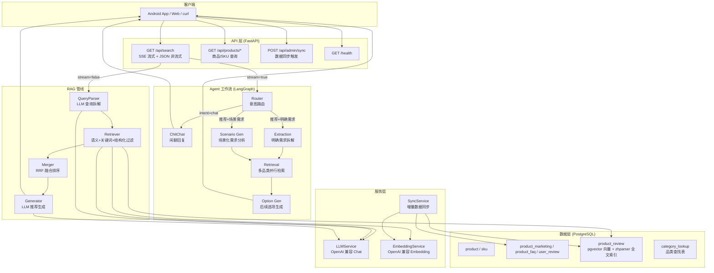
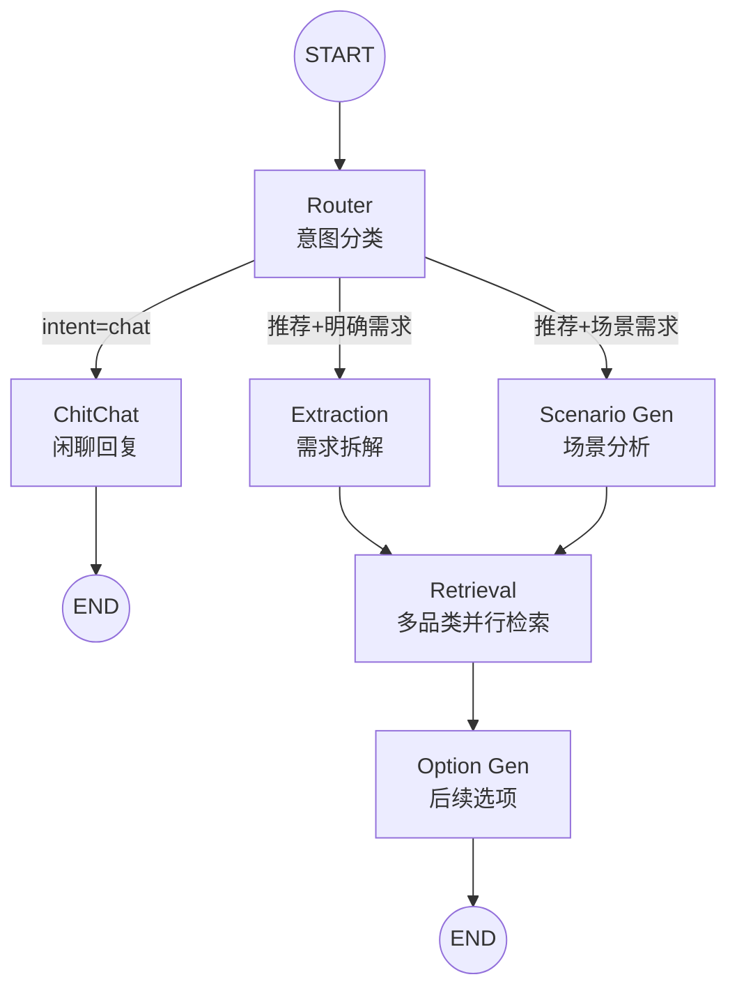
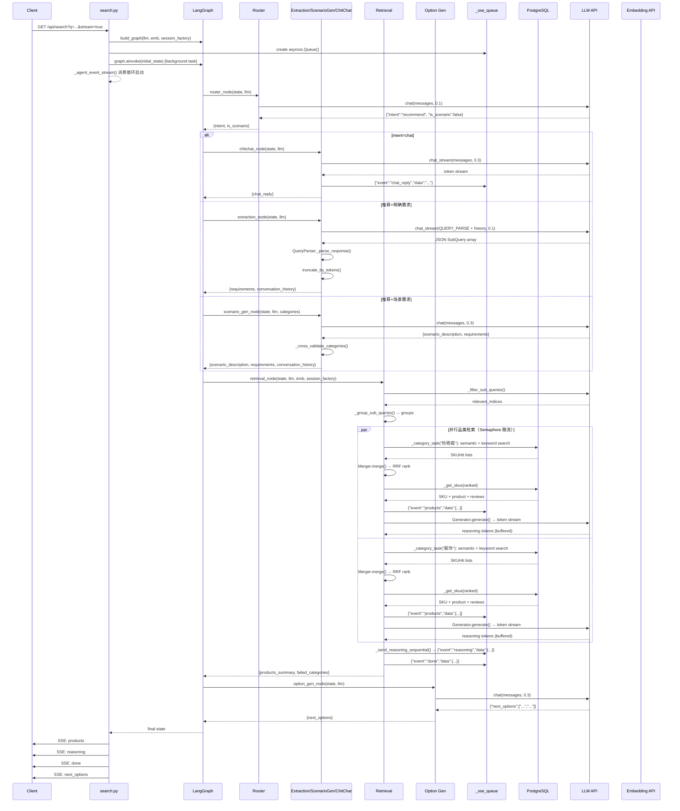
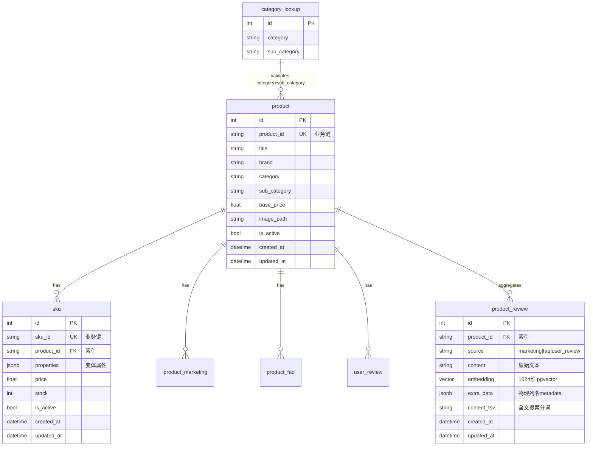

# AuraCart 技术设计文档

---

## 1. 整体架构

### 1.1 架构概览

AuraCart 采用 **LangGraph 多 Agent 工作流 + RAG 混合检索** 架构，实现从自然语言查询到流式商品推荐的完整闭环。



### 1.2 模块划分

| 层级 | 路径 | 职责 |
|------|------|------|
| **API 路由层** | `server/app/api/` | HTTP 端点：搜索、商品查询、管理同步 |
| **Agent 工作流** | `server/app/agent/` | LangGraph 状态图：意图路由、需求拆解、检索、选项生成 |
| **Agent 提示词** | `server/app/agent/prompts/` | 各 Agent 节点的 LLM 提示词模板 |
| **RAG 管线** | `server/app/rag/` | 查询解析提示词、RRF 融合、推荐生成器 |
| **服务层** | `server/app/services/` | LLM/Embedding 客户端、检索器、查询解析器、数据同步 |
| **数据模型** | `server/app/models/` | 7 个 SQLAlchemy ORM 模型 |
| **Schema** | `server/app/schemas/` | Pydantic 请求/响应模型 |
| **基础设施** | `server/app/` | 配置管理、数据库连接、日志 |

---

## 2. 各模块详细设计

### 2.1 配置管理模块 (`server/app/config.py`)

**实现思路**：采用 Pydantic Settings + YAML 配置方案。配置按领域拆分为独立子类（Database / Embedding / LLM / Search / Sync / Timeout / Log / Dataset），最后由 `Settings` 聚合。支持 `.secrets.yaml` 合并（API 密钥）和环境变量覆盖（`DB_HOST`、`DB_PORT`、`EMBEDDING_API_KEY`、`LLM_API_KEY`、`AURACART_CONFIG`）。

**功能链路**：`config.yaml` → `yaml.safe_load()` → 按节构建子类 → 合并 `.secrets.yaml` → 覆盖环境变量 → 模块级 `settings` 单例。

**难点**：敏感信息安全注入。解决方案：`.secrets.yaml` 不入 Git，API 密钥支持环境变量覆盖，Docker 时通过 `.env` 注入。

---

### 2.2 数据库模块 (`server/app/database.py`)

**实现思路**：基于 SQLAlchemy 2.0 异步风格，使用 `create_async_engine` + `async_sessionmaker`。`Base` 为声明式基类，`get_db()` 为 FastAPI 依赖生成器，按请求生命周期管理会话。

**功能链路**：`settings.database.url`（asyncpg 驱动）→ `create_async_engine()` → `async_sessionmaker()` → 路由中 `Depends(get_db)` 注入。

**难点**：Agent 节点运行在 graph.ainvoke 上下文中，不能直接使用 FastAPI 的 `Depends(get_db)`。解决方案：Agent 节点通过 `async_sessionmaker(bind=engine)` 创建独立 session，在 `_category_task` 内以 `async with` 托管生命周期。

---

### 2.3 LLM 服务 (`server/app/services/llm.py`)

**实现思路**：封装 OpenAI 兼容 API 的异步客户端。提供 `chat()`（非流式）和 `chat_stream()`（流式异步生成器）两种接口。各 Agent 节点按需选择：Router/ScenarioGen/OptionGen 用 `chat()`，Extraction/ChitChat 用 `chat_stream()` 收集完整回复。

**难点**：LLM 调用是系统的主要延迟瓶颈（非流式约 18s，流式首 token 约 10.5s）。解决方案：全系统采用流式调用降低首 token 延迟；所有 LLM 调用均包裹 try/except，失败时返回 fallback 默认值而非中断流程。

---

### 2.4 Embedding 服务 (`server/app/services/embedding.py`)

**实现思路**：封装 OpenAI 兼容 Embedding API。`embed()` 返回单个向量，`embed_batch()` 按 `batch_size` 分块并行请求，结果按 API 返回的 `index` 字段重排序以保证输入输出顺序一致。

**难点**：批量嵌入大量文本时的吞吐与顺序保证。解决方案：分块并行请求 API，通过 `sorted(data, key=lambda x: x.index)` 重排序。

---

### 2.5 查询解析器 (`server/app/services/query_parser.py`)

**实现思路**：通过 LLM 将自由文本查询拆解为结构化 `SubQuery` 列表。每条 `SubQuery` 携带策略标记（semantic / keyword / structured_filter）、品类标记（category / sub_category）和可选的结构化过滤参数（field / operator / value / expanded_values）。

**功能链路**：
```
user_query → QUERY_PARSE_SYSTEM 提示词 → LLM chat_stream → 
收集完整 JSON → 去除 markdown 围栏 → json.loads → 
SubQuery 数据类列表
```

**难点**：LLM 输出不稳定——可能带 markdown 围栏、尾随 JSON 逗号、前后解说文字。解决方案：`_parse_response()` 先 strip 围栏，再 `json.loads`。上游 Router 的 `_parse_router_response()` 额外处理首尾非 JSON 文本和尾随逗号。

---

### 2.6 检索器 (`server/app/services/retriever.py`)

**实现思路**：多策略检索引擎，三种策略并行或串行执行。

**策略执行链路**：

1. **structured_filter** → `_extract_filters()` 扫描所有 structured_filter 子查询，按字段路由到 product 表或 sku 表，生成参数化 SQL WHERE 条件
2. **semantic** → `_semantic_search()`：每个子查询独立 embedding，按 `1 - (embedding <=> query_vector)` 计算余弦相似度，多子查询得分 SUM 聚合，乘以 source 权重系数
3. **keyword** → `_keyword_search()`：优先级链：zhparser `chinese` tsvector → `simple` tsvector → `ILIKE` 降级；多子查询结果按 sku_id 去重保最高分

三路检索共享同一 SQL 骨架（`product_review pr → product p → sku s`），硬约束统一注入 WHERE 子句。

**难点与解决方案**：

| 难点 | 解决方案 |
|------|----------|
| 中文分词环境不确定 | 关键词检索优先 `chinese` 配置（zhparser），失败降级 `simple`，再降级 `ILIKE` |
| 语义与关键词分数不可比 | RRF 仅使用排名位置而非原始分数进行融合 |
| 检索源质量不均衡 | `source_weights` 配置项支持按 source（marketing/faq/user_review）加权，默认 user_review 权重 0.7 |

**核心 SQL 骨架**：
```sql
SELECT s.sku_id, p.product_id, <score_expression>
FROM product_review pr
JOIN product p ON p.product_id = pr.product_id AND p.is_active = TRUE
JOIN sku s ON s.product_id = p.product_id AND s.is_active = TRUE
[WHERE <hard_filters>]
[GROUP BY s.sku_id, p.product_id]
ORDER BY score DESC LIMIT :limit
```

---

### 2.7 RRF 融合器 (`server/app/rag/merger.py`)

**实现思路**：RRF（Reciprocal Rank Fusion）公式 `RRF(sku) = Σ 1/(k + rank_i)`，k=60。keyword 和 semantic 两路独立排名（rank 从 1 开始），相同 sku_id 的得分累加。

**技术选型理由**：RRF 仅依赖排名位置，天然适合异构检索源（全文排名的 ts_rank 分数与向量余弦相似度不可直接比较）。相比加权求和，RRF 无需做分数归一化。

---

### 2.8 推荐生成器 (`server/app/rag/generator.py`)

**实现思路**：将扁平 SKU 列表按 `product_id` 分组渲染为结构化文本（商品标题 → 品牌/品类/价格 → SKU 规格明细 → 匹配的用户评价与描述），注入 `GENERATOR_SYSTEM` 模板，调用 LLM `chat_stream` 流式输出。

**关键约束**（提示词硬编码）：
- 禁止编造价格、库存、功能、优惠券
- 必须为每个商品都给出推荐理由
- 优先引用用户评价（权重高于官方描述）
- 推荐理由字数受 `reasoning_max_chars` 约束

---

### 2.9 数据同步服务 (`server/app/services/sync.py`)

**实现思路**：增量同步——记录上次同步时间戳，每次 run 仅处理 `updated_at > last_sync` 的记录。活跃记录重新 embedding 后 upsert 到 `product_review`，停用记录删除对应行。

**难点与解决方案**：

| 难点 | 解决方案 |
|------|----------|
| 多实例并发同步 | PostgreSQL 咨询锁 `pg_advisory_lock(12345)`，同步前获取，完成后释放 |
| FAQ 精准更新 | 通过 `product_id + source + metadata->>'question'` 精确定位删除旧行 |
| 批量效率 | 一次 SQL JOIN 完成 SKU + Product + ProductReview 查询，LEFT JOIN 聚合避免 N+1 |

---

### 2.10 Agent 工作流 (`server/app/agent/`)

#### 2.10.1 状态设计 (`state.py`)

`AgentState` 是 LangGraph 的共享状态 TypedDict，字段按职责分组：

| 字段 | 类型 | 用途 |
|------|------|------|
| `user_query` | str | 当前轮用户输入 |
| `conversation_history` | `Annotated[list[dict], add]` | 对话历史，LangGraph `add` reducer 自动累加 |
| `intent` | str | `"recommend"` / `"chat"` |
| `is_scenario` | bool | True=场景化需求 |
| `requirements` | dict | `{"sub_queries": [...]}` |
| `scenario_description` | str\|None | 场景原文 |
| `products_summary` | list[dict] | 各品类检索结果聚合 |
| `chat_reply` | str | 闲聊回复文本 |
| `next_options` | list[str] | 后续提问建议 |
| `failed_categories` | list[str] | 检索失败的品类 |
| `_sse_queue` | asyncio.Queue (隐藏) | SSE 事件通道，运行时注入 |

**设计要点**：`conversation_history` 使用 `Annotated[list, add]`，各节点返回的 `{"conversation_history": [new_entry]}` 自动追加而非覆盖。`_sse_queue` 不在 TypedDict 声明中，通过 `state["_sse_queue"] = queue` 动态注入（避免 LangGraph 序列化）。

#### 2.10.2 图结构 (`graph.py`)



**路由逻辑**（`route_intent` 条件边）：
- `intent == "chat"` → `chitchat`
- `intent == "recommend"` + `is_scenario == True` → `scenario_gen`
- `intent == "recommend"` + `is_scenario == False` → `extraction`

#### 2.10.3 Router 节点 (`nodes/router.py`)

**实现思路**：单次 LLM 调用同时输出 `{"intent": "...", "is_scenario": bool}`。低温（0.1）保证分类确定性。

**容错设计**：`_parse_router_response()` 四级解析策略——直接 `json.loads` → 提取首尾 `{...}` → 正则移除尾随逗号 → fallback 默认值 `{"intent": "recommend", "is_scenario": False}`。

#### 2.10.4 Extraction 节点 (`nodes/extraction.py`)

**实现思路**：复用 `QUERY_PARSE_SYSTEM` 提示词，追加历史需求上下文（`_format_history_context`）。调用流式 LLM → 复用 `QueryParser._parse_response()` 解析 SubQuery → 追加到 conversation_history → 写时截断（memory_max_tokens 上限）。

**功能链路**：
```
user_query + history_context → QUERY_PARSE_SYSTEM → 
LLM chat_stream → 收集完整 JSON → QueryParser._parse_response() → 
List[SubQuery] → 序列化为 dict → truncate_by_tokens → 
返回 {requirements, conversation_history}
```

#### 2.10.5 Scenario Gen 节点 (`nodes/scenario_gen.py`)

**实现思路**：单次 LLM 调用端到端输出：场景描述 + 按品类分组的 SubQuery 列表。品类取值通过 `_cross_validate_categories()` 校验——精确匹配 → 去空格匹配 → (None, None) 回退到 "default" 组。

**难点**：LLM 可能输出不在数据库中的品类名。解决方案：`category_lookup` 表提供合法 (category, sub_category) 集合，交叉校验失败时回退为 (None, None)，下游 `_group_sub_queries` 归入 "default" 组统一处理。

#### 2.10.6 ChitChat 节点 (`nodes/chitchat.py`)

**实现思路**：轻量节点——简短友好回复 + 服务边界声明。使用 `chat_stream` 流式生成，通过 `_sse_queue` 推送 `chat_reply` 事件。LLM 失败时使用硬编码 fallback。

#### 2.10.7 Retrieval 节点 (`nodes/retrieval.py`)

这是整个系统最复杂的节点，包含 6 步流水线：

```
Step 1: LLM 需求筛选
  _filter_sub_queries() → 从历史需求中筛选与当前查询相关的子集
  窗口 2000 token，单轮无需筛选

Step 2: 按 sub_category 分组
  _group_sub_queries() → sub_category → category → "default" 三级回退

Step 3: 并行检索
  asyncio.Semaphore(max_category_concurrency) 限流
  每个品类在独立 DB session 中执行：检索 → RRF 融合 → SKU 补全 → Generator 生成
  缓存 reasoning_tokens 不立即发送

Step 4: 品类顺序式 SSE
  _send_reasoning_sequential() → 按 groups.keys() 顺序串行发送 reasoning

Step 5: 聚合结果
  _aggregate_results() → products_summary + failed_categories

Step 6: 发送 done 事件
```

**难点与解决方案**：

| 难点 | 解决方案 |
|------|----------|
| 多品类并行检索的 DB 连接安全 | 每个品类在 `async with async_session_factory() as db` 独立 session 中运行 |
| 品类并发爆炸 | `asyncio.Semaphore` 限流，默认 max_category_concurrency=5 |
| Generator token 流超时 | `asyncio.wait_for(agen.__anext__(), timeout=remaining)` 逐 token 超时控制 |
| SSE 事件乱序 | Q1 方案B：品类 token 先缓存后按确定顺序发送 |
| 品类 LLM 输出不可信 | `_cross_validate_categories()` 校验，失败回退 default 组 |

#### 2.10.8 Option Gen 节点 (`nodes/option_gen.py`)

**实现思路**：纯 LLM 调用生成 2-4 条后续推荐选项（补充/替代/细化/预算）。将 requirements、products_summary、failed_categories、scenario_description 注入提示词。输出截断到 4 条。

#### 2.10.9 Memory 模块 (`agent/memory.py`)

**实现思路**：纯函数设计。`count_tokens()` 用 `len(json.dumps(history)) // 4` 估算 token 数。`truncate_by_tokens()` 执行 FIFO 截断（头部丢弃最早的需求），最小保留 1 个元素。

**技术选型理由**：char/4 估算避免引入 tiktoken 等重依赖，对于中文场景估算准确度可接受。写时截断策略（追加后再截断）而非读时截断，确保 memory 状态始终在限制内。

---

## 3. 核心功能接口设计

### 3.1 GET /api/search（流式模式）

**涉及模块**：`search.py` → `graph.py` → 6 个 Agent 节点 + `state.py` + `memory.py`

**实现链路时序**：



### 3.2 GET /api/search（非流式模式）

**涉及模块**：`search.py` → `QueryParser` → `Retriever` → `Merger` → `Generator`

四阶段管线执行（查询解析 → 多策略检索 → RRF 融合 → LLM 生成），每阶段有独立的 `asyncio.wait_for` 超时保护。

### 3.3 POST /api/admin/sync

**涉及模块**：`admin.py` → `SyncService` → `EmbeddingService` → 源表 models → `product_review`

### 3.4 Batch API

**涉及模块**：`products.py` → `_normalize_ids()` → SQLAlchemy `select(...).where(id.in_(id_list))`

---

## 4. 数据实体

### 4.1 实体关系



### 4.2 存储与检索方案

| 数据实体 | 存储技术 | 检索方案 | 选型理由 |
|----------|----------|----------|----------|
| `product` / `sku` | PostgreSQL 行存储 | B-tree 索引（主键 + product_id） | OLTP 点查，标准关系模型 |
| `product_marketing` / `product_faq` / `user_review` | PostgreSQL 行存储 | product_id 索引 | 源表，供 sync 读取 |
| `product_review` (向量) | pgvector `VECTOR(1024)` | 余弦相似度 `<=>` 操作符 | 与 PostgreSQL 一体部署，避免额外向量数据库运维 |
| `product_review` (全文) | PostgreSQL tsvector + zhparser | `@@ plainto_tsquery` + `ts_rank` | 利用 PostgreSQL 原生 FTS 能力，zhparser 提供中文分词 |
| `category_lookup` | PostgreSQL 行存储 | UNIQUE(category, sub_category) 约束 | 轻量查找表，保证品类值唯一 |
| 对话历史 memory | AgentState 内存（`conversation_history`） | LangGraph add reducer + FIFO 截断 | 单次会话内有效，无需持久化 |

### 4.3 关键数据结构

**SubQuery（检索核心载体）**：
```
SubQuery:
  text: str              # 子查询文本
  strategy: str          # "semantic" | "keyword" | "structured_filter"
  field: str | None      # structured_filter 目标字段
  operator: str | None   # eq | lt | gt | in | not_in | contains | not_contains
  value: str | float | None
  expanded_values: list[str] | None  # LLM 展开的同义词/相关值
  category: str | None   # 品类大类（如"面部护肤"）
  sub_category: str | None  # 品类细类（如"防晒霜"）
```

**SSE 事件流**：
```
事件类型:
  products    → [{product_id, sku_id, category, sub_category}, ...]
  reasoning   → {token, category, sub_category}  (品类聚合完整文本)
  chat_reply  → "闲聊回复全文"
  done        → {total_categories, failed_categories}
  next_options → ["选项1", "选项2", ...]
  error       → {message}
```

---

## 5. 目录结构

```
AI-Agent-Ecom-Guide/
├── docker-compose.yml              # 根 Compose 编排：PostgreSQL + Server
├── .env.example                    # 环境变量模板（DB_HOST, DB_PORT, API keys）
├── DEPENDENCIES.md                 # 外部依赖说明
├── README.md                       # 项目说明
│
├── delivery/                       # 技术文档交付目录
│   ├── SETUP.md                    # 安装与启动指南
│   ├── API.md                      # API 接口详细测试文档
│   └── DESIGN.md                   # 本文件：技术设计文档
│
├── data/                           # 数据集目录
│   ├── ecommerce_agent_dataset_/   # 100 商品 JSON + images（4 品类 × 25 商品）
│   ├── processed/                  # 预处理产物（products.jsonl, text_index.json）
│   └── scripts/                    # 数据预处理脚本
│       ├── build_index.py          # 构建文本索引
│       └── import_products.py      # 旧版导入脚本
│
├── client/                         # Android (Kotlin) 客户端
│   └── app/src/main/java/com/ecomguide/
│       ├── model/Models.kt         # 数据模型
│       ├── network/                # Retrofit + SSE 网络层
│       ├── repository/             # 商品仓库
│       └── ui/                     # Activity/Fragment UI 层
│
└── server/                         # Python FastAPI 后端（主应用）
    ├── Dockerfile                  # 服务镜像：Python 3.12 + uvicorn
    ├── requirements.txt            # Python 依赖清单
    ├── run.py                      # 开发启动脚本
    ├── test_demo.py                # API 冒烟测试脚本
    ├── config.yaml                 # 运行时配置（数据库、模型、检索参数）
    ├── pytest.ini                  # pytest 配置（asyncio_mode=auto）
    │
    ├── alembic/                    # 数据库迁移
    │   ├── env.py                  # Alembic 运行时环境
    │   └── versions/               # 迁移版本文件
    │
    ├── scripts/                    # 运维脚本
    │   ├── Dockerfile              # PostgreSQL 17 镜像（pgvector + zhparser）
    │   ├── docker-compose.yml      # 独立数据库 Compose 编排
    │   ├── import_data.py          # 批量数据导入 + embedding
    │   ├── setup_category_lookup.py # 品类查找表初始化
    │   ├── transfer_api_request.py # curl URL 编码辅助
    │   └── operation.md            # Docker 运维手册
    │
    ├── app/                        # 应用主包
    │   ├── main.py                 # FastAPI 入口：lifespan、路由注册、静态文件
    │   ├── config.py               # YAML 配置加载 + Pydantic Settings + 环境变量覆盖
    │   ├── database.py             # SQLAlchemy 异步引擎 + 会话工厂 + Base 类
    │   │
    │   ├── core/                   # 核心基础设施
    │   │   └── logging.py          # structlog 双通道日志配置（控制台+文件）
    │   │
    │   ├── api/                    # API 路由层
    │   │   ├── search.py           # /api/search（SSE 流式 Agent + JSON 非流式 RAG）
    │   │   ├── products.py         # /api/products/* + /api/sku/* + Batch API
    │   │   └── admin.py            # /api/admin/sync 数据同步触发
    │   │
    │   ├── models/                 # ORM 数据模型（7 个实体）
    │   │   ├── __init__.py         # 模型注册表（统一导入入口）
    │   │   ├── product.py          # Product — 商品主记录
    │   │   ├── sku.py              # Sku — 库存单位变体（JSONB properties）
    │   │   ├── product_marketing.py # ProductMarketing — 营销描述
    │   │   ├── product_faq.py      # ProductFaq — 问答对
    │   │   ├── user_review.py      # UserReview — 用户评价
    │   │   ├── product_review.py   # ProductReview — 向量嵌入检索表（pgvector）
    │   │   └── category_lookup.py  # CategoryLookup — 合法品类值对
    │   │
    │   ├── schemas/                # Pydantic 请求/响应 Schema
    │   │   └── product.py          # ProductInfo, SkuOut, SearchResponse, SSE 事件
    │   │
    │   ├── services/               # 业务服务层
    │   │   ├── embedding.py        # EmbeddingService — OpenAI 兼容 Embedding 客户端
    │   │   ├── llm.py              # LLMService — 流式/非流式 Chat 客户端
    │   │   ├── query_parser.py     # QueryParser — LLM 查询 → SubQuery 列表
    │   │   ├── retriever.py        # Retriever — 多策略检索（语义/关键词/结构化过滤）
    │   │   ├── sku_utils.py        # SKU 补全 + 匹配文本截断（source 优先级排序）
    │   │   ├── sync.py             # SyncService — 增量同步（咨询锁 + embedding 更新）
    │   │   └── import_data.py      # DataImporter — JSON 批量导入 + 分块 + 批量嵌入
    │   │
    │   ├── rag/                    # RAG 管线
    │   │   ├── prompt.py           # QUERY_PARSE_SYSTEM + GENERATOR_SYSTEM 提示词
    │   │   ├── merger.py           # Merger — RRF 倒数排序融合（k=60）
    │   │   └── generator.py        # Generator — LLM 流式推荐文案生成
    │   │
    │   └── agent/                  # LangGraph 多 Agent 工作流
    │       ├── state.py            # AgentState TypedDict（含 conversation_history add reducer）
    │       ├── memory.py           # Token 计数（char/4） + FIFO 截断
    │       ├── graph.py            # StateGraph 构建（6 节点 + 条件边路由）
    │       ├── nodes/              # Agent 节点实现
    │       │   ├── router.py       # Intent Router — 两级分类（chat/推荐 + 场景/明确）
    │       │   ├── chitchat.py     # ChitChat — 闲聊回复 + SSE 推送
    │       │   ├── extraction.py   # Extraction — 明确需求 → SubQuery 拆解 + 历史注入
    │       │   ├── scenario_gen.py # Scenario Gen — 场景分析 + 品类交叉校验
    │       │   ├── retrieval.py    # Retrieval — 6 步流水线（筛选/分组/并行检索/顺序SSE/聚合）
    │       │   └── option_gen.py   # Option Gen — 2-4 条后续推荐选项
    │       └── prompts/            # Agent 提示词模板
    │           ├── router_prompt.py
    │           ├── chitchat_prompt.py
    │           ├── scenario_gen_prompt.py
    │           ├── option_gen_prompt.py
    │           └── relevance_filter_prompt.py
    │
    ├── tests/                      # 测试套件（30 个文件，113+ 测试）
    │   ├── conftest.py             # pytest 配置（AnyIO backend）
    │   ├── test_config.py          # 配置加载测试
    │   ├── test_config_extension.py # 配置扩展字段测试
    │   ├── test_embedding.py       # EmbeddingService mock 测试
    │   ├── test_llm.py             # LLMService mock 测试
    │   ├── test_models.py          # ORM 模型存在性测试
    │   ├── test_category_lookup.py # CategoryLookup 模型测试
    │   ├── test_subquery.py        # SubQuery category 字段测试
    │   ├── test_query_parser.py    # QueryParser 测试
    │   ├── test_retriever.py       # Retriever 三策略测试
    │   ├── test_merger.py          # RRF 融合测试
    │   ├── test_generator.py       # Generator 测试
    │   ├── test_sku_utils.py       # SKU 工具函数测试
    │   ├── test_sync.py            # SyncService mock 测试
    │   ├── test_import_data.py     # chunk_product 测试
    │   ├── test_products.py        # Product/SKU API 端点测试
    │   ├── test_batch_api.py       # Batch API 端点测试
    │   ├── test_search.py          # Search 路由 + 截断测试
    │   ├── test_prompt_parser_extension.py # 提示词扩展测试
    │   ├── test_agent_state.py     # AgentState 验证测试
    │   ├── test_memory.py          # Memory 函数测试
    │   ├── test_router.py          # Router 节点测试
    │   ├── test_chitchat.py        # ChitChat 节点测试
    │   ├── test_extraction.py      # Extraction 节点测试
    │   ├── test_scenario_gen.py    # Scenario Gen 节点测试
    │   ├── test_option_gen.py      # Option Gen 节点测试
    │   ├── test_retrieval_node.py  # Retrieval 节点测试
    │   ├── test_graph.py           # Graph 结构测试
    │   ├── test_search_agent.py    # Agent SSE 集成测试
    │   └── test_e2e.py             # 数据集端到端测试
    │
    └── docs/                       # 设计文档（中文）
        ├── PLAN/                   # 原始技术方案
        ├── SEARCH_OPT/             # 搜索优化方案
        ├── SEARCH_RAG_OPT/         # RAG 优化方案
        ├── SEARCH_RESULT_OPT/      # 搜索效果优化方案
        ├── AGENT_OPT/              # Agent 优化方案
        └── 待优化例子/              # 待优化案例参考
```

---

## 6. 风险点与待优化项

### 6.1 已知风险点

| 风险 | 严重程度 | 现状 | 建议 |
|------|----------|------|------|
| **LLM 输出不稳定** | 中 | 已有 markdown 围栏去除、尾随逗号修复、JSON 提取等多层容错，但仍有极端情况可能解析失败 | 增加 retry 机制（1-2 次），失败后降级为纯 semantic 检索 |
| **中文分词可用性** | 中 | zhparser 需手动安装和配置，关键词检索有 ILIKE 降级兜底 | ILIKE 降级的召回质量远低于 tsvector，建议提供自动化安装脚本或在 Docker 镜像中预置 |
| **单进程会话状态** | 低 | `conversation_history` 和 `_sse_queue` 存储在进程内存中 | 当前阶段接受；如需水平扩展，可引入 Redis 做会话共享 |
| **品类并发爆炸** | 低 | 已通过 `max_category_concurrency=5` 限流 | 场景生成上限为 6 个品类，当前并发控制在安全范围内 |
| **Embedding/LLM API 限流** | 中 | 无重试机制，API 临时不可用会导致请求失败 | 增加指数退避重试（tenacity 库），可配置重试次数和间隔 |
| **数据库连接池压力** | 低 | pool_size=8, overflow=5，Agent 品类并行 ≤5 | 监控连接池使用率，必要时调大 pool_size |

### 6.2 待优化项

1. **检索召回质量**
   - 当前 semantic 检索仅用 `1 - cosine_distance` 作为分数，可引入 reranker 模型做精排
   - `source_weights` 当前为全局静态配置，可考虑根据品类动态调整

2. **Agent 工作流优化**
   - Router 和 Extraction/ScenarioGen 各做一次 LLM 调用，可考虑合并为单次调用减少延迟
   - Extraction 和 ScenarioGen 共用 `QUERY_PARSE_SYSTEM` 的部分逻辑，可抽取公共提示词模板

3. **可观测性**
   - 当前日志覆盖核心节点，但缺少完整的 request tracing（如 OpenTelemetry）
   - 建议增加 LLM 调用延迟、检索延迟的 Prometheus 指标

4. **测试覆盖**
   - 非网络依赖测试 113 个，但网络依赖测试（LLM/Embedding/Sync/e2e）需真实 API Key，当前 CI 中跳过
   - 建议增加 LLM 响应的 golden file 测试（录制/回放模式），在 CI 中覆盖解析逻辑

5. **批量操作**
   - Batch API 当前限制 20 个 ID，超限返回 422，未提供分页
   - 大数据量场景下可增加游标分页支持

6. **数据同步**
   - `SyncService` 每次 run 对每条变更记录独立调用 embedding API，批量变更时效率低
   - 可改为收集所有待更新文本后批量 embedding

7. **会话持久化**
   - `conversation_history` 仅在内存中，服务重启后丢失
   - 需要多轮记忆的场景可考虑写入 PostgreSQL（按 session_id 分区）

---

> 文档版本：基于 `ymf_backend` 分支，commit `4354a55` 及之前的全部实现。
