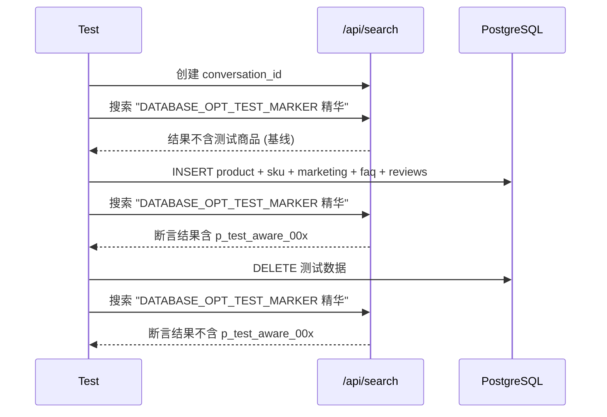

# CON_PLAN.md — DATABASE_OPT 编码级详细方案

> 输入: `server/docs/AGENT_OPT/DATABASE_OPT/PLAN.md`

## 1. 模块详细设计

### 1.1 `intent_route_agent.py` — 补全 chat_reply

**实现思路**: Chat 流程中 LLM 已经生成了 `welcome_chat`，只需在 return 字典中增加 `"chat_reply": welcome_chat`。

**变更位置 (2处)**:

- 流式路径 return (line 141):
  ```python
  # 改前
  return {"intent": "chat", "welcome_text": "", "session_memory": new_memory}
  # 改后
  return {"intent": "chat", "welcome_text": "", "chat_reply": welcome_chat, "session_memory": new_memory}
  ```

- 非流式路径 return (line 168):
  ```python
  # 改前
  return {"intent": "chat", "welcome_text": "", "session_memory": new_memory}
  # 改后
  return {"intent": "chat", "welcome_text": "", "chat_reply": welcome_chat, "session_memory": new_memory}
  ```

**异常安全**: `welcome_chat` 在异常路径中已赋空字符串，`search.py:333` 条件 `if user_query and chat_reply` 会自然跳过空值。

### 1.2 `option_generate_agent.py` — 补全 chat_reply

**实现思路**: `ending` 变量已在流式/非流式两条路径中解析完成，只需在 return 中带出。

**变更位置 (1处)**:

- return (line 191):
  ```python
  # 改前
  return {"next_options": options}
  # 改后
  return {"next_options": options, "chat_reply": ending}
  ```

**异常安全**: 异常路径中 `ending` 保持空字符串初始化值，condition 自然跳过。

### 1.3 `tests/test_chat_message_persistence.py` (新建)

**实现思路**: 单元测试级别，Mock LLM，直接调用节点函数，断言返回 dict 中存在 `chat_reply` key。

**测试用例**:

| 用例 | 场景 | 断言 |
|---|---|---|
| `test_router_chat_returns_chat_reply` | Chat 流式路径 | `result["chat_reply"]` 非空 |
| `test_router_chat_nonstream_returns_chat_reply` | Chat 非流式路径 | `result["chat_reply"]` 非空 |
| `test_option_gen_returns_chat_reply` | 推荐流程 option gen | `result["chat_reply"]` 非空 |

### 1.4 `tests/test_data_awareness.py` (新建)

**实现思路**: 端到端集成测试，通过 HTTP 客户端调 `/api/search`，在插入/删除新商品前后比较搜索结果是否包含新产品。

**测试数据生成**: 基于 `p_beauty_001.json` 格式，生成 3 条新商品：

- `product_id`: `p_test_aware_001` / `002` / `003`
- `category`: `美妆护肤`, `sub_category`: `精华`
- `title`: 含唯一关键字 "DATABASE_OPT_TEST_MARKER" 便于检索命中
- `skus`: 各 2 个 SKU (`s_test_aware_001_1` 等)

**时序**:



**清理策略**: `try/finally` 确保无论测试成败都执行 DELETE。

## 2. 关键数据实体

### 测试商品数据 (`p_test_aware_00x.json`)

```json
{
  "product_id": "p_test_aware_001",
  "title": "DATABASE_OPT_TEST_MARKER 测试精华液抗初老修复保湿30ml",
  "brand": "测试品牌",
  "category": "美妆护肤",
  "sub_category": "精华",
  "base_price": 299.0,
  "image_path": "ecommerce_agent_dataset/images/p_beauty_001_live.jpg",
  "skus": [
    {"sku_id": "s_test_aware_001_1", "properties": {"容量": "30ml"}, "price": 299.0, "stock": 50},
    {"sku_id": "s_test_aware_001_2", "properties": {"容量": "50ml"}, "price": 399.0, "stock": 30}
  ],
  "rag_knowledge": {
    "marketing_description": "DATABASE_OPT_TEST_MARKER 测试商品营销描述。",
    "official_faq": [{"question": "测试FAQ?", "answer": "测试回答"}],
    "user_reviews": [{"nickname": "测试用户", "rating": 5, "content": "DATABASE_OPT_TEST_MARKER 很好用。"}]
  }
}
```

## 3. 期望项目目录结构

```
server/
├── app/agent/nodes/
│   ├── intent_route_agent.py     # F1: 两处 return 补充 chat_reply
│   └── option_generate_agent.py  # F1: 一处 return 补充 chat_reply
├── data/ecommerce_agent_dataset_/data/
│   ├── p_test_aware_001.json     # F2: 测试商品数据
│   ├── p_test_aware_002.json     # F2: 测试商品数据
│   └── p_test_aware_003.json     # F2: 测试商品数据
└── tests/
    ├── test_chat_message_persistence.py  # F1: 单元测试 (离线)
    └── test_data_awareness.py            # F2: 集成测试 (需网络)
```

## 4. 风险点与待优化项

- F2 测试依赖 LLM+Embedding 稳定性，标记 skip 允许无网络跳过
- 测试数据文件名含 `_test_` 前缀，不会与现有 75 个商品数据冲突
- 插入商品后需等待 sync 同步（如有启用），或在测试中直接 INSERT 到 product/sku 等表后走 Retriever 查询
