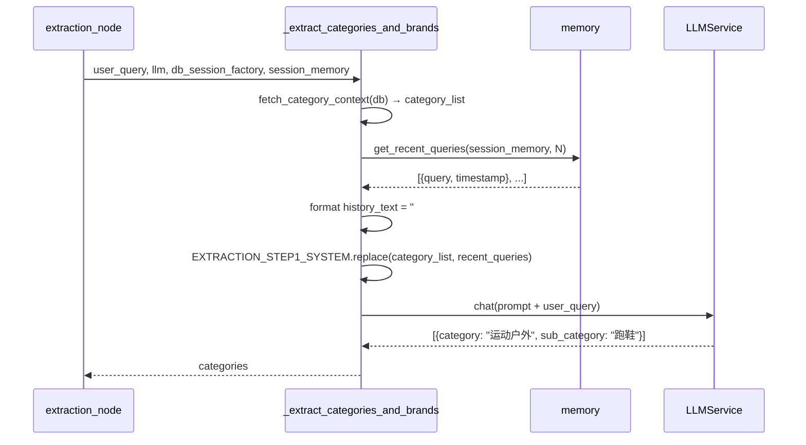

# CON_PLAN.md — 编码级详细设计

> 输入：`PLAN.md` → 输出：本文件
> 日期：2026-06-07

## 1. 修改点详细设计

### 1.1 `extraction_prompt.py` — 提示词模板

**当前 `EXTRACTION_STEP1_SYSTEM`（末尾）：**
```text
现在请识别以下查询的品类信息：
```

**修改后（末尾）：**
```text
## 对话历史（最近几轮用户查询，帮助你理解当前模糊查询的上下文）
{recent_queries}

现在请识别以下查询的品类信息：
```

**设计要点：**
- `{recent_queries}` 放在"当前查询"之前，让 LLM 先看到上下文再处理
- 说明句清晰告知 LLM 历史的作用范围（仅用于推断模糊查询的品类）

### 1.2 `extraction.py` — `_extract_categories_and_brands()` 函数

**新增参数：**
```python
async def _extract_categories_and_brands(
    user_query: str,
    llm: LLMService,
    db_session_factory,
    session_memory: list[dict] | None = None,  # 新增
) -> list[dict]:
```

**新增注入逻辑（在品类加载之后、prompt 构建之前）：**
```python
# 格式化最近几轮历史查询
history_text = "(无历史对话)"
if session_memory:
    recent = get_recent_queries(session_memory, settings.search.memory_recent_rounds)
    if recent:
        lines = [f"#{i} {q['query']}" for i, q in enumerate(recent, 1)]
        history_text = "\n".join(lines)

prompt = (EXTRACTION_STEP1_SYSTEM
          .replace("{category_list}", category_list)
          .replace("{recent_queries}", history_text))
```

**设计要点：**
- `session_memory` 默认为 `None`，兼容无历史场景
- `get_recent_queries()` 返回按时间降序的最新查询，编号展示
- 空历史或无 session_memory 时显示 `"(无历史对话)"`，不中断流程
- 新增 `from app.agent.memory import get_recent_queries` 导入（当前只导入了 `get_queries_by_category`）

### 1.3 `extraction.py` — `extraction_node()` 调用方

**当前调用：**
```python
categories = await _extract_categories_and_brands(
    user_query, llm, db_session_factory
)
```

**修改后：**
```python
categories = await _extract_categories_and_brands(
    user_query, llm, db_session_factory, session_memory
)
```

## 2. 实现链路时序



## 3. 期望最终代码形态

**`extraction_prompt.py` — 修改后关键段：**

```python
EXTRACTION_STEP1_SYSTEM = """你是一个电商查询品类识别专家。从用户查询中识别涉及的品类(category)和子品类(sub_category)。

## 规则
- 只提取 brand / category / sub_category 信息，不做意图拆解
- 提取的category / sub_category必须出现在可用品类列表中，不能编造
- 多个品类时分别列出
- 无法确定时设为 null
- **如果当前查询缺少主体（如"要轻量的""预算500以内"），参考对话历史推断品类**

## 合法品类列表
{category_list}

## 对话历史（最近几轮用户查询，帮助你理解当前模糊查询的上下文）
{recent_queries}

## 输出格式
只返回 JSON 数组，不返回其他内容：
[{"category": "美妆护肤", "sub_category": "防晒"}, ...]

现在请识别以下查询的品类信息："""
```

**`extraction.py` — `_extract_categories_and_brands()` 修改后关键段：**

```python
async def _extract_categories_and_brands(
    user_query: str,
    llm: LLMService,
    db_session_factory,
    session_memory: list[dict] | None = None,
) -> list[dict]:
    # ... 品类加载 (不变) ...

    # 格式化最近几轮历史查询
    history_text = "(无历史对话)"
    if session_memory:
        recent = get_recent_queries(session_memory, settings.search.memory_recent_rounds)
        if recent:
            lines = [f"#{i} {q['query']}" for i, q in enumerate(recent, 1)]
            history_text = "\n".join(lines)

    prompt = (EXTRACTION_STEP1_SYSTEM
              .replace("{category_list}", category_list)
              .replace("{recent_queries}", history_text))
    # ... LLM 调用 (不变) ...
```

## 4. 测试设计

### 新增测试用例

| 测试 | 场景 | 预期 |
|------|------|------|
| `test_step1_with_history_infers_category` | session_memory 含"帮我推荐跑鞋"，当前查询"要轻量的" | LLM prompt 包含"#1 帮我推荐跑鞋" |
| `test_step1_empty_memory_shows_placeholder` | session_memory=[] | prompt 包含"(无历史对话)" |
| `test_step1_none_memory_handles_gracefully` | session_memory=None | prompt 包含"(无历史对话)"，不崩溃 |
| `test_step1_prompt_contains_recent_queries_placeholder` | 验证模板已更新 | EXTRACTION_STEP1_SYSTEM 包含 `{recent_queries}` |

### 现有测试回归

- `test_extraction.py` 中现有 Step 1 测试应全部通过（mock llm 返回值即可，不依赖 history）
- `test_search_agent.py` 中端到端 SSE 测试不受影响

## 5. 期望目录结构（仅改动）

```
server/app/
├── agent/
│   ├── nodes/
│   │   └── extraction.py          # 修改：_extract_categories_and_brands() 新增 session_memory 参数 + 注入逻辑
│   └── prompts/
│       └── extraction_prompt.py   # 修改：EXTRACTION_STEP1_SYSTEM 新增 {recent_queries} 占位符
└── tests/
    └── test_extraction.py         # 新增：4 个测试用例
```

## 6. 风险点和待优化项

| 项 | 说明 |
|-----|------|
| **无风险** | 改动最小化，fallback 完整，不影响其他路径 |

---

> 编码可直接开始。遵循 `project-implement` skill 的 TDD 工作流。
