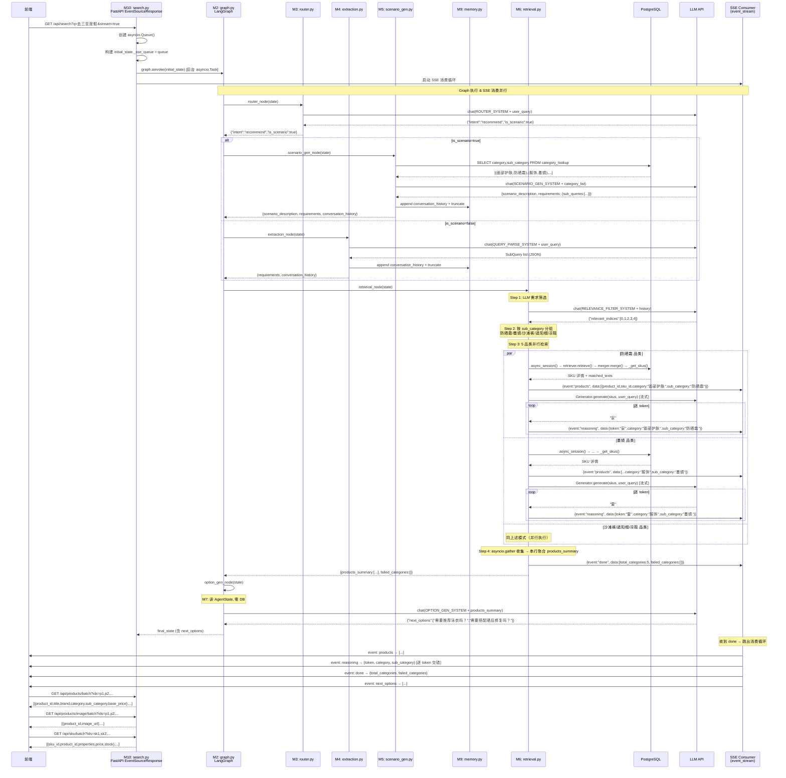
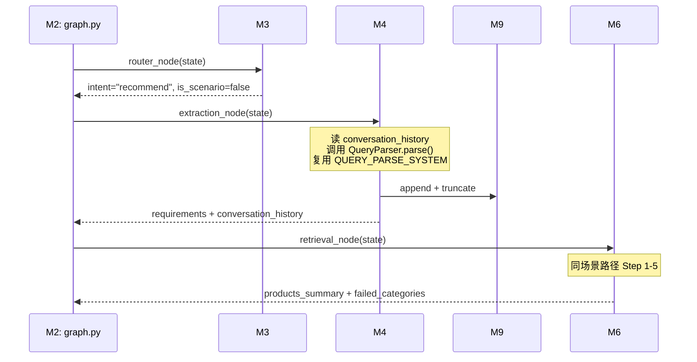
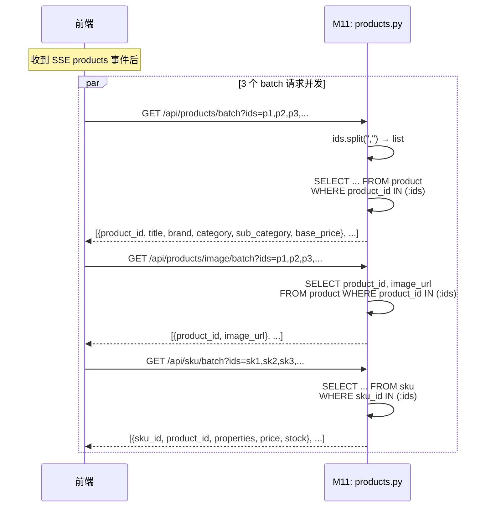

# 多Agent电商导购系统 — 编码实现方案

> **文档性质**：编码级实现方案。承接 PLAN.md（架构决策）和 SPEC.md（需求规格），
> 细化到每个模块的实现思路、功能链路、数据结构和接口时序，足够支撑编码。
> 
> **设计原则**：YAGNI — 不添加要求之外的功能；不为一次性代码创建抽象；
> 不为不可能发生的场景做错误处理。
>
> **与 PLAN.md 的关系**：PLAN.md 定义了架构和设计决策（B1-B11），本文档复用其结论，
> 不再重复论证。若出现冲突，以 PLAN.md 为准。

---

## 1. 模块详细设计

### 模块总览图

```
                        ┌──────────────────────────┐
                        │   M10: app/api/search.py  │  ← FastAPI 入口，Queue 注入 + SSE 消费
                        └─────────────┬────────────┘
                                      │ graph.ainvoke(initial_state)
                                      ▼
                        ┌──────────────────────────┐
                        │   M2: app/agent/graph.py  │  ← StateGraph 编排
                        └─────────────┬────────────┘
                                      │ 条件边路由
              ┌───────────────────────┼───────────────────────┐
              ▼                       ▼                       ▼
    ┌─────────────────┐   ┌─────────────────────┐   ┌─────────────────┐
    │ M8: chitchat.py │   │ M4: extraction.py   │   │ M5: scenario    │
    │ (闲聊)          │   │ (意图提取)           │   │    _gen.py      │
    └─────────────────┘   └──────────┬──────────┘   │ (场景生成)      │
                                     │               └────────┬────────┘
                                     │ 写入 M9: memory.py     │ 写入 M9
                                     ▼                        ▼
                              ┌──────────────────────────────────┐
                              │        M9: memory.py             │
                              │  (append-only + 写时截断)         │
                              └──────────────┬───────────────────┘
                                             │ 读取
                                             ▼
                              ┌──────────────────────────────────┐
                              │     M6: retrieval.py             │
                              │  (LLM筛选→分组→并行检索→SSE)      │
                              │  调用: M14 SubQuery / M15        │
                              │  sku_utils / Generator           │
                              └──────────────┬───────────────────┘
                                             │
                                             ▼
                              ┌──────────────────────────────────┐
                              │    M7: option_gen.py             │
                              │  (读 AgentState, 零 DB)          │
                              └──────────────────────────────────┘
```

**跨模块依赖简表**：

| 调用方 | 被调用方 | 调用原因 |
|--------|---------|---------|
| M2 graph.py | M3/M4/M5/M6/M7/M8 全部节点 | 组装 StateGraph |
| M3 router.py | LLMService | 意图分类 LLM 调用 |
| M4 extraction.py | QueryParser (复用), LLMService | 查询解析 |
| M5 scenario_gen.py | LLMService, category_lookup 表 | 场景→SubQuery |
| M6 retrieval.py | Retriever, Merger, Generator, LLMService, M15 sku_utils, category_lookup 表 | 并行检索管线 |
| M7 option_gen.py | LLMService | 选项生成 |
| M10 search.py | M2 graph.py, M1 state.py | API 层入口 |

---

### 1.1 M1: `app/agent/state.py` — AgentState 定义

**实现思路**：

使用 LangGraph 的 `TypedDict` 风格定义（通过 `Annotated` 实现 reducer）。核心要点：
- `conversation_history` 使用 `Annotated[list, add]` — LangGraph 自动 append，无需手动合并
- `_sse_queue` 隐藏字段 — 不参与 State 序列化，仅用于 SSE 事件通道。使用 `field(default=None)` 但不在 State 定义中暴露给 LangGraph 的 State update 机制

**定义方式**：使用 Python `TypedDict` + `Annotated`，而非 Pydantic Model。原因：(1) LangGraph 原生支持 TypedDict；(2) 与 Pydantic 的 validator 机制无关；(3) 更轻量。

**字段列表**：

| 字段名 | 类型 | Reducer | 说明 |
|--------|------|---------|------|
| `user_query` | `str` | 默认（覆盖） | 当前轮用户输入 |
| `conversation_history` | `Annotated[list[dict], add]` | **add** | 追加模式，LangGraph 自动累加 |
| `intent` | `str` | 默认 | `"recommend"` 或 `"chat"` |
| `is_scenario` | `bool` | 默认 | `False` 为 explicit 路径 |
| `requirements` | `dict` | 默认 | `{"sub_queries": [...]}`，SubQuery 列表的容器 |
| `scenario_description` | `str \| None` | 默认 | 场景原文，仅 Scenario 路径填写 |
| `products_summary` | `list[dict]` | 默认 | 各品类检索结果的轻量摘要聚合 |
| `chat_reply` | `str` | 默认 | Chit-Chat 输出 |
| `next_options` | `list[str]` | 默认 | Option Gen 输出 |
| `failed_categories` | `list[str]` | 默认 | 检索失败的品类列表 |

`_sse_queue` 的特殊处理：
- **不在 TypedDict 中声明**（LangGraph 的 State update 机制不理解 asyncio.Queue）
- 通过 `initial_state._sse_queue = asyncio.Queue()` 在 graph 执行前动态注入
- 节点内部通过 `state.get("_sse_queue")` 或直接访问属性获取

**实现要点**：

1. `conversation_history` 的每个元素格式为 `{"sub_queries": [...]}` — 一"轮"一个元素。Memory 节点通过 `Annotated[list, add]` 的 reducer 自动 append，然后对完整列表执行截断
2. `requirements` 的 `sub_queries` 列表元素为**字典**（可序列化），不是 `SubQuery` dataclass 实例。原因：LangGraph State 在节点间传递时可能跨线程/进程（虽然当前为进程内），字典保证可安全传递

**难点**：无显著难点。注意 `_sse_queue` 与 TypedDict 的边界 — 不在 `__annotations__` 中声明。

---

### 1.2 M2: `app/agent/graph.py` — StateGraph 构建

**实现思路**：

一个工厂函数 `build_graph(llm: LLMService) -> CompiledStateGraph`，返回编译后的 graph 对象。

**构建步骤**：

1. 创建 `StateGraph(AgentState)`
2. 依次 `.add_node("router", router_node)` / `"extraction"` / `"scenario_gen"` / `"retrieval"` / `"option_gen"` / `"chitchat"`
3. `.add_edge(START, "router")`
4. `.add_conditional_edges("router", route_intent, { ... })` — 两级条件边
5. 添加线性边：`extraction → retrieval`、`scenario_gen → retrieval`、`retrieval → option_gen`、`option_gen → END`、`chitchat → END`
6. `.compile()`

**条件边函数 `route_intent`**：

输入 `state: AgentState`，输出 `"chitchat"` 或 `"extraction"` 或 `"scenario_gen"`。

逻辑非常简单——直接读 `state["intent"]` 和 `state["is_scenario"]` 两个字段，这两个字段由 `router_node` 写入。不需要在此函数内做任何推理。

```text
if intent == "chat"     → "chitchat"
if is_scenario == false → "extraction"
if is_scenario == true  → "scenario_gen"
```

**Memory 节点的嵌入方式**：

Memory（截断逻辑）不作为一个独立的 Graph 节点，而是**嵌在 extraction 和 scenario_gen 节点内部**：
- extraction 节点：开始前从 `conversation_history` 读历史 → 执行 LLM 调用 → 输出追加到 `requirements` → 返回的 dict 中同时包含 `conversation_history` 的新元素
- scenario_gen 节点：执行 LLM 调用 → 输出写入 `requirements` → 同理返回 `conversation_history` 的新元素

`conversation_history` 通过 `Annotated[list, add]` 自动 append。

**截断在哪里执行**：在节点函数返回之前，调用 `M9.truncate_by_tokens()` 对 `conversation_history` 做截断。

**难点**：无显著难点。注意 `add_node` 的节点函数签名必须为 `async def node(state: AgentState) -> dict`，返回部分 State 更新。

---

### 1.3 M3: `app/agent/nodes/router.py` — Intent Router

**实现思路**：

最简节点——单次 LLM 调用 + JSON 解析。复用 `LLMService.chat()` 非流式接口。

**功能链路**：

```text
user_query + conversation_history
  → 填充提示词模板 router_prompt.py
  → LLMService.chat() (非流式，timeout=3s)
  → 解析 JSON: {"intent": "...", "is_scenario": bool}
  → 返回 {"intent": ..., "is_scenario": ...}
```

**实现要点**：

1. `conversation_history` 序列化：将列表转为 JSON 字符串（`ensure_ascii=False`）注入提示词 `{conversation_history}` 占位符
2. JSON 解析容错：`_parse_router_response(raw: str)` 函数——尝试提取第一个 `{...}` JSON 对象。失败返回默认值
3. Fallback 不与 LLM 调用混在同一 try/except：LLM 超时 → fallback；JSON 解析失败 → fallback；均返回 `{"intent": "recommend", "is_scenario": false}`

**提示词**：位于 `app/agent/prompts/router_prompt.py`，模块常量 `ROUTER_SYSTEM`，包含 `{conversation_history}` 和 `{user_query}` 占位符。

**难点**：
- **风险**：LLM 返回不可解析的 JSON → **解决方案**：`_parse_router_response` 使用简单的 `{` 和 `}` 匹配截取，外加 try/except + fallback
- **无高并发/高性能要求**：每次请求 1 次 LLM 调用，无特殊优化需求

---

### 1.4 M4: `app/agent/nodes/extraction.py` — Intent Extraction

**实现思路**：

复用现有 `QueryParser` 的核心逻辑。关键设计决策（PLAN.md B3）：使用**扩展后的 `QUERY_PARSE_SYSTEM`**（`app/rag/prompt.py`），与现有 `/api/search` 的 QueryParser 共用同一份提示词。

**功能链路**：

```text
user_query + conversation_history (历史 sub_queries)
  → 从 app/rag/prompt.py import QUERY_PARSE_SYSTEM (扩展版)
  → 组装 messages: [SystemMessage(QUERY_PARSE_SYSTEM), HumanMessage(user_query)]
  → LLMService.chat(messages) (非流式, timeout=3s)
  → 收集完整响应 raw_text
  → 调用 QueryParser._parse_response(raw_text) → list[SubQuery]
  → 包装为 {"requirements": {"sub_queries": [...]},
             "conversation_history": [{"sub_queries": [...]}]}
  → 截断 conversation_history (M9.truncate_by_tokens)
  → 返回 dict
```

**实现要点**：

1. **复用策略**：直接从 `app/services/query_parser.py` import `QueryParser` 类，或抽取 `_parse_response` 为模块级函数。最小改动方案：import 整个 `QueryParser` 类，实例化时传入 `llm`，调用其 `parse()` 方法——与现有代码完全一致
2. **对话历史注入**：将 `conversation_history` 中的所有历史 `sub_queries` 展平为文本注入提示词。格式：`"历史需求: [{\"text\": \"跑鞋\", ...}, ...]"`
3. **品类标记**：扩展后的 `QUERY_PARSE_SYSTEM` 已包含品类标记指引，LLM 在能确定时自动填写 `category`/`sub_category`
4. **需求合并**：历史需求 + 当前需求由 LLM 判断是否合并，提示词中已有合并指引

**与现有 QueryParser 的关系**：

- 现有 `/api/search` 继续使用 `QueryParser.parse()` — 行为不变
- Agent 的 extraction 节点也使用 `QueryParser.parse()` — 共享扩展后的提示词
- `QueryParser._parse_response()` 需适配新字段（PLAN.md B10）：冗余字段不报错，缺失字段默认 `None`

**难点**：

- **风险**：扩展提示词后 LLM 输出格式可能变化 → **解决方案**：`_parse_response()` 用宽松的 JSON 解析（允许额外字段），单元测试覆盖新旧两种 LLM 响应格式
- **兼容性**：现有 `/api/search` 非 Agent 路径的 QueryParser 也使用扩展后的提示词 → 确保 `SubQuery(category=None, sub_category=None)` 的默认行为不破坏现有逻辑

---

### 1.5 M5: `app/agent/nodes/scenario_gen.py` — Scenario Gen

**实现思路**：

单次 LLM 端到端调用。关键步骤：查询 `category_lookup` 表 → 构建品类列表字符串 → 注入提示词 → LLM 调用 → JSON 解析。

**功能链路**：

```text
user_query + conversation_history
  → 查询 category_lookup: SELECT category, sub_category FROM category_lookup
  → 格式化为 category_list_str: "面部护肤|防晒霜\n面部护肤|洗面奶\n..."
  → 填充提示词模板 SCENARIO_GEN_SYSTEM (含 {category_list})
  → LLMService.chat() (非流式, timeout=3s)
  → 解析 JSON → {scenario_description, requirements: {sub_queries: [...]}}
  → 校验: 每个 SubQuery 的 category/sub_category 与 category_lookup 交叉校验
  → 包装 conversation_history 追加 + 截断
  → 返回 dict
```

**实现要点**：

1. **category_lookup 查询**：通过 `AsyncSession.execute(select(CategoryLookup.category, CategoryLookup.sub_category))` 获取所有行。每次请求都查，不缓存（PLAN.md B5）
2. **品类列表字符串格式**：`"category|sub_category\n"` 逐行拼接，简洁直观
3. **交叉校验**：LLM 输出的 `category`/`sub_category` 可能与 category_lookup 不完全匹配（LLM 幻觉）。处理策略：
   - 精确匹配：保留
   - 模糊匹配（大小写/空格差异）：尝试修正为精确值
   - 无法匹配：标记 warning 日志，SubQuery 的 `category`/`sub_category` 置 `None`（回退到 default 组）
4. **JSON 解析**：与 Router 类似的宽松解析——提取第一个 `{...}` 对象

**错误处理**：

- LLM 超时 → fallback 到 Intent Extraction（视为误判）
- JSON 解析失败 → fallback 到 Intent Extraction
- category_lookup 查询失败（DB 异常）→ fallback 到 Intent Extraction
- Fallback 的实现：在 graph 层面，当 scenario_gen 节点检测到失败时，将 `is_scenario` 改为 `False`，并调用 extraction 逻辑重新处理。**简化方案**：在 scenario_gen 的 fallback 路径中直接调用 extraction 节点函数，返回其输出

**提示词**：位于 `app/agent/prompts/scenario_gen_prompt.py`，模块常量 `SCENARIO_GEN_SYSTEM`，含 `{category_list}`、`{conversation_history}`、`{user_query}` 占位符。

**难点**：

- **风险**：LLM 输出的品类标签不在 category_lookup 中 → **解决方案**：模糊匹配 + 回退 default 组（非阻断）
- **DB 依赖**：category_lookup 查询失败导致 Scenario Gen 无法执行 → **解决方案**：fallback 到 Extraction

---

### 1.6 M6: `app/agent/nodes/retrieval.py` — Product Retrieval（最复杂节点）

**实现思路**：

这是整个系统最复杂的节点。5 步流水线：LLM 筛选 → 分组 → 并行检索 → 逐品类 SSE → 聚合 summary。

**功能链路（5 步）**：

```
Step 1: LLM 需求筛选
  输入: requirements.sub_queries (Memory 中的全部), user_query
  处理: 填充 RELEVANCE_FILTER_SYSTEM 提示词 → LLMService.chat() 非流式
        → 解析 {"relevant_indices": [0, 2, ...]}
  输出: 筛选后的 SubQuery 列表 (仅保留 relevant_indices)
  Fallback: LLM 失败 → 使用全部 SubQuery (截断至 2000 token)

Step 2: 按 sub_category 分组
  输入: 筛选后的 SubQuery 列表
  处理: 遍历 SubQuery，按 sub_category 字段分组 (dict[str, list[SubQuery]])
        - 三级回退: sub_category → category → "default"
        - 校验: sub_category 是否在 category_lookup 中 (可选，防御性)
  输出: {group_key: [SubQuery, ...]} (group_key 为品类路由键)

Step 3: 并行检索 (asyncio.Semaphore + asyncio.gather)
  输入: 分组后的 SubQuery 字典
  处理:
    semaphore = asyncio.Semaphore(max_concurrency)
    每个 (group_key, sub_queries) → 一个 asyncio.Task
    每个 Task 内部:
      async with async_session() as db:
        1. retriever.retrieve(sub_queries, top_k)
        2. merger.merge(keyword_ranked, semantic_ranked)
        3. _get_skus(db, ranked)   ← 来自 app/services/sku_utils.py
        4. Generator(llm).generate(skus, user_query, sub_queries=subs)
           → async for token in agen: ...  (流式)
        5. 每 token 包装为 {"token": t, "category": c, "sub_category": sc}
           → await _sse_queue.put({"event": "reasoning", "data": ...})
        6. products 事件: await _sse_queue.put({"event": "products", "data": [...]})
        7. 从 _get_skus 结果提取 products_summary
        8. return {category, sub_category, products_summary, error}
  输出: asyncio.gather(*tasks) → list[dict] (结构化结果列表)

Step 4: 串行聚合
  输入: 各品类任务返回的结构化结果列表
  处理:
    products_summary = []
    failed_categories = []
    for result in results:
        if result["error"]:
            failed_categories.append({"category": ..., "sub_category": ..., "error": result["error"]})
        else:
            products_summary.extend(result["products_summary"])
  输出: 返回 {"products_summary": products_summary, "failed_categories": failed_categories}

Step 5: 发送 done 事件
    await _sse_queue.put({"event": "done", "data": {"total_categories": N, "failed_categories": [...]}})
```

**并行任务内部详细流程**（单个品类任务）：

```
输入: group_key (如 "面部护肤|防晒霜"), sub_queries: list[SubQuery], user_query, _sse_queue

1. async with async_session() as db:
     # 注意：每个任务创建独立 session，不要 sharing
     
2. retriever = Retriever(db=db, emb=emb_service)
   # emb_service 通过闭包/参数传入（节点函数构建时注入）

3. retrieve_result = await retriever.retrieve(sub_queries, top_k=settings.search.top_k_per_query)
   # 返回 {"keyword": [...], "semantic": [...]}

4. merger = Merger(rrf_k=60, final_limit=settings.search.final_sku_limit)
   ranked = merger.merge(keyword=retrieve_result["keyword"], semantic=retrieve_result["semantic"])

5. if not ranked:
     # 无结果 ≠ 失败，返回空 products_summary
     return {"category": category, "sub_category": sub_category, "products_summary": [], "error": None}

6. skus = await _get_skus(db, ranked)
   # 使用当前任务的独立 session

7. # 发送 products SSE 事件
   product_ids = [{"product_id": s["product_id"], "sku_id": s["sku_id"],
                    "category": category, "sub_category": sub_category} for s in skus]
   await _sse_queue.put({"event": "products", "data": product_ids})

8. # 提取 products_summary (轻量摘要)
   summary = [{"product_id": s["product_id"], "sku_id": s["sku_id"],
               "title": s["title"], "price": s["price"],
               "category": category, "sub_category": sub_category} for s in skus]

9. # Generator 流式生成推荐理由
   generator = Generator(llm=llm_service)
   agen = generator.generate(skus, user_query, sub_queries=subs)
   async for token in agen:
       await _sse_queue.put({
           "event": "reasoning",
           "data": {"token": token, "category": category, "sub_category": sub_category}
       })

10. return {"category": category, "sub_category": sub_category, "products_summary": summary, "error": None}
```

**异常处理**（品类任务内部 try/except）：

```text
try:
    # 步骤 1-10
except asyncio.TimeoutError:
    return {"category": ..., "sub_category": ..., "products_summary": [], "error": "timeout"}
except Exception as e:
    logger.error(f"品类检索失败: {category}/{sub_category}", error=str(e))
    return {"category": ..., "sub_category": ..., "products_summary": [], "error": str(e)}
```

**关键设计细节**：

1. **Retriever/EmbeddingService 的注入**：`Retriever` 和 `EmbeddingService` 需要在节点函数外部创建，通过闭包传入。`EmbeddingService` 是无状态服务（仅 HTTP 调用嵌入 API），可以在节点间共享。`Retriever` 依赖 `db` session，在品类任务内部创建
2. **_sse_queue 的访问**：通过 `state.get("_sse_queue")` 或直接通过函数参数注入。节点函数签名中不包含 `_sse_queue` — 通过闭包捕获
3. **max_concurrency 分批**：`asyncio.Semaphore(max_concurrency)` 自动处理排队。品类数 > 5 时，第 6+ 个任务在信号量上等待，FIFO 顺序

**难点**：

| 难点 | 风险等级 | 解决方案 |
|------|---------|---------|
| **并行任务的 SSE 事件交错** | 中 | `_sse_queue` 是 `asyncio.Queue`，线程安全。每个 reasoning token 携带 `category`/`sub_category` 路由键，前端按品类分发 |
| **独立 session 的连接池耗尽** | 中 | 配置 `pool_size≥8, max_overflow=5`。极端场景：5 个品类 + 主请求 + 其他并发请求 → `pool_size` 需 ≥ 8 |
| **Generator 流式调用超时** | 中 | 每品类 `settings.timeout.generation` (15s)。单 token 间超时由 `asyncio.wait_for(agen.__anext__(), timeout=remaining)` 控制 |
| **单品类失败隔离** | 低 | 任务内部 try/except，仅影响自身。`asyncio.gather` 不用 `return_exceptions` — 统一按结构化结果处理 |
| **LLM 筛选的准确性** | 低 | 轻量级提示词 + 2000 token 窗口。失败时使用全部 SubQuery（不过滤） |

---

### 1.7 M7: `app/agent/nodes/option_gen.py` — Option Gen

**实现思路**：

最简节点之一。读 `AgentState` 字段 → 组装提示词 → LLM 调用 → 返回选项列表。零 DB 访问。

**功能链路**：

```text
requirements + products_summary + scenario_description + conversation_history
  → 填充 OPTION_GEN_SYSTEM 提示词
  → LLMService.chat() (非流式, timeout=3s)
  → 解析 JSON: {"next_options": ["选项1", "选项2", ...]}
  → 返回 {"next_options": [...]}
```

**实现要点**：

1. **products_summary 序列化**：已包含 Option Gen 所需全部字段（title/price/category/sub_category），直接 JSON 序列化注入提示词
2. **failed_categories 处理**：在提示词中明确列出失败品类（从 State 读取），指示 LLM 避免生成相关选项
3. **选项数量**：2-4 条。解析后校验 `2 ≤ len(next_options) ≤ 4`，超出则截断
4. **输出追加到 SSE**：Option Gen 不在 retrieval 节点内部执行（它是独立 Graph 节点）。它的输出 `next_options` 需要在 API 层通过 SSE 发送。**实现方式**：在 graph 执行完成后，API 层从最终 State 读取 `next_options`，作为最后一个 SSE 事件发送

**提示词**：位于 `app/agent/prompts/option_gen_prompt.py`，模块常量 `OPTION_GEN_SYSTEM`，含 `{requirements}`、`{products_summary}`、`{scenario_description}`、`{conversation_history}` 占位符。

**难点**：
- **风险**：products_summary 过大导致提示词超长 → **解决方案**：每品类保留 Top 3 SKU（已在 retrieval 中控制），总体摘要量可控（5 品类 × 3 SKU = 15 条）

---

### 1.8 M8: `app/agent/nodes/chitchat.py` — Chit-Chat

**实现思路**：

最简节点。单次 LLM 调用，返回简短文本。

**功能链路**：

```text
user_query + conversation_history
  → 填充 CHITCHAT_SYSTEM 提示词
  → LLMService.chat_stream() (流式，也可非流式直接返回)
  → 返回 {"chat_reply": full_text}
```

**实现要点**：

1. 回复长度控制在 80 字以内（提示词约束）
2. SSE 输出：Chit-Chat 的回复文本需要通过 SSE 流式返回给前端。**实现方式**：在节点内通过 `_sse_queue` 发送 `chat_reply` 事件（逐 token 或一次性）
3. Fallback：LLM 超时 → 返回硬编码兜底消息 `"我主要可以帮助您推荐和比较商品，有需要的话随时告诉我！"`

**提示词**：位于 `app/agent/prompts/chitchat_prompt.py`，模块常量 `CHITCHAT_SYSTEM`。

**难点**：无。

---

### 1.9 M9: `app/agent/memory.py` — Memory 工具

**实现思路**：

纯函数模块，两个核心函数：`count_tokens()` 和 `truncate_by_tokens()`。

**功能链路**：

```text
truncate_by_tokens(history: list[dict], max_tokens: int, logger) -> list[dict]:
  1. 计算当前 token 数: count_tokens(history)
  2. while count_tokens(history) > max_tokens:
       丢弃 history[0] (最旧的需求组)
  3. 如果丢弃了元素: logger.info("截断", before=original_count, after=count_tokens(history), removed=removed_count)
  4. 返回截断后的 history
```

**count_tokens 实现**（PLAN.md B4）：

```text
def count_tokens(history: list[dict]) -> int:
    serialized = json.dumps(history, ensure_ascii=False)
    return len(serialized) // 4
```

±20% 偏差在 2000 token 软约束下可接受。

**实现要点**：

1. 截断策略：从列表**头部**开始丢弃（FIFO）— 最旧的需求最先被遗忘
2. 截断粒度：按"轮"（`conversation_history` 的元素）为单位丢弃，可能在丢弃一轮后仍超阈值，继续丢弃下一轮
3. 日志记录字段：`original_token_count`、`after_token_count`、`removed_rounds`、`removed_subquery_count`
4. **不发送前端通知** — 仅日志

**难点**：无。纯函数，无副作用，易于测试。

---

### 1.10 M10: `app/api/search.py` — API 层适配

**实现思路**：

改造现有 `/api/search?q=&stream=true` 路由，替换 `_run_pipeline() + event_stream()` 为 LangGraph 调用。

**功能链路**：

```text
GET /api/search?q=...&stream=true
  1. 依赖注入: db, emb, llm (保持现有 FastAPI DI 签名)
  2. 构建 graph: build_graph(llm)
  3. 构建 initial_state: AgentState(user_query=q, ...)
  4. 创建 SSE Queue: queue = asyncio.Queue()
  5. 注入: initial_state._sse_queue = queue
  6. 启动 graph 任务: asyncio.create_task(graph.ainvoke(initial_state))
  7. SSE 消费循环: while True: event = await queue.get() → yield EventSourceResponse event
  8. 退出条件: event["event"] == "done" 或超时
  9. 返回 EventSourceResponse
```

**与现有代码的关系**：

- 保留 `/api/search?stream=false` 的非流式路径：可继续使用现有 `_run_pipeline()`，也可复用 Agent 工作流
- **最小风险方案**：`stream=false` 保留现有逻辑不变，仅 `stream=true` 接入 Agent 工作流

**SSE 事件消费循环**（关键实现）：

```text
async def event_stream():
    queue = asyncio.Queue()
    initial_state = AgentState(user_query=q, ...)
    initial_state._sse_queue = queue
    
    # 异步启动 graph 执行
    graph_task = asyncio.create_task(graph.ainvoke(initial_state))
    
    try:
        while True:
            try:
                event = await asyncio.wait_for(queue.get(), timeout=settings.timeout.total_request)
            except asyncio.TimeoutError:
                # 总体超时 → 发送 error 事件 + done
                yield {"event": "error", "data": "{\"message\": \"请求超时\"}"}
                yield {"event": "done", "data": "{}"}
                break
            
            yield {"event": event["event"], "data": json.dumps(event["data"], ensure_ascii=False)}
            
            if event["event"] == "done":
                break
    finally:
        # 清理：取消未完成的 graph 任务，避免连接泄漏
        if not graph_task.done():
            graph_task.cancel()
        # 从 graph 结果中获取 next_options
        try:
            final_state = await graph_task
            # 发送 next_options 事件（done 之后）
            if final_state.get("next_options"):
                yield {"event": "next_options", "data": json.dumps(final_state["next_options"], ensure_ascii=False)}
        except asyncio.CancelledError:
            pass
```

**难点**：

| 难点 | 解决方案 |
|------|---------|
| **graph 异常时 queue 消费不退出** | `asyncio.wait_for(queue.get(), timeout=60)` + try/finally 中 cancel graph_task + 发送 error event |
| **graph_task 异常传播** | try/finally 确保清理；`graph_task.exception()` 记录日志 |
| **next_options 发送时机** | 在 `done` 事件之后、event_stream 退出之前，从 graph 结果中读取并发送 |
| **现有 stream=false 路径兼容** | 保持不变，不引入 Agent 工作流 |

---

### 1.11 M11: `app/api/products.py` — Batch API（3 个端点）

**实现思路**：

在现有 `products.py` 中新增 3 个 GET 端点。批量查询策略：`WHERE product_id IN (:ids)` 或 `WHERE sku_id IN (:ids)`，一次 SQL 完成。

**端点详情**：

| 端点 | SQL 逻辑 | 返回字段 |
|------|---------|---------|
| `GET /api/products/batch?ids=p1,p2,...` | `SELECT ... FROM product WHERE product_id IN (:ids) AND is_active=true` | product_id, title, brand, category, sub_category, base_price |
| `GET /api/products/image/batch?ids=p1,p2,...` | `SELECT product_id, image_url FROM product WHERE product_id IN (:ids) AND is_active=true` | product_id, image_url |
| `GET /api/sku/batch?ids=sk1,sk2,...` | `SELECT ... FROM sku WHERE sku_id IN (:ids) AND is_active=true` | sku_id, product_id, properties, price, stock |

**参数解析**：`ids` 参数为逗号分隔字符串，解析为 `list[str]`，去空去重。

**实现要点**：

1. 直接使用 FastAPI 的 `Query` 参数解析器，`ids: str = Query(..., description="逗号分隔的 ID 列表")`，内部 `ids.split(",")`
2. **不做 ID 数量上限限制** — DEFINE.md Q1 待确定，暂不做限制（YAGNI：当前场景最多 15 个 ID，远不到需要限制的量级）
3. 返回空列表而非 404 — 部分 ID 不存在是正常情况（商品可能已下架）
4. 复用现有 `Product` 和 `Sku` ORM 模型，不新建查询逻辑

**难点**：无。标准的批量 SQL 查询，与现有单条查询逻辑一致。

---

### 1.12 M12: `app/models/category_lookup.py` — Category 查找表模型

**实现思路**：

标准 SQLAlchemy ORM 模型，映射到 `category_lookup` 表。

**表结构**：

| 列 | 类型 | 约束 |
|----|------|------|
| `id` | `Integer` | PRIMARY KEY, autoincrement |
| `category` | `String` | NOT NULL |
| `sub_category` | `String` | NOT NULL |
| — | — | UNIQUE(category, sub_category) |

**模型定义**：继承 `Base`（现有 `app.database` 中的 `Base`），定义 `__tablename__ = "category_lookup"`。

**填充脚本**：`server/scripts/setup_category_lookup.py`：
1. 创建表（`Base.metadata.create_all` 或 `CREATE TABLE IF NOT EXISTS`）
2. `INSERT INTO category_lookup (category, sub_category) SELECT DISTINCT category, sub_category FROM product WHERE category IS NOT NULL AND sub_category IS NOT NULL ON CONFLICT DO NOTHING`

**难点**：无。独立表，不涉及外键或触发器。

---

### 1.13 M13: 配置变更

**新增配置项**（`config.yaml` + `config.py`）：

| 路径 | 默认值 | 类型 | 说明 |
|------|--------|------|------|
| `search.max_category_concurrency` | 5 | int | 品类并行检索最大并发数 |
| `database.pool_size` | 8 | int | SQLAlchemy 连接池常驻连接数 |
| `database.max_overflow` | 5 | int | 连接池溢出上限 |

**`database.py` 变更**：

在 `create_async_engine()` 调用中显式传入 `pool_size` 和 `max_overflow`：
```text
create_async_engine(
    DATABASE_URL,
    pool_size=settings.database.pool_size,
    max_overflow=settings.database.max_overflow,
    ...
)
```

---

### 1.14 M14: `app/services/retriever.py` — SubQuery 字段扩展

**变更内容**：

在 `SubQuery` dataclass 中新增两个可选字段：
- `category: str | None = None`
- `sub_category: str | None = None`

**兼容性保证**：默认值 `None`，所有现有 `SubQuery(...)` 构造代码无需修改。

---

### 1.15 M15: `app/services/sku_utils.py` — `_get_skus` 迁移

**变更内容**：

将 `app/api/search.py` 中的 `_get_skus()` 函数（含辅助函数 `_truncate_texts()` 和常量 `_SOURCE_PRIORITY`）迁移到 `app/services/sku_utils.py`。

- `search.py` 改为 `from app.services.sku_utils import _get_skus`
- `retrieval.py` 同样 import

**不变**：函数签名和实现逻辑完全不变。

---

### 1.16 提示词变更：`app/rag/prompt.py`

**QUERY_PARSE_SYSTEM 扩展**：

在现有提示词基础上新增：
- 输出格式中增加 `category`（可选，str|null）和 `sub_category`（可选，str|null）字段
- 品类标记指引段落（同 SPEC.md 3.2 中的指引）
- 需求合并逻辑段落（同 SPEC.md 3.2 中的合并规则）

**GENERATOR_SYSTEM 扩展**：

新增 `{requirements_summary}` 模板变量，替换规则 #9 中的表述，使 Agent 能传递结构化的用户需求摘要。

---

### 1.17 `app/services/query_parser.py` — `_parse_response` 适配

**变更内容**：

`_parse_response()` 的 JSON 解析逻辑需适配新增字段：
- LLM 返回的 JSON 中可能包含 `category`/`sub_category` → 解析时不报错
- LLM 返回的 JSON 中可能不包含 `category`/`sub_category` → 默认 `None`
- 现有对 `text`/`strategy`/`field`/`operator`/`value`/`expanded_values` 的解析逻辑不变

**实现策略**：在构造 `SubQuery` 时使用 `.get("category")` / `.get("sub_category")` 安全取值。

---

## 2. 核心功能接口详细设计

### 2.1 接口总览

| 接口 | 涉及模块 | 功能 |
|------|---------|------|
| `GET /api/search?q=&stream=true` | M10→M2→M3/M4/M5→M9→M6→M7 | Agent 导购主入口 |
| `GET /api/products/batch?ids=` | M11 | 批量获取商品详情 |
| `GET /api/products/image/batch?ids=` | M11 | 批量获取商品图片 |
| `GET /api/sku/batch?ids=` | M11 | 批量获取 SKU 详情 |

### 2.2 `/api/search` SSE 流式 — 完整时序



### 2.3 `/api/search` Explicit 路径时序

与场景路径的区别仅在中段：`scenario_gen_node` 替换为 `extraction_node`。其他节点（Router / Memory / Retrieval / Option Gen）相同。



### 2.4 Batch API 时序



---

## 3. 关键数据实体

### 3.1 `AgentState` — LangGraph 工作流状态

**存储方案**：进程内存（`TypedDict`），不持久化。

**数据结构**：

```text
AgentState:
  user_query: str                           # 当前轮用户原始输入
  conversation_history: list[dict]          # 每元素: {"sub_queries": [...]}，LangGraph add reducer
  intent: str                               # "recommend" | "chat"
  is_scenario: bool                         # True=场景化需求
  requirements: dict                        # {"sub_queries": [SubQuery(字典形式), ...]}
  scenario_description: str | None          # 场景原文（仅 Scenario 路径）
  products_summary: list[dict]              # [{product_id, sku_id, title, price, category, sub_category}, ...]
  chat_reply: str                           # Chit-Chat 回复文本
  next_options: list[str]                   # Option Gen 的输出
  failed_categories: list[str]              # 失败品类列表
  _sse_queue: asyncio.Queue | None          # 隐藏字段，不参与 State 序列化
```

**生命周期**：单次 HTTP 请求内。请求开始创建 `initial_state`，graph 完成后丢弃。

### 3.2 `SubQuery` — Agent 间数据契约

**存储方案**：Python `dataclass`（`app/services/retriever.py`），进程内存。

**数据结构**：

```text
SubQuery:
  text: str                           # 子查询文本
  strategy: str                       # "semantic" | "keyword" | "structured_filter"
  field: str | None                   # structured_filter 目标字段
  operator: str | None                # eq|lt|gt|in|not_in|contains|not_contains
  value: str|float|None               # 单值
  expanded_values: list[str]|None     # 多值展开
  category: str | None                # 新增：品类大类
  sub_category: str | None            # 新增：品类细类
```

**新增字段兼容性**：默认值 `None`，所有现有构造代码不受影响。

### 3.3 `conversation_history` 元素 — Memory 存储单元

**存储方案**：`AgentState` 中的 `list[dict]` 字段。

**数据结构**：

```text
conversation_history[i]:
  sub_queries: list[dict]             # 该轮的所有 SubQuery（字典形式，可 JSON 序列化）
    每个元素:
      text: str
      strategy: str
      field: str | null
      operator: str | null
      value: str|float|null
      expanded_values: list[str]|null
      category: str | null
      sub_category: str | null
```

**容量管理**：append-only + 写时截断（2000 token，`char/4` 估算）。

### 3.4 `products_summary` 元素 — 商品轻量摘要

**存储方案**：`AgentState` 中的 `list[dict]` 字段。

**数据结构**：

```text
products_summary[i]:
  product_id: str                     # 商品 ID
  sku_id: str                         # SKU ID
  title: str                          # 商品标题
  price: float                        # SKU 价格
  category: str                       # 品类大类
  sub_category: str                   # 品类细类
```

**字段范围说明**（DEFINE.md Q2）：当前仅包含最小必要字段。`brand` 和 `stock` 不在此列表中 — Option Gen 若需要可通过 `title` 推断品牌，库存状态非选项生成关键信息。后续如需扩展，在 `_get_skus()` 返回的 dict 中添加字段即可。

### 3.5 SSE 事件格式

**存储方案**：`asyncio.Queue` 传递，不持久化。

**事件类型**：

| 事件 | `data` 格式 | 发送时机 | 生产者 |
|------|-----------|---------|--------|
| `products` | `[{product_id, sku_id, category, sub_category}, ...]` | 每品类检索完成 | M6 品类任务 |
| `reasoning` | `{token: str, category: str, sub_category: str}` | 逐 token 流式 | M6 品类任务 |
| `done` | `{total_categories: int, failed_categories: [{category, sub_category, error}]}` | 所有品类完成/失败后 | M6 主流程 |
| `error` | `{message: str}` | graph 执行异常 | M10 event_stream |
| `next_options` | `["选项1", "选项2", ...]` | done 之后，graph 完成 | M10 event_stream（从 final_state 读取） |

### 3.6 `CategoryLookup` — 品类查找表

**存储方案**：PostgreSQL 表，通过 SQLAlchemy ORM 访问。

**表结构**：

```sql
CREATE TABLE category_lookup (
    id SERIAL PRIMARY KEY,
    category VARCHAR NOT NULL,
    sub_category VARCHAR NOT NULL,
    UNIQUE(category, sub_category)
);
```

**检索方案**：
- Scenario Gen：每次请求全表查询（`SELECT category, sub_category FROM category_lookup`），数据量 < 200 行，无索引需求
- Product Retrieval：分组校验时可选查询（防御性），同样全表查询
- 无缓存层 — 查询开销可忽略（~200 行 × 2 列，< 10KB）

---

## 4. 项目目录结构树

```
server/
├── config.yaml                              # 修改：新增 max_category_concurrency / pool_size / max_overflow
├── .secrets.yaml                            # 不变
│
├── scripts/
│   └── setup_category_lookup.py             # 新增：建表 + DISTINCT 填充脚本（M12）
│
├── app/
│   ├── __init__.py
│   ├── main.py                              # 不变
│   ├── config.py                            # 修改：新增 3 个配置字段（M13）
│   ├── database.py                          # 修改：create_async_engine 显式 pool_size/max_overflow（M13）
│   │
│   ├── agent/                               # 新增：LangGraph Agent 层
│   │   ├── __init__.py                      # 空，包标记
│   │   ├── state.py                         # M1：AgentState TypedDict 定义 + _sse_queue 注入
│   │   ├── graph.py                         # M2：build_graph() 工厂函数 + route_intent 条件边
│   │   ├── memory.py                        # M9：count_tokens() + truncate_by_tokens()
│   │   │
│   │   ├── nodes/                           # 6 个 Agent 节点
│   │   │   ├── __init__.py                  # 空，包标记
│   │   │   ├── router.py                    # M3：router_node() — 意图路由
│   │   │   ├── extraction.py               # M4：extraction_node() — 意图提取（复用 QueryParser）
│   │   │   ├── scenario_gen.py             # M5：scenario_gen_node() — 场景需求生成（查 category_lookup）
│   │   │   ├── retrieval.py                # M6：retrieval_node() — 5 步并行检索（最复杂）
│   │   │   ├── option_gen.py               # M7：option_gen_node() — 推荐选项生成（零 DB）
│   │   │   └── chitchat.py                 # M8：chitchat_node() — 闲聊
│   │   │
│   │   └── prompts/                         # Agent 专用提示词模板
│   │       ├── __init__.py                  # 空，包标记
│   │       ├── router_prompt.py             # ROUTER_SYSTEM（含 {conversation_history}, {user_query}）
│   │       ├── scenario_gen_prompt.py       # SCENARIO_GEN_SYSTEM（含 {category_list}）
│   │       ├── relevance_filter_prompt.py   # RELEVANCE_FILTER_SYSTEM（含 {history_sub_queries}, {user_query}）
│   │       ├── option_gen_prompt.py         # OPTION_GEN_SYSTEM（含 {products_summary}）
│   │       └── chitchat_prompt.py           # CHITCHAT_SYSTEM
│   │
│   ├── api/                                 # 修改：API 层
│   │   ├── __init__.py
│   │   ├── search.py                        # 修改（M10）：接入 LangGraph，Queue 注入 + SSE 消费
│   │   ├── products.py                      # 修改（M11）：新增 3 个 batch 端点
│   │   └── admin.py                         # 不变
│   │
│   ├── models/                              # 修改：新增 1 个模型
│   │   ├── __init__.py
│   │   ├── product.py                       # 不变
│   │   ├── sku.py                           # 不变
│   │   ├── product_review.py                # 不变
│   │   ├── product_faq.py                   # 不变
│   │   ├── product_marketing.py             # 不变
│   │   ├── user_review.py                   # 不变
│   │   └── category_lookup.py               # 新增（M12）：CategoryLookup ORM 模型
│   │
│   ├── services/                            # 修改：2 文件改动 + 1 新增
│   │   ├── __init__.py
│   │   ├── llm.py                           # 不变
│   │   ├── embedding.py                     # 不变
│   │   ├── retriever.py                     # 修改（M14）：SubQuery dataclass 新增 category/sub_category
│   │   ├── query_parser.py                  # 修改（M17）：_parse_response() 适配新字段
│   │   ├── sku_utils.py                     # 新增（M15）：_get_skus() + _truncate_texts() 迁移自 search.py
│   │   ├── sync.py                          # 不变
│   │   └── import_data.py                   # 不变
│   │
│   ├── rag/                                 # 修改：1 文件
│   │   ├── __init__.py
│   │   ├── generator.py                     # 不变（Generator(llm) 接口不变）
│   │   ├── merger.py                        # 不变
│   │   └── prompt.py                        # 修改（M16）：扩展 QUERY_PARSE_SYSTEM + GENERATOR_SYSTEM
│   │
│   ├── schemas/                             # 可能修改（DEFINE.md 边界问题 1）
│   │   ├── __init__.py
│   │   └── product.py                       # SearchResponse 可能需要同步 SubQuery 序列化字段
│   │
│   └── core/
│       ├── __init__.py
│       └── logging.py                       # 不变
│
└── tests/                                   # 测试文件（Phase 8）
    ├── test_agent/
    │   ├── test_state.py                    # AgentState 创建 + _sse_queue 注入
    │   ├── test_router.py                   # M3 单元测试（mock LLM）
    │   ├── test_extraction.py               # M4 单元测试（mock LLM）
    │   ├── test_scenario_gen.py             # M5 单元测试（mock LLM + DB）
    │   ├── test_retrieval.py                # M6 单元测试（mock LLM + DB + Queue）
    │   ├── test_option_gen.py               # M7 单元测试（mock LLM）
    │   ├── test_chitchat.py                 # M8 单元测试（mock LLM）
    │   ├── test_memory.py                   # M9 单元测试（纯函数）
    │   └── test_graph.py                    # 集成测试：完整 LangGraph 图（mock LLM + DB）
    ├── test_api/
    │   ├── test_search_agent.py             # /api/search Agent 路径 E2E 测试
    │   └── test_batch_api.py                # Batch API 测试
    └── conftest.py                          # 测试 fixtures（mock LLM, async DB session, Queue）
```

**目录结构设计原则**：
- `app/agent/` 与现有模块平行，互不污染
- 提示词按作用域分两处：Agent 专用 → `app/agent/prompts/`；共用（QUERY_PARSE/GENERATOR）→ `app/rag/prompt.py`
- 节点文件命名与 SPEC.md 的 Agent 名称一致，降低理解成本

---

## 5. 风险点和待优化项

### 5.1 风险点（实现层面）

| # | 风险 | 严重度 | 发生场景 | 缓解措施 | 状态 |
|---|------|--------|---------|---------|------|
| R1 | `_sse_queue` 未被消费导致生产者阻塞 | 高 | graph 异常，event_stream 提前退出但 `queue.put()` 阻塞了节点 | try/finally 中确保 done/error 事件发送；queue 使用 `put_nowait()` 或设置 timeout | 设计已考虑 |
| R2 | 并行 Generator 触发 LLM API 限流 | 中 | 5 品类同时调用 LLM，加上其他 Agent LLM 调用，峰值 7-8 并发 | `max_category_concurrency` 信号量控制 Generator 并发数；LLM API 层可增加重试 | 设计已考虑 |
| R3 | 连接池耗尽导致任务阻塞 | 中 | 多请求并发，每个请求占 5 个并行 session | `pool_size=8, max_overflow=5`；单请求最多占 5 个连接；连接等待超时依赖 asyncpg 默认行为 | 设计已考虑 |
| R4 | LLM JSON 解析失败导致节点降级 | 低 | 所有 LLM 调用的 JSON 响应均可能失败 | 每个节点独立 fallback；宽松 JSON 解析（提取第一个 {...}） | 设计已考虑 |
| R5 | `_get_skus` 迁移后遗漏引用 | 低 | 老代码中可能有其他文件 import `search._get_skus` | Phase 0 全局搜索 `_get_skus` 引用点 | 编码时注意 |
| R6 | QUERY_PARSE_SYSTEM 扩展后现有测试失败 | 低 | 现有 QueryParser 测试依赖固定 LLM mock 响应 | Phase 0 更新 mock 响应，增加新字段（值为 null） | 编码时注意 |
| R7 | Generator token yield 与 Queue put 之间的背压 | 低 | LLM 生成速度 > SSE 消费速度 | `asyncio.Queue` 默认无界，长文本不会被丢弃；极端情况 Queue 内存占用高但不会丢数据 | 可接受 |

### 5.2 待优化项（非当前实现范围）

| # | 优化项 | 优先级 | 说明 |
|---|--------|--------|------|
| O1 | Memory 按轮次边界对齐截断 | P2 | 当前允许不完整需求组被截断（简单但可能丢失上下文）。后续优化：截断时检查是否切分了同一轮次的 sub_queries，如果是则保留该轮 |
| O2 | Token 计数改为精确 tokenizer | P3 | 当前 `char/4` 估算在中文场景偏差较大。后续可引入 `tiktoken` 做精确计数 |
| O3 | category_lookup 脚本自动化 | P3 | 当前为手动脚本。若品类变更频繁，可改为 product 表的 INSERT/UPDATE 触发器自动同步 |
| O4 | 品类分组策略优化 | P3 | 当前按 `sub_category` 分组。后续可考虑用 LLM 做语义分组（相似品类合并到一个检索任务，减少 LLM 调用次数） |
| O5 | option_gen 输出追加到 SSE 流 | P2 | 当前在 done 事件后单独发送 `next_options` 事件。后续可考虑将 next_options 追加到最后一个品类的 reasoning 末尾，减少一次 SSE 事件 |
| O6 | 并行任务间的 Generator token 合并 | P3 | 当前各品类 reasoning token 交错发送。若前端期望顺序式（品类 A → 品类 B），需在 retrieval 层增加缓冲和顺序控制 |

---

## 6. 实现边界条件（待明确）

> 以下问题在 PLAN.md 和 DEFINE.md 中已提出但尚未最终确认。在开始编码前需明确。

### 6.1 前后端边界

**Q1: SSE reasoning token 的渲染模式**（DEFINE.md Q6）

- **方案 A（当前设计支持）**：交错渐进式 — 按 LLM 产出速度实时交错到达，前端维护多品类文本缓冲区。首屏最快，前端实现复杂
- **方案 B**：品类顺序式 — 品类 A 全部 token → 品类 B 全部 token → ...。前端简单，首屏慢
- **影响**：方案 B 需修改 M6 retrieval.py 的 SSE 发送逻辑（品类任务内部缓冲全部 token 后一次性 queue.put）
- **状态**：待前端确认
回复：采用方案B

**Q2: 前端 batch API 调用策略**（DEFINE.md Q5）

- **方案 A**：每收到 SSE `products` 事件立即调用 batch API（渐进式渲染，5 品类 × 3 batch = 15 次请求）
- **方案 B**：等 `done` 事件后收集全部 ID 统一调用（一次性渲染，共 3 次 batch 请求）
- **影响**：仅前端，后端无需修改
- **状态**：待前端确认
回复：不需要考虑前端实现

### 6.2 后端实现边界

**Q3: QUERY_PARSE_SYSTEM 扩展对现有 /api/search 的影响**（DEFINE.md 9.1）

- 现有 `/api/search` 的 `SearchResponse.sub_queries` 序列化是否需要同步新增 `category`/`sub_category` 字段？
- `app/schemas/product.py` 的 `SearchResponse` 模型是否需要更新？
- **建议**：同步更新 `SearchResponse` 的 sub_queries 序列化（增加字段，保持向后兼容）。状态：**待确认**
回复：确认同步新增 `category`/`sub_category` 字段

**Q4: Explicit 路径下 Intent Extraction 是否注入 `{category_list}`**（DEFINE.md Q3 子问题）

- 当前设计：仅 Scenario Gen 注入 category_list，Intent Extraction 让 LLM 自由判断品类
- 风险：LLM 自由判断的品类名称可能与 category_lookup 不一致，导致 Product Retrieval 分组时回退到 default 组
- **建议**：暂不注入。若 explicit 路径分组效果差（大量 SubQuery 归入 default），Phase 1 后评估注入方案
- **状态**：待确认
回复：暂不注入，标记为待优化项。

**Q5: batch API 的 ID 数量上限**（DEFINE.md Q1）

- 当前设计无上限。极端场景（如 6+ 品类各 3+ SKU）可能产生 20+ ID
- **建议**：当前不做限制（YAGNI）。如果将来出现 ID 数超标，通过 URL 长度限制（浏览器/nginx 默认 ~8KB）自然保护
- **状态**：待确认
回复：限制ID数至多为20个，个数配置放在config.yaml中。

**Q6: graph.ainvoke() 异常时 SSE 消费退出的超时值**（DEFINE.md 9.2）

- `asyncio.wait_for(queue.get(), timeout=?)` 的 timeout 值
- **建议**：使用 `settings.timeout.total_request`（30s）。与现有 `/api/search` 的超时体系一致
- **状态**：可编码时直接采用建议值，无需额外确认
回复：可以

**Q7: Scenario Gen 的 category_list 中 `{category_list}` 格式**

- DEFINE.md 未明确定义 `{category_list}` 的字符串格式
- **建议**：`"面部护肤|防晒霜\n面部护肤|洗面奶\n服饰|墨镜\n..."` — 每行 `category|sub_category`，简洁直接
- **状态**：编码时可直接采用，无需额外确认
回复：可以

---

> **下一步**：Q1-Q5 需确认后进入 Phase 0 编码。Q6-Q7 可直接在编码时确定。
