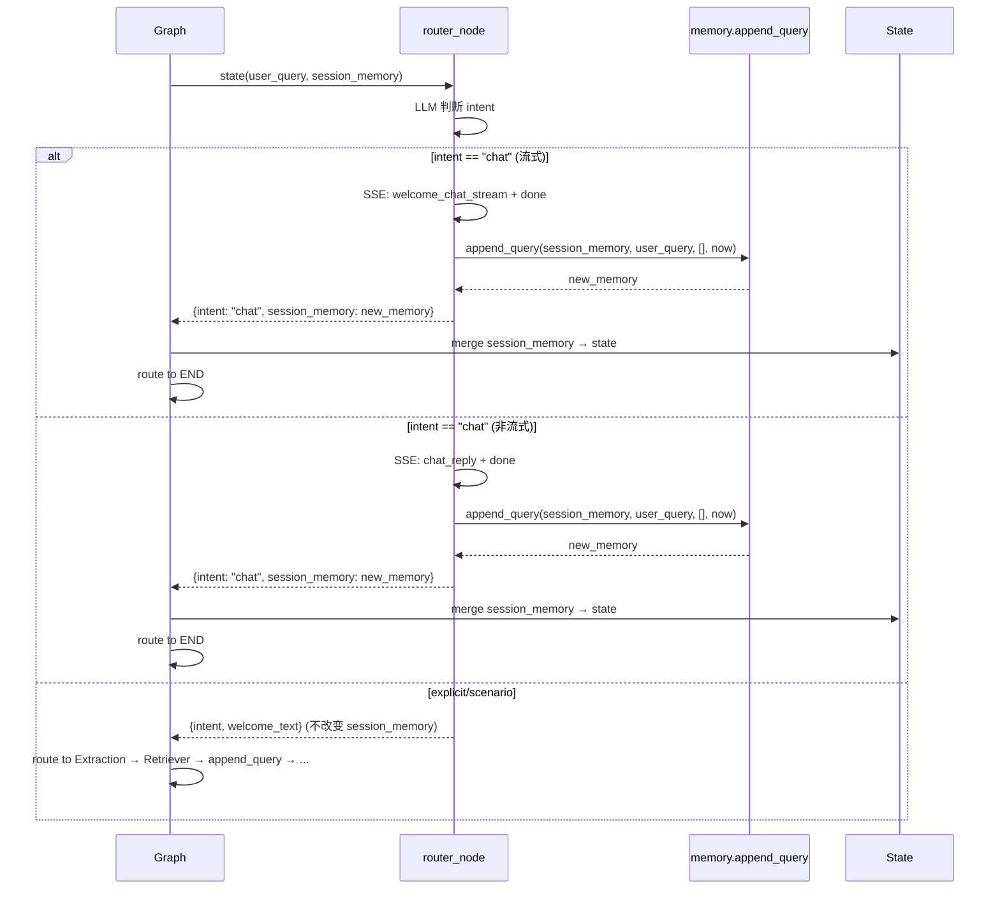

# CON_PLAN.md — 编码级详细设计

> 输入：`PLAN.md` → 输出：本文件
> 日期：2026-06-09

## 1. 修改点详细设计

### 1.1 `router.py` — chitchat 分支追加历史

**新增导入：**
```python
from datetime import datetime
from app.agent.memory import append_query
```

**流式路径修改（当前约 line 134-136）：**
```python
# 当前
if intent == "chat":
    await queue.put({"event": "done", "data": {}})
    return {"intent": "chat", "welcome_text": ""}

# 修改后
if intent == "chat":
    await queue.put({"event": "done", "data": {}})
    new_memory = append_query(
        session_memory, user_query, [],
        timestamp=datetime.now().isoformat(),
    )
    return {"intent": "chat", "welcome_text": "", "session_memory": new_memory}
```

**非流式路径修改（当前约 line 152-159）：**
```python
# 当前
if intent == "chat":
    if queue:
        await queue.put({...})
        await queue.put({"event": "done", "data": {}})
    return {"intent": "chat", "welcome_text": ""}

# 修改后
if intent == "chat":
    if queue:
        await queue.put({...})
        await queue.put({"event": "done", "data": {}})
    new_memory = append_query(
        session_memory, user_query, [],
        timestamp=datetime.now().isoformat(),
    )
    return {"intent": "chat", "welcome_text": "", "session_memory": new_memory}
```

**设计要点：**
- `categories=[]` 利用 `append_query` 现有 fallback → 写入 `unknown` 组
- timestamp 格式与 retriever 保持一致（`datetime.now().isoformat()`）
- 返回 `session_memory`，LangGraph 自动合并到 state

### 1.2 Prompt 时间关注度提示 — 5 处

#### 1.2.1 `unified_router_prompt.py`

**当前（`{recent_queries}` 上方）：**
```text
# 对话历史
{recent_queries}
```

**修改后：**
```text
# 对话历史（越近的对话越重要，优先参考最近的对话判断当前意图）
{recent_queries}
```

#### 1.2.2 `extraction_prompt.py`

**当前（`{recent_queries}` 上方）：**
```text
## 对话历史（最近几轮用户查询，帮助你理解当前模糊查询的上下文）
{recent_queries}
```

**修改后：**
```text
## 对话历史（越近的查询越重要，优先基于最近的查询推断品类）
{recent_queries}
```

#### 1.2.3 `extraction.py` `_build_context_with_memory()`

**当前（约 line 95）：**
```python
lines.append("历史查询（按时间顺序）：")
```

**修改后：**
```python
lines.append("历史查询（按时间顺序，越新越重要）：")
```

#### 1.2.4 `scenario_gen_prompt.py`

**当前（`{history_context}` 上方）：**
```text
## 历史查询
{history_context}
```

**修改后：**
```text
## 历史查询（越近的查询越重要，优先参考最近查询的意图）
{history_context}
```

#### 1.2.5 `option_gen_prompt.py`

**当前（`{recent_queries}` 上方）：**
```text
## 对话历史
{recent_queries}
```

**修改后：**
```text
## 对话历史（越近的对话越重要，优先关注最近对话的需求）
{recent_queries}
```

## 2. 实现链路时序



## 3. 期望最终代码形态

**`router.py` — 流式路径 chat 分支：**
```python
if intent == "chat":
    await queue.put({"event": "done", "data": {}})
    new_memory = append_query(
        session_memory, user_query, [],
        timestamp=datetime.now().isoformat(),
    )
    return {"intent": "chat", "welcome_text": "", "session_memory": new_memory}
```

**`router.py` — 非流式路径 chat 分支：**
```python
if intent == "chat":
    if queue:
        await queue.put({
            "event": "chat_reply",
            "data": welcome_chat or "我主要可以帮助您推荐和比较商品，有需要的话随时告诉我！",
        })
        await queue.put({"event": "done", "data": {}})
    new_memory = append_query(
        session_memory, user_query, [],
        timestamp=datetime.now().isoformat(),
    )
    return {"intent": "chat", "welcome_text": "", "session_memory": new_memory}
```

## 4. 测试设计

### F1 测试 — chitchat 写入 session_memory

| 测试 | 场景 | 预期 |
|------|------|------|
| `test_router_chat_appends_to_memory` | router 判断为 chat，验证返回值含 `session_memory` | `session_memory` 非空，含当前查询 |
| `test_router_chat_memory_has_unknown_category` | chat 写入后，session_memory 中有 `unknown` 组 | category=None, sub_category=None |

### F2 测试 — prompt 含时间提示

| 测试 | 场景 | 预期 |
|------|------|------|
| `test_build_context_has_time_hint` | `_build_context_with_memory` 输出 | 含"越新越重要" |
| `test_router_prompt_has_time_hint` | `UNIFIED_ROUTER_SYSTEM` | 含"越近的对话越重要" |
| `test_extraction_step1_prompt_has_time_hint` | `EXTRACTION_STEP1_SYSTEM` | 含"越近的查询越重要" |
| `test_option_gen_prompt_has_time_hint` | `OPTION_GEN_SYSTEM` | 含"越近的对话越重要" |
| `test_scenario_gen_prompt_has_time_hint` | `SCENARIO_GEN_SYSTEM` | 含"越近的查询越重要" |

### 回归测试

- `test_extraction.py` 中 `test_build_context_empty_memory` 断言更新（从 `"(无)"` → 仍含 `"(无)"`）
- `test_extraction.py` 中 `test_build_context_with_history` 断言更新（含"越新越重要"）
- 所有现有测试应通过

## 5. 期望目录结构（仅改动）

```
server/app/
├── agent/
│   ├── nodes/
│   │   ├── router.py                    # 修改：chat 分支新增 append_query
│   │   └── extraction.py                # 修改：_build_context_with_memory 历史标注
│   └── prompts/
│       ├── unified_router_prompt.py     # 修改：历史段加时间提示
│       ├── extraction_prompt.py         # 修改：历史段加时间提示
│       ├── scenario_gen_prompt.py       # 修改：历史段加时间提示
│       └── option_gen_prompt.py         # 修改：历史段加时间提示
└── tests/
    ├── test_router.py                   # 新增：2 个 F1 测试
    └── test_extraction.py               # 修改：断言更新 + F2 测试
```

## 6. 风险点和待优化项

| 项 | 说明 |
|-----|------|
| **无风险** | 改动最小化，fallback 完整，不影响其他路径 |

---

> 编码可直接开始。遵循 `project-implement` skill 的 TDD 工作流。
