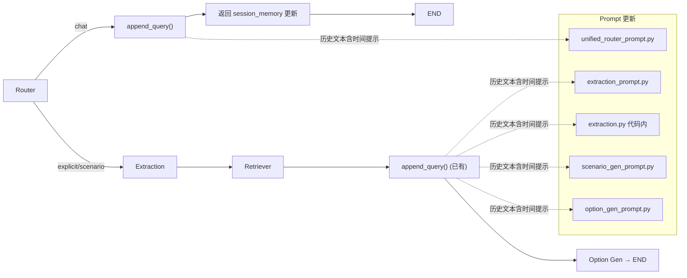

# PLAN.md — 实现方案

> 输入：`DEFINE.md` → 输出：本文件
> 日期：2026-06-09

## 1. 整体架构

## 2. 核心变更点

### 2.1 Router chitchat 路径追加历史

**变更：** `router_node()` 在 `intent == "chat"` 返回前调用 `append_query`。

- 新增 `from datetime import datetime` 和 `from app.agent.memory import append_query` 导入
- chat 分支生成 `timestamp`，调用 `append_query(session_memory, user_query, [], timestamp)`
- 返回 dict 新增 `"session_memory"` 字段，LangGraph 自动合并到 state

**影响范围：** 仅 `router.py`，约 6 行新增代码。

### 2.2 Prompt 时间关注度提示

**变更：** 5 处 prompt/代码中的历史段增加"越近越重要"提示。

| # | 文件 | 位置 | 变更内容 |
|---|------|------|----------|
| 1 | `unified_router_prompt.py` | `{recent_queries}` 上方 | 增加"越近的对话越重要，优先参考最近对话" |
| 2 | `extraction_prompt.py` | `{recent_queries}` 上方 | 已有"帮助理解当前模糊查询"说明，追加时间提示 |
| 3 | `extraction.py` `_build_context_with_memory()` | 历史查询标注行 | "历史查询（按时间顺序，越新越重要）" |
| 4 | `scenario_gen_prompt.py` | `{history_context}` 上方 | 增加"越近的查询越重要" |
| 5 | `option_gen_prompt.py` | `{recent_queries}` 上方 | 增加"越近的对话越重要" |

## 3. 模块影响范围

| 模块 | 变更类型 | 说明 |
|------|---------|------|
| `agent/nodes/router.py` | 修改 | chat 分支新增 `append_query` 调用 |
| `agent/prompts/unified_router_prompt.py` | 修改 | prompt 历史段加时间提示 |
| `agent/prompts/extraction_prompt.py` | 修改 | prompt 历史段加时间提示 |
| `agent/nodes/extraction.py` | 修改 | `_build_context_with_memory` 历史标注加时间提示 |
| `agent/prompts/scenario_gen_prompt.py` | 修改 | prompt 历史段加时间提示 |
| `agent/prompts/option_gen_prompt.py` | 修改 | prompt 历史段加时间提示 |
| `tests/test_extraction.py` | 修改 | `_build_context_with_memory` 断言更新 |
| `tests/test_router.py` | 新增测试 | chat 路径写入 session_memory |

## 4. 主要优点

- **改动极小：** 1 个逻辑变更 + 5 处提示词微调
- **复用现有能力：** `append_query` 已有 `categories=[]` → `unknown` 组的 fallback 逻辑
- **无回归风险：** chitchat 存入 `unknown` 组，品类级检索不受影响
- **不增加 LLM 调用：** 仅内存操作 + prompt 文本调整

## 5. 风险

| 风险 | 缓解 |
|------|------|
| `unknown` 组 history 膨胀 | `memory_recent_rounds=10` 自然限制 Router 读入量 |
| chat 返回新增 `session_memory` 字段是否影响路由 | LangGraph 只按 `intent` 路由，`session_memory` 仅被合并到 state |

## 6. 复杂度评估

| 维度 | 评级 |
|------|------|
| 实现复杂度 | **极低** — 约 20 行新增/修改 |
| 测试复杂度 | **极低** — mock 状态即可 |
| 回归风险 | **极低** — chat 路径不会影响导购流程 |
| 可交付性 | **高** — 单次 commit |

## 7. 可测试性

- F1 测试：构造 mock state，验证 `router_node()` chat 返回值的 `session_memory` 包含当前查询
- F2 测试：验证 prompt 模板/格式化文本包含时间提示关键词
- 回归测试：现有测试全部通过

---

> 无 `[NEEDS CLARIFICATION]`。方案明确，可直接进入 CON_PLAN.md。
