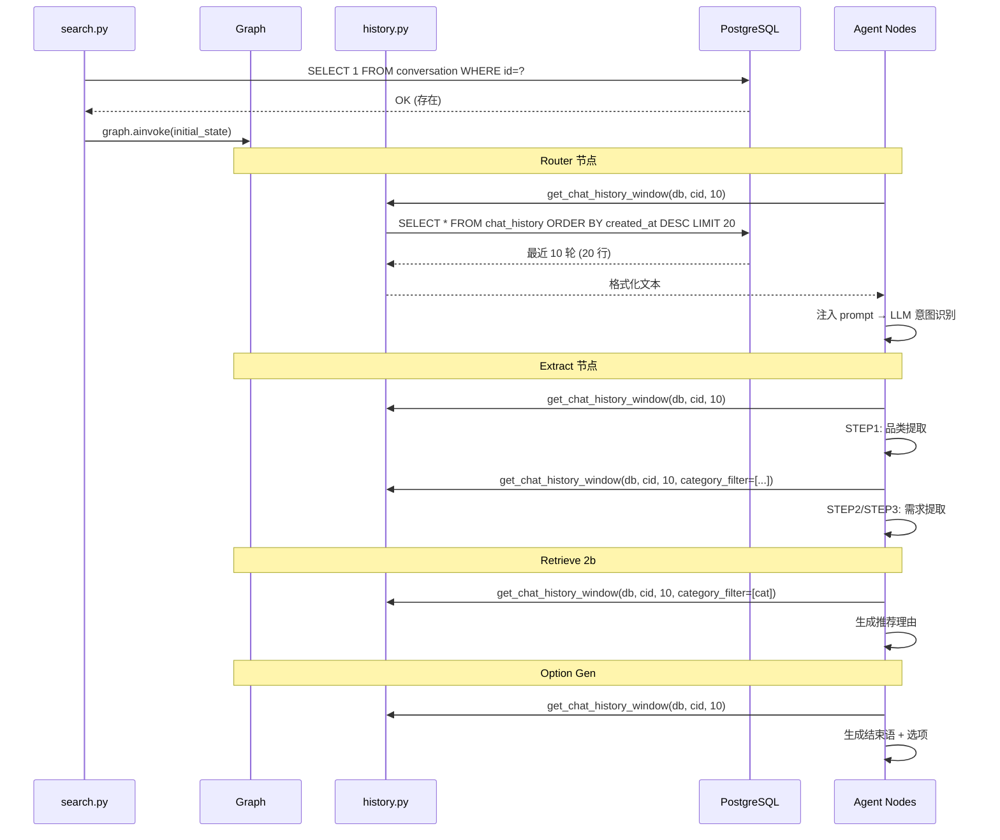

# CON_PLAN.md — HISTORY_OPT2 编码级详细方案

> 输入: `server/docs/AGENT_OPT/HISTORY_OPT2/PLAN.md`

## 1. 模块详细设计

### 1.1 数据库迁移 (alembic)

**迁移操作**:
1. `ALTER TABLE chat_message RENAME TO chat_history` （保留所有索引）
2. `ALTER TABLE conversation DROP COLUMN memory`

### 1.2 `app/models/chat_history.py` (重命名自 chat_message.py)

**变更**: `__tablename__ = "chat_history"`，类名 `ChatHistory`，其他字段不变。

### 1.3 `app/models/conversation.py` (精简)

**变更**: 删除 `memory` 字段定义（Mapped + mapped_column），保留 `conversation_id`/`created_at`/`updated_at`。

### 1.4 `app/agent/history.py` (新建) — 滑动窗口查询

**实现思路**: 从 ChatHistory 表查最近 N 轮对话，格式化为统一文本。

**函数签名**:
```python
async def get_chat_history_window(
    db_session,
    conversation_id: str,
    max_rounds: int,
    category_filter: list[str] | None = None,
) -> str
```

**逻辑**:
1. 查询 `chat_history` 表 WHERE conversation_id = ? ORDER BY created_at DESC LIMIT max_rounds * 2
2. 翻转结果为正序
3. 格式化为 `"用户: {content}\n助手: {content}\n..."` 文本
4. 若 `category_filter` 非空，结果前追加提示词 "重点关注与以下品类相关的部分：{cats}"

### 1.5 `app/agent/memory.py` (删除)

**移除**: `append_query`, `get_recent_queries`, `get_queries_by_category` 全部函数。

### 1.6 `app/agent/state.py`

**删除** `session_memory` TypedDict 字段。

### 1.7 各 Agent 节点改造

#### 1.7.1 `intent_route_agent.py`

**改动**:
- 删除 `from app.agent.memory import append_query` 和 `from datetime import datetime`
- 删除 Chat 路径两处 `new_memory = append_query(...)` + `"session_memory": new_memory`
- 新增 `db_session_factory` 参数
- 构建 prompt 前调用 `get_chat_history_window(db_session, conversation_id, max_rounds)`，注入到 prompt 的对话历史占位符

#### 1.7.2 `intent_extract_agent.py`

**改动**:
- 删除 `get_recent_queries` 导入
- `_build_context_with_memory()` 函数中的 session_memory 逻辑 → 调用 `get_chat_history_window`
- STEP2 调用时传入 `category_filter` 参数（STEP1 提取的品类列表）
- prompt 中的 `{recent_queries}` 占位符替换逻辑不变

#### 1.7.3 `product_retrieve_agent.py`

**改动**:
- 删除 `append_query` 导入和调用
- 删除 `# 3. Memory 更新阶段` 整个代码块
- 2b 阶段新增 `get_chat_history_window` 调用，传入 `category_filter`
- 移除函数签名中的 `session_memory` 参数

#### 1.7.4 `scene_generate_agent.py`

**改动**:
- 删除 `get_queries_by_category` 导入
- `_build_scenario_history_context()` → 调用 `get_chat_history_window` 替代
- `list(lookup)[:6]` → `list(lookup)[:settings.search.max_scene_categories]`
- `_build_scenario_history_context` 简化为直接调用 `get_chat_history_window`

#### 1.7.5 `option_generate_agent.py`

**改动**:
- 删除 `_build_recent_queries_text()` 函数
- 新增 `get_chat_history_window` 调用
- prompt 占位符替换逻辑不变

### 1.8 `app/agent/graph.py`

**改动**:
- `initial_state` 删除 `"session_memory": initial_session_memory`
- 各节点 wrapper 传递 `db_session_factory` 给需要历史的节点

### 1.9 `app/api/search.py`

**改动**:
- 删除 Conversation memory 加载逻辑（lines 178-198）
- 删除 Conversation memory 保存逻辑（lines 297-321）
- `_agent_event_stream` 新增 `conversation_id` 参数传入各节点 graph 执行
- ChatMessage → ChatHistory（lines 334-335 import/class）
- 保留 Conversation 的存在性校验

### 1.10 `app/api/get_conversation.py`

**改动**: `Conversation(conversation_id=conversation_id)` — 移除 `memory=[]`

### 1.11 `app/api/get_product_info.py`

**改动**: `ChatMessage` → `ChatHistory`，`chat_message` → `chat_history`

### 1.12 `app/config.py`

**改动**: 新增 `max_scene_categories: int = 3`

## 2. 核心接口时序



## 3. 关键数据实体

### ChatHistory 表 (chat_history)

| 列 | 类型 | 说明 |
|---|---|---|
| id | SERIAL PK | 自增 |
| conversation_id | VARCHAR(36) INDEXED | 会话 ID |
| role | VARCHAR(10) | "user" / "assistant" |
| content | TEXT | 消息内容 |
| created_at | TIMESTAMP | 自动时间戳 |

### Conversation 表 (conversation)

| 列 | 类型 | 说明 |
|---|---|---|
| conversation_id | VARCHAR(36) PK | 会话 ID |
| created_at | TIMESTAMP | 创建时间 |
| updated_at | TIMESTAMP | 最后更新时间 |

## 4. 期望项目目录结构

```
server/
├── alembic/versions/
│   └── xxx_rename_chat_history.py      # 迁移脚本
├── app/
│   ├── agent/
│   │   ├── history.py                  # [NEW] 滑动窗口查询公共函数
│   │   ├── memory.py                   # [DELETE]
│   │   ├── state.py                    # 删除 session_memory 字段
│   │   ├── graph.py                    # 更新 initial_state + 节点传递
│   │   └── nodes/
│   │       ├── intent_route_agent.py   # 删除 append_query, 注入历史
│   │       ├── intent_extract_agent.py # 删除 session_memory, 注入历史
│   │       ├── product_retrieve_agent.py # 删除 append_query + 3.Memory, 注入历史
│   │       ├── scene_generate_agent.py # 删除 get_queries, [:6]→config, 注入历史
│   │       └── option_generate_agent.py # 删除 _build_recent_queries_text, 注入历史
│   ├── api/
│   │   ├── search.py                   # 删除 session_memory 读写, ChatMessage→ChatHistory
│   │   ├── get_conversation.py         # 删除 memory=[]
│   │   └── get_product_info.py         # ChatMessage→ChatHistory
│   ├── models/
│   │   ├── chat_history.py             # [RENAME] __tablename__="chat_history"
│   │   ├── conversation.py             # 删除 memory 列
│   │   ├── chat_message.py             # [DELETE]
│   │   └── __init__.py                 # 更新导入
│   └── config.py                       # 新增 max_scene_categories
├── config/
│   └── config.yaml                     # 新增 max_scene_categories: 3
└── tests/
    ├── test_chat_message_persistence.py # ChatMessage→ChatHistory 引用更新
    ├── test_router.py                  # 删除 session_memory 断言
    ├── test_extraction.py              # 删除 session_memory 断言
    ├── test_retrieval_node.py          # 删除 session_memory 断言
    ├── test_option_gen.py              # 删除 session_memory 断言
    └── test_scenario_gen.py            # 删除 session_memory 断言
```

## 5. 风险点与待优化项

- **session_memory 测试清理**: 大量测试依赖 session_memory 字段，需逐一检查替换
- **db_session_factory 传递链**: 部分节点原本不需要 DB（如 option_gen），现在需要 factory 参数
- **迁移不可逆风险**: 删除 memory 列可能丢失数据，执行前需确认
- **prompt 长度**: 10 轮对话文本约 4000 字符，各 prompt 需预留空间
