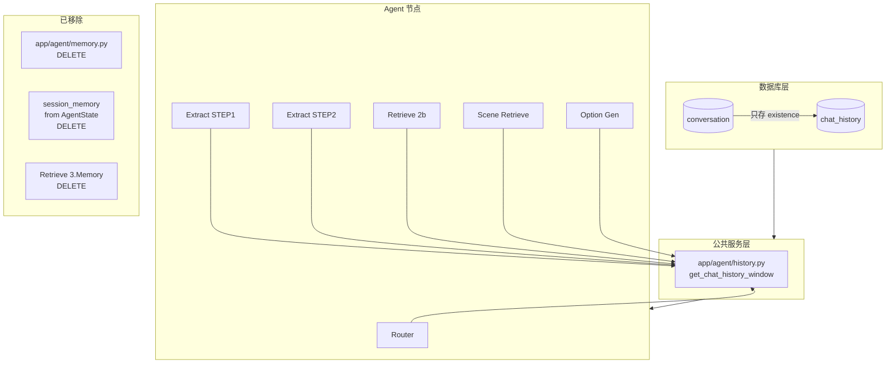

# PLAN.md — HISTORY_OPT2 实现方案

> 输入: `server/docs/AGENT_OPT/HISTORY_OPT2/DEFINE.md`

## 1. 整体实现架构

## 2. 核心变更清单

| # | 模块 | 文件 | 变更类型 |
|---|---|---|---|
| 1 | 数据库迁移 | `alembic/versions/xxx_rename_chat_history.py` | 新增 |
| 2 | 数据模型 | `app/models/chat_message.py` → `chat_history.py` | 重命名 |
| 3 | 数据模型 | `app/models/conversation.py` | 修改 |
| 4 | 数据模型 | `app/models/__init__.py` | 修改 |
| 5 | 公共服务 | `app/agent/history.py` | 新增 |
| 6 | 公共逻辑 | `app/agent/memory.py` | 删除 |
| 7 | Agent 状态 | `app/agent/state.py` | 修改 |
| 8 | Agent 节点 | `app/agent/nodes/intent_route_agent.py` | 修改 |
| 9 | Agent 节点 | `app/agent/nodes/intent_extract_agent.py` | 修改 |
| 10 | Agent 节点 | `app/agent/nodes/product_retrieve_agent.py` | 修改 |
| 11 | Agent 节点 | `app/agent/nodes/scene_generate_agent.py` | 修改 |
| 12 | Agent 节点 | `app/agent/nodes/option_generate_agent.py` | 修改 |
| 13 | Agent Graph | `app/agent/graph.py` | 修改 |
| 14 | API | `app/api/search.py` | 修改 |
| 15 | API | `app/api/get_conversation.py` | 修改 |
| 16 | API | `app/api/get_product_info.py` | 修改 |
| 17 | 配置 | `app/config.py` | 修改 |
| 18 | 配置 | `config/config.yaml` | 修改 |
| 19 | 测试 | `tests/test_router.py` 等 | 修改 |
| 20 | 文档 | `alembic/env.py` | 修改 |

## 3. 模块设计

### 3.1 `app/agent/history.py` (新建)

- **功能**: 提供滑动窗口查询公共函数
- **接口**: `async def get_chat_history_window(db_session, conversation_id: str, max_rounds: int) -> str`
- **输入**: 异步 DB session + conversation_id + 窗口大小
- **输出**: 格式化的对话历史文本字符串

### 3.2 `app/agent/memory.py` (删除)

- 移除 `append_query`, `get_recent_queries`, `get_queries_by_category` 所有函数

### 3.3 `app/agent/state.py`

- 删除 `session_memory` 字段定义

### 3.4 各 Agent 节点

每个节点新增 `db_session_factory` 参数注入，在 prompt 构建前调用 `get_chat_history_window`，替换原有的 `session_memory` 相关逻辑。

### 3.5 `app/api/search.py`

- 启动时：从 ChatHistory 获取滑动窗口历史 → 注入初始状态
- 结束时：移除 session_memory 写回 → 无需持久化（ChatHistory 的写入保留 F1 的 chat_reply 逻辑）

### 3.6 `app/api/get_conversation.py`

- 只插入 `Conversation(conversation_id=...)`，不传 `memory`

### 3.7 `app/config.py` + `config/config.yaml`

- 新增 `max_scene_categories: int = 3`

## 4. 方案优点

- **单一数据源**: 所有对话历史来自 ChatHistory 表，消除 session_memory vs ChatMessage 的数据冗余
- **精简架构**: 删除 memory.py 和 Retrieve 3.Memory 节点，减少 30+ 行代码
- **可配置**: 窗口大小（memory_recent_rounds）和品类上限（max_scene_categories）均在 config.yaml

## 5. 主要风险

| 风险 | 缓解 |
|---|---|
| session_memory 删除影响大量测试 | 分批修改测试，逐文件验证 |
| 各节点新增 DB 依赖（原 session_memory 是内存操作） | 复用现有 db_session_factory 参数模式 |
| 滑动窗口历史文本超长 | 单条截断 200 字符，10 轮 = 最多 ~4000 字符 |

## 6. 实现复杂度

**中等**。涉及 20+ 文件修改，主要是机械式替换和删除。最大的工作量在测试文件的适配。

## 7. 可测试性

- 滑动窗口查询：单元测试（mock DB session）
- prompt 注入：单元测试（检查 prompt 含历史片段）
- 端到端：依赖 LLM，标记为集成测试

## 8. 可交付性

可分 4 波交付：
- Wave 1: 数据模型（迁移 + 模型文件）
- Wave 2: 服务层（history.py 新建 + memory.py 删除）
- Wave 3: Agent 节点适配
- Wave 4: 测试更新 + 回归验证
