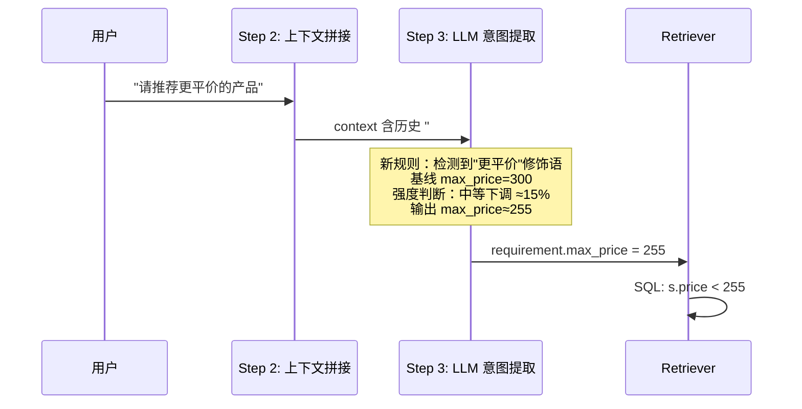
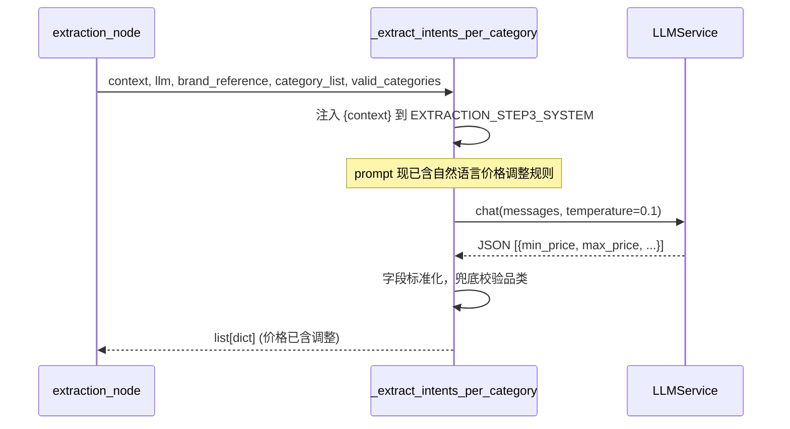

# CON_PLAN.md — 多轮对话自然语言价格调整 编码级详细方案

> 输入：`PLAN.md`（已确认）

---

## 1. 模块详细设计

本任务仅涉及一个模块：`extraction_prompt.py` 中的 `EXTRACTION_STEP3_SYSTEM` prompt 字符串。

### 1.1 实现思路

在现有 `EXTRACTION_STEP3_SYSTEM` 的 "Structured Filter" 段中，`price` 行之后插入"自然语言价格调整"子规则。Step 3 的 LLM 收到包含时间戳的 context（由 Step 2 生成），可从最新查询中检测价格修饰语、从历史查询中找到最近显式数值基线、然后输出调整后的 min_price/max_price。

### 1.2 功能实现链路



### 1.3 Prompt 改动点

**文件：** `server/app/agent/prompts/extraction_prompt.py`，行 40-41 之间插入。

**改动前 (L40):**
```
- price 相关：提取为 min_price（最低价）和 max_price（最高价），没有约束时 min_price=0, max_price=4294967295
```

**改动后:**
```
- price 相关：提取为 min_price（最低价）和 max_price（最高价），没有约束时 min_price=0, max_price=4294967295
  * **自然语言价格调整**：如果当前查询使用自然语言表达了对历史价格的相对调整意图，
    而历史查询中存在显式数值价格，则以最近一轮显式数值为基线，根据语言强度动态调整：
    - 轻微调整（"稍微便宜点""略贵一点"）         → 调整约 5%-10%
    - 中等调整（"更平价""便宜些""贵一些""再便宜点"）→ 调整约 10%-25%
    - 强烈调整（"越便宜越好""白菜价""使劲砍"）    → 调整约 25%-50%
    * 调整底线：min_price >= 0, max_price >= 1, 且调整后 min_price < max_price
    * 若当前查询同时包含显式数值（如"200元以下"），则显式数值优先，不做相对调整
    * 若历史查询无显式数值，则直接按"更便宜"等语义提取方向性价格偏好，
      不做相对计算（如"推荐便宜的手机"→ max_price 可设为较低值如 500）
```

### 1.4 难点/风险点及解决方案

| 难点 | 解决方案 |
|------|----------|
| LLM 调整幅度不稳定 | temperature=0.1（已有），且 prompt 给出明确强度分档和幅度区间 |
| 连续多轮"再便宜点"导致价格归零 | 调整底线规则：max_price >= 1 |
| 误判评价性语言为指令 | 示例中区分"这个不错，便宜好用"（评价）和"推荐更便宜的"（指令） |
| 与现有"后说覆盖前说"冲突 | 新规则明确：当前查询有显式数值时，显式数值优先（走旧逻辑）；仅当无显式数值时才做相对调整 |

---

## 2. 核心接口详细设计

### 2.1 `_extract_intents_per_category()` — 接口不变

**涉及模块：** `extraction_prompt.py`（prompt 内容），`extraction.py`（调用方，不修改）



---

## 3. 关键数据实体

无新数据结构。`requirements[i].min_price` / `.max_price` 语义不变（`int` 类型），仅值由 LLM 推理得出。

---

## 4. 目录结构

```
server/
├── app/agent/prompts/
│   └── extraction_prompt.py          # ▲ 修改：EXTRACTION_STEP3_SYSTEM 增加价格调整规则
└── tests/
    └── test_extraction.py             # ▲ 修改：新增 4 个测试函数
```

> 注：仅修改 2 个文件，不新增文件。

---

## 5. 测试设计

### 5.1 单元测试（`tests/test_extraction.py`）

**测试 1：自然语言价格下调（SPEC.md 示例）**
```python
@pytest.mark.asyncio
async def test_natural_language_price_down():
    """'300元以下' → '更平价' 后 max_price 应从 300 下降到合理范围。"""
    mock_llm = AsyncMock()
    step1_json = json.dumps([{"category": "美妆护肤", "sub_category": "防晒", "brand": None}])
    # Step3 返回调整后的价格：300 → ~250 (约 1/6 下调)
    step3_json = json.dumps([{
        "category": "美妆护肤", "sub_category": "防晒",
        "text": "", "min_price": 0, "max_price": 250,
        "order_num": 1, "brand": None,
    }])
    responses = [step1_json, step3_json]
    mock_llm.chat = AsyncMock(side_effect=responses)

    mock_session = AsyncMock()
    mock_session_factory = MagicMock(return_value=mock_session)
    mock_session.execute.return_value.fetchall.return_value = []

    state = {
        "user_query": "请推荐更平价的产品",
        "session_memory": [
            {"category": "美妆护肤", "sub_category": "防晒",
             "queries": [{"query": "推荐300元以下的防晒霜", "timestamp": "2026-06-04T10:00:00"}]}
        ],
    }

    with patch("app.services.category_lookup_service.fetch_category_context",
               AsyncMock(return_value=("", set()))):
        result = await extraction_node(state, llm=mock_llm,
                                        db_session_factory=mock_session_factory)

    reqs = result["requirements"]
    assert len(reqs) >= 1
    max_p = reqs[0]["max_price"]
    assert max_p < 300, f"期望 max_price 下调，实际 {max_p}"
    assert max_p >= 1, f"max_price 不应跌破底线"
```

**测试 2：自然语言价格上调**
```python
@pytest.mark.asyncio
async def test_natural_language_price_up():
    """'200元左右' → '可以稍微贵一点' 后 max_price 应上升。"""
    mock_llm = AsyncMock()
    step1_json = json.dumps([{"category": "数码电子", "sub_category": "蓝牙耳机", "brand": None}])
    step3_json = json.dumps([{
        "category": "数码电子", "sub_category": "蓝牙耳机",
        "text": "", "min_price": 200, "max_price": 260,
        "order_num": 1, "brand": None,
    }])
    responses = [step1_json, step3_json]
    mock_llm.chat = AsyncMock(side_effect=responses)

    mock_session = AsyncMock()
    mock_session_factory = MagicMock(return_value=mock_session)
    mock_session.execute.return_value.fetchall.return_value = []

    state = {
        "user_query": "可以稍微贵一点",
        "session_memory": [
            {"category": "数码电子", "sub_category": "蓝牙耳机",
             "queries": [{"query": "推荐200元左右的蓝牙耳机", "timestamp": "2026-06-04T10:00:00"}]}
        ],
    }

    with patch("app.services.category_lookup_service.fetch_category_context",
               AsyncMock(return_value=("", set()))):
        result = await extraction_node(state, llm=mock_llm,
                                        db_session_factory=mock_session_factory)

    reqs = result["requirements"]
    max_p = reqs[0]["max_price"]
    assert max_p > 200, f"期望 max_price 上调，实际 {max_p}"
```

**测试 3：无显式历史数值时不做相对调整**
```python
@pytest.mark.asyncio
async def test_no_baseline_no_relative_adjustment():
    """历史无显式数值时，'更便宜' 直接按语义提取价格，不崩溃。"""
    mock_llm = AsyncMock()
    step1_json = json.dumps([{"category": "美妆护肤", "sub_category": "防晒", "brand": None}])
    step3_json = json.dumps([{
        "category": "美妆护肤", "sub_category": "防晒",
        "text": "", "min_price": 0, "max_price": 500,
        "order_num": 1, "brand": None,
    }])
    responses = [step1_json, step3_json]
    mock_llm.chat = AsyncMock(side_effect=responses)

    mock_session = AsyncMock()
    mock_session_factory = MagicMock(return_value=mock_session)
    mock_session.execute.return_value.fetchall.return_value = []

    state = {
        "user_query": "推荐更便宜的防晒霜",
        "session_memory": [],  # 无历史
    }

    with patch("app.services.category_lookup_service.fetch_category_context",
               AsyncMock(return_value=("", set()))):
        result = await extraction_node(state, llm=mock_llm,
                                        db_session_factory=mock_session_factory)

    reqs = result["requirements"]
    assert len(reqs) >= 1
    assert reqs[0]["max_price"] < 4294967295  # 应有一个合理的上限
```

**测试 4：显式数值仍然优先**
```python
@pytest.mark.asyncio
async def test_explicit_number_wins_over_natural_language():
    """当前查询含显式数值时，不走相对调整逻辑。"""
    mock_llm = AsyncMock()
    step1_json = json.dumps([{"category": "美妆护肤", "sub_category": "防晒", "brand": None}])
    step3_json = json.dumps([{
        "category": "美妆护肤", "sub_category": "防晒",
        "text": "", "min_price": 0, "max_price": 150,
        "order_num": 1, "brand": None,
    }])
    responses = [step1_json, step3_json]
    mock_llm.chat = AsyncMock(side_effect=responses)

    mock_session = AsyncMock()
    mock_session_factory = MagicMock(return_value=mock_session)
    mock_session.execute.return_value.fetchall.return_value = []

    state = {
        "user_query": "150元以下的有没有",
        "session_memory": [
            {"category": "美妆护肤", "sub_category": "防晒",
             "queries": [{"query": "推荐300元以下的防晒霜", "timestamp": "2026-06-04T10:00:00"}]}
        ],
    }

    with patch("app.services.category_lookup_service.fetch_category_context",
               AsyncMock(return_value=("", set()))):
        result = await extraction_node(state, llm=mock_llm,
                                        db_session_factory=mock_session_factory)

    reqs = result["requirements"]
    assert reqs[0]["max_price"] == 150  # 显式数值直接覆盖
```

### 5.2 集成测试（需网络，用真实 LLM 验证 SPEC.md 示例）

手动运行 `python run.py` 启动服务，发送两轮对话：
1. "推荐300元以下的防晒霜"
2. "请推荐更平价的产品"

验证第二轮返回的商品价格**整体低于**第一轮（中位数或均值下移），且第二轮不重复推荐第一轮的全部商品。

---

## 6. Prompt 模板正确性测试

```python
def test_step3_prompt_contains_price_adjustment_rules():
    """EXTRACTION_STEP3_SYSTEM 应包含自然语言价格调整规则。"""
    from app.agent.prompts.extraction_prompt import EXTRACTION_STEP3_SYSTEM
    assert "自然语言价格调整" in EXTRACTION_STEP3_SYSTEM
    assert "更平价" in EXTRACTION_STEP3_SYSTEM
    assert "基线" in EXTRACTION_STEP3_SYSTEM
```

---

## 7. 风险点和待优化项

| 风险 | 级别 | 说明 |
|------|------|------|
| 调整幅度不稳定 | 中 | 依赖 LLM 推理，同一输入可能输出不同值；temperature=0.1 可缓解 |
| 中文修饰语覆盖不全 | 低 | 初版覆盖常见表达，极端口语化表达（"砍到脚脖子"）可能未识别，可后续迭代 |
| 与 scenario 路径不一致 | 低 | scenario_gen 路径有独立的价格提取 prompt，本次不改；若两路径行为不一致可后续对齐 |

---

## [NEEDS CLARIFICATION]

无。
