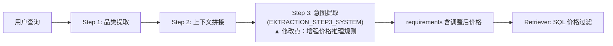

# PLAN.md — 多轮对话自然语言价格调整 实现方案

> 输入：`DEFINE.md`（已确认）

## 1. 方案整体架构

改动范围极小，仅涉及 prompt 文本增强，不增加新模块、新函数或新 API 调用。

**唯一修改点：** `EXTRACTION_STEP3_SYSTEM` prompt（`extraction_prompt.py:31-71`）。

## 2. 核心接口（不变）

Step 3 函数签名不变：`_extract_intents_per_category(context, llm, brand_reference, category_list, valid_categories)`，输出 `list[dict]`，字段含 `min_price`/`max_price`。

上游 Step 2 输出的 `context` 文本已包含时间戳标注的历史查询和当前查询，LLM 可直接从中推断价格演变。

## 3. 模块设计

### 3.1 Prompt 增强（`extraction_prompt.py`）

**输入：** 拼接后的查询文本 `{context}`（含历史时间戳 + 当前查询）
**输出：** LLM 推理后的 `min_price`/`max_price`（已含自然语言调整）

**增强内容：** 在 `EXTRACTION_STEP3_SYSTEM` 的"Structured Filter"段新增"自然语言价格调整"子规则：

- **检测基线价格**：从历史查询中找到最近一轮的显式数值价格（如"300元以下"→ max_price=300）
- **检测调整意图**：识别当前查询中的自然语言价格修饰语（"更平价""便宜点""可以贵一些"等）
- **动态调整**：根据语言强度决定调整比例，然后应用于基线价格
- **调整底线**：不跌破 0，不涨破 4294967295

### 3.2 测试（`tests/test_extraction.py`）

**输入：** 模拟两步 LLM 响应（step1 品类 + step3 价格调整）
**输出：** 断言 requirements 中的价格已按预期调整

新增测试函数：
- `test_natural_language_price_down` — "300元以下" → "更平价" 后 max_price 应下降
- `test_natural_language_price_up` — "200元左右" → "可以贵一点" 后 max_price 应上升
- `test_no_price_baseline_fallback` — 无显式数值时自然语言直接提取，不做相对调整
- `test_explicit_number_still_wins` — 显式数字变更（"300"→"200"）仍以后者为准

## 4. 主要优点

- **零代码改动**：只改 prompt 字符串，不碰 extraction.py 流程
- **零额外延迟**：不增加 LLM 调用次数
- **可回退**：prompt 变更可独立 revert，不影响其他功能
- **LLM 原生推理**：利用 LLM 的语言理解能力处理模糊的自然语言强度，无需人工规则

## 5. 主要风险

- **R1 调整幅度不稳定**：同一输入可能产出不同价格，但 temperature=0.1 可降低波动
- **R2 边界 case 遗漏**：中文价格修饰语丰富（"砍一刀""白菜价"等），初版 prompt 覆盖有限，需迭代

## 6. 复杂度评估

| 维度 | 评估 |
|------|------|
| 实现复杂度 | **低** — 仅修改一个 prompt 字符串 |
| 测试复杂度 | **低** — mock LLM 响应即可验证 |
| 风险等级 | **低** — 改动隔离，不影响其他节点 |

## 7. 可测试性

- 单元测试通过 mock LLM 的 step3 返回 JSON 直接验证字段值
- 集成测试通过真实 LLM 调用 SPEC.md 示例验证效果（需网络）

## 8. 可交付性

- 合并后即刻生效，无需部署额外服务或迁移数据
- prompt 迭代只需改 `extraction_prompt.py` 一个文件

---

## [NEEDS CLARIFICATION]

无。
