# PLAN.md — 实现方案

> 输入：`DEFINE.md` → 输出：本文件
> 日期：2026-06-09

## 1. 整体架构

纯重命名重构，13 个文件 → 新名 + 所有引用点同步更新。

```mermaid
graph TB
    subgraph 文件重命名
        A1["extraction.py → intent_extract_agent.py"]
        A2["option_gen.py → option_generate_agent.py"]
        A3["retriever.py → product_retrieve_agent.py"]
        A4["router.py → intent_route_agent.py"]
        A5["scenario_gen.py → scene_generate_agent.py"]
        P1["extraction_prompt.py → intent_extract_prompt.py"]
        P2["option_gen_prompt.py → option_generate_prompt.py"]
        P3["unified_router_prompt.py → intent_router_prompt.py"]
        P4["scenario_gen_prompt.py → scene_generate_prompt.py"]
        P5["category_intro_prompt.py → category_introduct_prompt.py"]
        P6["product_reason_prompt.py → product_recommendation_prompt.py"]
        API1["products.py → get_product_info.py"]
        API2["conversation.py → get_conversation.py"]
    end

    subgraph 引用更新
        G["graph.py"]
        MAIN["main.py"]
        NODES["5 个 agent 文件内 import"]
        TS["6 个测试文件"]
        DOCS["docs/*.md"]
    end

    A1 & A2 & A3 & A4 & A5 --> G
    A1 & A2 & A3 & A4 & A5 --> TS
    P1 & P2 & P3 & P4 & P5 & P6 --> NODES
    P1 & P2 & P3 & P4 & P5 & P6 --> TS
    API1 & API2 --> MAIN
    API1 --> TS
```

## 2. 完整影响范围

### 2.1 被重命名文件（13 个）

#### agent/nodes/ (5)
| 当前路径 | 新路径 |
|---------|--------|
| `server/app/agent/nodes/extraction.py` | `intent_extract_agent.py` |
| `server/app/agent/nodes/option_gen.py` | `option_generate_agent.py` |
| `server/app/agent/nodes/retriever.py` | `product_retrieve_agent.py` |
| `server/app/agent/nodes/router.py` | `intent_route_agent.py` |
| `server/app/agent/nodes/scenario_gen.py` | `scene_generate_agent.py` |

#### agent/prompts/ (6)
| 当前路径 | 新路径 |
|---------|--------|
| `category_intro_prompt.py` | `category_introduct_prompt.py` |
| `extraction_prompt.py` | `intent_extract_prompt.py` |
| `option_gen_prompt.py` | `option_generate_prompt.py` |
| `product_reason_prompt.py` | `product_recommendation_prompt.py` |
| `scenario_gen_prompt.py` | `scene_generate_prompt.py` |
| `unified_router_prompt.py` | `intent_router_prompt.py` |

#### api/ (2)
| 当前路径 | 新路径 |
|---------|--------|
| `products.py` | `get_product_info.py` |
| `conversation.py` | `get_conversation.py` |

### 2.2 需要修改的引用文件（14 个）

#### 核心代码 (7)
| # | 文件 | 修改内容 |
|---|------|----------|
| 1 | `graph.py` | 5 条 agent import + `router_node` → `intent_route_node` 等调用 |
| 2 | `main.py` | `products` → `get_product_info`, `conversation` → `get_conversation` |
| 3 | `router.py` → `intent_route_agent.py` | prompt import + 模块内函数名 |
| 4 | `extraction.py` → `intent_extract_agent.py` | prompt import + 模块内函数名 |
| 5 | `retriever.py` → `product_retrieve_agent.py` | 2 条 prompt import + 模块内函数名 |
| 6 | `option_gen.py` → `option_generate_agent.py` | prompt import + 模块内函数名 |
| 7 | `scenario_gen.py` → `scene_generate_agent.py` | prompt import + 模块内函数名 |

#### 测试文件 (7)
| # | 文件 | 修改内容 |
|---|------|----------|
| 8 | `test_router.py` | node import + prompt import + 函数名 |
| 9 | `test_extraction.py` | node import + prompt import + 函数名 |
| 10 | `test_option_gen.py` | node import + prompt import + 函数名 |
| 11 | `test_scenario_gen.py` | node import + prompt import + 函数名 |
| 12 | `test_retrieval_node.py` | node import + 函数名 |
| 13 | `test_price_adjust_integration.py` | node import + prompt import + 函数名 |
| 14 | `test_batch_api.py` | api import |

### 2.3 导出函数/常量重命名影响

每个更名后的引用点：

| 旧名 → 新名 | 引用文件数 |
|------------|-----------|
| `router_node` → `intent_route_node` | graph.py, test_router.py |
| `extraction_node` → `intent_extract_node` | graph.py, test_extraction.py, test_price_adjust_integration.py |
| `option_gen_node` → `option_generate_node` | graph.py, test_option_gen.py |
| `retrieval_node` → `product_retrieve_node` | graph.py, test_retrieval_node.py |
| `scenario_gen_node` → `scene_generate_node` | graph.py, test_scenario_gen.py |
| `_parse_router_response` → `_parse_route_response` | router.py(内部), test_router.py |
| `UNIFIED_ROUTER_SYSTEM` → `INTENT_ROUTER_SYSTEM` | router.py, test_router.py |
| `EXTRACTION_STEP1_SYSTEM` → `INTENT_EXTRACT_STEP1_SYSTEM` | extraction.py, test_extraction.py |
| `EXTRACTION_STEP3_SYSTEM` → `INTENT_EXTRACT_STEP3_SYSTEM` | extraction.py, test_extraction.py, test_price_adjust_integration.py |
| `SCENARIO_GEN_SYSTEM` → `SCENE_GENERATE_SYSTEM` | scenario_gen.py, test_scenario_gen.py |
| `ENDING_OPTION_SYSTEM` → `OPTION_GENERATE_SYSTEM` | option_gen.py, test_option_gen.py |
| `CATEGORY_INTRO_SYSTEM` → `CATEGORY_INTRODUCT_SYSTEM` | retriever.py |
| `PRODUCT_REASON_SYSTEM` → `PRODUCT_RECOMMENDATION_SYSTEM` | retriever.py |

## 3. 执行策略

按依赖顺序分 3 波执行，确保每波后测试通过：

- **波 1：提示词文件重命名**（底层，无内部依赖）
  - 6 个 prompt 文件 + 常量名 + 所有 node 内 import + 测试 import
  
- **波 2：Agent 文件重命名**（中间层，依赖 prompt）
  - 5 个 agent 文件 + 函数名 + graph.py + 测试 import + 测试函数名

- **波 3：API 文件重命名**（最外层，无内部依赖）
  - 2 个 api 文件 + main.py + test_batch_api.py

## 4. 主要优点

- 文件名语义清晰，`gen` → `generate`、缩写展开
- `_agent` 后缀区分 agent node 与 prompt 文件
- API 文件 `get_xxx` 命名直接反映用途
- 函数名与文件名保持一致

## 5. 风险

| 风险 | 缓解 |
|------|------|
| import 漏改导致 ImportError | 分波执行，每波后全量跑测试 |
| 运行时动态 import 遗漏 | grep 搜索旧文件名字符串全项目扫描 |
| 设计文档旧引用残留 | grep `server/docs/` 逐条更新 |

## 6. 复杂度评估

| 维度 | 评级 |
|------|------|
| 实现复杂度 | **低** — 纯 rename + find/replace |
| 测试复杂度 | **低** — 不改变测试逻辑 |
| 回归风险 | **低** — 每波后验证 |
| 可交付性 | **高** — 单次 commit，git mv 保留历史 |

## 7. 可测试性

- 每波 rename 后运行 `pytest` 验证无 ImportError
- 全量 rename 后运行完整测试套件
- 测试断言本身不变，仅常量名同步

---

> 无 `[NEEDS CLARIFICATION]`。方案明确，可直接进入 CON_PLAN.md。
