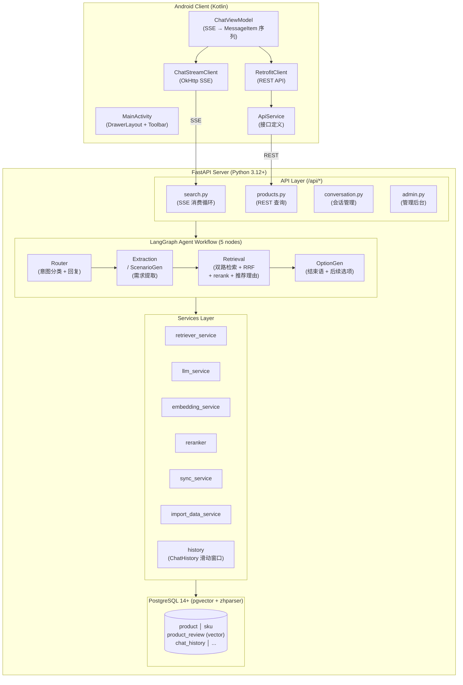
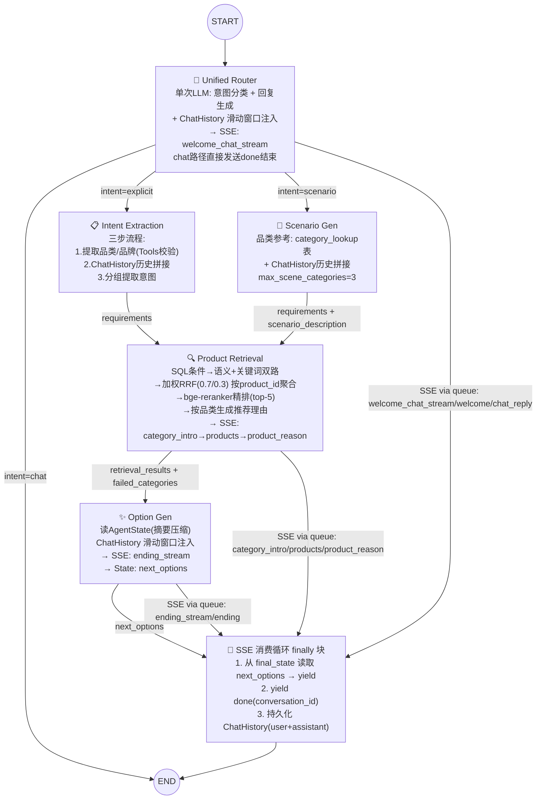

# AuraCart — 系统设计文档

---

## 1. 系统概述

AuraCart 是一个基于 **RAG + LangGraph + SSE** 的电商智能导购系统。用户输入自然语言商品查询（如"推荐一款 200 元以下的防晒霜"或"下周去三亚度假需要准备什么"），系统自动完成意图分类、需求提取、多策略商品检索、LLM 推荐理由生成，并通过 SSE 事件流向客户端实时推送结果。

系统由两个端组成：

- **后端**：FastAPI (Python 3.12+) + LangGraph Agent 工作流 + PostgreSQL (pgvector 向量检索 + zhparser 中文分词)
- **客户端**：Android 原生 App (Kotlin, MVVM)，SSE 流式渲染，RecyclerView 多类型消息列表

---

## 2. 系统架构

### 2.1 架构总览



### 2.2 Agent 工作流 (LangGraph 5 节点管线)

```
START → Router → Extraction / ScenarioGen → Retrieval → OptionGen → END
```

整体采用 LangGraph StateGraph 架构。Router 作为统一入口，单次 LLM 调用完成意图分类 + 回复生成（闲聊或欢迎语），chat 路径直接发送 `done` 结束。节点间共享 `AgentState` 作为状态通道。对话历史通过 `chat_history` 表的滑动窗口查询（`get_chat_history_window`）注入各节点 prompt，实现多轮对话上下文。SSE 事件通过 `asyncio.Queue` 注入 `state["_sse_queue"]`，由 `_agent_event_stream` 消费循环统一转发。

#### 2.2.1 Unified Router（统一意图路由 + 回复生成）

**节点函数**: `intent_route_node(state, llm, _sse_queue=None)` → `app/agent/nodes/intent_route_agent.py`

单次 LLM 调用完成三项任务：
- **意图分类**：判定意图为 `chat`（闲聊）、`explicit`（明确商品查询）、`scenario`（场景化推荐）
- **回复生成**：chat 时生成闲聊回复（引导购物），explicit/scenario 时生成欢迎语
- **SSE 推送**：流式逐 token 推送 `welcome_chat_stream` 事件；非流式发送 `chat_reply`（chat）或 `welcome`（推荐）

使用统一提示词 `INTENT_ROUTER_SYSTEM`（`app/agent/prompts/intent_router_prompt.py`），输出 `{"welcome_chat": "<回复>", "intent": "chat|explicit|scenario"}`。chat 路径由 Router 直接发送 SSE + `done` 结束，不再经过独立闲聊节点。

| 通道 | 内容 | 说明 |
|------|------|------|
| **State** | `intent`: `"chat"` \| `"explicit"` \| `"scenario"` | 驱动条件边路由 |
| **State** | `welcome_text`: `str` | 欢迎语（供日志/调试）；chat 路径为空串 |
| **SSE** | `welcome_chat_stream`（流式） | `start → delta × N → end`，chat 时为闲聊回复，推荐时为欢迎语 |
| **SSE** | `chat_reply` / `welcome`（非流式） | 路径特定事件名，向后兼容 |
| **SSE** | `done` | 仅 chat 路径由 Router 直接发送，结束 SSE 流 |

#### 2.2.2 Intent Extraction（意图提取）

**节点函数**: `intent_extract_node(state, llm, db_session_factory)` → `app/agent/nodes/intent_extract_agent.py`

处理明确商品需求路径（`intent == "explicit"`），三步流程：

1. **提取品类/品牌意图**：从 `user_query` 中提取 `brand`/`category`/`sub_category`，借助 DB Tool（`query_field_values`）校验合法取值
2. **检索历史并拼接**：按 `(category, sub_category)` 从 `chat_history` 表加载滑动窗口历史，与当前 `user_query` 按时间顺序平铺拼接（多品类独立拼接）
3. **分组提取意图**：按 `(category, sub_category)` 分组，从拼接文本中提取结构化查询条件和语义查询条件

输出统一的意图格式 `requirements: list[dict]`：

```json
[{
  "category": "面部护肤",
  "sub_category": "防晒霜",
  "text": "不含酒精、不粘腻、适合敏感肌",
  "min_price": 0,
  "max_price": 200,
  "order_num": 1,
  "brand": ["安热沙", "资生堂"]
}]
```

Extraction 不直接发送 SSE 事件。

#### 2.2.3 Scenario Gen（场景需求生成）

**节点函数**: `scene_generate_node(state, llm, db_session_factory)` → `app/agent/nodes/scene_generate_agent.py`

处理场景化需求路径（`intent == "scenario"`）：

1. 从 `user_query` 出发，从 `category_lookup` 表读取可用品类列表，确定场景所需品类
2. 按品类从 `chat_history` 表加载滑动窗口历史，与当前查询拼接
3. LLM 按品类分组输出意图信息

| 通道 | 内容 |
|------|------|
| **State** | `scenario_description`: `str` — 原始场景描述，供 Option Gen 和结束语使用 |
| **State** | `requirements`: `list[dict]` — 格式与 Extraction 统一 |

Scenario Gen 不直接发送 SSE 事件。失败时视为误判，回退到 Extraction 做 explicit 分解。

#### 2.2.4 Product Retrieval（商品检索）

**节点函数**: `product_retrieve_node(state, llm, emb_service, async_session_factory, reranker)` → `app/agent/nodes/product_retrieve_agent.py`

从 state 读取 `requirements`，按品类分组并行执行检索管线：

1. **SQL 条件转换**：将意图中的 `category`/`sub_category`/`min_price`/`max_price`/`order_num`/`brand` 转换为 SQL WHERE 条件
2. **语义检索**：在 SQL 条件基础上，用 `text` embedding 进行余弦相似度匹配（`<=>` 操作符），返回 top-25
3. **关键词检索**：在 SQL 条件基础上，用 `plainto_tsquery('chinese', ...)` + ts_rank 进行全文检索，返回 top-25
4. **RRF 融合**：加权 RRF 综合语义（权重 0.7）和关键词（权重 0.3）结果，k=60，取 top-25。**按 product_id 聚合去重**（`ROW_NUMBER() OVER (PARTITION BY product_id)`）
5. **bge-reranker 精排**：调用 SiliconFlow API（`BAAI/bge-reranker-v2-m3`）对 RRF top-25 精排，取 top-5。失败时 fallback 到 RRF top-5
6. **推荐理由生成**：按品类 LLM 生成推荐理由（`PRODUCT_RECOMMENDATION_SYSTEM` 提示词），每个商品一条
7. **品类顺序式 SSE 返回**：按品类顺序发送 `category_intro` / `category_intro_stream`（仅多品类）→ `products` + `product_reason`（逐商品）

多品类通过 `asyncio.gather` 并行执行，`Semaphore` 限流（默认 max_category_concurrency=5），每个并行任务独立 `AsyncSession`。Review 截断：单 product 最多 5 条 matched_texts，每条最大 500 字符。

| 通道 | 内容 | 说明 |
|------|------|------|
| **SSE** | `category_intro` / `category_intro_stream` | 品类介绍过渡语（仅多品类） |
| **SSE** | `products` | `{product_id, category, sub_category}` 单商品对象 |
| **SSE** | `product_reason` | 单商品推荐理由 |
| **State** | `retrieval_results`: `list[dict]` | 完整商品详情（含 skus + matched_texts） |
| **State** | `failed_categories`: `list[str]` | 检索失败的 sub_category 列表 |

#### 2.2.5 Option Gen（推荐选项 + 结束语生成）

**节点函数**: `option_generate_node(state, llm)` → `app/agent/nodes/option_generate_agent.py`

所有品类检索完成后执行一次。从 `AgentState.retrieval_results` 读取全部商品，压缩为摘要（最多 5 个商品，每条 ≤300 字符），使用合并提示词 `OPTION_GENERATE_SYSTEM` 单次 LLM 调用同时生成结束语和 2-3 条下一步推荐选项。**零 DB 访问**。

| 通道 | 内容 | 说明 |
|------|------|------|
| **SSE** | `ending` / `ending_stream` | 结束语（流式时逐 token 推送） |
| **State** | `next_options`: `list[str]` | 最多 3 条后续推荐选项 |
| **State** | `ending`: `str` | 结束语文本（供日志记录） |

`next_options` 的 SSE 发送由消费循环 finally 块从 `final_state` 读取后统一发送（在 `done` 之前），避免重复发送。

#### 2.2.6 SSE 消费循环（事件流总控）

**函数**: `_agent_event_stream(user_query, graph, queue, total_timeout, conversation_id)` → `app/api/search.py`

1. 后台启动 `graph.ainvoke(initial_state)`
2. 循环从 queue 消费事件并 yield（`welcome_chat_stream` / `welcome` / `chat_reply` / `category_intro_stream` / `category_intro` / `products` / `product_reason` / `ending_stream` / `ending`），直到 graph 完成
3. graph 完成后排空 queue 中残留事件
4. Chat 路径检测到 queue 中的 `done` 后立即返回
5. **finally 块**：从 `final_state` 读取 `next_options` 并 yield（如有）；yield `done`（含 `conversation_id`）作为最后事件
6. 持久化聊天记录到 `chat_history` 表（user + assistant 各一条，仅当 `user_query` 和 `chat_reply` 均非空时写入）

**完整 SSE 事件流顺序**：

流式推荐路径：
```
welcome_chat_stream (start → delta → end) → [category_intro_stream (start → delta → end)]
  → products → product_reason → ... (逐品类重复)
  → ending_stream (start → delta → end) → next_options → done
```

非流式推荐路径：
```
welcome → [category_intro] → products → product_reason → ... → ending → next_options → done
```

Chat 路径（流式）：
```
welcome_chat_stream (start → delta → end) → done
```

Chat 路径（非流式）：
```
chat_reply → done
```

#### 2.2.7 ChatHistory（对话历史机制）

通过 `chat_history` 表 + 滑动窗口查询实现多轮对话上下文。

**数据模型**：

- **ChatHistory 表**：`(id, conversation_id, role, content, created_at)` —— 按时间顺序存储每轮对话的 user/assistant 消息
- **Conversation 表**：精简为 3 字段 `(conversation_id PK, created_at, updated_at)` —— 仅用于会话存在性校验，不含 `memory` JSONB

**滑动窗口查询**（`get_chat_history_window` → `app/agent/history.py`）：查询最近 `max_rounds` × 2 条记录，翻转为时间正序，格式化为 `用户: {content}\n助手: {content}\n...`。

**注入点**：各 Agent 节点独立调用 `get_chat_history_window()` 加载对话历史注入 prompt：

| 节点 | 用途 | 查询方式 |
|------|------|---------|
| **Router** | 对话上下文感知 | 跨品类，取最近 N 轮 |
| **Extraction Step1/Step2** | 历史拼接提取意图 | 按 `(category, sub_category)` 品类过滤 |
| **Scenario Gen** | 历史拼接 | 按品类过滤 |
| **Retrieval** | 推荐理由参考 | 按品类过滤 |
| **Option Gen** | 结束语/选项参考 | 跨品类，取最近 N 轮 |

**持久化时机**：每轮搜索完成后，在消费循环 finally 块中插入 2 条 `chat_history`（user + assistant），仅当 `user_query` 和 `chat_reply` 均非空。`chat_reply` 来源：chat 路径由 Router 写入，推荐路径由 Option Gen 写入。

#### 2.2.8 DB 查询 Tool & Reranker

**3 个内部 DB Tool**（Agent 节点直接调用，不走 LLM function calling）：

| Tool | 功能 |
|------|------|
| `list_tables(db)` | 查询数据库所有表及描述 |
| `list_fields(db, table)` | 查询表的字段名、类型、含义 |
| `query_field_values(db, table, field, filters?)` | SELECT DISTINCT 查询字段取值，支持多字段联合过滤 |

表/字段的中文描述硬编码为映射字典，`table`/`field`/`filter_key` 做白名单校验防注入。

**Reranker 精排服务**：`RerankerService` 封装 bge-reranker-v2-m3 的 SiliconFlow API 调用（`POST https://api.siliconflow.cn/v1/rerank`），超时 5s 可配置，失败返回空列表由调用方 fallback 到 RRF top-5。

#### 2.2.9 Agent 协作关系



**Agent 转移关系**：

| # | 源 Agent | 条件 / 触发 | 目标 Agent |
|---|---------|------------|-----------|
| 1 | START | —— | Unified Router |
| 2 | Unified Router | `intent == "chat"` | END |
| 3 | Unified Router | `intent == "explicit"` | Intent Extraction |
| 4 | Unified Router | `intent == "scenario"` | Scenario Gen |
| 5 | Memory | Router / Extraction / Scenario Gen 读取 | —— |
| 6 | Intent Extraction | 需求提取完成 | Product Retrieval |
| 7 | Scenario Gen | 场景分析完成 | Product Retrieval |
| 8 | Product Retrieval | 检索完成后 | Memory（写入） |
| 9 | Product Retrieval | 检索完成 | Option Gen |
| 10 | Option Gen | 始终 | END (via consumer) |
| 11 | 消费循环 | graph 完成后 (finally) | END (SSE 流) |

#### 2.2.10 Agent I/O 规约总览

| Agent | 输入（从 State 读取） | 输出（写入 State） | SSE 事件（通过 queue） |
|-------|---------------------|-------------------|---------------------|
| **Unified Router** | `user_query` + ChatHistory 滑动窗口 | `intent`, `welcome_text` | `welcome_chat_stream` / `chat_reply` / `welcome`；chat 路径额外 `done` |
| **Intent Extraction** | `user_query` + ChatHistory 滑动窗口（按品类过滤），DB Tools | `requirements` | — |
| **Scenario Gen** | `user_query` + ChatHistory 滑动窗口（按品类过滤），`category_list` | `scenario_description`, `requirements` | — |
| **Product Retrieval** | `requirements`, `user_query` + ChatHistory 滑动窗口（按品类过滤） | `retrieval_results`, `failed_categories` | `category_intro` / `category_intro_stream`, `products`, `product_reason` |
| **Option Gen** | `user_query`, `requirements`, `retrieval_results`, `scenario_description`, `failed_categories` + ChatHistory 滑动窗口 | `next_options`, `ending` | `ending` / `ending_stream` |

#### 2.2.11 Fallback 策略

| Agent | 失败/超时行为 |
|-------|--------------|
| Unified Router | 默认 `intent="explicit"`，`welcome_text=""`；非流式 chat 使用硬编码兜底回复 |
| Intent Extraction | Step 1 LLM 失败 → 品类/品牌为 null；Step 3 LLM 失败 → 回退为 `[{text: user_query, category: null, ...}]` |
| Scenario Gen | 视为误判，回退到 Intent Extraction 做 explicit 分解 |
| Product Retrieval | 单品类检索失败 → 品类内 try/except，`failed_categories` 汇总，其他品类继续；Reranker API 失败 → fallback 到 RRF top-5；全部失败 → 用原始 `user_query` 做语义检索兜底 |
| Option Gen | 跳过，回复末尾不追加选项 |
| Reranker | API 失败/超时 → 跳过精排，直接用 RRF top-5 |

---

## 3. 技术栈

### 3.1 后端

| 层面 | 技术 | 版本 | 说明 |
|------|------|------|------|
| 语言 | Python | 3.12+ | conda 环境推荐 |
| Web 框架 | FastAPI | ≥0.110.0 | 异步 REST + SSE |
| ASGI 服务器 | uvicorn | ≥0.29.0 | 支持 hot reload |
| ORM | SQLAlchemy 2.0 | ≥2.0.30 | async 模式，asyncpg 驱动 |
| 数据库 | PostgreSQL | 14+ | pgvector 扩展 + zhparser 扩展 |
| 向量扩展 | pgvector | ≥0.3.0 | 余弦相似度语义检索 |
| 中文分词 | zhparser | — | PostgreSQL 全文检索解析器 |
| 迁移工具 | Alembic | ≥1.13.1 | 数据库版本迁移 |
| Graph 工作流 | LangGraph | ≥0.2.0 | StateGraph 5 节点 Agent 管线 |
| LLM 客户端 | openai | ≥1.30.0 | OpenAI 兼容接口 |
| HTTP 客户端 | httpx | ≥0.27.0 | 异步 HTTP（LLM/Embedding API） |
| 配置 | PyYAML + Pydantic | ≥6.0.1 / ≥2.7.0 | config.yaml + .secrets.yaml |
| 日志 | structlog | ≥24.0.0 | 双通道（console 彩色 + file 纯文本） |
| 测试 | pytest + pytest-asyncio | ≥8.2.0 / ≥0.23.7 | asyncio_mode = auto |

### 3.2 Android 客户端

| 层面 | 技术 | 版本 |
|------|------|------|
| 语言 | Kotlin | 1.9.23 |
| 构建 | Gradle (Groovy DSL) | Gradle 8.5, AGP 8.3.2 |
| 最低 SDK | Android 8.0 | API 26 |
| 目标 SDK | Android 14 | API 34 |
| 架构 | MVVM | ViewModel + LiveData |
| 网络 SSE | OkHttp | 4.12.0 |
| 网络 REST | Retrofit + Gson | 2.9.0 |
| 图片加载 | Glide | 4.16.0 |
| UI | Material Design 3 | 1.11.0 |

### 3.3 外部服务

| 服务 | 用途 | 说明 |
|------|------|------|
| Embedding API | 文本向量化 | OpenAI 兼容接口（豆包、阿里云等） |
| LLM API | 意图分类/回复生成/推荐理由 | OpenAI 兼容接口 |
| Reranker API | 检索结果精排 | SiliconFlow `BAAI/bge-reranker-v2-m3`，可选 |

---

## 4. 环境依赖

### 4.1 运行时依赖

| 依赖 | 版本要求 | 必要性 |
|------|----------|--------|
| Python | 3.12+ | 必需 |
| PostgreSQL | 14+ | 必需 |
| pgvector 扩展 | — | 必需（语义检索） |
| zhparser 扩展 | — | 必需（中文关键词检索） |
| Docker | 24+ | 推荐（数据库容器化） |
| Embedding API Key | — | 必需 |
| LLM API Key | — | 必需 |
| Android Studio | Hedgehog 2023.1.1+ | 客户端开发/构建 |

### 4.2 数据库扩展安装

```sql
CREATE EXTENSION pgvector;
CREATE EXTENSION zhparser;
CREATE TEXT SEARCH CONFIGURATION chinese (PARSER = zhparser);
ALTER TEXT SEARCH CONFIGURATION chinese ADD MAPPING FOR n,v,a,i,e,l,j WITH simple;
```

---

## 5. 目录结构

```
AI-Agent-Ecom-Guide/
├── client/                              # Android 客户端 (Kotlin, MVVM)
│   └── app/src/main/java/com/ecomguide/
│       ├── model/Models.kt              # ApiProduct, MessageItem, SSE 事件
│       ├── network/
│       │   ├── ChatStreamClient.kt      # OkHttp SSE 长连接客户端
│       │   ├── RetrofitClient.kt        # REST API + 图片路径解析
│       │   └── ApiService.kt            # Retrofit 接口定义
│       ├── repository/
│       │   ├── CartRepository.kt        # 购物车状态 (LiveData)
│       │   └── DemoProducts.kt          # Demo 商品数据
│       └── ui/
│           ├── MainActivity.kt          # 主容器 (DrawerLayout + Toolbar)
│           ├── chat/
│           │   ├── ChatFragment.kt      # 聊天页 (RecyclerView + 输入框)
│           │   ├── ChatViewModel.kt     # 核心状态容器 (SSE → MessageItem)
│           │   ├── MessageAdapter.kt    # 多类型消息 Adapter
│           │   └── ProductCardAdapter.kt
│           ├── detail/                  # 商品详情 (全屏/半屏/品类落地页)
│           ├── cart/CartActivity.kt     # 购物车
│           └── sidebar/                 # 侧边栏 (历史对话/消息/订单)
│
├── server/                              # FastAPI 后端
│   ├── run.py                           # 启动入口 (支持 --log/--port/--reload)
│   ├── config.yaml                      # 运行时配置 (DB/LLM/Embedding/检索参数)
│   ├── requirements.txt                 # Python 依赖
│   ├── app/
│   │   ├── main.py                      # FastAPI 入口 + lifespan
│   │   ├── config.py                    # YAML + Pydantic Settings 加载
│   │   ├── database.py                  # SQLAlchemy 异步引擎
│   │   ├── api/
│   │   │   ├── search.py                # /api/search SSE 搜索 + _agent_event_stream
│   │   │   ├── get_product_info.py      # 商品/图片/SKU/历史/评价查询
│   │   │   ├── get_conversation.py      # /api/conversation 会话管理
│   │   │   └── admin.py                 # /api/admin 后台管理
│   │   ├── agent/
│   │   │   ├── state.py                 # AgentState TypedDict
│   │   │   ├── graph.py                 # StateGraph 构建 + 条件边
│   │   │   ├── history.py               # 对话历史滑动窗口查询
│   │   │   ├── tools.py                 # DB 查询 Tool (3 个)
│   │   │   ├── nodes/
│   │   │   │   ├── intent_route_agent.py        # Router: 统一意图分类+回复
│   │   │   │   ├── intent_extract_agent.py      # Extraction: 三步意图提取
│   │   │   │   ├── scene_generate_agent.py      # ScenarioGen: 场景→品类
│   │   │   │   ├── product_retrieve_agent.py    # Retrieval: 双路检索+推荐理由
│   │   │   │   └── option_generate_agent.py     # OptionGen: 结束语+选项
│   │   │   ├── prompts/                 # LLM 系统提示词 (6 个)
│   │   │   └── utils/stream_json.py     # 流式 JSON 字段提取器
│   │   ├── models/                      # SQLAlchemy ORM 模型 (8 个)
│   │   │   ├── product.py               # Product
│   │   │   ├── sku.py                   # Sku
│   │   │   ├── conversation.py          # Conversation（3 字段，仅会话存在性校验）
│   │   │   ├── chat_history.py          # ChatHistory（对话历史持久化）
│   │   │   ├── product_review.py        # ProductReview (pgvector)
│   │   │   ├── product_marketing.py     # ProductMarketing
│   │   │   ├── product_faq.py           # ProductFaq
│   │   │   └── user_review.py           # UserReview
│   │   ├── services/
│   │   │   ├── llm_service.py           # LLM 调用封装
│   │   │   ├── embedding_service.py     # Embedding 调用封装
│   │   │   ├── retriever_service.py     # 多路检索 + RRF 融合
│   │   │   ├── reranker.py              # bge-reranker-v2-m3 API
│   │   │   ├── sync_service.py          # 增量数据同步
│   │   │   └── import_data_service.py   # 初始数据导入
│   │   ├── schemas/                     # Pydantic 响应模型
│   │   └── core/logging.py             # structlog 配置
│   ├── scripts/
│   │   ├── import_data.py               # 数据导入脚本
│   │   ├── setup_category_lookup.py     # 品类查找表初始化
│   │   └── docker-compose.yml           # PostgreSQL 容器 (pgvector+zhparser)
│   ├── tests/                           # pytest (130+ 用例)
│   ├── alembic/                         # 数据库迁移
│   │   └── versions/
│   ├── docs/                            # 设计文档 (AGENT_OPT/*)
│   └── log/                             # 应用日志输出目录
│
├── data/
│   └── ecommerce_agent_dataset_/data/   # 原始商品 JSON + 实拍图片 (100 条)
│
├── docs/                                # 项目文档
│   ├── DESIGN.md                        # 本文档
│   ├── DEPLOYMENT.md                    # 部署与快速体验指南
│   ├── SETUP.md                         # 安装与启动指南
│   ├── backend/
│   │   ├── SPEC.md                      # 后端技术规格 (Agent 设计、数据流、I/O 规约)
│   │   └── API.md                       # 后端接口文档 (13 个端点)
│   └── frontend/
│       ├── architecture.md              # Android 客户端整体架构
│       └── client-design.md             # Android 客户端设计方案
│
├── delivery/                            # 交付文档
├── DEPENDENCIES.md                      # 全量依赖清单
└── README.md                            # 项目入口说明
```

---

## 6. 配置说明

### 6.1 配置体系

项目采用 **双层 YAML** 配置，通过 Pydantic Settings 加载：

| 文件 | 说明 | 纳入版本控制 |
|------|------|-------------|
| `server/config.yaml` | 运行时配置（DB 连接、模型端点、检索参数） | 是 |
| `server/.secrets.yaml` | 敏感信息（API Key） | 否（.gitignore） |

### 6.2 核心配置参数

**数据库连接：**

```yaml
# server/config.yaml
database:
  host: "localhost"
  port: 5432
  user: "postgres"
  password: "123456"
  dbname: "ecommerce"
  vector_dim: 1024              # embedding 向量维度
  db_schema: "public"
```

**模型端点：**

```yaml
embedding:
  base_url: "https://api.example.com/v1"
  model: "text-embedding-v4"
  # api_key 写入 .secrets.yaml

llm:
  base_url: "https://api.example.com/v1"
  model: "your-model-id"
  temperature: 0.3
  # api_key 写入 .secrets.yaml
```

**检索参数：**

```yaml
search:
  semantic_top_k: 25              # 语义检索返回数
  keyword_top_k: 25               # 关键词检索返回数
  rrf_semantic_weight: 0.7        # RRF 语义权重
  rrf_keyword_weight: 0.3         # RRF 关键词权重
  rrf_k: 60                       # RRF 平滑因子
  rrf_top_k: 25                   # RRF 融合后取 top-k
  rerank_top_k: 5                 # bge-reranker 最终返回数
  max_match_texts_per_product: 5  # 单产品最多 review 条数
  max_match_chars_per_product: 500  # 单 review 最大字符数
  max_category_concurrency: 5     # 品类并行检索上限
  memory_recent_rounds: 10        # Router 检索历史轮数
  reasoning_max_chars: 500        # 推荐理由最大字符数
  max_batch_ids: 20               # Batch API 单次上限
```

**超时控制：**

```yaml
timeout:
  total_request: 300              # SSE 总超时 (秒)

reranker:
  model: "BAAI/bge-reranker-v2-m3"
  timeout: 5.0                    # Reranker API 超时 (秒)
```

### 6.3 secrets 管理

```yaml
# server/.secrets.yaml (不纳入版本控制)
embedding:
  api_key: "your-embedding-api-key"

llm:
  api_key: "your-llm-api-key"
```

---

## 7. 关键设计问题与解决方案

### 7.1 统一意图路由 — 单次 LLM 调用完成分类+回复

**问题**：原设计分两次 LLM 调用（先分类 → 再生成欢迎语），增加了延迟和 token 消耗。

**方案**：Unified Router 节点单次 LLM 调用同时完成意图分类（chat/explicit/scenario）和回复生成。使用统一提示词 `INTENT_ROUTER_SYSTEM`，输出 `{"welcome_chat": "...", "intent": "chat|explicit|scenario"}`。chat 路径由 Router 直接发送 `done` 结束，不再经过独立闲聊节点。

### 7.2 双路检索 + 加权 RRF 融合

**问题**：单一语义检索对品类名、品牌名等精确匹配效果差；单一关键词检索无法理解模糊评价意图。

**方案**：
- **语义检索**：pgvector 余弦相似度（`<=>` 操作符），理解"不粘腻""轻量"等模糊描述
- **关键词检索**：zhparser 分词 + `plainto_tsquery('chinese', ...)` + ts_rank，精确匹配品类/品牌
- **RRF 融合**：加权 RRF（语义 0.7 / 关键词 0.3），k=60，取 top-25，按 `product_id` 聚合去重

### 7.3 bge-reranker 精排

**问题**：RRF 融合排名不够精准，用户评价内容的相关性无法被向量检索充分捕捉。

**方案**：RRF top-25 送入 `BAAI/bge-reranker-v2-m3`（SiliconFlow API）精排，取 top-5。API 失败/超时时 fallback 到 RRF top-5，保证服务可用性。

### 7.4 会话记忆隔离与持久化

**问题**：多轮对话需要上下文记忆，多会话需要隔离，且需要在服务重启后保持。

**方案**：
- `conversation` 表精简为 3 字段（仅存证），`chat_history` 表作为唯一对话记录
- 各节点通过 `get_chat_history_window()` 独立查询滑动窗口历史，按品类过滤
- 消费循环 finally 块统一持久化 2 条 `chat_history`（user + assistant）

### 7.5 商品级检索

**问题**：原设计按 SKU 返回结果，同一商品的不同规格（如 30ml/60ml）分散在结果中，推荐理由重复。

**方案**：RRF 融合时按 `product_id` 聚合去重（`ROW_NUMBER() OVER (PARTITION BY product_id)`），`products` SSE 事件仅含 `{product_id, category, sub_category}`。前端通过 `/api/all_skus/{product_id}` 按需获取 SKU 变体。

### 7.6 SSE 流式事件协议

**问题**：需要实时向客户端推送检索进度、商品信息和推荐理由，同时保证事件顺序和最终一致性。

**方案**：
- `asyncio.Queue` 注入 `state["_sse_queue"]`，各 Agent 节点通过 queue 推送 SSE 事件
- 消费循环 `_agent_event_stream` 统一转发，确保事件顺序
- finally 块保证 `next_options` 和 `done` 在最后发送
- 流式路径使用 `start → delta × N → end` 模式推送文本内容

### 7.7 多品类并行检索

**问题**：场景化查询（如"去三亚度假"）涉及 5-6 个品类，串行检索延迟累加不可接受。

**方案**：`asyncio.gather` 并行执行各品类检索，`asyncio.Semaphore` 限流（默认 max_category_concurrency=5），每个并行任务使用独立 `AsyncSession`。失败品类记录到 `failed_categories`，不阻塞其他品类。

### 7.8 Fallback 容错体系

| 场景 | Fallback 策略 |
|------|--------------|
| Router LLM 失败 | 默认 `intent="explicit"`，`welcome_text=""`；非流式 chat 用硬编码兜底回复 |
| Extraction Step 1 失败 | 品类/品牌为 null，继续后续步骤 |
| Extraction Step 3 失败 | 回退为 `[{text: user_query, category: null, ...}]` |
| ScenarioGen 失败 | 视为误判，回退到 Extraction 做 explicit 分解 |
| 单品类检索失败 | 品类内 try/except，`failed_categories` 记录，其他品类继续 |
| Reranker API 失败 | 跳过精排，直接用 RRF top-5 |
| 全部品类检索失败 | 用原始 `user_query` 做最简语义检索兜底 |
| Option Gen 失败 | 跳过，回复末尾不追加选项 |
| DB Session 异常 | 失败品类记录到 `failed_categories`，不中止整个搜索 |

### 7.9 ChatHistory 持久化修复

原 `chat_message` 表始终为空，原因在于 `chat_reply` 字段未被任何 Agent 节点设置。解决方案：Router 节点在返回时写入 `chat_reply`（welcome_chat 内容）；OptionGen 节点写入 `chat_reply`（ending 内容）。消费循环 finally 块从 `final_state` 读取并持久化到 `chat_history` 表（user + assistant 各一条，仅当两者均非空）。

随后将 `chat_message` 表重命名为 `chat_history`，`conversation` 表移除 `memory` JSONB 列，以 ChatHistory 滑动窗口替代 session_memory 机制。

### 7.10 pgvector 写入方式

**问题**：通过 SQLAlchemy raw `text()` 插入 pgvector 列时，Python list 无法被 asyncpg 自动转换，且 `::jsonb` 等 PostgreSQL cast 语法与 `:param` 参数绑定冲突。

**方案**：对含 embedding 列的写入统一使用 ORM 方式（`session.add(ProductReview(...))`），利用 pgvector SQLAlchemy 集成自动将 `list[float]` 转换为 vector 类型。

---

## 8. 数据覆盖

| 品类 | 商品 ID 范围 | 数量 |
|------|-------------|------|
| 美妆护肤 | p_beauty_001 ~ 025 | 25 |
| 服装 | p_clothes_001 ~ 025 | 25 |
| 数码电子 | p_digital_001 ~ 025 | 25 |
| 食品 | p_food_001 ~ 025 | 25 |

每个产品包含：SKU 变体（多规格）、营销描述、官方 FAQ、用户评价、商品实拍图片。
