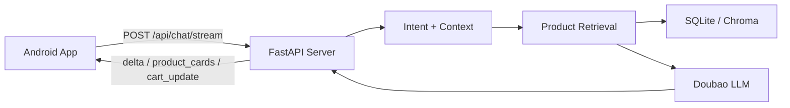

# Architecture

## 目标

先完成端到端最小闭环：Android 对话页发送文本，后端完成商品检索和导购回复，通过 SSE 返回流式文本和商品卡片，客户端渲染对话与商品卡片。

## 模块

## 优先级

1. 最小闭环：文字输入、RAG 检索、流式回复、商品卡片。
2. RAG 可靠性：只推荐库内商品，价格/库存/优惠不由模型编造。
3. 一个加分项做深：多轮上下文 + 反选/排除。
4. 购物车闭环：加购、删除、改数量，体现 Agent 操作结构化数据。

`admin/` 暂不启动，避免分散客户端原生体验和后端 RAG 的主线。
