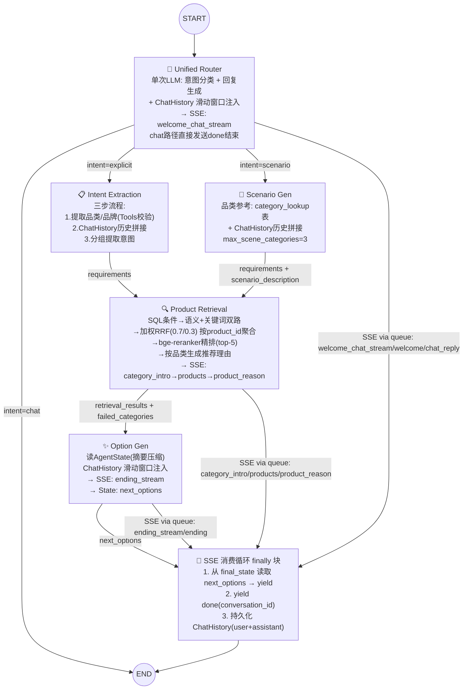
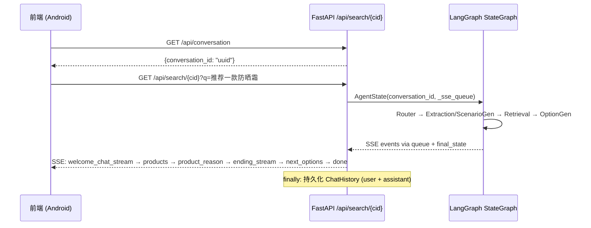

# 1 核心Agent组件

> 更新日期：2026-06-10 | 变更：REFACT_OPT（13 文件重命名标准化）+ HISTORY_OPT（对话历史时间提示）+ DATABASE_OPT（ChatMessage 持久化修复）

整体采用 **LangGraph 工作流架构**，5 节点管线：

```
START → Router → Extraction / ScenarioGen → Retrieval → OptionGen → END
```

Router 作为统一入口，单次 LLM 调用完成意图分类 + 回复生成（闲聊或欢迎语），chat 路径直接发送 `done` 结束。节点间共享 `AgentState` 作为状态通道。对话历史通过 `chat_history` 表的滑动窗口查询（`get_chat_history_window`）注入各节点 prompt，实现多轮对话上下文。SSE 事件通过 `asyncio.Queue` 注入 `state["_sse_queue"]`，由 `_agent_event_stream` 消费循环统一转发；`next_options` 和 `done` 由消费循环的 finally 块从 `final_state` 读取后发送。

---

## (1) 统一意图路由 (Unified Router)

**节点函数**: `intent_route_node(state, llm, _sse_queue=None)` → `app/agent/nodes/intent_route_agent.py`

作为工作流的第一个节点，单次 LLM 调用完成三项任务（原 Router + ChitChat + Welcome 合并）：

- **意图分类**：判定意图为三类之一：`chat`（闲聊）、`explicit`（明确商品查询）、`scenario`（场景化推荐）。分类前从 `chat_history` 表加载最近 N 轮对话历史（`memory_recent_rounds`，默认 10），注入 prompt 提供对话上下文。
- **回复生成**：根据意图生成对应内容 —— chat 时生成闲聊回复（引导购物），explicit/scenario 时生成欢迎语（单品类突出特点、多品类突出场景感）
- **SSE 推送**：流式逐 token 推送 `welcome_chat_stream` 事件；非流式发送 `chat_reply`（chat）或 `welcome`（推荐）

使用统一提示词 `INTENT_ROUTER_SYSTEM`（`app/agent/prompts/intent_router_prompt.py`），合并原 ROUTER_SYSTEM + CHITCHAT_SYSTEM + WELCOME_SYSTEM。输出格式：
```json
{"welcome_chat": "<回复内容>", "intent": "chat|explicit|scenario"}
```

> **MERGE_OPT2 变更**：Router 不再单独调用分类 + 欢迎语两次 LLM，改为单次统一调用。ChitChat 节点已删除（功能合并到 Router）。chat 路径由 Router 直接发送 SSE + `done` 结束，不再经过独立闲聊节点。

### 输出内容

| 通道 | 内容 | 说明 |
|------|------|------|
| **State** | `intent`: `"chat"` \| `"explicit"` \| `"scenario"` | 驱动条件边路由 |
| **State** | `welcome_text`: `str` | 推荐路径时写入欢迎语（供日志/调试）；chat 路径为空串 |
| **SSE** | `welcome_chat_stream`（流式） | start → delta × N → end，chat 时为闲聊回复，推荐时为欢迎语 |
| **SSE** | `chat_reply` / `welcome`（非流式） | 路径特定事件名，向后兼容 |
| **SSE** | `done` | 仅 chat 路径由 Router 直接发送，结束 SSE 流 |

> Router 推荐路径不再将 welcome 延迟到 Retrieval 发送。所有 welcome/chat_reply SSE 事件均由 Router 统一负责。

---

## (2) 意图提取 (Intent Extraction)

**节点函数**: `intent_extract_node(state, llm, db_session_factory)` → `app/agent/nodes/intent_extract_agent.py`

处理明确商品需求路径（`intent == "explicit"`）。三步流程：

**Step 1 — 提取品类/品牌意图**：从 `user_query` 中提取 `brand`/`category`/`sub_category`，借助 DB Tool（`query_field_values`）校验合法取值。

**Step 2 — 检索历史并拼接**：按 `(category, sub_category)` 从 `chat_history` 表加载滑动窗口历史，与当前 `user_query` 按时间顺序平铺拼接（多品类独立拼接，分段展示）。

**Step 3 — 分组提取意图**：按 `(category, sub_category)` 分组，从拼接文本中提取结构化查询条件和语义查询条件。

**不再生成 keyword 策略的查询分支**。

### 输出内容

| 通道 | 内容 | 说明 |
|------|------|------|
| **State** | `requirements`: `list[dict]` | 按品类分组的意图列表，格式见下方 |

```json
[
  {
    "category": "面部护肤",
    "sub_category": "防晒霜",
    "text": "不含酒精、不粘腻、适合敏感肌",
    "min_price": 0,
    "max_price": 200,
    "order_num": 1,
    "brand": ["安热沙", "资生堂"]
  }
]
```

字段说明：
- `category`: 品类大类（可为 null）
- `sub_category`: 品类细类（可为 null）
- `text`: 语义查询条件文本
- `min_price`: 最低价格，无约束为 0
- `max_price`: 最高价格，无约束为 4294967295
- `order_num`: 下单数量，默认 1
- `brand`: 品牌列表，无偏好为 null

> Extraction 不直接发送 SSE 事件。

---

## (3) 场景需求生成 (Scenario Gen)

**节点函数**: `scene_generate_node(state, llm, db_session_factory)` → `app/agent/nodes/scene_generate_agent.py`

处理场景化需求路径（`intent == "scenario"`）。

1. 从 `user_query` 出发，从 **category_lookup 表**读取可用品类列表，提取前 `max_scene_categories` 个（默认 3）确定场景所需品类
2. 按品类从 `chat_history` 表加载滑动窗口历史，与当前查询拼接
3. LLM 按品类分组输出意图信息

### 输出内容

| 通道 | 内容 | 说明 |
|------|------|------|
| **State** | `scenario_description`: `str` | 原始场景描述，供 Option Gen 和结束语使用 |
| **State** | `requirements`: `list[dict]` | 格式与 Extraction 统一（见 §2） |

> Scenario Gen 不直接发送 SSE 事件。

---

## (4) 商品检索 (Product Retrieval)

**节点函数**: `product_retrieve_node(state, llm, emb_service, async_session_factory, reranker)` → `app/agent/nodes/product_retrieve_agent.py`

从 state 读取 `requirements`（按品类分组的意图列表），按品类分组并行执行检索管线：

**检索管线（每个品类独立执行）**：

1. **SQL 条件转换**：将意图中的 `category`/`sub_category`/`min_price`/`max_price`/`order_num`/`brand` 转换为 SQL WHERE 条件
2. **语义检索**：在 SQL 条件基础上，用 `text` embedding 进行余弦相似度匹配，返回 top-25
3. **关键词检索**：在 SQL 条件基础上，用 `plainto_tsquery('chinese', ...)` + tsvector 进行全文检索，返回 top-25
4. **RRF 融合**：加权 RRF 综合语义（权重 0.7）和关键词（权重 0.3）结果，取 top-25。**按 product_id 聚合**
5. **bge-reranker 精排**：调用 SiliconFlow API（`BAAI/bge-reranker-v2-m3`）对 RRF top-25 精排，取 top-5。API 失败时 fallback 到 RRF top-5
6. **推荐理由生成**：按品类 LLM 生成推荐理由（`PRODUCT_RECOMMENDATION_SYSTEM` 提示词），每个商品一条
7. **品类顺序式 SSE 返回**：按品类顺序发送 `category_intro`（品类介绍，仅多品类）→ `products` + `product_reason`（逐商品）

> **MERGE_OPT2 变更**：`welcome` 事件改由 Router 发送，Retrieval 不再发送 welcome。**MERGE_OPT 变更**：`ending` 事件改由 Option Gen 发送，Retrieval 不再生成结束语。

**并行检索**：各品类并行执行，通过 `asyncio.Semaphore` 限流（`max_category_concurrency`，默认 5）。每个并行任务独立 `AsyncSession`。

**Review 截断**：单 product 最多保留 N 条 `matched_texts`（N 可配置，默认 5），每条最大字符数可配（默认 500）。

### 输出内容

| 通道 | 内容 | 说明 |
|------|------|------|
| **SSE** `category_intro` / `category_intro_stream` | `string` | 品类介绍过渡语（仅多品类，流式时逐 token 推送） |
| **SSE** `product_reason` | `string` | 单商品推荐理由（每个 `products` 事件后） |
| **SSE** `products` | `{product_id, category, sub_category}` | 单商品对象（非数组），**商品级（不含 sku_id）** |
| **State** | `retrieval_results`: `list[dict]` | 全部商品详情，供 Option Gen 使用 |
| **State** | `failed_categories`: `list[str]` | 检索失败的 sub_category 列表 |

> `welcome` / `welcome_chat_stream` 由 Router 发送（§1）；`ending` / `ending_stream` 由 Option Gen 发送（§5）。Retrieval 不再发送 welcome 和 ending。`done` 由消费循环 finally 块统一发送。

每个 `retrieval_results` 元素（商品级）：
```json
{
  "product_id": "p_beauty_001",
  "title": "安热沙小金瓶防晒霜",
  "brand": "安热沙",
  "category": "面部护肤",
  "sub_category": "防晒霜",
  "base_price": 198.0,
  "skus": [
    {"sku_id": "s_p_beauty_001_1", "properties": {"容量": "60ml"}, "price": 198.0, "stock": 50}
  ],
  "matched_texts": [
    {"source": "marketing", "content": "安热沙小金瓶..."},
    {"source": "user_review", "content": "海边用完全没晒黑..."}
  ]
}
```

> Retrieval **不再发送 `done` 事件**。`done` 由消费循环 finally 块在所有节点完成后统一发送。结束语为独立的 `ending` 事件。

---

## (5) 推荐选项 + 结束语生成 (Option Gen)

**节点函数**: `option_generate_node(state, llm)` → `app/agent/nodes/option_generate_agent.py`

在 Product Retrieval **所有品类返回后执行一次**。从 `AgentState.retrieval_results` 读取全部商品，压缩为摘要（最多 5 个商品，每条 ≤300 字符），使用合并提示词 `OPTION_GENERATE_SYSTEM` 单次 LLM 调用同时生成结束语和 2-3 条下一步推荐选项。**无需访问数据库**。

> **MERGE_OPT 变更**：结束语生成和选项生成合并为单次 LLM 调用，输出格式 `{"ending": "...", "next_options": [...]}`。流式路径使用 `stream_json_field` 提取 ending 逐 token 推送 `ending_stream` 事件。

### 输出内容

| 通道 | 内容 | 说明 |
|------|------|------|
| **SSE** `ending` / `ending_stream` | `string` | 结束语（流式时逐 token 推送） |
| **State** | `next_options`: `list[str]` | 最多 3 条下一步推荐选项 |
| **State** | `ending`: `str` | 结束语文本（供日志记录） |

> `next_options` 的 SSE 发送由消费循环 finally 块从 `final_state` 读取后统一发送（在 `done` 之前），避免重复发送。

---

## (6) 闲聊 (Chit-Chat) — 已删除

**MERGE_OPT2 变更**：Chit-Chat 独立节点已删除。闲聊功能合并到 Unified Router（§1），chat 路径由 Router 直接生成回复 + SSE 推送 + `done` 结束。`chitchat.py` 和 `chitchat_prompt.py` 已移除。

---

## (7) SSE 消费循环（事件流总控）

**函数**: `_agent_event_stream(user_query, graph, queue, total_timeout, conversation_id)` → `app/api/search.py`

所有节点 SSE 事件的统一消费和收尾逻辑：

1. 后台启动 `graph.ainvoke(initial_state)`
2. 循环从 queue 消费事件并 yield（`welcome_chat_stream`/`welcome`/`chat_reply`/`category_intro_stream`/`category_intro`/`products`/`product_reason`/`ending_stream`/`ending`），直到 graph 完成
3. graph 完成后排空 queue 中残留事件
4. Chat 路径检测到 queue 中的 `done` 后立即返回（不进入 finally 块的 `next_options` 逻辑）
5. **finally 块**：从 `final_state` 读取 `next_options` 并 yield（如有）；yield `done`（含 `conversation_id`）作为最后事件
6. 持久化聊天记录到 `chat_history` 表（user + assistant 各一条，仅当 `user_query` 和 `chat_reply` 均非空时写入）

### 完整 SSE 事件流顺序

**流式推荐路径**：
```
welcome_chat_stream (start → delta → end) → [category_intro_stream (start → delta → end)] → products → product_reason
       → ... (逐品类重复)
       → ending_stream (start → delta → end)
       → next_options → done
```

**非流式推荐路径**：
```
welcome → [category_intro] → products → product_reason → ... → ending → next_options → done
```

**Chat 路径（流式）**：
```
welcome_chat_stream (start → delta → end) → done
```

**Chat 路径（非流式）**：
```
chat_reply → done
```

---

## (8) 多轮对话及会话记忆机制 (ChatHistory)

通过 `chat_history` 表 + 滑动窗口查询实现多轮对话上下文，**已删除 `session_memory` 机制**（原 `app/agent/memory.py` 已移除）。

### 数据模型

**ChatHistory 表** (`app/models/chat_history.py`)：
```sql
CREATE TABLE chat_history (
    id SERIAL PRIMARY KEY,
    conversation_id VARCHAR(36) NOT NULL,  -- 索引
    role VARCHAR(10) NOT NULL,             -- user / assistant
    content TEXT NOT NULL,
    created_at TIMESTAMP DEFAULT now()
);
```

**Conversation 表** (`app/models/conversation.py`)：精简为 3 字段（不含 `memory` JSONB）：
```sql
CREATE TABLE conversation (
    conversation_id VARCHAR(36) PRIMARY KEY,
    created_at TIMESTAMP DEFAULT now(),
    updated_at TIMESTAMP DEFAULT now()  -- onupdate 自动维护
);
```

### 滑动窗口查询

**函数**: `get_chat_history_window(db_session, conversation_id, max_rounds, category_filter?, max_chars_per_msg?)` → `app/agent/history.py`

```sql
SELECT role, content FROM chat_history
WHERE conversation_id = :cid
ORDER BY created_at DESC
LIMIT :max_rounds * 2  -- 每轮 2 条 (user + assistant)
```

结果翻转为时间正序，格式化为 `用户: {content}\n助手: {content}\n...`。

**注入点**：各 Agent 节点调用 `get_chat_history_window()` 加载对话历史注入 prompt：

| 节点 | 用途 | 查询方式 |
|------|------|---------|
| **Router** | 提供对话上下文，生成上下文感知回复 | 跨品类，取最近 N 轮 |
| **Extraction Step1** | 校验品类/品牌合法性 | 跨品类，取最近 N 轮 |
| **Extraction Step2** | 拼接历史查询，提取意图 | 按 `(category, sub_category)` 品类过滤 |
| **Scenario Gen** | 拼接历史查询 | 按品类（前 `max_scene_categories` 个）过滤 |
| **Retrieval 2b** | 生成推荐理由参考上下文 | 按品类过滤 |
| **Option Gen** | 生成结束语和选项参考 | 跨品类，取最近 N 轮 |

### 持久化时机

每轮 `/api/search` 完成后，在 `_agent_event_stream` 的 **finally 块**中：
1. 检查 `final_state.user_query` 和 `final_state.chat_reply` 均非空
2. 插入 2 条 `chat_history`：`role=user` + `role=assistant`
3. `chat_reply` 来源：chat 路径由 Router 写入，推荐路径由 Option Gen 写入

### 与旧方案（session_memory）的区别

| 方面 | 旧方案 (session_memory) | 新方案 (ChatHistory) |
|------|----------------------|-------------------|
| 存储位置 | `conversation.memory` JSONB 字段 | `chat_history` 表 |
| 数据结构 | 按品类分组的原始查询 | 完整的 user/assistant 对话记录 |
| 查询方式 | 从 AgentState 读取 | SQL 滑动窗口查询 |
| 内容 | 仅原始查询 | 完整对话（含助手回复） |
| 多会话隔离 | conversation_id 维度的 memory 字段 | conversation_id WHERE 条件 |
| 维护 | memory.py 工具函数 | history.py 查询函数 |

---

## (9) 数据库查询 Tool

3 个内部 Python 函数，Agent 节点直接调用（不走 LLM function calling）：

| Tool | 功能 | 说明 |
|------|------|------|
| `list_tables(db)` | 查询数据库所有表 | 返回表名及每张表存储内容的描述 |
| `list_fields(db, table)` | 查询表的字段 | 返回字段名、类型、含义描述 |
| `query_field_values(db, table, field, filters?)` | 查询字段取值 | SELECT DISTINCT，支持多字段联合过滤 |

表/字段的中文描述硬编码为映射字典。`table`/`field`/`filter_key` 做白名单校验防注入。

---

## (10) Reranker 精排服务

`RerankerService` 封装 bge-reranker-v2-m3 的 SiliconFlow API 调用：

```
POST https://api.siliconflow.cn/v1/rerank
Model: BAAI/bge-reranker-v2-m3
```

超时 5s 可配置，失败返回空列表（调用方 fallback 到 RRF top-5）。

---

## (11) Properties 汇总（product_review 增强）

独立脚本 `property_summary_service.py`：
- 为每个 Product 汇总其所有 SKU 的 `properties` 字段信息为一句话自然语言描述
- 经 Embedding 向量化后写入 `product_review` 表，`source` 设为 `"property"`
- `config.yaml` 的 `search.source_weights` 新增 `property: 1.0`
- 支持幂等重跑（跳过已处理的 product）

---

### Agent 间数据契约

所有向 Memory 写入和检索的数据遵循统一结构。
Intent Extraction 和 Scenario Gen 输出统一的意图格式：

```json
[
  {
    "category": "str | null",
    "sub_category": "str | null",
    "text": "str",
    "min_price": 0,
    "max_price": 4294967295,
    "order_num": 1,
    "brand": ["str"] | null
  }
]
```

---

### Category 查找表

新增 `category_lookup` 表，记录数据库中合法的 (category, sub_category) 取值对：

```sql
CREATE TABLE category_lookup (
    id SERIAL PRIMARY KEY,
    category VARCHAR NOT NULL,
    sub_category VARCHAR NOT NULL,
    UNIQUE(category, sub_category)
);
```

**用途**：
- Scenario Gen 提示词中动态注入可用品类列表
- Extraction Step 1 校验 LLM 输出的品类合法性
- 通过 `/server/scripts/` 下手动脚本构建和维护

---

### Fallback 策略

| Agent | 失败/超时行为 |
|-------|--------------|
| Unified Router | 默认 `intent="explicit"`，`welcome_text=""`；非流式 chat 使用硬编码兜底回复 |
| Intent Extraction | Step 1 LLM 失败 → 品类/品牌为 null；Step 3 LLM 失败 → 回退为 `[{text: user_query, category: null, ...}]` |
| Scenario Gen | 视为误判，回退到 Intent Extraction 做 explicit 分解 |
| Product Retrieval | 单品类检索失败 → 品类任务内 try/except，返回 `error` 字段，`failed_categories` 汇总记录，其他品类继续；Reranker API 失败 → fallback 到 RRF top-5；全部失败 → 用原始 `user_query` 做语义检索兜底 |
| Option Gen | 跳过，回复末尾不追加选项 |
| Reranker | API 失败/超时 → 跳过精排，直接用 RRF top-5 |

---

## 目录结构

```
server/app/
├── agent/
│   ├── state.py              # AgentState TypedDict 定义（含 _sse_queue / stream）
│   ├── graph.py              # StateGraph 构建 + 条件边（5 节点管线）
│   ├── history.py             # 对话历史滑动窗口查询（get_chat_history_window）
│   ├── tools.py              # DB 查询 Tool（list_tables / list_fields / query_field_values）
│   ├── nodes/
│   │   ├── intent_route_agent.py        # Unified Router（单次 LLM: 分类 + 回复 + SSE 推送）
│   │   ├── intent_extract_agent.py      # Intent Extraction（三步流程：品类提取 → 历史拼接 → 分组意图）
│   │   ├── scene_generate_agent.py      # Scenario Gen（场景→品类确定→意图提取）
│   │   ├── product_retrieve_agent.py    # Product Retrieval（SQL条件→双路检索→RRF融合→reranker→推荐理由→SSE）
│   │   └── option_generate_agent.py     # Option Gen（合并 ending + next_options，流式推送 ending_stream）
│   └── prompts/
│       ├── intent_router_prompt.py         # INTENT_ROUTER_SYSTEM（合并分类 + 闲聊 + 欢迎语）
│       ├── category_introduct_prompt.py    # CATEGORY_INTRODUCT_SYSTEM（品类介绍过渡语）
│       ├── product_recommendation_prompt.py # PRODUCT_RECOMMENDATION_SYSTEM（单商品推荐理由）
│       ├── intent_extract_prompt.py        # 三步提取提示词（Step1 + Step3）
│       ├── scene_generate_prompt.py        # 场景生成提示词
│       └── option_generate_prompt.py       # 合并结束语 + 选项提示词（OPTION_GENERATE_SYSTEM）
│   └── utils/
│       └── stream_json.py    # 流式 JSON 字段提取器（stream_json_field）
├── api/
│   ├── search.py             # SSE 搜索端点 + _agent_event_stream 消费循环
│   ├── products.py           # 产品/SKU 查询 + 前端补充接口（history / review / all_skus）
│   ├── admin.py              # 管理后台接口（sync）
│   ├── conversation.py       # 会话管理接口
│   └── ...
├── services/
│   ├── retriever_service.py   # Retriever / SubQuery / Merger / ProductHit（商品级检索）
│   ├── reranker.py            # RerankerService（bge-reranker-v2-m3 API 客户端）
│   └── ...
├── utils/
│   └── search_util.py        # truncate_texts（文本截断工具）
├── models/
│   ├── conversation.py       # Conversation 模型（3 字段：conversation_id + created_at + updated_at）
│   ├── chat_history.py       # ChatHistory 模型（对话历史持久化）
│   └── ...
└── config.yaml / config.py   # 检索分段参数 + reranker 配置段 + timeout 配置
```

**关键配置参数**：

| 参数 | 默认值 | 说明 |
|------|--------|------|
| `search.semantic_top_k` | 25 | 语义检索返回数量 |
| `search.keyword_top_k` | 25 | 关键词检索返回数量 |
| `search.rrf_semantic_weight` | 0.7 | RRF 语义权重 |
| `search.rrf_keyword_weight` | 0.3 | RRF 关键词权重 |
| `search.rrf_k` | 60 | RRF k 值 |
| `search.rrf_top_k` | 25 | RRF 融合后取 top-k |
| `search.rerank_top_k` | 5 | 精排后最终返回数量 |
| `search.max_match_texts_per_product` | 5 | 单 product 最多 review 条数 |
| `search.max_match_chars_per_product` | 500 | 单 product review 最大字符数 |
| `search.max_category_concurrency` | 5 | 品类并行检索最大并发数 |
| `search.memory_recent_rounds` | 10 | Router 改写时检索的最近轮数 |
| `search.reasoning_max_chars` | 500 | 推荐理由最大字符数 |
| `search.max_batch_ids` | 20 | Batch API 单次最大 ID 数 |
| `timeout.total_request` | 300 | SSE 总超时（秒） |
| `reranker.model` | BAAI/bge-reranker-v2-m3 | 精排模型 |
| `reranker.timeout` | 5.0 | Reranker API 超时（秒） |


# 2 多Agent协作关系

## (1) Agent 协作关系图



## (2) Agent 转移关系表

| # | 源 Agent | 条件 / 触发 | 目标 Agent | 语义 |
|---|---------|------------|-----------|------|
| 1 | START | —— | Unified Router | 用户输入进入系统 |
| 2 | Unified Router | `intent == "chat"` | END | 闲聊意图，Router 直接发送回复 + done |
| 3 | Unified Router | `intent == "explicit"` | Intent Extraction | 明确商品需求 |
| 4 | Unified Router | `intent == "scenario"` | Scenario Gen | 场景化需求 |
| 5 | ChatHistory | Router / Extraction / Scenario Gen / Retrieval / Option Gen 读取 | —— | 各节点独立调用 `get_chat_history_window()` 滑动窗口查询 |
| 6 | Intent Extraction | 需求提取完成 | Product Retrieval | 输出 requirements → 进入检索 |
| 7 | Scenario Gen | 场景分析 + 意图提取完成 | Product Retrieval | 输出 requirements + scenario_description |
| 8 | Product Retrieval | 检索完成 | Option Gen | retrieval_results + failed_categories 写入 State |
| 9 | Option Gen | 始终 | END (via consumer) | 写 next_options 到 State，由消费循环 finally 发送 |
| 10 | 消费循环 | graph 完成后 (finally) | END (SSE 流) | 从 final_state 读 next_options → yield done + 持久化 ChatHistory |

## (3) Agent 协作设计要点

- **Unified Router 单次 LLM 调用**：单次调用完成意图分类（chat/explicit/scenario）+ 回复生成（欢迎语或闲聊），通过 `welcome_chat_stream` 逐 token 推送。chat 路径由 Router 直接发送 `done` 结束。
- **Explicit 路径**：Router（分类+欢迎语）→ Extraction（三步流程）→ Retrieval（检索+SSE）→ Option Gen（选项+结束语）。
- **Scenario 路径**：Router（分类+欢迎语）→ Scenario Gen（品类确定+意图提取）→ Retrieval（检索+SSE）→ Option Gen（选项+结束语）。
- **ChatHistory 滑动窗口**：各节点通过 `get_chat_history_window()` 查询最近 N 轮对话历史，品类可选的先按品类过滤再返回。每轮对话完成后在 finally 块持久化 user + assistant 两条记录。
- **统一输出格式**：Extraction 和 Scenario Gen 输出统一的 `[{category, sub_category, text, ...}]` 格式。
- **商品级检索**：RRF 融合时按 `product_id` 聚合去重（`ROW_NUMBER() OVER PARTITION BY product_id`），不再输出 SKU 级结果。`products` SSE 事件仅含 `{product_id, category, sub_category}`，前端通过 `/api/all_skus/{product_id}` 获取 SKU 变体。
- **并行检索 + 独立 session**：多品类并行执行，Semaphore 限流。每个并行任务独立 `AsyncSession`。
- **双路检索 + 加权 RRF + bge-reranker**：语义（0.7）和关键词（0.3）双路并行，RRF 融合后精排。
- **SSE 事件流**：`welcome_chat_stream/welcome → [category_intro] → products → product_reason → ... → ending_stream/ending → next_options → done`。`done` 始终为最后事件。welcome/chat_reply 由 Router 统一发送。
- **Option Gen 零 DB 访问**：Retrieval 将完整商品详情（含 skus + matched_texts）写入 `retrieval_results`，Option Gen 压缩后直接使用。结束语和选项合并为单次 LLM 调用。
- **next_options 单次发送**：由消费循环 finally 块从 `final_state` 读取并发送，不在 Option Gen 节点内通过 queue 发送（避免重复）。
- **Chat 路径特殊处理**：Router 判定 chat 意图后，流式推送 `welcome_chat_stream`，完成后直接发送 `done` 到 queue。消费循环检测到 queue 中的 `done` 后立即返回，不走 finally 块。
- **聊天记录持久化**：每轮对话的 user_query + chat_reply 写入 `chat_history` 表（仅当两者均非空），按 `created_at` 排序即为对话时间线。`chat_reply` 来源：chat 路径由 Router 写入，推荐路径由 Option Gen 写入。


# 3 各Agent的I/O规约与提示词

## 3.0 I/O 规约总览

| Agent | 输入（从 State 读取） | 输出（写入 State） | SSE 事件（通过 queue） | 下游消费者 |
|-------|---------------------|-------------------|---------------------|-----------|
| **Unified Router** | `user_query` + ChatHistory 滑动窗口 | `intent`, `welcome_text` | `welcome_chat_stream`（流式）/ `chat_reply` 或 `welcome`（非流式）；chat 路径额外发送 `done` | 条件边 → Extraction / Scenario Gen / END |
| **Intent Extraction** | `user_query` + ChatHistory 滑动窗口（按品类过滤），DB Tools | `requirements` | — | Product Retrieval |
| **Scenario Gen** | `user_query` + ChatHistory 滑动窗口（按品类过滤），`category_list`（category_lookup 表） | `scenario_description`, `requirements` | — | Product Retrieval（scenario_description → Option Gen 也读） |
| **Product Retrieval** | `requirements`, `user_query` + ChatHistory 滑动窗口（按品类过滤） | `retrieval_results`, `failed_categories` | `category_intro` / `category_intro_stream`, `product_reason`, `products` | Option Gen（State）；前端（SSE） |
| **Option Gen** | `user_query`, `requirements`, `retrieval_results`, `scenario_description`, `failed_categories` + ChatHistory 滑动窗口 | `next_options`, `ending` | `ending` / `ending_stream` | 前端（SSE）；消费循环 finally 块 → `next_options` SSE |

## 3.1 Unified Router（统一意图路由 + 回复生成）

### 输入规约

```
- user_query: str              # 当前用户提问原文
- ChatHistory 滑动窗口: str    # 最近 N 轮对话历史文本（get_chat_history_window）
```

### 输出规约

```
- intent: "chat" | "explicit" | "scenario"
- welcome_text: str            # 欢迎语（explicit/scenario 时生成，chat 时为空串）
```

### 提示词（统一意图分类 + 回复生成）

使用 `INTENT_ROUTER_SYSTEM`（`app/agent/prompts/intent_router_prompt.py`），单次 LLM 调用完成分类和回复：

```text
# 角色
你是一个专业的电商导购助手，需同时完成意图判断和自然回复生成。

# 任务 1: 意图分类
- chat: 非购物/商品/导购问题（聊天、问候、笑话、天气等）
- explicit: 明确商品/品类/品牌/价格/功效/规格/对比/替代需求
- scenario: 场景/任务/人群/行程需求，需要先拆多个商品品类

# 任务 2: 回复生成
- chat 时生成简短闲聊回复（≤80字），结尾声明服务范围
- explicit/scenario 时生成 warm 欢迎回复，自然引导购物

历史对话（最近 N 轮，从 chat_history 表加载）：
{recent_queries}

# 输出格式（welcome_chat 必须排在 intent 前面）
{"welcome_chat": "<回复内容>", "intent": "chat|explicit|scenario"}

用户提问：{user_query}
```

> **MERGE_OPT2 变更**：合并原 ROUTER_SYSTEM + CHITCHAT_SYSTEM + WELCOME_SYSTEM。**MERGE_OPT 变更**：已删除 `rewritten_query` 字段，不再进行查询改写。流式路径使用 `stream_json_field` 提取 `welcome_chat` 字段逐 token 推送。

## 3.2 Intent Extraction（意图提取）

### 输入规约

```
- user_query: str             # 用户原始查询
- ChatHistory 滑动窗口: str   # 按品类过滤的对话历史（get_chat_history_window + category_filter）
- DB Tools: list_tables / list_fields / query_field_values
```

### 输出规约

```json
[
  {
    "category": "面部护肤",
    "sub_category": "防晒霜",
    "text": "不含酒精、不粘腻、适合敏感肌",
    "min_price": 0,
    "max_price": 200,
    "order_num": 1,
    "brand": ["安热沙", "资生堂"]
  }
]
```

### 三步流程提示词（与 v2.2 一致，略）

## 3.3 Scenario Gen（场景需求生成）

### 提示词（与 v2.2 一致，略）

## 3.4 Product Retrieval（商品检索）

### 内部流程（6 步流水线）

```text
Step 1: [SQL 条件转换] — category/sub_category → p.category/p.sub_category;
         min_price/max_price → s.price; order_num → s.stock; brand → p.brand IN (...)
Step 2: [双路并行检索]：
        语义检索: pgvector <=> 余弦相似度 + SQL 条件, top-25
        关键词检索: plainto_tsquery + ts_rank + SQL 条件, top-25
        ROW_NUMBER() OVER (PARTITION BY pr.product_id) → 按 product_id 去重
Step 3: [加权 RRF 融合] — semantic 0.7 / keyword 0.3, k=60, top-25（按 product_id 聚合）
Step 4: [bge-reranker 精排] — SiliconFlow API, top-5; 失败 → RRF top-5 fallback
Step 5: [Review 截断] — max_match_texts_per_product=5, max_match_chars_per_product=500
Step 6: [SSE 发送] — category_intro(品类介绍，仅多品类) → products → product_reason(推荐理由) → ...
```

### 输出规约

```
SSE 事件（通过 queue，由消费循环转发）:
  event: category_intro / category_intro_stream  → data: "首先是美妆护肤..."（品类介绍，仅多品类；流式时逐 token 推送）
  event: products    → data: {"product_id":"p_beauty_001","category":"面部护肤","sub_category":"防晒霜"}
  event: product_reason  → data: "安热沙小金瓶——SPF50+..."（推荐理由）
  ... （逐品类、逐商品重复）

注意: welcome / welcome_chat_stream 由 Router 发送（§1）；ending / ending_stream 由 Option Gen 发送（§5）。done 由消费循环 finally 块统一发送。

写入 AgentState:
  retrieval_results: [{
    "product_id": "p_beauty_001",
    "title": "安热沙小金瓶防晒霜",
    "brand": "安热沙",
    "category": "面部护肤", "sub_category": "防晒霜",
    "base_price": 198.0,
    "skus": [{"sku_id":"...", "properties":{...}, "price":..., "stock":...}],
    "matched_texts": [{"source":"marketing", "content":"..."}, ...]
  }, ...]
  failed_categories: ["防晒霜"]  // 仅失败的 sub_category
```

### 推荐理由生成提示词（PRODUCT_RECOMMENDATION_SYSTEM）

与 v2.2 一致：引用商品真实属性，用户评价优先于官方描述，控制在 `reasoning_max_chars` 字以内。

## 3.5 Option Gen（推荐选项生成）

触发时机：所有品类检索完成后执行一次。数据来源：`AgentState.retrieval_results`（压缩为摘要：≤5 商品，每条 ≤300 字符），无需 DB。

### 输出规约

```
- next_options: list[str]       # 最多 3 条，写入 State；不通过 queue 发送 SSE
```

> `next_options` 的 SSE 发送由消费循环 finally 块从 `final_state` 统一读取并 yield，确保只发送一次且在 `done` 之前。

### 提示词（与 v2.2 一致，略）

## 3.6 Chit-Chat（闲聊）— 已删除

**MERGE_OPT2 变更**：Chit-Chat 独立节点和提示词已删除。闲聊功能合并到 Unified Router（§3.1），chat 路径由 Router 直接生成回复 + SSE 推送 + `done` 结束。原 `chitchat.py`、`chitchat_prompt.py` 已移除。


# 4 查询场景例子

## 4.1 单轮对话："200 元以下的蓝牙耳机有哪些？"

```text
用户: "200 元以下的蓝牙耳机有哪些？"

━━━ ① Unified Router ━━━
  Input:  user_query, ChatHistory=(无历史记录)   [首轮无历史]
  Logic:  单次 LLM 调用 → explicit + 欢迎语
  Output: intent="explicit",
          welcome_text="帮你挑了几款口碑好、性价比高的蓝牙耳机～"
  SSE:    welcome_chat_stream (start → "帮你挑了..." → end)

━━━ ② Intent Extraction ━━━
  Step 1: LLM 提取品类 → [{category: "数码电子", sub_category: "蓝牙耳机", brand: null}]
          → Tools 校验合法性
  Step 2: 首轮无历史 → context = "当前: 200 元以下的蓝牙耳机有哪些？"
  Step 3: LLM 分组提取 → [{category:"数码电子", sub_category:"蓝牙耳机",
          text:"音质好 连接稳定", min_price:0, max_price:200, ...}]
  Output: requirements = [如上]

━━━ ③ Product Retrieval ━━━
  Input:  requirements[0] = {category:"数码电子", sub_category:"蓝牙耳机", text:"音质好 连接稳定", max_price:200}
  SSE:
    event: products → {"product_id":"p_digi_001","category":"数码电子","sub_category":"蓝牙耳机"}
    event: product_reason → "漫步者 X3——¥159，音质均衡..."
    event: products → {"product_id":"p_digi_002","category":"数码电子","sub_category":"蓝牙耳机"}
    event: product_reason → "小米 Buds 3——¥189，轻量设计..."

━━━ ④ Option Gen ━━━
  Input:  requirements, retrieval_results（从 AgentState 读，压缩为摘要）
  Output: ending="这两款都是 200 元以内的人气款，有看中的吗？",
          next_options=["需要关注降噪功能吗？", "想看看 100 元以内的入门款吗？"]
  SSE:    ending_stream (start → "这两款都..." → end)

━━━ ⑤ 消费循环 finally ━━━
  SSE:
    event: next_options → ["需要关注降噪功能吗？", "想看看 100 元以内的入门款吗？"]
    event: done → {"conversation_id":"550e8400-..."}

  持久化: user_query + assistant_reply → chat_history 表 (2 条记录)
```

## 4.2 多轮对话："帮我推荐跑鞋" → "要轻量的" → "预算 500 以内"

### Turn 1："帮我推荐跑鞋"

```text
━━━ ① Unified Router ━━━
  Output: intent="explicit", welcome_text="..."
  SSE:    welcome_chat_stream

━━━ ② Intent Extraction ━━━
  Step 1: LLM → [{category: "运动户外", sub_category: "跑鞋", brand: null}]
  Step 2: 无历史
  Step 3: LLM → [{category:"运动户外", sub_category:"跑鞋", text:"舒适缓震", ...}]

━━━ ③ Product Retrieval ━━━
  SSE: products + product_reason（逐商品）
  追加 memory

━━━ ④ Option Gen ━━━
  Output: ending="...", next_options=["需要限定预算范围吗？", "偏好哪个品牌？"]
  SSE:    ending_stream

━━━ ⑤ 消费循环 finally ━━━
  SSE: next_options → done
```

### Turn 2："要轻量的"

```text
━━━ ① Unified Router ━━━
  Input:  user_query + ChatHistory="用户: 帮我推荐跑鞋\n助手: ..."
  Logic:  单次 LLM 基于 user_query + 历史生成欢迎语
  Output: intent="explicit", welcome_text="..."
  SSE:    welcome_chat_stream

━━━ ② Intent Extraction ━━━
  Step 2: get_chat_history_window(category_filter=["运动户外", "跑鞋"])
          → "用户: 帮我推荐跑鞋\n..."
          context = "用户: 帮我推荐跑鞋\n当前: 要轻量的"
  Step 3: LLM → [{category:"运动户外", sub_category:"跑鞋", text:"轻量化设计 舒适缓震", ...}]

━━━ ③ Product Retrieval ━━━
  检索 + SSE（逐商品）
  持久化: user + assistant → chat_history 表
```

### Turn 3："预算 500 以内"

```text
━━━ ① Unified Router ━━━
  Logic:  单次 LLM 基于 user_query + 历史（"帮我推荐跑鞋""要轻量的"）分类 → explicit
  Output: intent="explicit", welcome_text="..."
  SSE:    welcome_chat_stream

━━━ ② Intent Extraction ━━━
  Step 3: text 整合"轻量化 舒适缓震", max_price=500

━━━ ③ Product Retrieval ━━━
  SQL: s.price <= 500 → 检索匹配
```

## 4.3 场景化推荐："下周去三亚度假，帮我搭配一套方案"

```text
━━━ ① Unified Router ━━━
  Output: intent="scenario", welcome_text="海边度假装备得备齐！..."
  SSE:    welcome_chat_stream (start → "海边度假..." → end)

━━━ ② Scenario Gen ━━━
  Input:  user_query, category_list（category_lookup 表动态注入）
  Logic:  场景分析 → 热带海岛 → 高倍防晒、防水防汗、速干透气
          选取品类: 防晒霜/墨镜/沙滩裤/遮阳帽/凉鞋（≤ max_scene_categories=3 个）
  Output: scenario_description="下周去三亚度假...", requirements = [3 品类]

━━━ ③ Product Retrieval ━━━
  3 组并行检索（≤ max_concurrency=5）
  SSE（品类顺序式）:
    event: category_intro_stream / category_intro → "首先是美妆护肤（防晒必备）..."
    event: products → {防晒商品1} → product_reason → {防晒商品2} → product_reason
    event: category_intro → "接下来是服饰配件..."
    event: products → {墨镜商品} → product_reason
    ... （逐品类）

━━━ ④ Option Gen ━━━
  Output: ending="以上就是为你搭配的海边出游套装...",
          next_options=["需要推荐泳衣吗？", "需要搭配晒后修复产品吗？"]
  SSE:    ending_stream (start → "以上就是..." → end)

━━━ ⑤ 消费循环 finally ━━━
  SSE: next_options → done
  持久化: user + assistant → chat_history 表
```

## 4.4 闲聊场景

```text
用户: "今天天气怎么样？"

━━━ ① Unified Router ━━━
  Logic:  单次 LLM 调用 → intent="chat"，生成闲聊回复
  Output: intent="chat", welcome_text=""
  SSE (flow):
    event: welcome_chat_stream → "抱歉，我是电商导购助手，无法查询天气..."
    event: done → {}

━━━ 消费循环检测到 done → 立即返回（不走 finally 块）━━━
```

## 4.5 四场景对比总结

| 维度 | 单轮 explicit | 多轮 explicit | scenario | chat |
|------|-------------|-------------|----------|------|
| Router 输出 | explicit + 欢迎语 | explicit + 欢迎语（含历史上下文） | scenario + 欢迎语 | chat + 闲聊回复 |
| 路径 | Extraction → Retrieval → OptionGen | 同左 | ScenarioGen → Retrieval → OptionGen | Router → END |
| ChatHistory 读取 | 无 | Router + Extraction 读 | Router + ScenarioGen 读 | 无 |
| ChatHistory 写入 | 消费循环 finally | 同左 | 同左 | 同左 |
| 检索策略 | 单品类商品级双路检索 | 同左 | 多品类并行商品级双路检索 | 无 |
| SSE 事件顺序 | welcome_chat_stream → products+product_reason → ending_stream → next_options → done | 同左 | 同左 + 品类介绍 category_intro_stream | welcome_chat_stream → done |
| done 发送方 | 消费循环 finally | 同左 | 同左 | Router 节点 |
| Option Gen | 读 State 摘要，零 DB | 同左 | 同左，含 scenario_description | 不触发 |
| ChatMessage | 持久化 user + assistant | 同左 | 同左 | 持久化 |


# 5 多会话支持

## 5.1 设计

通过 `conversation_id` 实现会话隔离：

### API

- **`GET /api/conversation`**：创建新会话，返回 UUID
- **`GET /api/search/{conversation_id}?q=...`**：SSE 搜索（conversation_id 为路径参数）

### Memory 隔离

```
conversation 表:
  conversation_id (PK) → (created_at, updated_at)   -- 仅 3 字段，不含 memory JSONB
chat_history 表:
  conversation_id (INDEX) → (role, content, created_at)
```

- **写入**：每次搜索完成后在消费循环 finally 块 insert `chat_history`（user + assistant 各一条，仅当 `user_query` 和 `chat_reply` 均非空）
- **读取**：各节点通过 `get_chat_history_window()` 以 `conversation_id` 为 key 查询滑动窗口历史

### 数据流



### 前端补充接口

| 接口 | 说明 | 数据来源 |
|------|------|---------|
| `GET /api/history/{conversation_id}` | 会话对话历史 | `chat_history` 表 |
| `GET /api/review/{product_id}` | 商品 RAG 知识（营销/FAQ/评价） | `product_marketing` / `product_faq` / `user_review` 表 |
| `GET /api/all_skus/{product_id}` | 商品所有 SKU 变体 | `sku` 表 |

### 设计要点

- 每个 `conversation_id` 对应独立的 ChatHistory 空间，通过 SQL WHERE 条件隔离
- `GET /api/conversation` 无副作用，仅生成新 UUID 并写入 conversation 表（仅 3 字段：conversation_id + created_at + updated_at）
- conversation_id 在 conversation 表中不存在时返回 error 事件 `{"detail": "conversation not found"}`
- ChatHistory 滑动窗口通过 `max_rounds`（默认 10）控制长度，单条消息通过 `max_chars_per_msg`（默认 200）截断
- `stream` 参数保留但忽略，始终走 SSE 流式
