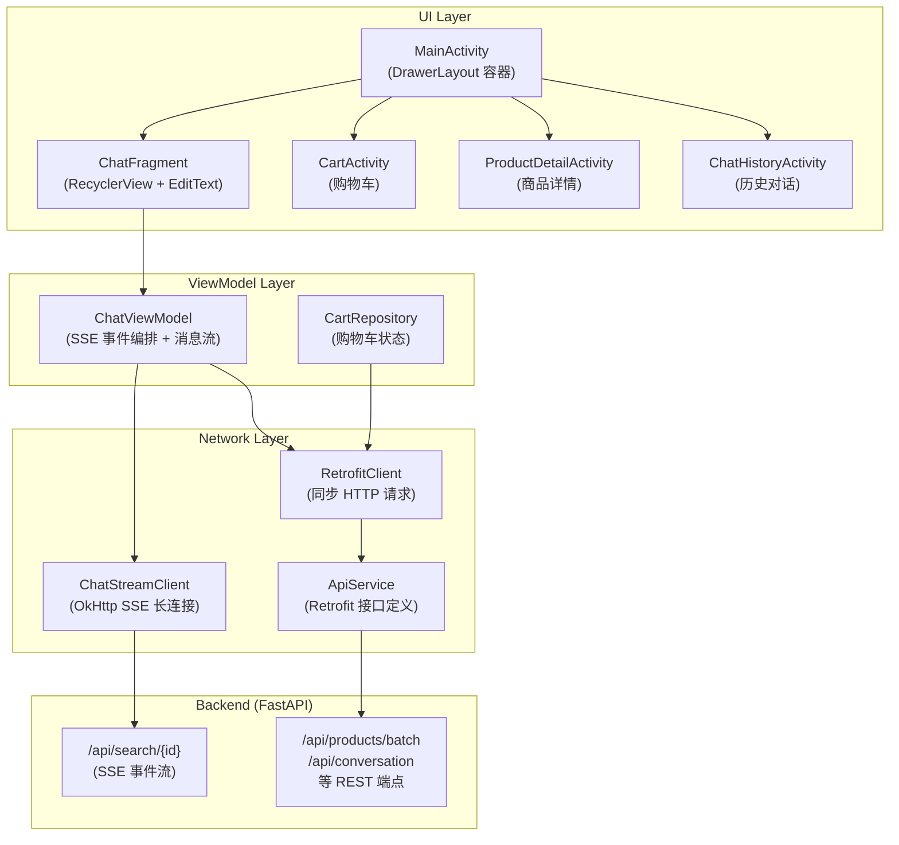

# AuraCart Client — 整体架构

> 平台：Android (Kotlin) | 架构：MVVM | 更新日期：2026-06-10

## 1. 架构概览



## 2. 技术栈

| 层面 | 技术 |
|------|------|
| 语言 | Kotlin |
| 构建 | Gradle (Groovy DSL) |
| UI | XML Layouts + Material Design |
| 架构 | MVVM (ViewModel + LiveData) |
| 网络 SSE | OkHttp (EventSource 手动解析) |
| 网络 REST | Retrofit + Gson |
| 图片 | 服务端静态文件托管 |
| 导航 | DrawerLayout + Activity 跳转 |

## 3. 包结构

```
com.ecomguide/
├── ui/
│   ├── MainActivity.kt              # 主容器 (DrawerLayout + Toolbar)
│   ├── chat/
│   │   ├── ChatFragment.kt          # 聊天页 (RecyclerView + 输入框)
│   │   ├── ChatViewModel.kt         # 核心状态容器 (SSE→MessageItem 序列)
│   │   ├── MessageAdapter.kt        # 多类型消息 RecyclerView Adapter
│   │   └── ProductCardAdapter.kt    # 横向商品卡片 Adapter
│   ├── cart/
│   │   ├── CartActivity.kt          # 购物车页
│   │   └── CartAdapter.kt           # 购物车列表 Adapter
│   ├── detail/
│   │   ├── ProductDetailActivity.kt         # 商品详情全屏页
│   │   ├── HalfScreenProductDetailActivity.kt # 半屏商品详情
│   │   └── CategoryProductsActivity.kt      # 品类落地页
│   └── sidebar/
│       ├── ChatHistoryActivity.kt    # 历史对话列表
│       ├── MessagesActivity.kt      # 消息中心
│       └── MyOrdersActivity.kt      # 我的订单
├── model/
│   └── Models.kt                    # 数据模型 (ApiProduct / MessageItem / SSE 事件)
├── network/
│   ├── ChatStreamClient.kt          # OkHttp SSE 长连接客户端
│   ├── RetrofitClient.kt            # Retrofit 单例 + 图片路径解析
│   └── ApiService.kt               # REST API 接口定义
└── repository/
    ├── CartRepository.kt            # 购物车状态管理 (LiveData)
    └── DemoProducts.kt              # Demo 商品数据
```

## 4. 数据流

### 4.1 搜索主流程 (SSE 实时事件)

```
用户输入
  → ChatViewModel.sendMessage()
    → ChatViewModel.createConversation()        (GET /api/conversation)
    → ChatStreamClient.search(query, cid)        (GET /api/search/{cid}?q=...)
      → OkHttp SSE 事件流
        → ChatViewModel.handleStreamEvent()      (主线程逐事件处理)
          → Welcome / ChatReply / ProductEvent / StreamText / Done / Error
            → MessageItem 序列更新
              → LiveData.setValue()
                → MessageAdapter.onBindViewHolder()
                  → RecyclerView 增量渲染
```

### 4.2 商品批量补全 (REST)

```
ProductEvent (只含 product_id + category)
  → ChatViewModel.handleProductEvent()
    → 入队到 productPairQueue
      → chat_reply 到达后回填理由
        → done 事件后批量请求
          → GET /api/products/batch?ids=...
          → GET /api/products/image/batch?ids=...
            → ApiProduct 详情填充
              → 场景卡片 / 横向商品卡片渲染
```

## 5. 关键设计决策

### 5.1 单 AiMsg 气泡 + Blocks 结构

所有 AI 回复（欢迎语、品类介绍、商品理由、结束语）共用一条 `AiMsg` 消息，内部用 `List<AiReplyBlock>` 组织：

```
AiMsg (isStreaming=true)
  ├── AiReplyBlock(text="欢迎语")
  ├── AiReplyBlock(text="品类介绍")
  ├── AiReplyBlock(scenarioCard=场景入口)
  ├── AiReplyBlock(text="推荐理由")
  ├── AiReplyBlock(product=商品卡片)
  └── AiReplyBlock(text="结束语")
```

- 流式期间 isStreaming=true，done 后置 false
- 场景入口卡片插入品类介绍段后，保证视觉顺序

### 5.2 卡片渲染模式自动切换

done 事件后根据 subCategory 个数判断：
- **subCategory = 1** → 横向商品卡片 (HorizontalProductCard)
- **subCategory > 1** → 场景入口卡片 (ScenarioCard)，点击跳转品类落地页

### 5.3 结束语延迟追加

结束语 (ending/ending_stream) 缓存到 `deferredEndingText`，在商品/场景卡片渲染完成后再追加到 AiMsg 末尾，避免"先结束语后商品"。
