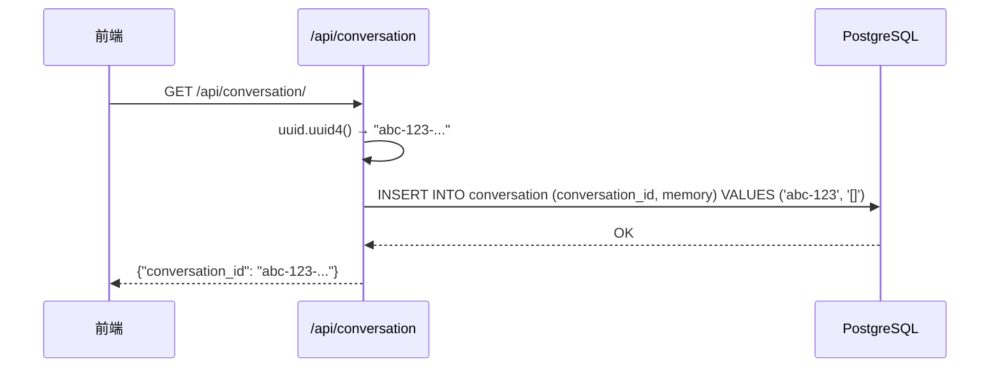
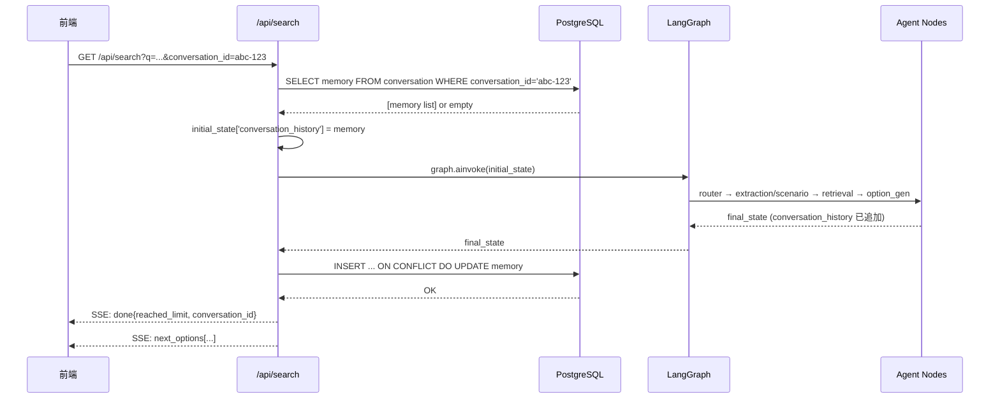

# 多会话支持 — 编码级详细设计

> **输入：** [PLAN.md](PLAN.md)
> **目标：** 精确到每个函数签名、每个 SQL 语义、每个异常路径的编码级方案

---

## 1. 模块详细设计

### 1.1 新建：`app/models/conversation.py` — Conversation ORM 模型

**实现思路：**
遵循 `ProductReview` 模型风格，使用 `mapped_column` 声明式映射。主键为 UUID 字符串，无自增 id。

**字段设计：**

| Python 属性 | 物理列名 | 类型 | 约束 |
|------------|---------|------|------|
| `conversation_id` | `conversation_id` | `String(36)` | PK, 应用层生成 UUID |
| `memory` | `memory` | `JSONB` | NOT NULL, server_default=`'[]'::jsonb` |
| `created_at` | `created_at` | `DateTime` | server_default=`func.now()` |
| `updated_at` | `updated_at` | `DateTime` | server_default=`func.now()`, onupdate=`func.now()` |

**难点/风险：**
- `default=list` 不可用（SQLAlchemy 要求 callable 或 server_default），使用 `server_default=sa.text("'[]'::jsonb")` 解决。
- JSONB 列从 DB 读出时 asyncpg 自动反序列化为 Python `list[dict]`，无需手动处理。
- 物理列名 `memory` 不与 SQLAlchemy 保留字冲突（`ProductReview.extra_data` 用 `name="metadata"` 是因为 `metadata` 是 `Base` 的属性）。

**代码结构：**
```python
# app/models/conversation.py
from sqlalchemy import String, DateTime, text
from sqlalchemy.dialects.postgresql import JSONB
from sqlalchemy.orm import Mapped, mapped_column
from sqlalchemy.sql import func
from app.database import Base

class Conversation(Base):
    __tablename__ = "conversation"
    conversation_id: Mapped[str] = mapped_column(String(36), primary_key=True)
    memory: Mapped[list | None] = mapped_column(
        JSONB, nullable=False, server_default=text("'[]'::jsonb")
    )
    created_at: Mapped[DateTime] = mapped_column(DateTime, server_default=func.now())
    updated_at: Mapped[DateTime] = mapped_column(
        DateTime, server_default=func.now(), onupdate=func.now()
    )
```

---

### 1.2 新建：`alembic/versions/YYYYMMDD_0002_add_conversation.py` — 数据库迁移

**实现思路：**
创建 `conversation` 表。`down_revision` 指向 `6af5d4918efe`（当前 HEAD）。无外键、无额外索引。

**功能实现链路：**
```
alembic upgrade head
  → _ensure_database_exists()
  → run_async_migrations()
  → run_migrations_online()
  → 20260527_0001 (已执行, skip)
  → 6af5d4918efe (已执行, skip)
  → YYYYMMDD_0002 → CREATE TABLE conversation
```

**upgrade 步骤：**
1. `op.create_table("conversation", ...)` — 4 列，PK 为 `conversation_id`

**downgrade 步骤：**
1. `op.drop_table("conversation")`

**难点/风险：**
- `down_revision` 必须精确指向 `'6af5d4918efe'`，否则迁移链断裂。
- 不需要显式创建索引 — PK 自动创建 B-tree 索引。

**代码结构：**
```python
# alembic/versions/YYYYMMDD_0002_add_conversation.py
revision: str = "YYYYMMDD_0002"
down_revision: Union[str, Sequence[str], None] = "6af5d4918efe"

def upgrade() -> None:
    op.create_table(
        "conversation",
        sa.Column("conversation_id", sa.String(36), nullable=False),
        sa.Column("memory", postgresql.JSONB(), nullable=False,
                  server_default=sa.text("'[]'::jsonb")),
        sa.Column("created_at", sa.DateTime(), server_default=sa.text("now()")),
        sa.Column("updated_at", sa.DateTime(), server_default=sa.text("now()")),
        sa.PrimaryKeyConstraint("conversation_id"),
    )

def downgrade() -> None:
    op.drop_table("conversation")
```

---

### 1.3 新建：`app/api/conversation.py` — 会话创建 API

**实现思路：**
单路由 `GET /api/conversation/`，依赖注入 `AsyncSession`，生成 UUID 并 INSERT 空行。

**功能实现链路：**
```
GET /api/conversation/
  → uuid.uuid4() 生成 conversation_id
  → db.add(Conversation(conversation_id=str(uuid), memory=[]))
  → db.commit()
  → return {"conversation_id": "xxx-xxx-xxx"}
```

**接口签名：**
```python
@router.get("/conversation")
async def create_conversation(
    request: Request,
    db: AsyncSession = Depends(get_db),
) -> dict:
```

**异常路径：**
- DB commit 失败 → FastAPI 自动 500，由现有异常处理捕获
- UUID 碰撞概率极低（v4 随机），不做冲突重试

**难点/风险：**
- 无。此接口为最简单的 CRUD 操作。

---

### 1.4 修改：`app/models/__init__.py` — 注册 Conversation 模型

**改动内容：** 新增 1 行 import + 1 行 `__all__` 条目

```
from app.models.conversation import Conversation  # noqa: E402, F401
```

**为什么需要：** Alembic `env.py` 通过 `app.models` 导入发现所有模型元数据，不注册则 `--autogenerate` 无法检测。

---

### 1.5 修改：`app/main.py` — 注册路由

**改动内容：** 新增 1 行 import + 1 行 `include_router`

```python
from app.api import search, products, admin, conversation
app.include_router(conversation.router)
```

---

### 1.6 修改：`app/schemas/product.py` — SearchResponse 增加字段

**改动内容：** `SearchResponse` 新增 1 个字段

```python
class SearchResponse(BaseModel):
    query: str
    sub_queries: list[dict]
    products: list[dict]
    reasoning: str | None
    conversation_id: str | None = None  # ← 新增
```

**向后兼容：** 默认值 `None`，旧客户端忽略该字段。

---

### 1.7 修改：`app/api/search.py` — 核心改造（最复杂模块）

这是本次改动最集中的文件，涉及 3 个改动区域。

#### 区域 A：`search()` 函数签名 + 非流式路径

**改动 1：** 在 `search()` 参数中新增 `conversation_id`

```python
async def search(
    request: Request,
    q: str = Query(...),
    stream: bool = Query(True),
    conversation_id: str | None = Query(None, description="会话ID，用于多轮对话记忆"),
    db: AsyncSession = Depends(get_db),
    emb: EmbeddingService = Depends(get_embedding_service),
    llm: LLMService = Depends(get_llm_service),
):
```

**改动 2：** 非流式返回 `SearchResponse` 时传入 `conversation_id`

```python
return SearchResponse(
    query=q, sub_queries=subs, products=products, reasoning=reasoning,
    conversation_id=conversation_id,  # ← 新增
)
```

注意：非流式路径不使用 Agent 工作流，不涉及 memory 读写。`conversation_id` 仅透传到响应。

**改动 3：** 将 `conversation_id` 传入 `_agent_event_stream`

```python
async for event in _agent_event_stream(
    user_query=q,
    graph=agent_graph,
    queue=queue,
    total_timeout=settings.timeout.total_request,
    conversation_id=conversation_id,  # ← 新增
):
```

#### 区域 B：`_agent_event_stream()` 签名 + Memory 读

**改动 4：** 函数签名新增 `conversation_id` 参数

```python
async def _agent_event_stream(
    user_query: str,
    graph,
    queue: asyncio.Queue,
    total_timeout: float = 60.0,
    conversation_id: str | None = None,  # ← 新增
):
```

**改动 5：** 在构建 `initial_state` 之前加载 memory

在 `from app.agent.state import AgentState` 之后、`initial_state` 构建之前插入：

```python
# ---- 加载会话记忆 ----
initial_history: list[dict] = []
if conversation_id:
    try:
        from app.database import async_session
        from sqlalchemy import select
        from app.models.conversation import Conversation

        async with async_session() as session:
            result = await session.execute(
                select(Conversation.memory).where(
                    Conversation.conversation_id == conversation_id
                )
            )
            row = result.scalar_one_or_none()
            if row is not None:
                # asyncpg JSONB → Python list[dict] 自动反序列化
                initial_history = row
            else:
                logger.warning(
                    "会话不存在，降级为空记忆",
                    conversation_id=conversation_id,
                )
    except Exception as e:
        logger.warning(
            "加载会话记忆失败，降级为空记忆",
            conversation_id=conversation_id,
            error=str(e),
        )
```

然后修改 `initial_state` 中的 `conversation_history` 初始值：

```python
initial_state: AgentState = {
    ...
    "conversation_history": initial_history,  # ← 改为变量，原为 []
    ...
}
```

**设计要点：**
- 使用独立的 `async_session()` 而非注入的 `db`，因为 `_agent_event_stream` 不在 FastAPI DI 范围内
- `scalar_one_or_none()` 返回单个列值（JSONB 已自动反序列化），不是 Row 对象
- `conversation_id` 不存在时仅 WARNING 日志，不影响搜索功能

#### 区域 C：Memory 写回

**改动 6：** 在 `_agent_event_stream` 的 `finally` 块中，`graph_task` 成功完成后写回 memory

当前 `finally` 块结构（line 346-370）：
```python
finally:
    if done_received:
        # 等待 graph_task 终态
        ...
    else:
        # 取消 graph_task
        ...

    # 发送 next_options
    if done_received and graph_task.done() and not graph_task.cancelled():
        final_state = graph_task.result()
        if final_state and final_state.get("next_options"):
            yield { "event": "next_options", ... }
```

**插入位置：** 在 `final_state = graph_task.result()` 之后、`next_options` 发送之前：

```python
# ---- 持久化会话记忆 ----
if conversation_id and final_state:
    try:
        from app.database import async_session
        from sqlalchemy.dialects.postgresql import insert as pg_insert
        from app.models.conversation import Conversation

        memory = final_state.get("conversation_history", [])
        async with async_session() as session:
            stmt = pg_insert(Conversation).values(
                conversation_id=conversation_id,
                memory=memory,
            ).on_conflict_do_update(
                constraint="conversation_pkey",
                set_={
                    "memory": memory,
                    "updated_at": sa.func.now(),
                },
            )
            await session.execute(stmt)
            await session.commit()
            logger.debug("会话记忆已保存",
                         conversation_id=conversation_id,
                         rounds=len(memory))
    except Exception as e:
        logger.warning(
            "保存会话记忆失败",
            conversation_id=conversation_id,
            error=str(e),
        )
```

**设计要点：**
- 使用 PostgreSQL `INSERT ... ON CONFLICT DO UPDATE`（UPSERT）语义
- 若 `conversation_id` 对应行不存在（极端情况：手动删除），自动创建
- `on_conflict_do_update` 手动指定 `updated_at=func.now()`，因为 `onupdate` 仅对 ORM `session.merge()` 生效，对原生 SQL 不触发
- 写失败仅 WARNING 日志，不阻塞 `next_options` 发送
- 需要文件顶部新增 `import sqlalchemy as sa`（用于 `sa.func.now()` 和 `sa.text`）

#### 区域 D：done 事件的 conversation_id

**改动 7：** 不修改 done 事件本身——done 事件已在循环中直接 yield，其 data 为 `event["data"]` 的 JSON 序列化结果。`conversation_id` 通过 `next_options` 事件之前的独立 SSE 事件发送，或…… 

**重新审视设计：** 按 DEFINE.md FR4 要求"done 事件 data 中包含 `conversation_id`"。当前 done 事件由 `option_gen_node` 发送，其 data 为 `{"reached_limit": bool}`。需要修改 done 事件发出点。

**更简洁的方案：** 不在各节点修改 done 事件，而是在 `_agent_event_stream` 的消费循环中，当收到 done 事件时，在 yield 之前将 `conversation_id` 附加到 data 中：

在消费循环 `yield` done 事件之前（line 330-335 区域）：

```python
# 在 yield 之前注入 conversation_id
if event["event"] == "done" and conversation_id:
    if isinstance(event["data"], dict):
        event["data"]["conversation_id"] = conversation_id
    else:
        # data 可能是 str（已序列化），反序列化后注入
        data_obj = json.loads(event["data"]) if isinstance(event["data"], str) else event["data"]
        data_obj["conversation_id"] = conversation_id
        event["data"] = data_obj
```

**更稳健的设计：** 在 done 事件 yield 之后、next_options 之前，单独发送一个 `conversation_id` SSE 事件。或者直接修改 done 事件的 data。

**最终选择：** 直接在 done 事件的 data dict 中注入 `conversation_id`。当前 done data 格式为 `{"reached_limit": bool}`，新增字段后为 `{"reached_limit": bool, "conversation_id": str | None}`。向后兼容——旧客户端忽略未知字段。

**实现方式：** 在消费循环中，处理 done 事件时修改 data：

```python
# 第 330-335 行改为：
data = event["data"]
if event["event"] == "done":
    done_received = True
    if isinstance(data, dict):
        data["conversation_id"] = conversation_id
    data_str = json.dumps(data, ensure_ascii=False)
    yield {"event": event["event"], "data": data_str}
    break
```

同时需要检查：done 事件目前由 `option_gen_node` 发送，其 data 格式为 `{"reached_limit": bool}`。这已是 dict 格式，直接在消费循环注入即可。

---

### 1.8 修改：`alembic/env.py` — 注册 Conversation 模型引用

**改动内容：** 在模型导入列表新增 `Conversation`

```python
from app.models import (
    Product,
    ProductFaq,
    ProductMarketing,
    ProductReview,
    Sku,
    UserReview,
    Conversation,  # ← 新增
)
```

**为什么需要：** `env.py` 显式列出了所有模型类导入。虽然 `app.models.__init__` 也导出了 `Conversation`，但 `env.py` 的导入列表也需同步更新以确保 `--autogenerate` 能发现新表。实际上，由于 `env.py` 使用 `from app.models import (...)`，只要 `__init__.py` 正确导出即可。但保持 `env.py` 列表同步是最佳实践。

---

## 2. 核心功能接口详细设计

### 2.1 FR1: `GET /api/conversation/`

**时序：**



**涉及模块：** `app/api/conversation.py`, `app/models/conversation.py`

### 2.2 FR2+FR3+FR4: `/api/search` 带 conversation_id（SSE 路径）

**时序：**



### 2.3 Memory 读写详细路径

**读路径：**
```
conversation_id is None → initial_history = []
conversation_id 有值:
  → async_session() → SELECT memory → scalar_one_or_none()
  → 有结果: initial_history = row (list[dict])
  → 无结果: WARNING + initial_history = []
  → 异常: WARNING + initial_history = []
```

**写路径：**
```
done_received AND graph_task 成功 AND conversation_id 有值:
  → final_state = graph_task.result()
  → memory = final_state["conversation_history"] (LangGraph add reducer 已累加)
  → async_session() → INSERT ... ON CONFLICT DO UPDATE
  → commit()
  → 异常: WARNING (不阻塞)
```

---

## 3. 关键数据实体

### 3.1 数据库表：`conversation`

```sql
CREATE TABLE conversation (
    conversation_id VARCHAR(36) PRIMARY KEY,   -- UUID v4
    memory          JSONB NOT NULL DEFAULT '[]'::jsonb,  -- list[dict]
    created_at      TIMESTAMP DEFAULT now(),
    updated_at      TIMESTAMP DEFAULT now()
);
```

### 3.2 memory JSONB 内容格式

与 `AgentState.conversation_history` 一致，为 `list[dict]`，每项为 requirements 格式：

```json
[
    {
        "sub_queries": [
            {"text": "...", "strategy": "semantic", ...},
            {"text": "...", "strategy": "keyword", ...}
        ]
    }
]
```

由 `retrieval_node` 通过 LangGraph `add` reducer 自动追加。

### 3.3 存储与检索技术选型

| 决策点 | 选择 | 理由 |
|--------|------|------|
| 主键类型 | `String(36)` UUID | DEFINE 阶段确认，无碰撞风险 |
| Memory 列类型 | JSONB | 已有 PostgreSQL JSONB 支持（asyncpg 自动序列化/反序列化） |
| Memory 写策略 | UPSERT (ON CONFLICT) | 读时降级为空，写时自动创建行 |
| UUID 生成位置 | 应用层 `uuid.uuid4()` | 避免 DB 依赖，便于测试 mock |
| 索引策略 | 仅 PK B-tree | 查询全部为主键等值查找，无需额外索引 |

---

## 4. 项目目录结构

```
server/
├── alembic/
│   └── versions/
│       ├── 20260527_0001_init_schema.py          # 初始迁移（不改）
│       ├── 6af5d4918efe_fix_content_tsv_and_indexes.py  # 修正迁移（不改）
│       └── YYYYMMDD_0002_add_conversation.py     # [新建] conversation 表迁移
├── app/
│   ├── api/
│   │   ├── search.py        # [修改] +conversation_id 参数, memory 读写, done 注入
│   │   └── conversation.py  # [新建] GET /api/conversation/ 路由
│   ├── models/
│   │   ├── __init__.py       # [修改] 注册 Conversation
│   │   └── conversation.py   # [新建] Conversation ORM 模型
│   ├── schemas/
│   │   └── product.py        # [修改] SearchResponse +conversation_id 字段
│   └── main.py               # [修改] 注册 conversation.router
└── docs/
    └── AGENT_OPT/
        └── CONVERSATION_OPT/
            ├── SPEC.md        # 原始需求（不改）
            ├── DEFINE.md      # 需求分析（不改）
            ├── PLAN.md        # 架构方案（不改）
            └── CON_PLAN.md    # 本文档
```

---

## 5. 风险点和待优化项

| # | 类型 | 描述 | 处理 |
|---|------|------|------|
| R1 | 风险 | `conversation_id` 不存在时写回自动创建行，但无 `created_at` 差异 | 可接受：极端边缘场景，且功能不受影响 |
| R2 | 风险 | `_agent_event_stream` 内 `async_session()` 创建的独立 session 不受 FastAPI 事务管理 | 刻意为之：memory 读写应独立于搜索 DB 操作，失败不互相影响 |
| R3 | 风险 | done 事件 data 注入 `conversation_id` 修改了 event dict | 低风险：done 是最后一个 SSE 事件，修改不会影响后续处理 |
| O1 | 优化 | 当前 memory 写回未做 token 截断 | 线上观察 JSONB 大小后再决定是否在写侧加 `truncate_by_tokens` |
| O2 | 优化 | `GET /api/conversation/` 无认证 | 当前系统整体无认证机制，待统一引入 |

---

> **文档状态：** 待确认
> **下一阶段：** 编码实现（按 Task 顺序：ORM → 迁移 → 路由 → search.py → 测试）
