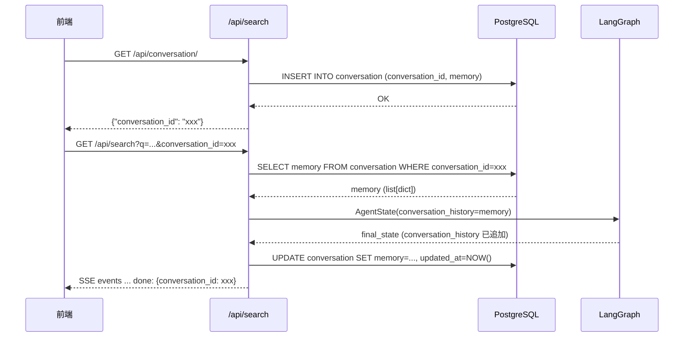

# 多会话支持 — 需求分析

> **输入：** [SPEC.md](SPEC.md)
> **目标：** 明确功能需求、性能需求、交付物、约束边界和风险点

---

## 1. 功能需求

### FR1: 新增 `GET /api/conversation/` 会话创建接口

前端通过此接口申请新会话，服务端生成 UUID `conversation_id`，在 `conversation` 表中插入一行（空 memory），返回 `{"conversation_id": "xxx-xxx-xxx"}`。

### FR2: `/api/search` 支持 `conversation_id` 参数

在现有 `GET /api/search?q=...&stream=true` 上新增可选参数 `conversation_id: str | None = None`。

- 传入时：从 `conversation` 表加载 `memory` → 注入 `AgentState.conversation_history` 初始值
- 未传入时：`conversation_history` 初始化为 `[]`（向后兼容，现有行为不变）

### FR3: conversation_history 按 conversation_id 持久化

- **读时机**：`/api/search` 开始时，根据 `conversation_id` 从 DB 加载 `memory`
- **写时机**：LangGraph 图执行完成后，将 `final_state["conversation_history"]` 写回 `conversation.memory`
- **写失败处理**：记录 WARNING 日志，不阻塞 SSE 响应（memory 为优化项，丢失一次不致命）

### FR4: `/api/search` 响应返回 `conversation_id`

- **SSE 模式**：在 `done` 事件 data 中包含 `conversation_id`
- **JSON 模式**：在 `SearchResponse` body 中增加 `conversation_id` 字段
- 若请求未传入 `conversation_id`，返回 `null`

---

## 2. 性能需求

| ID | 需求 | 度量 |
|----|------|------|
| PR1 | conversation 表读写延迟不影响搜索体验 | 单次 SELECT/UPDATE < 5ms |
| PR2 | UUID 主键索引高效 | B-tree 索引，O(log n) 查找 |
| PR3 | memory JSONB 列不拖慢查询 | 当前 conversation_history 条目数少（<50 条），JSONB 大小可控 |

---

## 3. 最终交付物

1. **新建 `Conversation` ORM 模型** — `server/app/models/conversation.py`
2. **新建 Alembic 迁移** — 创建 `conversation` 表
3. **新增 `GET /api/conversation/` 路由** — `server/app/api/conversation.py` 或在 `search.py` 中添加
4. **修改 `/api/search` 接口** — 新增 `conversation_id` 参数 + 读写 memory + 返回值
5. **修改 `_agent_event_stream`** — 注入 `conversation_history` 初始值 + done 事件加 `conversation_id`
6. **测试验证** — 回归测试 0 失败

---

## 4. 硬约束

1. **不修改 `AgentState` 字段定义** — `conversation_history` 的类型和 `add` reducer 不变
2. **不修改 LangGraph 图拓扑** — 节点增删或边变更不在范围内
3. **向后兼容** — `conversation_id` 为可选参数，不传入时行为与现状完全一致
4. **不新增 Python 依赖** — `uuid` 为标准库，JSONB 使用已有 sqlalchemy JSONB
5. **SSE 事件格式不变** — 新增字段仅附加到现有事件 data 中，不改变现有 key
6. **conversation_history 持久化的是原始 dict list** — 不做额外序列化/反序列化转换

---

## 5. 隐含要求

1. **`conversation` 表需要 `updated_at` 字段** — 用于未来清理过期会话（不在本次实现，但 Schema 预留）
2. **并发安全** — 同一 `conversation_id` 不应同时有两个 `/api/search` 请求（正常使用场景不会出现，暂不做乐观锁）
3. **memory 写回时机** — 必须在 SSE done 事件发送之前完成 DB 写入，确保客户端收到 done 后立即发起下一个请求时能读到最新 memory
4. **JSONB 中的 `conversation_history` 格式与 AgentState 一致** — 即 `list[dict]`，每条为 `requirements` 格式（`{"sub_queries": [...], ...}`）

---

## 6. 任务完成边界

**范围内：**
- 新建 `Conversation` ORM 模型 + Alembic 迁移
- `GET /api/conversation/` 接口
- `/api/search` 增加 `conversation_id` 参数
- `_agent_event_stream` 注入初始 `conversation_history`
- 图执行完成后写回 memory
- `done` 事件和 `SearchResponse` 返回 `conversation_id`
- 回归测试

**范围外：**
- 不实现会话列表/删除/过期清理
- 不实现会话之间的数据隔离（多租户）
- 不实现会话级并发锁
- 不修改 retrieval.py / retriever.py / graph.py 等核心逻辑
- 不修改 SSE 事件类型或顺序

---

## 7. 风险点

| # | 风险 | 影响 | 缓解措施 |
|---|------|------|----------|
| R1 | `conversation_id` 传入不存在时如何处理 | 查不到 memory 导致 KeyError | 降级为空 history，同时 UPDATE 时用 UPSERT 语义 |
| R2 | 图执行中途崩溃（如 LLM 超时），memory 未写回 | 丢失本轮 conversation_history 更新 | 在 `finally` 块中保存 memory |
| R3 | 多个 SSE 连接同时使用同一 `conversation_id` | memory 可能被后写入的覆盖 | 正常使用不会出现；后续可加版本号乐观锁 |
| R4 | memory JSONB 随时间膨胀（长会话积累大量 requirements） | SELECT/UPDATE 变慢 | `memory.py` 中 `truncate_by_tokens` 已存在截断逻辑；可在写回前截断 |

---

## 附录: 数据流（改造后）

---

> **文档状态：** 待确认
> **下一阶段：** PLAN.md（架构方案）
