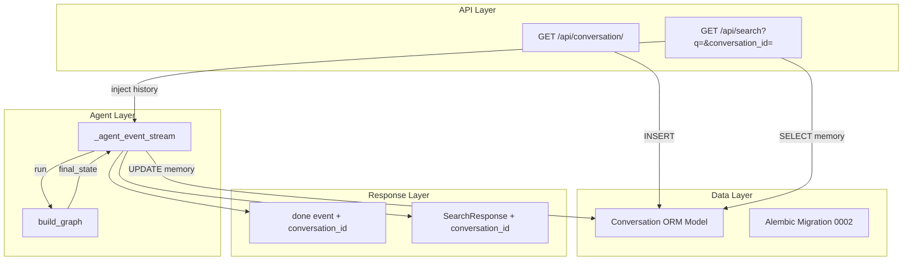

# 多会话支持 — 架构方案

> **输入：** [DEFINE.md](DEFINE.md)
> **目标：** 设计满足 4 个 FR 的最小可行架构

---

## 1. 整体实现架构

**数据流简述：**
1. 前端调用 `GET /api/conversation/` → 服务端 INSERT 新行 → 返回 `{conversation_id: "<UUID>"}`
2. 前端调用 `GET /api/search?q=...&conversation_id=<UUID>` → 服务端 SELECT memory → 注入 `AgentState.conversation_history` → 执行 LangGraph → UPDATE memory → 响应携带 `conversation_id`

---

## 2. 核心功能接口 vs 功能需求映射

| FR | 接口/改动点 | 说明 |
|----|------------|------|
| FR1 | `GET /api/conversation/` | 新建路由，生成 UUID，INSERT 空 memory，返回 conversation_id |
| FR2 | `/api/search?conversation_id=` | 在现有 `search()` 签名加可选参数，传入 `_agent_event_stream` |
| FR3 | `_agent_event_stream` 读写 memory | 初始状态构建前 SELECT；graph 完成后 UPDATE；写失败 WARNING 不阻塞 |
| FR4 | `done` 事件 + `SearchResponse` | SSE done data 附加 `conversation_id`；SearchResponse 新增字段 |

---

## 3. 模块设计

### 3.1 新建模块

| 模块 | 文件 | 输入 | 输出 | 功能 |
|------|------|------|------|------|
| Conversation ORM | `app/models/conversation.py` | — | SQLAlchemy Model | 定义 conversation 表映射 |
| Conversation API | `app/api/conversation.py` | — | FastAPI Router | `GET /api/conversation/` 创建会话 |
| Migration 0002 | `alembic/versions/YYYYMMDD_0002_add_conversation.py` | — | DDL | 创建 conversation 表 |

### 3.2 修改模块

| 模块 | 文件 | 改动点 | 说明 |
|------|------|--------|------|
| Models `__init__` | `app/models/__init__.py` | 新增 import | 注册 Conversation 到 Base.metadata |
| App entry | `app/main.py` | 新增 router 注册 | `app.include_router(conversation.router)` |
| Search API | `app/api/search.py` | 3 处改动 | ① `search()` 加 `conversation_id` 参数 ② `_agent_event_stream` 加 memory 读写 ③ 非流式模式返回 `conversation_id` |
| SearchResponse | `app/schemas/product.py` | 新增字段 | `conversation_id: str \| None = None` |

### 3.3 不改动的模块

以下模块 **不在变更范围内**，确认无需修改：

- `app/agent/state.py` — `conversation_history` 字段和 `add` reducer 不变
- `app/agent/graph.py` — 图拓扑不变，`build_graph()` 签名不变
- `app/agent/nodes/retrieval.py` — 已有 `conversation_history` 写入逻辑，不新增
- `app/agent/memory.py` — token 计数和截断函数不变
- `app/services/retriever.py` — 检索逻辑不变
- `app/database.py` — Base 类和引擎配置不变

---

## 4. 关键数据实体

### Conversation 表

| 列 | 类型 | 约束 | 说明 |
|----|------|------|------|
| `conversation_id` | `String(36)` | PK | UUID v4，应用层生成 |
| `memory` | `JSONB` | NOT NULL, default `'[]'` | 持久化的 `conversation_history` list |
| `created_at` | `DateTime` | server_default=`now()` | 创建时间 |
| `updated_at` | `DateTime` | server_default=`now()`, onupdate=`now()` | 最后更新时间 |

### ORM 模型设计要点

- 使用 `mapped_column(String(36), primary_key=True)` 作为 UUID 主键，无自增 id
- `memory` 属性映射到物理列 `memory`（无命名冲突，直接用 JSONB）
- 符合现有 `ProductReview` 模型的时间戳模式

---

## 5. 方案优点

1. **最小侵入** — 仅在 API 层和响应 schema 做增量改动，Agent 核心逻辑零变更
2. **向后兼容** — `conversation_id` 为可选参数，不传时行为与现状完全一致
3. **无新依赖** — UUID 用标准库 `uuid.uuid4()`，JSONB 用已有 SQLAlchemy JSONB
4. **失败安全** — memory 写失败仅记录 WARNING，不阻塞 SSE 响应；读失败降级为空 history
5. **预留扩展** — `updated_at` 字段为未来会话清理/过期提供基础

---

## 6. 主要风险

| # | 风险 | 影响 | 缓解 |
|---|------|------|------|
| R1 | `conversation_id` 不存在时 SELECT 返回空 | 用户传入无效 ID | 降级为空 history + WARNING 日志，后续 UPDATE 用 "UPSERT 语义"（INSERT OR UPDATE） |
| R2 | Graph 执行中途崩溃，memory 未写回 | 丢失本轮对话记忆 | 在 `_agent_event_stream` 的 `finally` 块中保存 memory |
| R3 | 同一 `conversation_id` 并发请求 | memory 覆盖 | 不处理（正常使用不会出现）；未来可加版本号乐观锁 |
| R4 | Memory JSONB 膨胀 | SELECT/UPDATE 变慢 | `memory.py:truncate_by_tokens()` 已存在，在读侧和写侧均可截断 |

---

## 7. 实现复杂度评估

| 维度 | 评估 | 说明 |
|------|------|------|
| 新增代码量 | ~80 行 | 1 个 ORM 模型 + 1 个路由 + 1 个迁移 + search.py 3 处改动 + schema 1 字段 |
| 改动文件数 | 6 个 | 3 新建 + 3 修改（不含测试） |
| 数据库变更 | 1 张新表 | 无外键、无索引（仅 PK）、无数据迁移 |
| 测试影响 | 低 | 回归测试无需改动；可新增 2-3 个 conversation 专项测试 |
| 风险等级 | 低 | 改动集中在 API 边界，Agent 核心逻辑不变 |

---

## 8. 可测试性评估

- **单元测试**：Conversation 路由可用 `TestClient` + mock DB session 独立测试
- **集成测试**：完整流（create → search → 再 search 验证 memory 持久化）可在测试环境验证
- **回归测试**：不影响现有 `test_search.py`、`test_retriever.py`、`test_graph.py`
- **DB 迁移测试**：Alembic 的 `upgrade`/`downgrade` 可在测试 DB 上验证

---

## 9. 可交付性评估

| 交付物 | 状态 |
|--------|------|
| Conversation ORM 模型 | 新建文件 |
| Alembic 迁移 0002 | 新建文件 |
| `GET /api/conversation/` 路由 | 新建文件 |
| `/api/search` 改造 | 修改 search.py + product.py |
| `_agent_event_stream` memory 读写 | 修改 search.py |
| 测试验证 | 回归 0 失败 + 新增测试 |

---

> **文档状态：** 待确认
> **下一阶段：** CON_PLAN.md（编码级详细设计）
