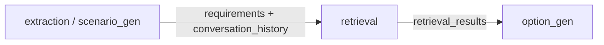
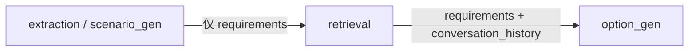

# 完善会话记忆 Memory 机制 — 实现方案

## 问题

在现有实现中，Intent Extraction 或 Scenario Gen 节点提取完当前查询的 `requirements` 后，会立即将其写入 `conversation_history`（memory）。Product Retrieval 节点同时收到 `requirements` 和 `conversation_history`，导致当前用户意图发生重复。

**日志证据**（`app_20260602_141419.log` L7）：

```
extraction 输出:
  requirements={"sub_queries": [防晒霜, price<200]}
  conversation_history=[{"sub_queries": [防晒霜, price<200]}]
```

`requirements` 与 `conversation_history[0]` 内容完全一致，形成重复注入。

## 根因分析

LangGraph 数据流：



Extraction/Scenario Gen 在返回 `requirements` 的同时，也将其追加到 `conversation_history` 并返回。由于 `conversation_history` 使用 `Annotated[list, add]` reducer，LangGraph 自动将返回值拼接到 state 中，导致 state 中同时存在 `requirements`（当前轮）和 `conversation_history[last]`（也是当前轮）。

## 解决方案

将 `conversation_history` 的写入从 **Extraction/Scenario Gen** 推迟到 **Product Retrieval 完成检索之后**。

### 修复后数据流



- Extraction/Scenario Gen：**只返回 `requirements`**，不再写入 `conversation_history`
- Product Retrieval：检索完成后，将当前 `requirements` 作为新条目追加到 `conversation_history`

## 涉及文件

| 文件 | 变更类型 | 说明 |
|------|---------|------|
| `server/app/agent/nodes/extraction.py` | 修改 | 移除 `conversation_history` 追加和 `truncate_by_tokens` 调用 |
| `server/app/agent/nodes/scenario_gen.py` | 修改 | 同上 |
| `server/app/agent/nodes/retrieval.py` | 修改 | 新增 Step 6：检索完成后追加 `conversation_history` |
| `server/tests/test_extraction.py` | 修改 | 更新 3 个测试，验证 extraction 不再返回/截断 history |
| `server/tests/test_retrieval_node.py` | 修改 | 新增 2 个测试，验证 retrieval 正确写入 memory |

## 关键实现细节

### 1. extraction.py / scenario_gen.py

删除以下代码块：

```python
# 追加到 conversation_history
new_entry = {"sub_queries": subs_dicts}
new_history = conversation_history + [new_entry]
new_history = truncate_by_tokens(new_history, ...)
```

返回字典中移除 `"conversation_history": new_history`。

### 2. retrieval.py

新增 Step 6（在聚合 `retrieval_results` 之后）：

```python
# 检索完成后，将当前 requirements 写入 conversation_history
# 只返回新增条目 [new_entry]，由 LangGraph add reducer 负责拼接到 state
requirements = state.get("requirements", {})
new_entry = requirements if requirements else {}
return {
    "retrieval_results": ...,
    "failed_categories": ...,
    "conversation_history": [new_entry] if requirements else [],
}
```

### 3. LangGraph add reducer 行为

`conversation_history: Annotated[list[dict], add]` — 每个节点返回的列表会被 **追加** 到 state 现有值：

```
state["conversation_history"] = old_value + node_return["conversation_history"]
```

因此节点只需返回 **本轮新增条目**（`[new_entry]`），不需要返回完整历史。State 每次 API 请求都是全新的（`initial_state = {"conversation_history": []}`），不存在跨请求累积。

## 测试覆盖

| 测试 | 说明 |
|------|------|
| `test_extraction_no_longer_appends_conversation_history` | 验证 extraction 返回结果不含 `conversation_history` |
| `test_extraction_no_longer_truncates_history` | 验证 extraction 不再调用 `truncate_by_tokens` |
| `test_extraction_injects_history_context` | 验证 extraction 仍能读取 history 用于提示词上下文 |
| `test_retrieval_node_writes_conversation_history_after_retrieval` | 验证 retrieval 返回 1 条新条目 |
| `test_retrieval_node_empty_requirements_no_history` | 验证空 requirements 时不追加空条目 |
