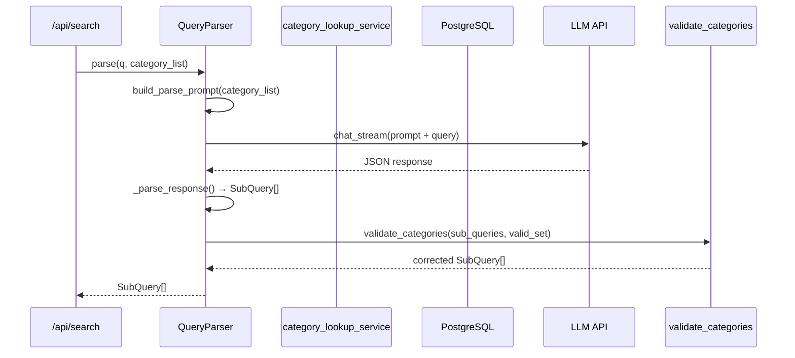
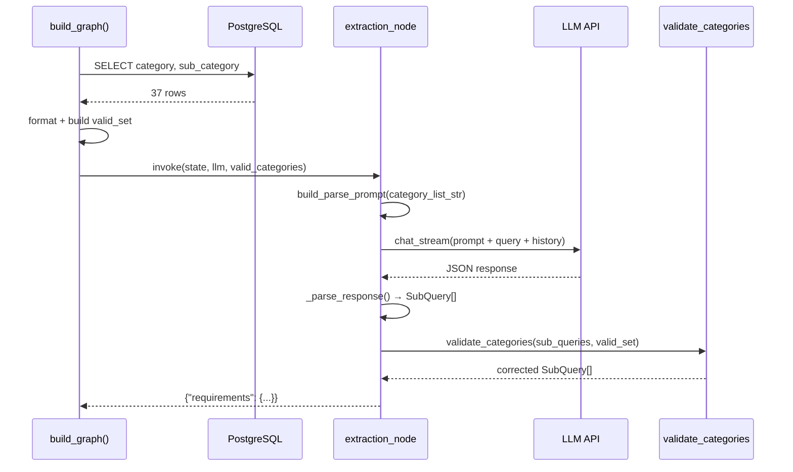

# CON_PLAN.md — 查询解析品类约束优化（编码级设计）

> 输入：`PLAN.md`（已确认）
> 输出：可直接编码的详细设计

## 1. 模块详细设计

### 1.1 `app/services/category_lookup_service.py`（新增）

**实现思路：**
从 `category_lookup` 表查询所有 (category, sub_category) 对，按 category 分组聚合为紧凑字符串。

**接口：**
```python
async def fetch_category_list(db_session: AsyncSession) -> str:
    # 查询 → 分组 → 格式化 → 返回
    # 异常/空表 → 返回 ""
```

**格式化规则：**
- 按 category 分组：`- 面部护肤：防晒霜、洗面奶、面霜、眼霜、精华...`
- 每个 category 一行，sub_category 用中文顿号分隔
- 输出示例：
```
- 面部护肤：防晒霜、洗面奶、面霜、精华
- 运动户外：跑鞋、T恤、运动裤、瑜伽垫
- 彩妆个护：粉底液、口红、卸妆、面膜
- 食品饮料：坚果炒货、牛奶、碳酸饮料、调味品
```

**难点/风险：**
- DB 连接可能失败 → catch Exception，WARNING 日志，返回 ""
- 空表 → WARNING 日志，返回 ""

### 1.2 `app/rag/prompt.py`（修改）

**实现思路：**
`QUERY_PARSE_SYSTEM` 末尾添加 `{category_list}` 占位符，新增 `build_parse_prompt()` 函数填充。

**变更点：**
1. `QUERY_PARSE_SYSTEM` 字符串末尾追加品类区块（含占位符）：
```
## 合法品类列表
以下为系统中实际存在的品类，category 和 sub_category 必须严格从列表中选择。
无法匹配时保持 null。列表格式：category：sub_category1、sub_category2...

{category_list}
```

2. 新增函数：
```python
def build_parse_prompt(category_list: str = "") -> str:
    if category_list:
        return QUERY_PARSE_SYSTEM.format(category_list=category_list)
    else:
        return QUERY_PARSE_SYSTEM.replace("{category_list}", "")
```

3. 移除旧的硬编码示例中的具体品类名，仅保留结构示例（或不改示例，仅让品类列表约束覆盖）

**难点/风险：**
- Python `str.format()` 如果 `category_list` 中含 `{` / `}` 会抛 KeyError → 使用 `str.replace()` 或确保品类名称不含花括号

### 1.3 `app/services/query_parser.py`（修改）

**实现思路：**
- `parse()` 新增可选参数 `category_list: str = ""`
- 用 `build_parse_prompt(category_list)` 替代直接使用 `QUERY_PARSE_SYSTEM`
- 解析完成后调用 `validate_categories()` 做后校验

**实现链路：**
```
parse(user_query, category_list="")
  → build_parse_prompt(category_list)
  → llm.chat_stream(messages, temperature=0.1)
  → _parse_response(raw_response)
  → validate_categories(sub_queries, valid_pairs_set)
  → return sub_queries
```

**难点/风险：**
- `category_list` 参数需要向后兼容 → 默认值 `""`，行为不变
- 后校验需要 `valid_pairs_set: set[tuple[str, str]]` → 从 `category_list` 字符串重建或单独传入

### 1.4 `app/agent/nodes/extraction.py`（修改）

**实现思路：**
- `extraction_node` 签名新增 `valid_categories: set | None = None`
- 使用 `build_parse_prompt()` + 后校验

**实现链路：**
```
extraction_node(state, llm, valid_categories=None)
  → build_parse_prompt(category_list_str)
  → llm.chat_stream(messages, temperature=0.1)
  → _parse_response(raw_response)
  → validate_categories(sub_queries, valid_categories)
  → return {"requirements": {...}}
```

**难点/风险：**
- `extraction_node` 自身不持有 db session → 品类加载在 graph.py 的 `build_graph()` 中完成，通过闭包注入
- 或者在 node 调用前通过 state 传入 `valid_categories`

### 1.5 `app/agent/graph.py`（修改）

**实现思路：**
`build_graph()` 已有 `async_session_factory` 参数，在构建 graph 时：
1. 用 `async_session_factory` 查询品类列表
2. 将 `valid_categories` set 注入 `extraction_node` 的闭包

**变更点：**
- `build_graph()` 内部：在构建 node 函数时，预先加载品类列表，构造带品类约束的 node wrapper

### 1.6 `validate_categories()` 后校验函数

**实现思路：**
纯函数，不依赖外部状态。

**位置：** `app/services/category_lookup_service.py`（与查询函数同一文件）

**逻辑：**
```python
def validate_categories(sub_queries: list[SubQuery], valid_pairs: set[tuple[str, str]]) -> list[SubQuery]:
    for sq in sub_queries:
        if sq.category and sq.sub_category:
            if (sq.category, sq.sub_category) not in valid_pairs:
                sq.category = None
                sq.sub_category = None
        elif sq.category and not sq.sub_category:
            # 仅 category 不为 null：检查该 category 是否存在于 valid_pairs
            if sq.category not in {c for c, _ in valid_pairs}:
                sq.category = None
        # sq.category 为 None 时不处理
    return sub_queries
```

## 2. 核心接口时序图

### 2.1 非流式管线（QueryParser）



### 2.2 Agent 管线（extraction_node）



## 3. 关键数据实体

### 3.1 品类列表字符串（提示词注入）

```
## 合法品类列表
以下为系统中实际存在的品类，category 和 sub_category 必须严格从列表中选择。
无法匹配时保持 null。

- 面部护肤：防晒霜、洗面奶、面霜、眼霜、精华、面霜、粉底液、卸妆、隔离、面膜...
- 运动户外：跑鞋、T恤、运动裤、瑜伽垫、运动短裤、羽绒服、徒步鞋、登山鞋...
- 彩妆个护：粉底液、口红、卸妆、面膜、眉笔、眼影、腮红、粉饼、防晒...
- 食品饮料：坚果炒货、牛奶、碳酸饮料、调味品、饼干、巧克力、方便食品...
```

### 3.2 合法值对集合（后校验）

```python
# set[tuple[str, str]] — O(1) 查找
valid_pairs = {
    ("面部护肤", "防晒霜"), ("面部护肤", "洗面奶"), ...
}
```

### 3.3 存储与检索方案

| 数据 | 存储 | 查询方式 | 缓存策略 |
|------|------|---------|---------|
| category_lookup 原始数据 | PostgreSQL | `SELECT category, sub_category FROM category_lookup` | 无缓存（37 行，查询 < 5ms） |
| 格式化字符串 | 内存 | 每次请求构建 | 请求级（一个函数调用内） |
| valid_pairs set | 内存 | 每次请求构建 | 请求级（一个函数调用内） |

## 4. 期望目录结构

```
server/
├── app/
│   ├── rag/
│   │   └── prompt.py                    # 修改：QUERY_PARSE_SYSTEM + build_parse_prompt()
│   ├── services/
│   │   ├── category_lookup_service.py   # 新增：fetch_category_list() + validate_categories()
│   │   └── query_parser.py              # 修改：parse() +category_list 参数，集成后校验
│   ├── agent/
│   │   ├── nodes/
│   │   │   └── extraction.py            # 修改：+valid_categories 参数，集成后校验
│   │   └── graph.py                     # 修改：加载品类列表，注入 extraction_node
├── tests/
│   └── test_category_lookup.py          # 修改/新增：验证 fetch + validate + prompt 集成
└── docs/
    └── AGENT_OPT/
        └── QUERY_PARSE_OPT/
            ├── SPEC.md                  # 已有
            ├── DEFINE.md                # 本次产出
            ├── PLAN.md                  # 本次产出
            └── CON_PLAN.md              # 本次产出
```

## 5. 风险点和待优化项

| 项目 | 说明 | 处理 |
|------|------|------|
| 品类列表可能增长 | 若未来 > 200 行，token 可能过大 | 当前 37 行安全；未来可加 `LIMIT` 或精简为仅 sub_category |
| LLM 后校验过于激进 | 可能将 LLM 的合理"近似匹配"也置 null | 当前严格约束是设计目标；可观察后调整 |
| graph.py 启动时查 DB | `build_graph()` 每次请求都查 DB | 37 行查询足够轻量；如需优化可用模块级 TTL 缓存 |
| extraction_node 异常路径 | node 内异常时 sub_queries 走 fallback，不经过后校验 | fallback 的 SubQuery category/sub_category 为 None，天然安全 |
