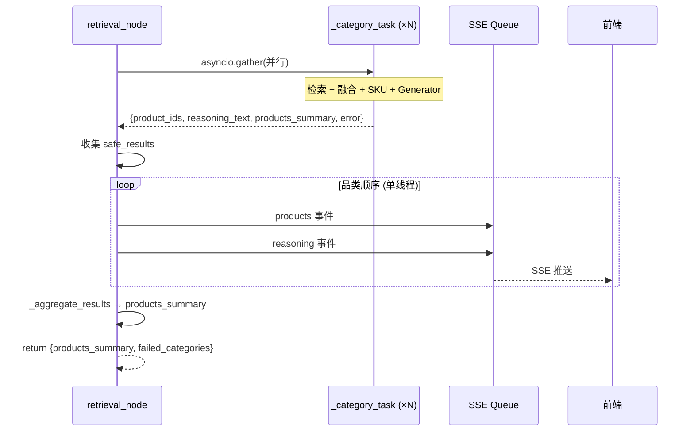

# CON_PLAN.md — Retrieval Node SSE 重构编码级详细设计

> 基于 DEFINE.md + PLAN.md，编码级详细设计，足够支撑实现。

---

## 1. 详细设计

### 1.1 `_category_task` 修改

**变更概述：** 移除 `queue` 参数和内部 SSE 发送，将 `reasoning_tokens: list[str]` 改为 `reasoning_text: str`，新增 `product_ids` 返回字段。

**影响行号（当前 `retrieval.py`）：**

| 区域 | 行号 | 变更 |
|---|---|---|
| 函数签名 | 106-114 | 删除 `queue` 参数 |
| Docstring | 115-118 | 删除对 `queue` 的引用 |
| 空结果返回 | 155-161 | 新增 `product_ids: []`, `reasoning_text: ""` |
| products SSE | 165-173 | 删除 `queue.put`，仅构建 `product_ids` 变量 |
| 正常返回 | 206-212 | `reasoning_tokens` → `reasoning_text`，新增 `product_ids` |
| 异常返回 | 214-222 | `reasoning_tokens: []` → `reasoning_text: ""`，新增 `product_ids: []` |

**实现思路：**

1. **删除 `queue` 参数**：从函数签名第 113 行删除 `queue,`，同时更新 docstring。
2. **重构 product_ids 构建**：将 lines 167-173 的构建 + 发送逻辑拆开，保留构建逻辑（移到 summary 之前），删除 `if queue: await queue.put(...)` 部分。
3. **字段重命名**：line 185 的 `tokens: list[str]` → `tokens: list[str]` 保持不变（内部缓冲仍用 list），但 line 211 的返回字段 `"reasoning_tokens": tokens` → `"reasoning_text": "".join(tokens)`。
4. **空结果/异常返回补齐**：两个早返回路径都加上 `product_ids` 和 `reasoning_text` 字段。

**难点/风险：**
- `product_ids` 构建依赖 `skus` 变量，但空结果分支（line 155）位于 `skus` 赋值之前。解决：空结果分支中 `product_ids` 直接赋 `[]`。

---

### 1.2 `retrieval_node` 修改

**变更概述：** 内联品类顺序 SSE 循环替代 `_send_reasoning_sequential`，`_bounded_task` 不再传递 `queue`，异常回退字段对齐新接口。

**影响行号：**

| 区域 | 行号 | 变更 |
|---|---|---|
| `_bounded_task` | 305-309 | 删除 `queue` 实参 |
| 异常回退 | 318-324 | `reasoning_tokens` → `reasoning_text`，新增 `product_ids` |
| SSE 发送 | 328-329 | 删除 `_send_reasoning_sequential` 调用，替换为内联循环 |

**实现思路：**

1. **`_bounded_task` 去掉 `queue`**：line 308 从 `emb_service, llm, queue` → `emb_service, llm`。
2. **异常回退字段对齐**：line 323 的 `"reasoning_tokens": []` → `"reasoning_text": ""`，新增 `"product_ids": []`。
3. **内联 SSE 循环**：删除 lines 328-329，替换为：
   ```
   if queue:
       for r in safe_results:
           if r.get("error"): continue
           # 发送 products 事件
           pids = r.get("product_ids", [])
           if pids: await queue.put({"event": "products", "data": pids})
           # 发送 reasoning 事件
           reason = r.get("reasoning_text", "")
           if reason: await queue.put({"event": "reasoning", "data": {...}})
   ```

**循环顺序保证：** `safe_results` 的构建顺序与 `group_key_list`（即 `groups.keys()`）一致，Python 3.7+ dict 保序，因此迭代 `safe_results` 的顺序即品类顺序。

**实现链路时序：**



---

### 1.3 删除 `_send_reasoning_sequential`

**变更概述：** 整个函数删除（lines 225-267），逻辑已合并到 `retrieval_node`。

**影响：**
- `retrieval.py`：lines 225-267 删除
- `test_retrieval_node.py`：import 移除 + 3 个测试删除

---

### 1.4 测试适配

**文件：** `server/tests/test_retrieval_node.py`

| 操作 | 测试函数 | 原因 |
|---|---|---|
| 保留 | `test_group_sub_queries_by_sub_category` | 无变化 |
| 保留 | `test_group_sub_queries_fallback_to_category` | 无变化 |
| 保留 | `test_group_sub_queries_fallback_to_default` | 无变化 |
| 保留 | `test_aggregate_results_success` | 无变化（`_aggregate_results` 不读 `reasoning_*` 字段） |
| 保留 | `test_aggregate_results_with_failures` | 无变化 |
| 保留 | `test_aggregate_results_empty_input` | 无变化 |
| 保留 | `test_retrieval_node_basic` | mock 不完整，触发异常走回退分支，需验证字段兼容 |
| 删除 | `test_send_reasoning_sequential_ordered_by_groups` | 被测函数已删除 |
| 删除 | `test_send_reasoning_sequential_skips_failed` | 被测函数已删除 |
| 删除 | `test_send_reasoning_sequential_empty_queue` | 被测函数已删除 |
| 替换 | `test_retrieval_node_sends_sequential_reasoning` | 改为 `test_retrieval_node_inline_sse_sends_products_and_reasoning` |
| 新增 | `test_retrieval_node_inline_sse_skips_failed_categories` | 验证失败品类跳过 |

**新测试设计思路：**
- **`test_retrieval_node_inline_sse_sends_products_and_reasoning`**：构造 2 个品类的 `safe_results`，直接运行内联 SSE 循环，断言 4 个事件按 `品类1 products → 品类1 reasoning → 品类2 products → 品类2 reasoning` 顺序入队。
- **`test_retrieval_node_inline_sse_skips_failed_categories`**：构造 1 个 `error` 非空的 result，断言 queue 为空。

---

## 2. 关键数据实体

### 2.1 `_category_task` 返回值（修改后）

```
{
    "category": str,           # 品类名（不变）
    "sub_category": str,       # 子品类名（不变）
    "products_summary": list[  # 供 option_gen 使用（不变）
        {"product_id": str, "sku_id": str, "title": str, "price": float,
         "category": str, "sub_category": str}
    ],
    "product_ids": list[       # 新增：供 retrieval_node 发送 products SSE
        {"product_id": str, "sku_id": str, "category": str, "sub_category": str}
    ],
    "reasoning_text": str,     # 改名：原 reasoning_tokens: list[str]，现为拼接后的完整字符串
    "error": str | None,       # 不变
}
```

### 2.2 SSE 事件结构（不变）

```json
// products 事件
{"event": "products", "data": [{"product_id": "p1", "sku_id": "s1", "category": "防晒", "sub_category": "防晒霜"}]}

// reasoning 事件
{"event": "reasoning", "data": {"token": "推荐理由全文", "category": "防晒", "sub_category": "防晒霜"}}
```

> `reasoning` 事件的 data 中字段名仍为 `token`（兼容前端现有解析逻辑），虽然现在是一次性发送完整文本而非逐 token 流式。

### 2.3 `retrieval_node` 返回值（不变）

```
{
    "products_summary": list[...],
    "failed_categories": list[str],  # 失败子品类名列表
}
```

---

## 3. 项目目录结构树

```
server/
├── app/
│   ├── agent/
│   │   ├── nodes/
│   │   │   └── retrieval.py          # 修改：3 函数修改 + 1 函数删除
│   │   └── graph.py                  # 不变
│   ├── api/
│   │   └── search.py                 # 不变
│   └── rag/
│       └── generator.py              # 不变
├── tests/
│   └── test_retrieval_node.py        # 修改：3 测试删除 + 1 替换 + 1 新增
└── docs/
    └── AGENT_OPT/
        └── RETRIEVAL_NODE_OPT/
            ├── SPEC.md               # 原始需求
            ├── DEFINE.md             # 需求分析
            ├── PLAN.md               # 实现方案
            └── CON_PLAN.md           # 本文档
```

---

## 4. 风险点和待优化项

### 风险点

| ID | 风险 | 影响 | 缓解措施 |
|---|---|---|---|
| R1 | `retrieval_node` 异常回退路径漏改字段名 | 下游 `_aggregate_results` 读不到 `error`，误判为成功 | Task 3 Step 2 明确列出所有字段 |
| R2 | 测试 mock 不完整导致 `_category_task` 抛异常 | `test_retrieval_node_basic` 走异常回退，行为变化 | Task 4 验证新字段不破坏测试 |
| R3 | `reasoning_text` 为大字符串时的内存占用 | 多个品类并行完成后全部缓存在 `safe_results` 中 | 当前品类数 ≤ `max_category_concurrency`（默认 3），风险低 |

### 待优化项（不在本次范围）

- Generator 的流式 token 现被缓冲拼接为完整字符串后才发送，若未来需要逐 token SSE 可由 `retrieval_node` 直接消费 `agen`（需改接口，不在本次范围）
- `product_ids` 和 `products_summary` 的 `product_id`/`sku_id` 有重复，可考虑后续合并减少冗余

---

## 5. 变更汇总

```
retrieval.py:
  _category_task:      -queue, -queue.put("products"), reasoning_tokens→reasoning_text, +product_ids
  retrieval_node:      -_send_reasoning_sequential 调用, +内联 SSE 循环, 字段对齐
  _send_reasoning_sequential:  DELETE

test_retrieval_node.py:
  import:              -_send_reasoning_sequential
  删除:                 test_send_reasoning_sequential_ordered_by_groups
                        test_send_reasoning_sequential_skips_failed
                        test_send_reasoning_sequential_empty_queue
  替换:                 test_retrieval_node_sends_sequential_reasoning
                       → test_retrieval_node_inline_sse_sends_products_and_reasoning
  新增:                 test_retrieval_node_inline_sse_skips_failed_categories
```

---

> **状态**: 已确认，无 `[NEEDS CLARIFICATION]` 项。可进入编码实现阶段。
