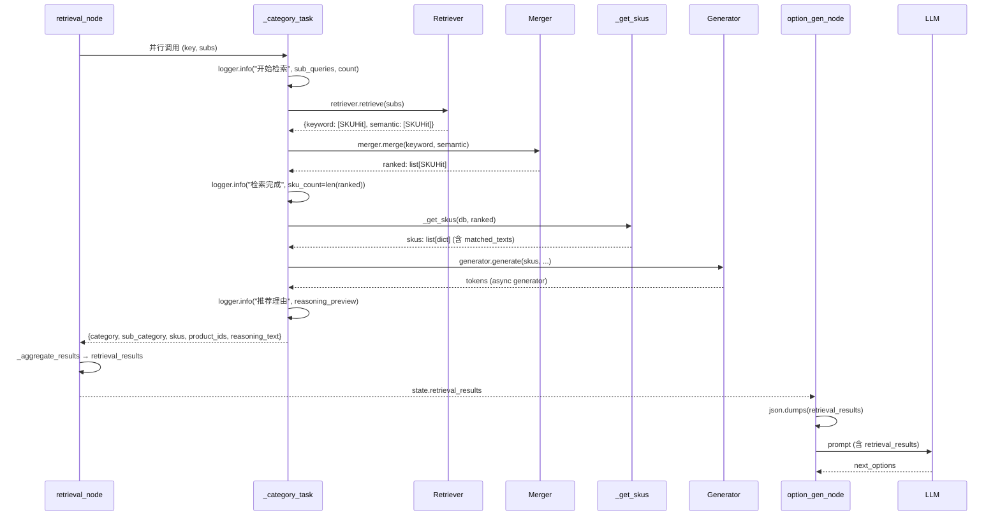

# CON_PLAN.md — Retrieval + Option Gen 节点编码级详细设计

> 基于 [PLAN.md](PLAN.md)，编码级详细设计，足够支撑实现。

---

## 1. 模块详细设计

### 1.1 `state.py` — AgentState 字段重命名

**实现思路：**
将 `products_summary: list[dict]` 重命名为 `retrieval_results: list[dict]`，更新 docstring。

**变更点（2 处）：**

| 行号 | 当前 | 改为 |
|------|------|------|
| 22 | `products_summary: 各品类检索结果的轻量摘要聚合。` | `retrieval_results: 各品类检索结果（完整 SKU 含 matched_texts）。` |
| 35 | `products_summary: list[dict]` | `retrieval_results: list[dict]` |

**难度：** 无。纯文本替换。

---

### 1.2 `retrieval.py` — 日志增强 + 输出字段变更

#### 1.2.1 `_category_task` 变更

**实现思路：**
1. 在检索前、检索后、生成后三处新增 `logger.info` 日志
2. 移除 `products_summary` 字段（原 `summary` 列表构建代码）
3. 新增 `skus` 字段，将 `_get_skus()` 返回值原样放入返回值

**具体变更行：**

**(a) 新增 3 行日志（插入到 `_category_task` 函数体内）：**

```
行 139 后（retriever.retrieve 调用前）插入：
    logger.info(f"品类 [{category}/{sub_category}] 开始检索",
                sub_queries=[s.text for s in subs], count=len(subs))

行 152 后（ranked 赋值后，if not ranked 判断前）插入：
    logger.info(f"品类 [{category}/{sub_category}] 检索完成",
                sku_count=len(ranked))

行 210 后（reasoning_text 赋值后，return 前）插入：
    logger.info(f"品类 [{category}/{sub_category}] 推荐理由",
                reasoning_preview=reasoning_text[:200])
```

**(b) 移除 `summary` 构建代码（行 175-180）：**

```python
# 删除这 6 行：
            # 6. 提取 products_summary
            summary = [
                {"product_id": s["product_id"], "sku_id": s["sku_id"],
                 "title": s["title"], "price": s["price"],
                 "category": category, "sub_category": sub_category}
                for s in skus
            ]
```

**(c) 修改返回字典（行 205-212）：**

```python
# 当前：
            return {
                "category": category,
                "sub_category": sub_category,
                "products_summary": summary,      # ← 删除
                "product_ids": product_ids,
                "reasoning_text": "".join(tokens),
                "error": None,
            }

# 改为：
            return {
                "category": category,
                "sub_category": sub_category,
                "skus": skus,                     # ← 新增：完整 SKU + matched_texts
                "product_ids": product_ids,
                "reasoning_text": "".join(tokens),
                "error": None,
            }
```

**(d) 异常分支空返回也需同步修改（行 155-162、214-223）：**

```python
# 空结果分支（行 155-162），删除 products_summary，新增 skus:
            if not ranked:
                return {
                    "category": category,
                    "sub_category": sub_category,
                    "skus": [],                   # ← 替换 products_summary: []
                    "product_ids": [],
                    "reasoning_text": "",
                    "error": None,
                }

# 异常分支（行 214-223），同理：
        return {
            "category": category,
            "sub_category": sub_category,
            "skus": [],                           # ← 替换 products_summary: []
            "product_ids": [],
            "reasoning_text": "",
            "error": str(e),
        }
```

**函数 docstring 更新（行 117）：**

```python
# 当前：
    """单个品类的检索任务（在独立 session 中执行）。

    返回结构化结果: {category, sub_category, products_summary, product_ids, reasoning_text, error}
    """

# 改为：
    """单个品类的检索任务（在独立 session 中执行）。

    返回结构化结果: {category, sub_category, skus, product_ids, reasoning_text, error}
    """
```

#### 1.2.2 `_aggregate_results` 适配

**实现思路：**
将 `r.get("products_summary", [])` 改为 `r.get("skus", [])`。

**具体变更：**

```python
# 行 63，当前：
            products_summary.extend(r.get("products_summary", []))

# 改为：
            products_summary.extend(r.get("skus", []))
```

同时更新函数内部变量名和 docstring：

```python
# 行 43-64，完整改写：
def _aggregate_results(results: list[dict]) -> tuple[list[dict], list[dict]]:
    """串行聚合各品类任务的返回结果。

    参数:
        results: 品类任务返回的结构化结果列表，每项格式:
            {category, sub_category, skus, error}

    返回值:
        (retrieval_results, failed_categories)
    """
    retrieval_results = []
    failed_categories = []
    for r in results:
        if r["error"]:
            failed_categories.append({
                "category": r["category"],
                "sub_category": r["sub_category"],
                "error": r["error"],
            })
        else:
            retrieval_results.extend(r.get("skus", []))
    return retrieval_results, failed_categories
```

#### 1.2.3 `retrieval_node` 返回值变更

**实现思路：**
返回值中的 `products_summary` 改名为 `retrieval_results`。

**具体变更（行 308-311）：**

```python
# 行 250：空结果分支
        return {"products_summary": [], "failed_categories": []}
# 改为：
        return {"retrieval_results": [], "failed_categories": []}

# 行 308-311：
    return {
        "products_summary": products_summary,
        "failed_categories": [f["sub_category"] for f in failed_categories],
    }
# 改为：
    return {
        "retrieval_results": retrieval_results,
        "failed_categories": [f["sub_category"] for f in failed_categories],
    }
```

**safe_results 构建中的 `products_summary: []` 也要改为 `skus: []`（行 278）：**

```python
# 行 278：
            safe_results.append({
                "category": "", "sub_category": key,
                "products_summary": [], "product_ids": [],
                ...
            })
# 改为：
            safe_results.append({
                "category": "", "sub_category": key,
                "skus": [], "product_ids": [],
                ...
            })
```

#### 1.2.4 总结：retrieval.py 所有变更位置

| 行范围 | 变更类型 | 说明 |
|--------|----------|------|
| 9 | 注释更新 | 步骤 5 描述：`products_summary` → `retrieval_results` |
| 43-64 | 重命名 | `_aggregate_results` 内部变量名 + keys |
| 117 | docstring | 返回值说明去掉 `products_summary`，加 `skus` |
| 140-142 | 新增 | 检索前 logger.info |
| 153-155 | 新增 | 检索后 logger.info |
| 155-162 | 修改 | 空结果返回 `skus: []` 替换 `products_summary: []` |
| 175-180 | 删除 | 移除 summary 构建代码 |
| 205-212 | 修改 | 返回字典 `products_summary` → `skus` |
| 211-213 | 新增 | 推荐理由 logger.info |
| 214-223 | 修改 | 异常返回 `products_summary: []` → `skus: []` |
| 250 | 修改 | 空 sub_queries 返回 `products_summary` → `retrieval_results` |
| 278 | 修改 | safe_results 异常项 `products_summary: []` → `skus: []` |
| 305-311 | 修改 | 返回 dict key 改名 |

---

### 1.3 `option_gen.py` — 输入适配

**实现思路：**
1. 读 `state.get("retrieval_results", [])` 替代 `state.get("products_summary", [])`
2. 格式化 `retrieval_results` 时将 matched_texts 纳入 prompt 上下文
3. 仍零 DB 访问（方案A）

**具体变更：**

**(a) 行 26：读取字段改名**

```python
# 当前：
    products_summary = json.dumps(state.get("products_summary", []), ensure_ascii=False)

# 改为：
    retrieval_results = json.dumps(state.get("retrieval_results", []), ensure_ascii=False)
```

**(b) 行 35：prompt 占位符改名**

```python
# 当前：
        .replace("{products_summary}", products_summary)

# 改为：
        .replace("{retrieval_results}", retrieval_results)
```

**(c) 行 4：docstring 更新**

```python
# 当前：
    从 AgentState 读取 products_summary，纯 LLM 调用生成 2-4 条下一步推荐选项。

# 改为：
    从 AgentState 读取 retrieval_results（含商品基础信息 + matched_texts），
    纯 LLM 调用生成 2-4 条下一步推荐选项。
```

**完整变更后文件（option_gen.py）：**
只有 3 处文字替换，无逻辑变更。

---

### 1.4 `option_gen_prompt.py` — Prompt 模板更新

**实现思路：**
1. 占位符 `{products_summary}` → `{retrieval_results}`
2. 新增对 matched_texts 的利用指导（FAQ/评价）

**具体变更：**

```python
# 行 3，整体替换 OPTION_GEN_SYSTEM 字符串：

OPTION_GEN_SYSTEM = """你是一个电商导购推荐选项生成器。基于用户当前需求和已推荐的全部商品，推测用户下一步可能的需求。

## 任务
分析用户的当前需求和已推荐的全部商品（可能跨多个品类），生成 2-4 个下一步推荐选项。

## 选项生成策略
1. **互补品推荐**：当前商品需要搭配使用的产品
2. **替代品探索**：同品类但不同定位的选项
3. **属性细化**：帮助用户进一步缩小范围
4. **预算调整**：基于价格区间提供放宽或收紧建议

## 规则
1. 选项必须基于数据库中可能存在的商品品类，不得虚构不存在的品类
2. 选项文案自然友好，使用问句或建议语气
3. 不要重复用户已经表达过的需求
4. 选项不要超过 4 条，优先级从高到低排列
5. 如果涉及多个品类，选项可以灵活针对不同品类的商品
6. 如果某品类检索失败，避免生成该品类的相关选项
7. **优先参考商品对应的 FAQ/用户评价（matched_texts）**：FAQ 和评价中提到的搭配产品、使用场景、替代选择可作为生成选项的直接依据

## 输出格式
只返回 JSON：
{"next_options": ["选项1", "选项2", "选项3"]}

## 当前用户需求
{requirements}

## 原始场景描述（如有）
{scenario_description}

## 已推荐商品信息（含商品基础信息 + 检索到的 FAQ/评价）
{retrieval_results}

## 检索失败的品类（避免生成这些品类的选项）
{failed_categories}

## 对话历史
{conversation_history}"""
```

**变更明细：**

| 位置 | 变更 |
|------|------|
| 规则第 6 条后 | 新增第 7 条：优先参考 matched_texts |
| 占用符行 | `{products_summary}` → `{retrieval_results}` |
| 占位符前导语 | `已推荐商品摘要` → `已推荐商品信息（含商品基础信息 + 检索到的 FAQ/评价）` |

---

### 1.5 `graph.py` — 无需变更

`_preview` 函数通过 `state_or_result.items()` 遍历，自动适配新字段名。`_retrieval` 和 `_option_gen` 包装器的日志输出自动跟随。

**验证点：** `_SKIP_LOG_FIELDS = {"_sse_queue"}` 无需修改，`retrieval_results` 为可序列化 list[dict]。

---

## 2. 核心功能接口详细设计

### 2.1 检索数据流通路（完整链路）



### 2.2 关键接口签名（变更后）

```python
# _category_task 返回值
{
    "category": str,
    "sub_category": str,
    "skus": list[dict],          # _get_skus() 完整返回，含 matched_texts
    "product_ids": list[dict],   # [{product_id, sku_id, category, sub_category}]
    "reasoning_text": str,       # Generator 完整输出
    "error": str | None,
}

# _aggregate_results
def _aggregate_results(results: list[dict]) -> tuple[list[dict], list[dict]]:
    """返回 (retrieval_results, failed_categories)"""

# retrieval_node 返回值
{
    "retrieval_results": list[dict],  # 扁平 SKU 列表，含 matched_texts
    "failed_categories": list[str],   # 失败品类 sub_category 名
}
```

---

## 3. 关键数据实体

### 3.1 `retrieval_results` 数据形态（= `skus` 列表）

每个元素即 `_get_skus()` 返回的扁平 SKU 字典：

```python
{
    # ---- Product 字段 ----
    "product_id": str,        # "p001"
    "title": str,             # "安热沙小金瓶防晒霜"
    "brand": str | None,      # "安热沙"
    "category": str,          # "面部护肤"
    "sub_category": str,      # "防晒霜"
    "base_price": float,      # 198.0

    # ---- SKU 字段 ----
    "sku_id": str,            # "sk001"
    "properties": dict | None, # {"容量": "60ml", "防晒指数": "SPF50+"}
    "price": float,           # 198.0
    "stock": int,             # 100

    # ---- matched_texts（= SPEC 所指的 product_review） ----
    "matched_texts": [
        {
            "content": "这款防晒霜适合油性皮肤...",
            "source": "faq",                        # "faq" | "user_review" | "marketing"
            "metadata": {"question": "适合什么肤质？", "answer": "..."}
        },
        ...
    ]
}
```

### 3.2 数据量估算

- 每个品类 ≤10 个 SKU（`final_sku_limit`）
- 每个 SKU ≤3 条 matched_texts（`_truncate_texts` 截断）
- 每个 matched_text content 最多 ~200 char
- 总 token 估量：10 SKU × (200 商品字段 + 3 × 200 matched_texts) ≈ 8000 char ≈ 2000 token/品类
- 即使 5 个品类并发：~10000 token，在 LLM 上下文窗口内

---

## 4. 期望项目目录结构树

```
server/
├── app/
│   ├── agent/
│   │   ├── state.py              # AgentState TypedDict: products_summary → retrieval_results
│   │   ├── graph.py              # 无需变更（_preview 自动适配）
│   │   ├── nodes/
│   │   │   ├── retrieval.py      # 日志增强 + _category_task 输出变更 + _aggregate_results 适配
│   │   │   ├── option_gen.py     # 输入字段改名: products_summary → retrieval_results
│   │   │   ├── extraction.py     # 不变
│   │   │   ├── scenario_gen.py   # 不变
│   │   │   ├── router.py         # 不变
│   │   │   └── chitchat.py       # 不变
│   │   └── prompts/
│   │       ├── option_gen_prompt.py  # 模板更新: {products_summary} → {retrieval_results}
│   │       ├── relevance_filter_prompt.py  # 不变
│   │       └── ...               # 不变
│   ├── rag/
│   │   ├── generator.py          # 不变（不做任何修改）
│   │   ├── merger.py             # 不变
│   │   └── prompt.py             # 不变
│   ├── services/
│   │   ├── retriever.py          # 不变
│   │   └── sku_utils.py          # 不变
│   └── models/
│       └── product_review.py     # 不变
├── tests/
│   ├── test_retrieval_node.py    # 适配: products_summary → skus/retrieval_results
│   └── test_option_gen.py        # 适配: products_summary → retrieval_results
└── docs/
    └── AGENT_OPT/
        └── RETRIEVAL_NODE_OPT2/
            ├── SPEC.md           # 需求文档
            ├── DEFINE.md         # 需求分析
            ├── PLAN.md           # 架构方案
            └── CON_PLAN.md       # 本文档
```

---

## 5. 测试适配

### 5.1 `test_retrieval_node.py` 变更

| 测试函数 | 变更 |
|----------|------|
| `test_aggregate_results_success` | `products_summary` → `skus`，变量名 `summary` → `results` |
| `test_aggregate_results_with_failures` | 同上 |
| `test_aggregate_results_empty_input` | 无需改 |
| `test_retrieval_node_basic` | 断言 `"retrieval_results"` in result |
| `test_retrieval_node_inline_sse_sends_*` | safe_results 中的 `products_summary` → `skus` |

### 5.2 `test_option_gen.py` 变更

| 测试函数 | 变更 |
|----------|------|
| `test_option_gen_basic` | state 中 `products_summary` → `retrieval_results` |
| `test_option_gen_fallback_on_error` | 同上 |
| `test_option_gen_truncates_too_many` | 同上 |
| `test_option_gen_injects_failed_categories_into_prompt` | state key 改名 + prompt 断言适配 |
| `test_option_gen_omits_failed_categories_when_empty` | state key 改名 |
| `test_option_gen_empty_failed_categories` | state key 改名 |

---

## 6. 风险点和待优化项

### 6.1 风险点

| ID | 风险 | 缓解措施 |
|----|------|----------|
| R1 | `retrieval_results` 含 matched_texts 后 prompt token 增加，可能超 LLM 上下文限制 | matched_texts 已被 `_truncate_texts` 截断（≤3 条/SKU），prompt 模板可进一步控制；如实际超限，后续可在 option_gen 中对 retrieval_results 做 top-N 截断 |
| R2 | 字段改名遗漏：其他文件引用 `products_summary` | 全量 grep 搜索 `products_summary` 确保无遗漏 |
| R3 | 测试中 hardcode 的数据结构变更后 assert 失败 | 已识别出所有受影响的测试函数（5.1-5.2），逐一适配 |

### 6.2 待优化项（范围内不做）

- `matched_texts` 在 option_gen prompt 中的截断策略，当前依赖 `_truncate_texts` 预截断，未在 prompt 层二次保护
- Generator 的 reasoning_text 已是流式 buffer，但其 token 级 SSE 拆分不在本优化范围

---

> **状态**: 待确认。无 `[NEEDS CLARIFICATION]` 项。
