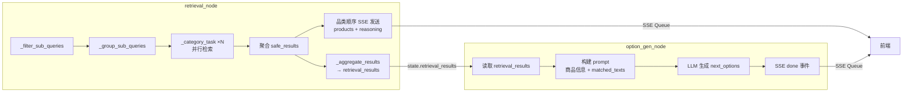

# PLAN.md — Retrieval + Option Gen 节点设计完善实现方案

> 基于 [DEFINE.md](DEFINE.md)，架构方案级设计，不包含代码。

---

## 1. 整体实现架构



> 关键变化：`state.products_summary` → `state.retrieval_results`，数据从轻量摘要变为完整 SKU + matched_texts。

---

## 2. 模块变更清单

### 2.1 `state.py` — AgentState 字段重命名

| 项 | 说明 |
|---|---|
| 变更类型 | 重命名 |
| `products_summary: list[dict]` | → `retrieval_results: list[dict]` |
| 注释更新 | 说明包含完整 SKU + matched_texts |
| 影响 | 所有引用 `state["products_summary"]` 的代码 |

### 2.2 `retrieval.py` — 日志增强 + 输出字段变更

**`_category_task` (3 处日志 + 1 处返回值)**

| 位置 | 变更 |
|---|---|
| 检索前 | `logger.info(f"品类 [{category}/{sub_category}] 开始检索", sub_queries=[s.text for s in subs], count=len(subs))` |
| 检索后 | `logger.info(f"品类 [{category}/{sub_category}] 检索完成", sku_count=len(ranked))` |
| 生成后 | `logger.info(f"品类 [{category}/{sub_category}] 推荐理由", reasoning_preview=reasoning_text[:200])` |
| 返回值 | `products_summary` → 移除，**新增 `skus` 字段**（完整列表，含 matched_texts） |

**返回值结构变更（`_category_task`）：**
```
{
    "category": str,
    "sub_category": str,
    "skus": list[dict],          # 新增：_get_skus() 完整返回
    "product_ids": list[dict],   # 不变
    "reasoning_text": str,       # 不变
    "error": str | None,         # 不变
}
```
> 移除 `products_summary` 字段。

**`retrieval_node` 返回值变更：**
```
{
    "retrieval_results": list[dict],  # 改名 + 数据充实
    "failed_categories": list[str],   # 不变
}
```

**`_aggregate_results` 适配：**
- 参数 `results[].products_summary` → `results[].skus`
- 聚合逻辑从收集 `products_summary` 列表改为收集 `skus` 列表

### 2.3 `option_gen.py` — 输入适配

| 项 | 变更 |
|---|---|
| 读取字段 | `state.get("products_summary", [])` → `state.get("retrieval_results", [])` |
| prompt 构建 | 格式化 `retrieval_results`（含商品信息 + matched_texts）注入 prompt |
| DB 访问 | 无（方案A） |

### 2.4 `option_gen_prompt.py` — Prompt 模板更新

| 项 | 变更 |
|---|---|
| 占位符 | `{products_summary}` → `{retrieval_results}` |
| 引导语 | 新增对 matched_texts（FAQ/评价）的利用指导 |
| token 控制 | 模板中建议 LLM 优先参考 FAQ 中提到的搭配产品、场景 |

### 2.5 `graph.py` — 日志适配（最小变更）

- `_preview` 函数无需改动（自动适配新字段名）
- `logger.debug` 中 `retrieval 输出` 的行会自动包含 `retrieval_results`

---

## 3. 核心接口与功能需求对照

| 功能需求 | 实现模块 | 接口变化 |
|---|---|---|
| F1: 日志增强 | `retrieval.py:_category_task` | 新增 3 行 `logger.info` |
| F2: 输出变更 | `retrieval.py:_category_task` + `retrieval_node` | `products_summary` → `skus`，聚合为 `retrieval_results` |
| F3: Option Gen 输入变更 | `option_gen.py` + `option_gen_prompt.py` | 读 `retrieval_results`，注入 matched_texts |
| F4: State 字段调整 | `state.py` | 字段重命名 |

---

## 4. 方案主要优点

1. **最小变更**：仅涉及 5 个文件的局部修改，无架构性重构
2. **无性能退化**：无新增 DB 查询，无新增网络调用，matched_texts 已在内存中
3. **质量提升**：option_gen 拿到 product_review（FAQ/评价），可生成更精准的选项（如基于 FAQ 中的搭配建议、使用场景）
4. **可观测性提升**：检索过程每个品类的输入/输出/理由可追溯
5. **兼容性**：SSE 事件结构不变，前端无需适配

---

## 5. 主要风险

| ID | 风险 | 概率 | 影响 |
|---|---|---|---|
| R1 | `retrieval_results` 数据量增大导致 prompt token 超限 | 低 | option_gen 返回空或截断 |
| R2 | 字段改名遗漏（`products_summary` 在其他文件引用） | 低 | 运行时 KeyError |
| R3 | option_gen prompt 变更导致选项质量下降 | 低 | 回归测试覆盖 |

---

## 6. 实现复杂度评估

| 维度 | 评估 |
|---|---|
| 代码量 | ~60 行变更（删除 ~20 行 + 新增 ~40 行） |
| 涉及文件 | 5 个源文件 + 测试文件 |
| 依赖变更 | 无新增依赖 |
| 难度 | **低** — 纯字段重命名 + 日志 + prompt 调整 |

---

## 7. 可测试性评估

| 测试类型 | 变更 |
|---|---|
| 单元测试 `test_retrieval_node.py` | `products_summary` → `skus` 字段适配，日志 mock 验证 |
| 单元测试 `test_option_gen.py` | 输入数据格式更新（如有） |
| 集成测试 | `/api/search` SSE 端到端：验证 products/reasoning/done 事件正常 |

---

## 8. 可交付性评估

所有变更集中在 retrieval → option_gen 数据通路，不涉及 API 层、数据库 schema、配置项。交付后只需运行测试套件 + 一次端到端 SSE 调用即可验证。

---

> **状态**: 已确认，无 `[NEEDS CLARIFICATION]` 项。可进入 CON_PLAN.md 阶段。
