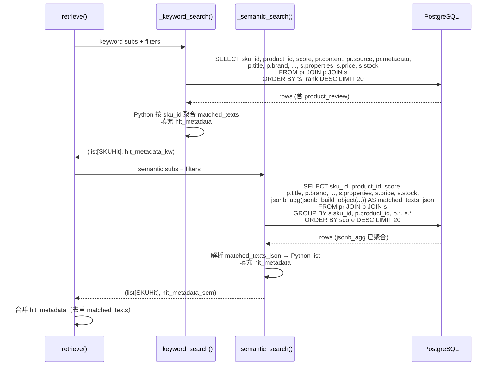
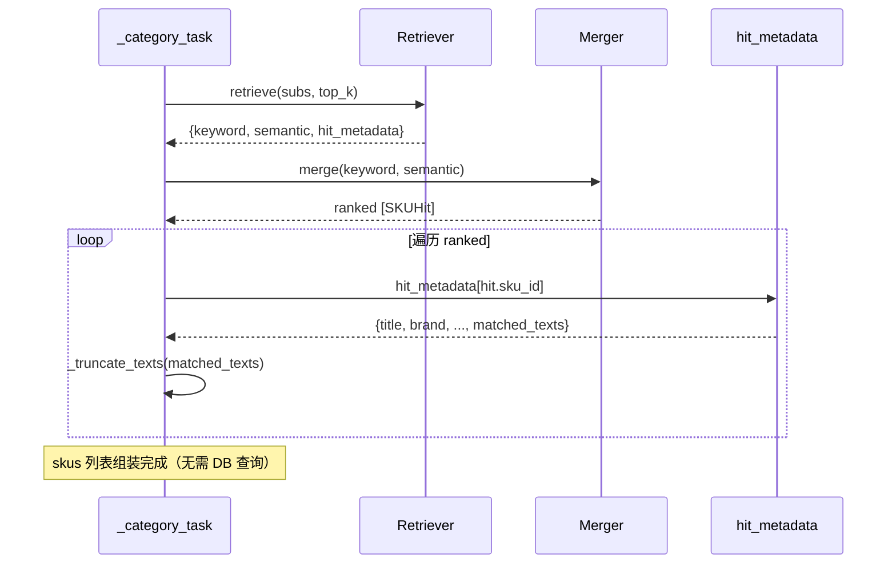
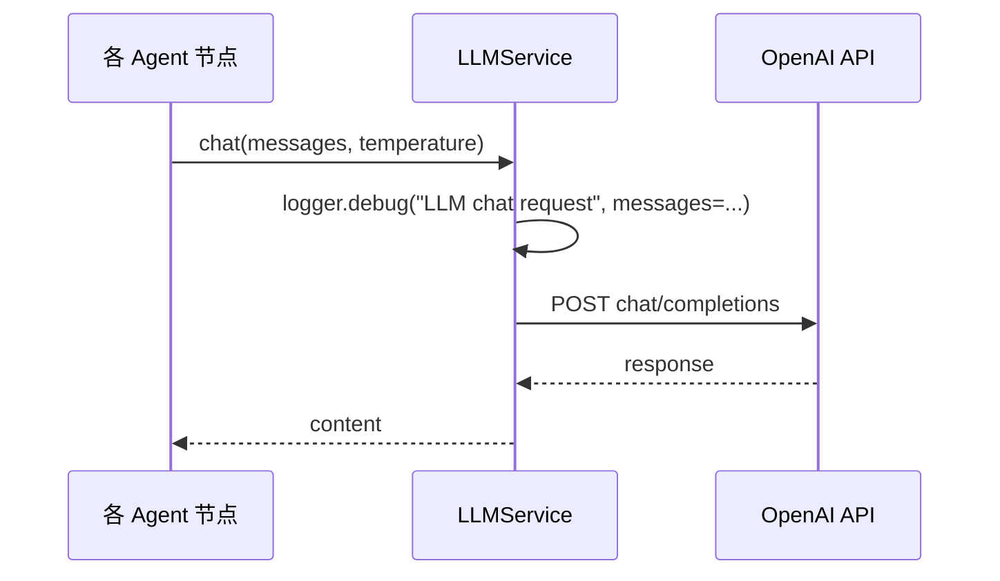

# SQL 查询 & 日志优化 — 编码级详细设计

> **输入：** [PLAN.md](PLAN.md)（已确认）
> **目标：** 每个模块输出完整实现链路，足够支撑编码

---

## 1. 期望目录结构

```
server/
├── app/
│   ├── services/
│   │   ├── retriever.py          # [修改] SQL 扩展 + 移除 @@ + hit_metadata
│   │   └── llm.py                # [修改] 添加 DEBUG 日志打印 messages
│   └── agent/
│       └── nodes/
│           └── retrieval.py      # [修改] 移除 _get_skus，从 hit_metadata 组装
```

共 3 个文件修改，0 个新建。

---

## 2. 模块详细设计

### 2.1 retriever.py — SQL 扩展 + 移除 `@@` + hit_metadata

#### 2.1.1 实现思路

1. `_build_base_query()` 新增 `extra_cols` 参数，允许调用方在 `s.sku_id, p.product_id, {score_expr}` 之后追加额外 SELECT 列
2. `_keyword_search()` 和 `_semantic_search()` 返回值从 `list[SKUHit]` 改为 `tuple[list[SKUHit], dict[str, dict]]`
3. `retrieve()` 合并两路 `hit_metadata`，去重 `matched_texts`
4. keyword 移除 `@@` 硬过滤，ILIKE 降级路径保留但同步扩展 SELECT

#### 2.1.2 实现链路时序



#### 2.1.3 详细变更点

**变更 1: `_build_base_query` 新增 `extra_cols` 参数**

- 文件: [retriever.py:193-218](server/app/services/retriever.py)
- 签名: `def _build_base_query(self, filters: Filters, score_expr: str, extra_cols: str = "") -> str:`
- `SELECT s.sku_id, p.product_id, {score_expr}{extra_cols}` — extra_cols 以逗号开头，调用方负责前导逗号
- 默认值 `""` 保持向后兼容

**变更 2: `_semantic_search` 返回 `tuple[list[SKUHit], dict]`**

- 文件: [retriever.py:289-344](server/app/services/retriever.py)
- 新增 `extra_cols`:
  ```text
  , p.title, p.brand, p.category, p.sub_category, p.base_price
  , s.properties, s.price, s.stock
  , jsonb_agg(jsonb_build_object(
        'content', pr.content,
        'source', pr.source,
        'metadata', pr.metadata
    )) AS matched_texts_json
  ```
- GROUP BY 新增所有非聚合列: `p.title, p.brand, p.category, p.sub_category, p.base_price, s.properties, s.price, s.stock`
- 遍历 `rows` → `SKUHit` + 填充 `hit_metadata`（解析 `matched_texts_json` 为 Python list）
- `jsonb_agg` 在 PostgreSQL 中聚合所有 product_review 行；asyncpg 自动将 JSONB 反序列化为 Python list[dict]
- 返回 `(hits, hit_metadata)`

**变更 3: `_keyword_search` 返回 `tuple[list[SKUHit], dict]`**

- 文件: [retriever.py:346-436](server/app/services/retriever.py)
- 移除 `WHERE pr.content_tsv @@ plainto_tsquery(...)` 硬过滤（保留 `ts_rank` 在 SELECT 中的评分表达式）
- 新增 `extra_cols`:
  ```text
  , pr.content, pr.source, pr.metadata
  , p.title, p.brand, p.category, p.sub_category, p.base_price
  , s.properties, s.price, s.stock
  ```
- `all_rows` 列表中每条记录存储 product_review 内容 + product 信息 + SKU 信息（共 14 字段）
- 在去重循环中：
  - `deduped[sku_id]` 保留最高分 `SKUHit`
  - 同步构建/更新 `hit_metadata[sku_id]` → 合并 `matched_texts`（按 content 去重追加）
- ILIKE 降级分支同样扩展 SELECT（复用 `extra_cols`），格式与 tsvector 路径一致
- tsvector 的 `@@` 移除后，ILIKE 几乎不被触发（仅在 `ProgrammingError` 时），但保留代码
- 返回 `(ranked_list, hit_metadata)`

**变更 4: `retrieve` 返回值扩展**

- 文件: [retriever.py:248-287](server/app/services/retriever.py)
- 新增 `_merge_metadata()` 辅助函数:
  - 合并两个 `hit_metadata` dict
  - 同 SKU 的 `matched_texts` 按 `content` 字段去重
- `asyncio.gather` 解构: `(kw_results, kw_meta), (sem_results, sem_meta) = await asyncio.gather(kw_task, sem_task)`
- 返回值新增 key: `"hit_metadata": merged_metadata`

#### 2.1.4 难点/风险点

| 难点 | 解决方案 |
|------|----------|
| semantic 的 GROUP BY 需包含所有非聚合列（p.title 等 8 列） | 显式列出；PostgreSQL 对主键功能依赖列可省略，但显式更安全 |
| `jsonb_agg` 聚合大量 product_review 时 JSON 体积膨胀 | 先全量聚合，Python 层 `_truncate_texts` 截断；未来可加 SQL 层子查询 LIMIT |
| keyword 移除 `@@` 后 tsvector 始终返回行（即使得分为 0），ILIKE 降级不再触发 | 保留 ILIKE 代码作为 `ProgrammingError` 兜底，不主动删除 |
| keyword 和 semantic 的 hit_metadata 可能包含相同 SKU | `_merge_metadata` 合并 matched_texts 并去重 |

---

### 2.2 retrieval.py — 移除 `_get_skus`，从 `hit_metadata` 组装

#### 2.2.1 实现思路

`_category_task` 中，原「检索 → RRF → `_get_skus(DB)`」三步改为「检索 → RRF → 从 `hit_metadata` 组装」。

#### 2.2.2 实现链路时序



#### 2.2.3 详细变更点

**变更 1: 导入调整**

- 文件: [retrieval.py:17](server/app/agent/nodes/retrieval.py)
- 删除: `from app.services.sku_utils import _get_skus`
- 保留/新增: `from app.services.sku_utils import _truncate_texts`（组装时仍需截断 matched_texts）

**变更 2: `_category_task` 替换 `_get_skus` 调用**

- 文件: [retrieval.py:183-191](server/app/agent/nodes/retrieval.py)
- 删除 L183-184:
  ```python
  # 4. 获取 SKU 详情
  skus = await _get_skus(db, ranked)
  ```
- 替换为:
  ```python
  # 4. 从 hit_metadata 组装 SKU 数据（不再查询 DB）
  hit_metadata = retrieve_result.get("hit_metadata", {})
  skus = []
  for hit in ranked:
      data = hit_metadata.get(hit.sku_id)
      if data is None:
          continue  # 极端情况：SKUHit 对应的 metadata 缺失，跳过
      raw_texts = data.get("matched_texts", [])
      data["matched_texts"] = _truncate_texts(
          raw_texts,
          settings.search.max_match_texts_per_sku,
          settings.search.max_match_chars_per_sku,
      )
      skus.append(data)
  ```
- `product_ids` 构建逻辑（L187-192）不变，仍从 `skus` 列表提取

#### 2.2.4 难点/风险点

| 难点 | 解决方案 |
|------|----------|
| `hit_metadata` 中某 SKU 缺失（semantic 和 keyword 都未返回该 SKU 的 metadata） | 遍历 ranked 时 `if data is None: continue`，该 SKU 不出现在最终结果中 |
| `_truncate_texts` 仍需导入 | 从 `sku_utils` 导入（不导入 `_get_skus`） |
| product_ids 构建依赖 skus 列表 | skus 组装逻辑前置到 product_ids 构建之前，保持数据流顺序不变 |

---

### 2.3 llm.py — 添加提示词日志

#### 2.3.1 实现思路

在 `chat()` 和 `chat_stream()` 方法中，调用 API 前以 DEBUG 级别打印完整的 `messages` 列表（已填充占位符的实际内容）。超长 content 截断防止日志爆炸。

#### 2.3.2 实现链路时序



#### 2.3.3 详细变更点

**变更 1: 新增 structlog 导入**

- 文件: [llm.py:13](server/app/services/llm.py)
- 新增: `import structlog`
- 新增: `logger = structlog.get_logger("services.llm")`

**变更 2: 新增 `_truncate_messages` 辅助函数**

- 文件: [llm.py](server/app/services/llm.py)（模块级函数）
- 签名: `def _truncate_messages(messages: list[dict], max_len: int = 2000) -> list[dict]:`
- 逻辑: 遍历 messages，对每个 content 字段（str 类型）若超过 `max_len` 则截断 + 标记 `...<truncated>`
- 返回浅拷贝后的 messages 列表（不修改原始对象）

**变更 3: `chat()` 添加日志**

- 文件: [llm.py:43-61](server/app/services/llm.py)
- 在 `self._client.chat.completions.create(...)` 调用前:
  ```python
  logger.debug("LLM chat request",
      model=self.model,
      temperature=temperature if temperature is not None else self.temperature,
      messages=_truncate_messages(messages),
  )
  ```

**变更 4: `chat_stream()` 添加日志**

- 文件: [llm.py:63-91](server/app/services/llm.py)
- 在 `self._client.chat.completions.create(...)` 调用前:
  ```python
  logger.debug("LLM chat stream request",
      model=self.model,
      temperature=temperature if temperature is not None else self.temperature,
      messages=_truncate_messages(messages),
  )
  ```

#### 2.3.4 难点/风险点

| 难点 | 解决方案 |
|------|----------|
| Generator prompt 可能 5000+ 字符（含完整商品上下文） | `_truncate_messages` 默认截断到 2000 字符 |
| `messages` 中的 `content` 可能是 list（多模态格式）而非 str | `_truncate_messages` 仅处理 str 类型 content，非 str 保持不变 |
| DEBUG 日志在生产环境关闭，但仍有序列化开销 | `structlog` 的 lazy evaluation 避免不必要的字符串拼接 |

---

## 3. 关键数据实体

### 3.1 SKUHit（不变）

```python
@dataclass
class SKUHit:
    sku_id: str
    product_id: str
    score: float
```

### 3.2 hit_metadata（新增，作为检索内部数据结构）

```python
# dict[str, dict]
# key = sku_id
# value:
{
    "product_id": str,
    "title": str,
    "brand": str | None,
    "category": str | None,
    "sub_category": str | None,
    "base_price": float | None,
    "sku_id": str,
    "properties": dict | None,      # JSONB → Python dict
    "price": float,
    "stock": int,
    "matched_texts": [
        {
            "content": str,
            "source": str,           # "marketing" | "faq" | "user_review"
            "metadata": dict | None, # JSONB → Python dict | None
        },
        ...
    ],
}
```

### 3.3 retrieve() 返回值（变更）

```python
{
    "keyword": list[SKUHit],       # 不变
    "semantic": list[SKUHit],      # 不变
    "hit_metadata": dict[str, dict],  # 新增
}
```

### 3.4 存储/检索方案

- **hit_metadata 不持久化**：仅在单次请求的检索→组装阶段存在，不写入 AgentState
- **matched_texts 持久化**：通过 `retrieval_results` 字段存入 AgentState，序列化方式不变
- **数据流向**：`retrieve() → hit_metadata → _category_task 组装 → retrieval_results → AgentState → Option Gen / Generator`

---

## 4. 数据流完整对比

### 4.1 现状（改造前）

```
_keyword_search ──→ [SKUHit] ──┐
                                ├─→ Merger.rrf() ──→ [SKUHit ranked]
_semantic_search ──→ [SKUHit] ──┘                        │
                                              _get_skus(db, ranked)  ← 第2次DB查询
                                                    │
                                              [完整 SKU 数据 + matched_texts]
```

### 4.2 目标（改造后）

```
_keyword_search ──→ ([SKUHit], hit_metadata_kw) ──┐
                                                   ├─→ Merger.rrf() ──→ [SKUHit ranked]
_semantic_search ──→ ([SKUHit], hit_metadata_sem) ──┘                        │
                                                    合并 metadata            │
                                                         │                  │
                                                    hit_metadata ←──────────┘
                                                         │
                                                   遍历 ranked，从 metadata 取值
                                                         │
                                                   [完整 SKU 数据 + matched_texts]
                                                   （0 次额外 DB 查询）
```

---

## 5. 任务拆解

### Task 1: 修改 `retriever.py`

**文件:** [server/app/services/retriever.py](server/app/services/retriever.py)

- [ ] **Step 1: 修改 `_build_base_query` 签名**
  - 新增 `extra_cols: str = ""` 参数
  - SELECT 子句追加 `{extra_cols}`

- [ ] **Step 2: 修改 `_semantic_search`**
  - 构建 `extra_cols`（product 列 + SKU 列 + `jsonb_agg` 聚合）
  - 扩展 GROUP BY 包含所有非聚合列
  - 遍历结果构建 `hit_metadata`
  - 返回 `(hits, hit_metadata)`

- [ ] **Step 3: 修改 `_keyword_search`**
  - 移除 `@@` WHERE 子句
  - 构建 `extra_cols`（pr.content/source/metadata + product 列 + SKU 列）
  - `all_rows` 扩展为存储完整字段
  - 去重循环中填充 `hit_metadata`
  - ILIKE 降级路径同步扩展 SELECT
  - 返回 `(ranked_list, hit_metadata)`

- [ ] **Step 4: 修改 `retrieve`**
  - 新增 `_merge_metadata()` 辅助函数
  - 更新 `asyncio.gather` 解构
  - 返回值新增 `"hit_metadata"` key

- [ ] **Step 5: 验证可导入**
  - 命令: `cd server && python -c "from app.services.retriever import Retriever, SKUHit; print('OK')"`

- [ ] **Step 6: Commit**
  ```bash
  git add server/app/services/retriever.py
  git commit -m "feat(retriever): extend SQL to return product_review content, remove @@ hard filter"
  ```

### Task 2: 修改 `retrieval.py`

**文件:** [server/app/agent/nodes/retrieval.py](server/app/agent/nodes/retrieval.py)

- [ ] **Step 1: 修改导入**
  - `from app.services.sku_utils import _get_skus` → `from app.services.sku_utils import _truncate_texts`

- [ ] **Step 2: 替换 `_get_skus` 调用**
  - 删除 L183-184 `skus = await _get_skus(db, ranked)`
  - 新增从 `hit_metadata` 组装逻辑（含 `_truncate_texts` 调用）

- [ ] **Step 3: 验证可导入**
  - 命令: `cd server && python -c "from app.agent.nodes.retrieval import retrieval_node; print('OK')"`

- [ ] **Step 4: Commit**
  ```bash
  git add server/app/agent/nodes/retrieval.py
  git commit -m "feat(retrieval): replace _get_skus DB query with hit_metadata lookup"
  ```

### Task 3: 修改 `llm.py`

**文件:** [server/app/services/llm.py](server/app/services/llm.py)

- [ ] **Step 1: 添加 structlog 导入和 logger**
  - 新增 `import structlog`
  - 新增 `logger = structlog.get_logger("services.llm")`

- [ ] **Step 2: 添加 `_truncate_messages` 辅助函数**
  - 2000 字符截断，标记 `...<truncated>`

- [ ] **Step 3: 在 `chat()` 中添加 DEBUG 日志**
  - `logger.debug("LLM chat request", model=..., temperature=..., messages=...)`

- [ ] **Step 4: 在 `chat_stream()` 中添加 DEBUG 日志**
  - `logger.debug("LLM chat stream request", model=..., temperature=..., messages=...)`

- [ ] **Step 5: 验证可导入**
  - 命令: `cd server && python -c "from app.services.llm import LLMService; print('OK')"`

- [ ] **Step 6: Commit**
  ```bash
  git add server/app/services/llm.py
  git commit -m "feat(llm): log filled prompt messages at DEBUG level"
  ```

### Task 4: 回归测试

- [ ] **Step 1: 运行离线测试**
  ```bash
  cd server && python -m pytest tests/ -v \
    --ignore=tests/test_e2e.py \
    --ignore=tests/test_llm.py \
    --ignore=tests/test_embedding.py \
    --ignore=tests/test_sync.py \
    --ignore=tests/test_search.py \
    --ignore=tests/test_retriever.py \
    --ignore=tests/test_generator.py \
    --ignore=tests/test_products.py \
    --ignore=tests/test_category_lookup.py \
    --ignore=tests/test_query_parser.py \
    --ignore=tests/test_sku_utils.py \
    --ignore=tests/test_merger.py
  ```
  预期: 零回归

- [ ] **Step 2: 运行检索相关测试（如有网络）**
  ```bash
  cd server && python -m pytest tests/test_retriever.py tests/test_merger.py tests/test_sku_utils.py -v
  ```

- [ ] **Step 3: Commit（如有测试修改）**
  ```bash
  git add tests/
  git commit -m "test: update tests for SQL query and _get_skus changes"
  ```

---

## 6. 验证清单

| # | 验证项 | 命令/方法 | 预期结果 |
|---|--------|-----------|----------|
| 1 | retriever 可导入 | `python -c "from app.services.retriever import Retriever"` | OK |
| 2 | retrieval 可导入 | `python -c "from app.agent.nodes.retrieval import retrieval_node"` | OK |
| 3 | llm 可导入 | `python -c "from app.services.llm import LLMService"` | OK |
| 4 | 检索测试 | `pytest tests/test_retriever.py -v` | PASS |
| 5 | 合并测试 | `pytest tests/test_merger.py -v` | PASS |
| 6 | SKU工具测试 | `pytest tests/test_sku_utils.py -v` | PASS |
| 7 | 回归测试（离线） | `pytest -v --ignore=...` 见 Task 4 | 0 失败 |
| 8 | 日志验证 | 启动 server 发送请求，检查 `server/log/` 文件 | DEBUG 日志含 messages 内容 |
| 9 | `_get_skus` 仍可被 API 层使用 | `python -c "from app.services.sku_utils import _get_skus; print('OK')"` | OK（函数未被删除） |

---

## 7. 风险点和待优化项

| 类别 | 描述 | 应对 |
|------|------|------|
| **风险** | `jsonb_agg` 对超多 product_review 的产品可能产生数 MB JSON | 当前阶段数据量可控；`_truncate_texts` 在 Python 层截断；后续可在 SQL 层加子查询 LIMIT |
| **风险** | keyword 移除 `@@` 后退化为全表扫描 + `ts_rank` 排序 | 当前数据量 <10 万行，全表扫描可接受；GIN 索引保留供后续 `@@` + `ORDER BY` 的 Index Scan 优化 |
| **待优化** | `jsonb_agg` 聚合可能重复 product_review 行（每个 SKU 的 product_id 相同） | 对于同一 product 下多个 SKU 的情况，matched_texts 会被重复聚合到每个 SKU。可后续加 product_id 去重缓存 |
| **待优化** | `retrieve()` 中合并 keyword 和 semantic 的 hit_metadata 时，matched_texts 去重方式简单（按 content 字符串比较） | 当前够用；后续可用 content hash 提高去重效率 |
