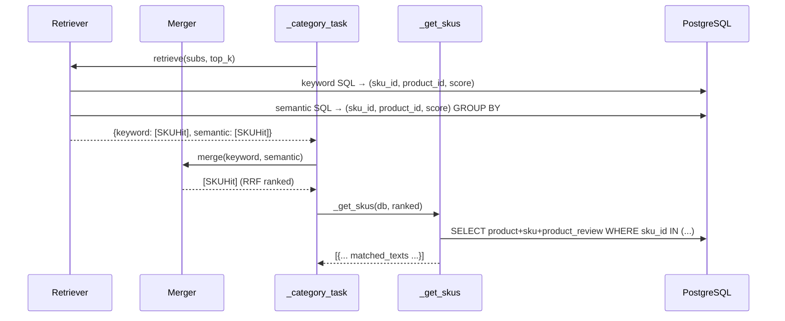
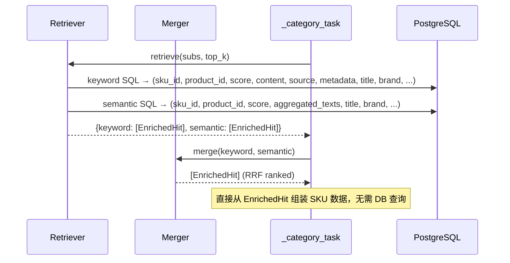

# SQL 查询 & 日志优化 — 需求分析

> **输入：** [SPEC.md](SPEC.md)
> **目标：** 明确功能需求、性能需求、交付物、约束边界和风险点

---

## 1. 功能需求

### FR1: SQL 检索查询需返回 product_review 原始内容

当前 `retriever.py` 中 keyword 和 semantic 检索的 SQL 查询仅返回 `(sku_id, product_id, score)` 三列。需要扩展 SELECT 子句，同时返回 `product_review` 表的关键字段（`pr.content`、`pr.source`、`pr.metadata`），以及 product/SKU 的基础字段（`p.title`、`p.brand`、`p.category`、`p.sub_category`、`p.base_price`、`s.properties`、`s.price`、`s.stock`），使单次 SQL 查询即可获取后续 `matched_texts` 和推荐理由生成所需的全部数据。

**关联代码：** [retriever.py:289-436](server/app/services/retriever.py) 的 `_semantic_search` 和 `_keyword_search`。

### FR2: 移除 RRF 融合后的冗余 DB 查询 (`_get_skus`)

当前 [retrieval.py:184](server/app/agent/nodes/retrieval.py) 在 RRF 融合之后，通过 `_get_skus(db, ranked)` 再次查询 DB 获取 SKU 详情和 product_review 文本。FR1 完成后，SQL 检索已携带完整数据，`_get_skus` 成为冗余调用，应从 `_category_task` 中移除，改为从检索原始结果中直接组装 SKU 数据。

**关联代码：**
- [retrieval.py:184](server/app/agent/nodes/retrieval.py) — `skus = await _get_skus(db, ranked)`
- [sku_utils.py:69-154](server/app/services/sku_utils.py) — `_get_skus` 函数定义

### FR3: LLM 调用时打印已填充占位符的实际提示词

当前所有节点在调用 LLM 时，构建了填充好占位符的 `messages` 列表，但未将其写入日志。需要在 LLM 服务层或各节点 `llm.chat()` / `llm.chat_stream()` 调用前后，以 DEBUG 或 INFO 级别打印完整的 `messages` 内容（含已替换的占位符）。

**涉及节点：** router、extraction、scenario_gen、retrieval（`_filter_sub_queries` + Generator）、option_gen、chitchat。

### FR4: 移除 keyword 检索中的 `@@` 硬过滤条件

当前 keyword 检索 [retriever.py:377](server/app/services/retriever.py) 在 WHERE 子句中使用 `pr.content_tsv @@ plainto_tsquery(...)` 强制要求 product_review 必须包含 LLM 生成的关键词。由于 LLM 关键词与评论文本用词可能存在差异（如 LLM 给出"防晒霜"但评论用"防晒"、"UV防护"等），硬匹配会导致结果为空。

需移除 `@@` 过滤条件，仅保留 `ts_rank` 得分表达式。`ts_rank` 对不匹配行返回 0 分，ORDER BY + LIMIT 仍能保证排序质量，同时避免空结果。

**关联代码：** [retriever.py:371-395](server/app/services/retriever.py) `_keyword_search` 的 tsvector 分支。

---

## 2. 性能需求

| ID | 需求 | 度量 |
|----|------|------|
| PR1 | 移除 `_get_skus` 后，不再有 RRF 后的额外 DB 往返，检索阶段 DB 查询次数减少 1 次/品类 | 延迟降低 |
| PR2 | 移除 `@@` 后 keyword 检索不再依赖 GIN 索引过滤，但仍需确保 ORDER BY ts_rank + LIMIT 在数据量<10万行时有可接受的性能 | 单次 keyword 查询 < 200ms |
| PR3 | 提示词日志打印不影响 LLM 调用性能（日志为异步或同步但非阻塞） | 日志开销 < 5ms |

---

## 3. 最终交付物

1. **修改 `retriever.py`：** `_semantic_search` / `_keyword_search` 的 SQL SELECT 扩展 + keyword 移除 `@@` 硬过滤
2. **修改 `retrieval.py`：** `_category_task` 移除 `_get_skus` 调用，改为从检索结果直接组装 SKU 数据
3. **修改 `merger.py` 或 SKUHit：** 扩展数据结构以携带 product_review 原始内容（或增加独立聚合函数）
4. **修改 `llm.py` 或各节点：** 添加提示词日志打印
5. **测试验证：** 回归测试 0 失败

---

## 4. 硬约束

1. **不修改 `AgentState` 字段定义：** `retrieval_results` 的数据结构（含 `matched_texts`）保持不变
2. **不修改 Generator 和 Option Gen 的输入契约：** 它们仍接收相同格式的 SKU 列表
3. **不新增 Python 依赖：** 所有变更使用现有的 sqlalchemy / structlog / json
4. **不修改 `_truncate_texts` 逻辑：** matched_texts 截断/排序规则不变
5. **数据库 schema 不变：** 不新增/删除表或列，不新增索引
6. **三表 JOIN 结构不变：** `product_review → product → sku` 关联路径维持现状

---

## 5. 隐含要求

1. **FR1 改造后，`matched_texts` 的来源从 `_get_skus` 的 LEFT JOIN 聚合变为 SQL 检索的 INNER JOIN 结果** — 需确保 matched_texts 字段格式（`{content, source, metadata}`）完全一致
2. **semantic 检索使用 `GROUP BY` + `SUM` 聚合，需处理 `pr.content` 等多值字段的聚合方式** — 使用 `array_agg` 或保留逐行返回 + Python 层聚合
3. **FR4 移除 `@@` 后，ILIKE 降级路径也应重新评估** — 当前 ILIKE 是 tsvector 失败后的降级，移除 `@@` 后 tsvector 不会"失败"（只是可能得 0 分），ILIKE 路径可能不再触发
4. **FR3 日志打印需截断超长 prompt** — 避免日志文件暴增（当前 Generator prompt 含完整商品上下文，可能数千 token）

---

## 6. 任务完成边界

**范围内：**
- `retriever.py` SQL 扩展 + 移除 `@@`
- `retrieval.py` 移除 `_get_skus`、从检索结果组装数据
- `merger.py` / `SKUHit` 扩展以携带 product_review 数据
- `llm.py` 或各节点添加 prompt 日志
- 回归测试验证

**范围外：**
- 不重构 `_get_skus` 函数本身（API 层 `search.py` 可能仍依赖它）
- 不修改 Generator / Option Gen / Router / ChitChat 的 prompt 模板
- 不修改 `_truncate_texts` 截断逻辑
- 不修改 RRF 融合公式
- 不新增数据库索引

---

## 7. 风险点

| # | 风险 | 影响 | 缓解措施 |
|---|------|------|----------|
| R1 | semantic 检索的 `GROUP BY` 与 `pr.content` 等多值列冲突 — SQL 不允许 SELECT 非聚合列 | `array_agg` 聚合后 Python 层拆分，或改为逐行返回+Python层聚合 | 优先使用 `array_agg` + `to_json` 在 SQL 层完成聚合 |
| R2 | 移除 `@@` 后 keyword 检索退化为全表扫描（`ts_rank` 无索引可用） | 小数据量 (<10万) 可接受；大数据量时性能劣化 | 保留 GIN 索引供未来优化；当前阶段数据量小，风险可控 |
| R3 | 移除 `@@` 后 ILIKE 降级路径不再触发，但 ILIKE 本身也可被简化或移除 | keyword 搜索策略实质上从"硬过滤+排名"变为"软排名" | 保留 ILIKE 降级路径不变（tsvector 返回 0 分时 ILIKE 仍可兜底） |
| R4 | SKUHit 数据类扩展后，Merger 和其他消费者需同步更新 | 接口变更可能影响 API 层 `search.py` | 检查 `search.py` 对 SKUHit 的使用，必要时做向后兼容 |
| R5 | prompt 日志可能包含用户隐私数据（查询文本、对话历史） | 日志文件可能泄露 PII | DEBUG 级别打印，生产环境可关闭；不做脱敏处理 |

---

## 附录: 当前数据流 (现状)

## 目标数据流 (改造后)

---

> **文档状态：** 待确认
> **下一阶段：** PLAN.md（架构方案）
