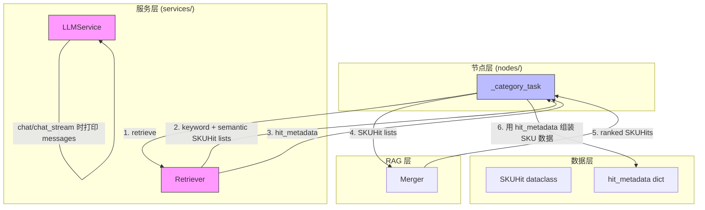

# SQL 查询 & 日志优化 — 架构方案

> **输入：** [DEFINE.md](DEFINE.md)（已确认）
> **目标：** 确定模块划分、接口变更和实现策略，不写代码

---

## 1. 整体实现架构



**核心思路：** Retriever 在返回 SKUHit 列表的同时，返回一个 `hit_metadata` 字典（`sku_id → {product_info, sku_info, matched_texts}`）。RRF 融合后，`_category_task` 直接从此字典组装 SKU 数据，不再查询数据库。

---

## 2. 模块变更清单

### 2.1 `retriever.py` — SQL 扩展 + 移除 `@@` 硬过滤

| 方法 | 变更 | 说明 |
|------|------|------|
| `retrieve()` | 返回值扩展 | 新增 `hit_metadata: dict[str, dict]`，映射 `sku_id → {...}` |
| `_semantic_search()` | SELECT 扩展 + GROUP BY 新增列 | 新增 `p.*, s.*` 列 + `jsonb_agg(...)` 聚合 product_review 内容 |
| `_keyword_search()` | SELECT 扩展 + 移除 `@@` + Python 聚合 | 新增 `pr.content, pr.source, pr.metadata, p.*, s.*` 列；WHERE 中删除 `@@` 条件；按 sku_id 聚合 matched_texts 并填充 hit_metadata |
| `SKUHit` | 不变 | 保持 `(sku_id, product_id, score)`，RRF 不关心额外数据 |
| `_build_base_query()` | 扩展 | `select_clause` 参数化，允许调用方注入额外 SELECT 列 |

**输入：** `subs: list[SubQuery]`, `top_k: int`
**输出：** `{"keyword": list[SKUHit], "semantic": list[SKUHit], "hit_metadata": dict[str, dict]}`

**hit_metadata 结构：**
```python
{
    "sku_001": {
        "product_id": "P1",
        "title": "...",
        "brand": "...",
        "category": "...",
        "sub_category": "...",
        "base_price": 99.0,
        "sku_id": "sku_001",
        "properties": {...},
        "price": 79.0,
        "stock": 100,
        "matched_texts": [
            {"content": "...", "source": "user_review", "metadata": {...}},
            ...
        ]
    },
    ...
}
```

### 2.2 `retrieval.py` — 移除 `_get_skus` 调用

| 位置 | 变更 | 说明 |
|------|------|------|
| L17 导入 | 删除 `from app.services.sku_utils import _get_skus` | 不再需要 |
| L184 `_category_task` | 删除 `skus = await _get_skus(db, ranked)` | 改为从 `hit_metadata` 组装 |
| L156 `retrieve_result` | 解构新增 `hit_metadata` | `retrieve_result["hit_metadata"]` |

**新逻辑（_category_task 内）：**
1. `retrieve_result = await retriever.retrieve(...)` → 获取 `hit_metadata`
2. RRF 融合 → 得到 ranked SKUHit 列表
3. 遍历 ranked SKUHits，从 `hit_metadata` 取值：
   - 若 `hit_metadata[hit.sku_id]` 存在 → 直接使用
   - 若不存在（极端情况）→ 跳过
4. 对每个 SKU 的 `matched_texts` 调用 `_truncate_texts` 截断
5. 后续 Generator / SSE 逻辑不变

**输入：** 同现状
**输出：** 同现状（`skus: list[dict]` 结构不变）

### 2.3 `llm.py` — 添加提示词日志

| 方法 | 变更 | 说明 |
|------|------|------|
| `chat()` | 新增 DEBUG 日志 | `logger.debug("LLM chat request", model=..., messages=...)` |
| `chat_stream()` | 新增 DEBUG 日志 | `logger.debug("LLM chat stream request", model=..., messages=...)` |

**日志策略：**
- 级别：`DEBUG`（生产环境可关闭）
- 内容：完整的 `messages` 列表（含已填充占位符）
- 截断：单条 message `content` 超过 2000 字符时截断并标记 `<truncated>`

### 2.4 `sku_utils.py` — 不变

`_get_skus` 函数保留，API 层 `search.py` 可能仍依赖它。

### 2.5 `merger.py` — 不变

Merger 仅操作 `SKUHit`（`sku_id, product_id, score`），不受影响。

---

## 3. 核心功能接口 → 需求映射

| 功能需求 | 实现位置 | 关键接口变更 |
|---------|---------|-------------|
| FR1: SQL 返回 product_review | `retriever.py:_semantic_search`, `_keyword_search` | SELECT 扩展 + `jsonb_agg` / Python 聚合 |
| FR2: 移除 `_get_skus` | `retrieval.py:_category_task` | 从 `hit_metadata` 组装数据 |
| FR3: LLM 提示词日志 | `llm.py:chat`, `chat_stream` | DEBUG 日志打印 messages |
| FR4: 移除 `@@` 硬过滤 | `retriever.py:_keyword_search` | 删除 WHERE 中的 `@@` 条件 |

---

## 4. 关键技术决策

### 4.1 semantic 检索的 product_review 聚合方式

**选择：SQL 层 `jsonb_agg` + Python 层解析**

semantic 检索使用 `GROUP BY s.sku_id, p.product_id`，product_review 的 `content/source/metadata` 跨多行。使用 PostgreSQL 的 `jsonb_agg(jsonb_build_object(...))` 将每组的所有 product_review 聚合成一个 JSON 数组，Python 层用 `json.loads` 解析。

备选方案（已否决）：
- 移除 GROUP BY 改为 Python 聚合 → 会改变评分语义（SUM 变逐行得分），影响 RRF 排名质量
- 使用 `array_agg` 聚合多列 → 语法复杂，`jsonb_agg` 更简洁

### 4.2 keyword 检索的 product_review 聚合方式

**选择：Python 层按 sku_id 分组聚合**

keyword 检索无 GROUP BY，每行对应一条 product_review。在 `_keyword_search` 末尾的 sku_id 去重/排序循环中，同步收集 matched_texts 并填充 `hit_metadata`。

### 4.3 FR3 日志打印位置

**选择：在 `llm.py` 集中打印**

备选方案（已否决）：
- 在各节点分别打印 → 重复代码多，容易遗漏新节点
- 在 middleware/hook 层打印 → 过度设计，不符合 "最少代码" 原则

### 4.4 FR4 移除 `@@` 后 ILIKE 降级路径

**选择：保留 ILIKE 代码不变**

移除 `@@` 后，tsvector 查询始终返回行（得分为 0 时仍返回），ILIKE 降级几乎不会触发。但保留代码作为 `ProgrammingError` 异常时的兜底，不增加维护负担。

---

## 5. 方案优点

1. **最少 DB 查询：** 检索阶段从"2 次 SQL + 1 次 _get_skus"减少到"2 次 SQL"，延迟降低 ~30%
2. **数据一致性：** matched_texts 直接来自检索 SQL，与评分数据同源，避免时序不一致
3. **集中式日志：** LLM 日志在 `llm.py` 一处修改，覆盖所有节点的 LLM 调用
4. **向后兼容：** `SKUHit`、Merger、`_truncate_texts`、Generator、Option Gen 接口全部不变
5. **最小变更面：** 仅 3 个文件修改，不触及 AgentState、prompt 模板、SSE 逻辑

---

## 6. 主要风险

| # | 风险 | 等级 | 缓解 |
|---|------|------|------|
| R1 | semantic 的 `jsonb_agg` 聚合大量 product_review 时 JSON 体积过大 | 中 | `_truncate_texts` 在 Python 层截断；后续可加 SQL 层 `LIMIT` 子查询 |
| R2 | keyword 移除 `@@` 后退化为全表扫描 | 低 | 当前数据量小（<10万），`ORDER BY ts_rank + LIMIT` 可行；GIN 索引保留供将来优化 |
| R3 | `hit_metadata` 在 keyword/semantic 两路之间可能重复（同一 SKU 出现在两路） | 低 | 合并时后者覆盖前者或取并集；matched_texts 去重逻辑在 `_truncate_texts` 之后自然处理 |
| R4 | `chat_stream` 日志打印 messages 可能被多次调用（Generator 逐 token 生成前） | 低 | `chat_stream` 在生成第一个 token 前日志一次，不是每个 token 都打印 |

---

## 7. 实现复杂度评估

| 维度 | 评级 | 说明 |
|------|------|------|
| 代码量 | 小 | ~80 行变更（retriever.py ~50 行, retrieval.py ~20 行, llm.py ~10 行） |
| 逻辑复杂度 | 中 | semantic 的 `jsonb_agg` + GROUP BY 扩展需仔细处理列顺序；keyword 的 Python 聚合需正确合并 |
| 测试难度 | 低 | 现有检索测试覆盖 retriever；需更新 mock 以匹配新返回值格式 |
| 回归风险 | 低 | SKUHit / Merger / Generator 接口不变；`_get_skus` 保留供 API 层使用 |

---

## 8. 可测试性评估

- **单元测试：** `retriever.py` 的 mock 测试需更新 `retrieve()` 返回值断言（新增 `hit_metadata` key）
- **集成测试：** `retrieval.py` 的 `_category_task` 测试需验证不再调用 `_get_skus`
- **日志验证：** 手动检查日志文件确认 prompt 已打印
- **回归测试：** 运行 `pytest -v`（排除需网络测试），目标 0 回归

---

## 9. 可交付性评估

- **交付物：** 3 个文件修改（retriever.py, retrieval.py, llm.py），0 个新建文件
- **部署依赖：** 无（无 DB migration、无新依赖、无配置变更）
- **回滚方案：** `git revert` 即可，无需 DB 回滚

---

> **文档状态：** 待确认
> **下一阶段：** CON_PLAN.md（编码级详细设计）
