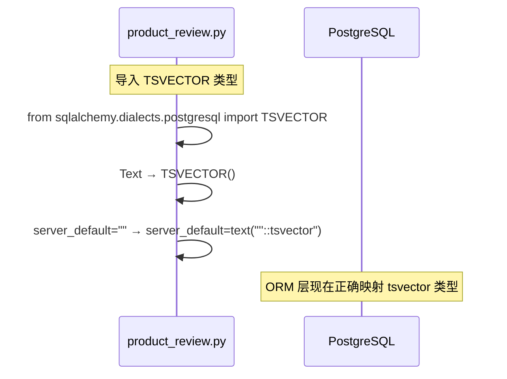
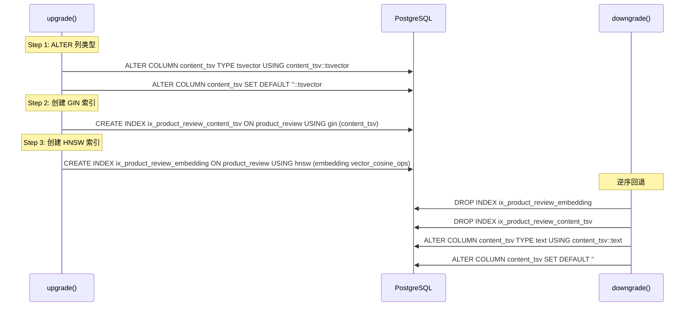

# ProductReview 表修复 & 索引优化 — 编码级详细设计

> **输入：** [PLAN.md](PLAN.md)（已确认）
> **目标：** 足够支撑编码，每个模块给出完整实现代码和验证命令

---

## 1. 期望目录结构

```
server/
├── app/models/
│   └── product_review.py          # [修改] content_tsv 列类型 Text → TSVECTOR
├── alembic/versions/
│   ├── 20260527_0001_init_schema.py  # [修改] 初始迁移中 content_tsv 类型修正
│   └── 20260602_0002_fix_content_tsv_and_indexes.py  # [新建] ALTER + 补建索引
```

共 3 个文件：2 个修改 + 1 个新建。

---

## 2. 模块详细设计

### 2.1 模型修正 — [product_review.py](server/app/models/product_review.py)

**实现思路：** 将 `content_tsv` 列从 `Text` 改为 PostgreSQL 原生 `TSVECTOR` 类型，同步修正 `server_default` 使其与 tsvector 类型匹配。

**变更链路：**



**完整变更（L88-L90）：**

```python
# === 修改前 ===
content_tsv: Mapped[str | None] = mapped_column(
    Text, nullable=True, server_default=""
)

# === 修改后 ===
content_tsv: Mapped[str | None] = mapped_column(
    TSVECTOR(), nullable=True, server_default=sa.text("''::tsvector")
)
```

**难点：** 无。`TSVECTOR` 在 Python 侧仍然表现为字符串，Python 类型注解 `Mapped[str | None]` 保持不变。

---

### 2.2 初始迁移修正 — [20260527_0001_init_schema.py](server/alembic/versions/20260527_0001_init_schema.py)

**实现思路：** 修正 DDL 定义中 `content_tsv` 列的类型和默认值，确保全新 `alembic upgrade head` 部署时从零创建正确类型。

**完整变更（L252-L257）：**

```python
# === 修改前 ===
sa.Column(
    "content_tsv",
    sa.Text(),
    nullable=True,
    server_default=sa.text("''"),
),

# === 修改后 ===
sa.Column(
    "content_tsv",
    TSVECTOR(),
    nullable=True,
    server_default=sa.text("''::tsvector"),
),
```

此外，需在文件顶部导入区域添加 `TSVECTOR` 导入：

```python
# 在现有 from pgvector.sqlalchemy import Vector 下方添加
from sqlalchemy.dialects.postgresql import TSVECTOR
```

**难点：** 无。此迁移文件只对全新数据库执行，不影响已有部署。

---

### 2.3 增量迁移 — `20260602_0002_fix_content_tsv_and_indexes.py`（新建）

**实现思路：** 对已有数据库执行三步操作——先 ALTER 列类型（含 `USING` 子句无损转换），再创建 GIN 索引和 HNSW 索引。

**实现链路时序：**



**完整代码：**

```python
"""Fix content_tsv column type and add performance indexes

Revision ID: 20260602_0002
Revises: 20260527_0001
Create Date: 2026-06-02

1. ALTER content_tsv 列类型: TEXT → TSVECTOR
2. 创建 GIN 索引: ix_product_review_content_tsv（全文检索）
3. 创建 HNSW 索引: ix_product_review_embedding（向量相似度）
"""

from typing import Sequence, Union

import sqlalchemy as sa
from alembic import op
from sqlalchemy.dialects.postgresql import TSVECTOR


# ---------------------------------------------------------------------------
# 版本标识符
# ---------------------------------------------------------------------------
revision: str = "20260602_0002"
down_revision: Union[str, None] = "20260527_0001"
branch_labels: Union[str, Sequence[str], None] = None
depends_on: Union[str, Sequence[str], None] = None


def upgrade() -> None:
    """修正 content_tsv 类型并补建性能索引。"""

    # Step 1: 修正 content_tsv 列类型（使用 USING 无损转换已有数据）
    # 先执行原始 SQL 做类型转换（Alembic alter_column 的 type_ 参数在某些
    # 方言版本中不自动生成 USING 子句，显式执行更安全）
    op.execute(
        "ALTER TABLE product_review "
        "ALTER COLUMN content_tsv TYPE tsvector "
        "USING content_tsv::tsvector"
    )
    # 再通过 alter_column 修正 SQLAlchemy metadata 中的类型和默认值
    op.alter_column(
        "product_review",
        "content_tsv",
        type_=TSVECTOR(),
        existing_type=sa.Text(),
        nullable=True,
        server_default=sa.text("''::tsvector"),
    )

    # Step 2: 为全文检索字段创建 GIN 倒排索引
    op.create_index(
        "ix_product_review_content_tsv",
        "product_review",
        ["content_tsv"],
        unique=False,
        postgresql_using="gin",
    )

    # Step 3: 为向量列创建 HNSW 索引（余弦相似度）
    op.create_index(
        "ix_product_review_embedding",
        "product_review",
        ["embedding"],
        unique=False,
        postgresql_using="hnsw",
        postgresql_with={"ops": "vector_cosine_ops"},
    )


def downgrade() -> None:
    """回退：逆序删除索引并还原列类型。"""

    # Step 3 逆: 删除 HNSW 索引
    op.drop_index(
        "ix_product_review_embedding",
        table_name="product_review",
    )

    # Step 2 逆: 删除 GIN 索引
    op.drop_index(
        "ix_product_review_content_tsv",
        table_name="product_review",
    )

    # Step 1 逆: 还原 content_tsv 列类型
    op.execute(
        "ALTER TABLE product_review "
        "ALTER COLUMN content_tsv TYPE text "
        "USING content_tsv::text"
    )
    op.alter_column(
        "product_review",
        "content_tsv",
        type_=sa.Text(),
        existing_type=TSVECTOR(),
        nullable=True,
        server_default=sa.text("''"),
    )
```

**难点/风险点：**

| 难点 | 解决方案 |
|------|----------|
| `alter_column` 不自动生成 `USING` 子句 | 先 `op.execute("ALTER TABLE ... USING ...")` 显式转换，再 `alter_column` 修 metadata |
| HNSW 索引需 pgvector 0.5.0+ | 初始迁移已 `CREATE EXTENSION IF NOT EXISTS vector`；本地开发环境已安装 pgvector |
| 降级时 `tsvector::text` 转换 | PostgreSQL 原生支持 `::text` 强制转换，无风险 |

---

## 3. 关键数据实体

### 3.1 `product_review` 表变更前后对比

| 列 | 变更前类型 | 变更后类型 | 变更前默认值 | 变更后默认值 |
|----|-----------|-----------|-------------|-------------|
| `content_tsv` | `TEXT` | `TSVECTOR` | `''` | `''::tsvector` |
| 其余列 | 不变 | 不变 | 不变 | 不变 |

### 3.2 新增索引

| 索引名 | 列 | 类型 | 用途 |
|--------|---|------|------|
| `ix_product_review_content_tsv` | `content_tsv` | GIN | 加速 `@@` 和 `ts_rank()` 全文检索 |
| `ix_product_review_embedding` | `embedding` | HNSW | 加速 `<=>` 余弦相似度向量检索 |
| `ix_product_review_product_id` | `product_id` | BTREE | 已存在，加速按产品过滤 |

### 3.3 存储/检索方案

- **存储：** `TSVECTOR` 是 PostgreSQL 原生类型，以压缩的词典树结构存储，比 `TEXT` 存储 `to_tsvector()` 产物更高效
- **检索：** 现有 `retriever.py` 中 `pr.content_tsv @@ plainto_tsquery(...)` 和 `ts_rank(pr.content_tsv, ...)` 直接使用 tsvector 列，类型修正后无需更改查询
- **写入：** `import_data.py` 触发器 `to_tsvector()` 写入 tsvector 值，与修正后类型一致

---

## 4. 风险点和待优化项

| 类别 | 描述 | 应对 |
|------|------|------|
| **风险** | `content_tsv` 含 NULL 值时 `::tsvector` 转换行为 | 触发器在 INSERT 时已填充 `to_tsvector(content)`，content 为 NOT NULL，故 content_tsv 始终非 NULL |
| **风险** | pgvector 版本 < 0.5.0 不支持 HNSW | 开发环境已安装 pgvector 0.5.0+，且初始迁移已启用 vector 扩展 |
| **待优化** | 大表场景下 `CREATE INDEX` 可能锁表 | 当前为开发阶段数据量小，无需 `CONCURRENTLY`；生产环境部署时再加 |

---

## 5. 任务拆解（Task Breakdown）

### Task 1: 修正模型层 content_tsv 类型

**Files:**
- Modify: `server/app/models/product_review.py:1,16,88-90`

- [ ] **Step 1: 添加 TSVECTOR 导入**

在 [product_review.py](server/app/models/product_review.py) 的导入区域，将 `TSVECTOR` 添加到 `sqlalchemy.dialects.postgresql` 的导入行：

```python
# 修改前 L16-17:
from sqlalchemy import String, DateTime, Text
from sqlalchemy.dialects.postgresql import JSONB

# 修改后:
from sqlalchemy import String, DateTime, Text
from sqlalchemy.dialects.postgresql import JSONB, TSVECTOR
```

- [ ] **Step 2: 修正 content_tsv 列定义**

将 [product_review.py](server/app/models/product_review.py) L88-L90：

```python
# 修改前:
content_tsv: Mapped[str | None] = mapped_column(
    Text, nullable=True, server_default=""
)

# 修改后:
content_tsv: Mapped[str | None] = mapped_column(
    TSVECTOR(), nullable=True, server_default=sa.text("''::tsvector")
)
```

注意：需确认 `sa` 已在文件顶部导入（`import sqlalchemy as sa`），若没有则添加，或使用 `text()` 从 `sqlalchemy` 导入。

- [ ] **Step 3: 验证模型可导入**

```bash
cd server && python -c "from app.models.product_review import ProductReview; print('OK')"
```

Expected: `OK`

- [ ] **Step 4: Commit**

```bash
git add server/app/models/product_review.py
git commit -m "fix(table): change content_tsv column type from Text to TSVECTOR"
```

---

### Task 2: 修正初始迁移

**Files:**
- Modify: `server/alembic/versions/20260527_0001_init_schema.py:22,252-257`

- [ ] **Step 1: 添加 TSVECTOR 导入**

在 [20260527_0001_init_schema.py](server/alembic/versions/20260527_0001_init_schema.py) 的导入区域添加 `TSVECTOR`：

```python
# 在 L22 from pgvector.sqlalchemy import Vector 之后添加:
from sqlalchemy.dialects.postgresql import TSVECTOR
```

- [ ] **Step 2: 修正 DDL 中的 content_tsv 列**

将 L252-L257：

```python
# 修改前:
sa.Column(
    "content_tsv",
    sa.Text(),
    nullable=True,
    server_default=sa.text("''"),
),

# 修改后:
sa.Column(
    "content_tsv",
    TSVECTOR(),
    nullable=True,
    server_default=sa.text("''::tsvector"),
),
```

- [ ] **Step 3: Commit**

```bash
git add server/alembic/versions/20260527_0001_init_schema.py
git commit -m "fix(migration): correct content_tsv type to TSVECTOR in initial schema"
```

---

### Task 3: 新建增量迁移

**Files:**
- Create: `server/alembic/versions/20260602_0002_fix_content_tsv_and_indexes.py`

- [ ] **Step 1: 创建迁移文件**

```bash
cd server && python -m alembic revision -m "fix_content_tsv_and_indexes"
```

记下生成的文件名（Alembic 会自动添加 revision ID 前缀）。

- [ ] **Step 2: 编写完整迁移代码**

用以下内容覆盖生成的迁移文件：

```python
"""Fix content_tsv column type and add performance indexes

Revision ID: 20260602_0002
Revises: 20260527_0001
Create Date: 2026-06-02

1. ALTER content_tsv 列类型: TEXT → TSVECTOR
2. 创建 GIN 索引: ix_product_review_content_tsv（全文检索）
3. 创建 HNSW 索引: ix_product_review_embedding（向量相似度）
"""

from typing import Sequence, Union

import sqlalchemy as sa
from alembic import op
from sqlalchemy.dialects.postgresql import TSVECTOR


revision: str = "20260602_0002"
down_revision: Union[str, None] = "20260527_0001"
branch_labels: Union[str, Sequence[str], None] = None
depends_on: Union[str, Sequence[str], None] = None


def upgrade() -> None:
    """修正 content_tsv 类型并补建性能索引。"""

    # Step 1: 修正 content_tsv 列类型
    op.execute(
        "ALTER TABLE product_review "
        "ALTER COLUMN content_tsv TYPE tsvector "
        "USING content_tsv::tsvector"
    )
    op.alter_column(
        "product_review",
        "content_tsv",
        type_=TSVECTOR(),
        existing_type=sa.Text(),
        nullable=True,
        server_default=sa.text("''::tsvector"),
    )

    # Step 2: GIN 倒排索引
    op.create_index(
        "ix_product_review_content_tsv",
        "product_review",
        ["content_tsv"],
        unique=False,
        postgresql_using="gin",
    )

    # Step 3: HNSW 向量索引
    op.create_index(
        "ix_product_review_embedding",
        "product_review",
        ["embedding"],
        unique=False,
        postgresql_using="hnsw",
        postgresql_with={"ops": "vector_cosine_ops"},
    )


def downgrade() -> None:
    """回退索引和列类型。"""

    op.drop_index(
        "ix_product_review_embedding",
        table_name="product_review",
    )
    op.drop_index(
        "ix_product_review_content_tsv",
        table_name="product_review",
    )
    op.execute(
        "ALTER TABLE product_review "
        "ALTER COLUMN content_tsv TYPE text "
        "USING content_tsv::text"
    )
    op.alter_column(
        "product_review",
        "content_tsv",
        type_=sa.Text(),
        existing_type=TSVECTOR(),
        nullable=True,
        server_default=sa.text("''"),
    )
```

注意：如果 alembic 自动生成的 revision ID 不是 `20260602_0002`，更新 `revision` 和 `down_revision` 为实际值。

- [ ] **Step 3: 验证迁移升级**

```bash
cd server && python -m alembic upgrade head
```

Expected: 无错误输出，显示 "Running upgrade 20260527_0001 -> 20260602_0002"

- [ ] **Step 4: 验证迁移降级**

```bash
cd server && python -m alembic downgrade 20260527_0001
```

Expected: 无错误输出

- [ ] **Step 5: 重新升级到最新**

```bash
cd server && python -m alembic upgrade head
```

Expected: 无错误输出

- [ ] **Step 6: 运行回归测试**

```bash
cd server && python -m pytest tests/ -v --ignore=tests/test_e2e.py --ignore=tests/test_llm.py --ignore=tests/test_embedding.py --ignore=tests/test_sync.py --ignore=tests/test_search.py --ignore=tests/test_retriever.py --ignore=tests/test_generator.py --ignore=tests/test_products.py --ignore=tests/test_category_lookup.py --ignore=tests/test_query_parser.py --ignore=tests/test_sku_utils.py --ignore=tests/test_merger.py
```

Expected: 所有测试 PASS，零回归

- [ ] **Step 7: Commit**

```bash
git add server/alembic/versions/20260602_0002_fix_content_tsv_and_indexes.py
git commit -m "feat(migration): alter content_tsv to TSVECTOR, add GIN and HNSW indexes"
```

---

## 6. 验证清单

| # | 验证项 | 命令 | 预期结果 |
|---|--------|------|----------|
| 1 | 模型可导入 | `python -c "from app.models.product_review import ProductReview"` | OK |
| 2 | 升级迁移 | `alembic upgrade head` | 无错误 |
| 3 | 降级迁移 | `alembic downgrade 20260527_0001` | 无错误 |
| 4 | 重新升级 | `alembic upgrade head` | 无错误 |
| 5 | 索引存在 | `psql -c "\d product_review"` | 显示 3 个索引 |
| 6 | 列类型正确 | `psql -c "\d product_review"` | content_tsv 类型为 tsvector |
| 7 | 回归测试 | `pytest -v` (排除需网络测试) | 零回归 |
