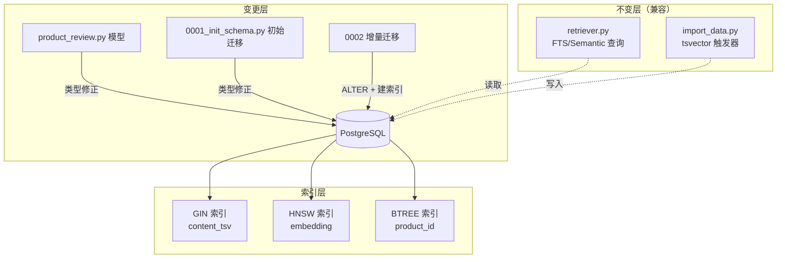

# ProductReview 表修复 & 索引优化 — 架构方案

> **输入：** [DEFINE.md](DEFINE.md)（已确认）

## 1. 整体实现架构

**核心思路：** 三层变更——模型层修正类型注解、初始迁移修正 DDL（保证全新部署正确）、增量迁移处理已有数据库的 ALTER 和补建索引。业务查询层（retriever/import_data）不感知类型变更，零影响。

## 2. 核心功能接口 & 需求覆盖

| 需求编号 | 需求 | 实现方式 | 涉及模块 |
| --- | --- | --- | --- |
| FR1 | `content_tsv` 类型修正为 `TSVECTOR` | 模型 + 初始迁移 + 增量迁移三处同步修改 | `product_review.py`, `0001_init_schema.py`, `0002_*.py` |
| FR2 | `product_id` BTREE 索引 | 初始迁移已存在，确认无需新增 | `0001_init_schema.py`（不变） |
| FR3 | `content_tsv` GIN 索引 | 增量迁移中创建 `postgresql_using="gin"` | `0002_*.py` |
| FR4 | `embedding` HNSW 索引 | 增量迁移中创建 `postgresql_using="hnsw"` + `vector_cosine_ops` | `0002_*.py` |

## 3. 模块设计

### 3.1 模型层 — [product_review.py](server/app/models/product_review.py)

| 属性 | 值 |
| --- | --- |
| **输入** | `TSVECTOR` 类型（从 `sqlalchemy.dialects.postgresql` 导入） |
| **输出** | `content_tsv` 列定义为 `Mapped[str \| None]` + `TSVECTOR()` |
| **功能** | 为 SQLAlchemy ORM 提供正确的列类型映射 |
| **变更范围** | L88-L90：替换 `Text` → `TSVECTOR()`，修正 `server_default` |

### 3.2 初始迁移 — [20260527_0001_init_schema.py](server/alembic/versions/20260527_0001_init_schema.py)

| 属性 | 值 |
| --- | --- |
| **输入** | `TSVECTOR` 类型导入 |
| **输出** | DDL 中 `content_tsv` 列类型为 `TSVECTOR()` |
| **功能** | 保证全新 `alembic upgrade head` 部署时列类型直接正确 |
| **变更范围** | L252-L257：替换 `sa.Text()` → `TSVECTOR()`，修正 `server_default` |

### 3.3 增量迁移 — `alembic/versions/YYYYMMDD_0002_fix_content_tsv_and_indexes.py`（新建）

| 属性 | 值 |
| --- | --- |
| **输入** | 已有数据库（`content_tsv` 为 TEXT 类型，缺少 GIN/HNSW 索引） |
| **输出** | `content_tsv` 类型变为 TSVECTOR，新增 2 个性能索引 |
| **功能** | 对已有数据库执行无损 ALTER + 补建索引 |
| **upgrade 步骤** | ① `ALTER COLUMN content_tsv TYPE tsvector USING content_tsv::tsvector` + `alter_column` 修改 metadata ② 创建 GIN 索引 ③ 创建 HNSW 索引 |
| **downgrade 步骤** | 逆序：删 HNSW 索引 → 删 GIN 索引 → ALTER 回 TEXT |

### 3.4 兼容性：不变模块

| 模块 | 依赖 `content_tsv` 的方式 | 影响 |
| --- | --- | --- |
| [retriever.py](server/app/services/retriever.py#L375-L377) | SQL 表达式 `ts_rank(pr.content_tsv, ...)` 和 `@@` 运算符 | **无影响**——这些运算符天然接受 tsvector 类型 |
| [import_data.py](server/app/services/import_data.py#L239-L264) | 触发器 `to_tsvector()` → `NEW.content_tsv` | **无影响**——触发器返回 tsvector，与修正后类型一致 |

## 4. 方案优点

1. **最小变更面**：3 个文件，其中 2 个仅改一行类型声明，1 个新建迁移
2. **零业务影响**：retriever 和 import_data 代码完全不变
3. **向后兼容**：已有数据通过 `USING ...::tsvector` 无损转换；全新部署通过初始迁移修正直接正确
4. **可回退**：downgrade 完整支持逆操作
5. **性能提升明确**：GIN 索引加速 FTS 查询，HNSW 索引加速向量检索

## 5. 主要风险

| 风险 | 等级 | 应对 |
| --- | --- | --- |
| pgvector 扩展未安装 → HNSW 创建失败 | 低 | 初始迁移已有 `CREATE EXTENSION IF NOT EXISTS vector` |
| 已有数据中 content_tsv 含非法值 → `::tsvector` 转换失败 | 极低 | 触发器保证了值始终为 `to_tsvector()` 产物 |
| 初始迁移修改影响已有部署 | 极低 | 初始迁移只对全新数据库执行；已有数据库走增量迁移 |

## 6. 实现复杂度评估

| 维度 | 评级 | 说明 |
| --- | --- | --- |
| 整体复杂度 | **低** | 本质是 1 个类型替换 + 2 个索引创建 |
| 代码量 | ~60 行 | 模型 3 行 + 初始迁移 3 行 + 增量迁移 ~50 行 |
| 依赖关系 | 无新增 | 仅使用已有依赖 `sqlalchemy.dialects.postgresql.TSVECTOR` |
| 测试工作量 | 低 | 无需新增单元测试，验证迁移可执行 + 现有测试不回归即可 |

## 7. 可测试性评估

| 测试类型 | 方法 |
| --- | --- |
| 迁移升级 | `alembic upgrade head` — 验证无错误 |
| 迁移降级 | `alembic downgrade 20260527_0001` — 验证可完整回退 |
| 回归测试 | `pytest -v`（排除需网络测试）— 验证现有功能不受影响 |
| 索引有效性 | `EXPLAIN ANALYZE` 验证 FTS/向量查询使用了目标索引 |

无需新增单元测试——本次变更为 DDL 层面类型修正和索引创建，不涉及业务逻辑变更。

## 8. 可交付性评估

| 条件 | 状态 |
| --- | --- |
| FR1-FR4 全部满足 | ✅ |
| 现有测试零回归 | ✅ 待执行验证 |
| 迁移可升降级 | ✅ 待执行验证 |
| 文档完整 | ✅ DEFINE.md + PLAN.md + CON_PLAN.md（阶段 3） |

---

## [NEEDS CLARIFICATION]

无。方案明确，所有模块边界清晰，无不确定项。
