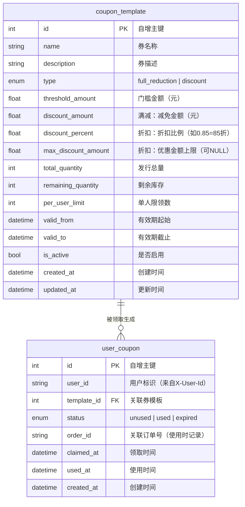
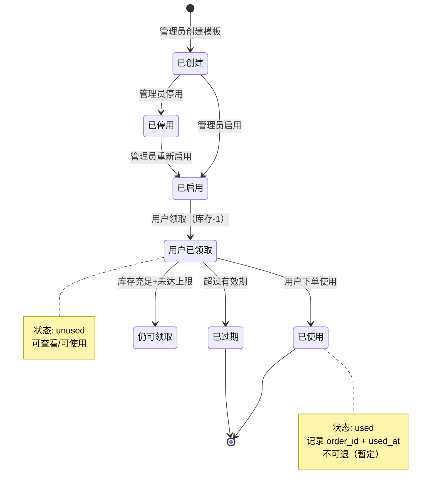
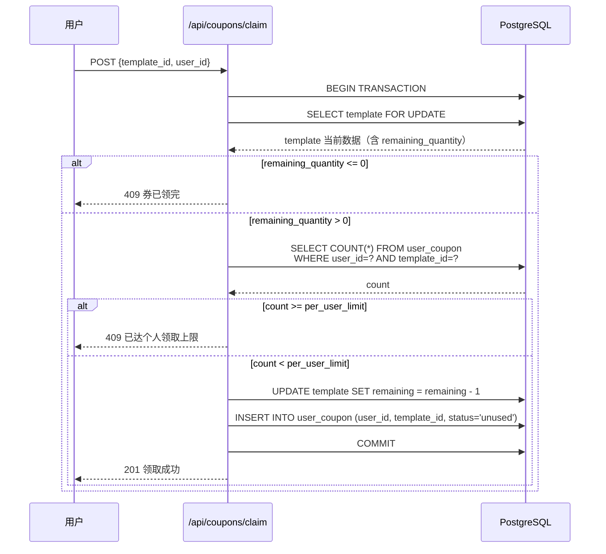
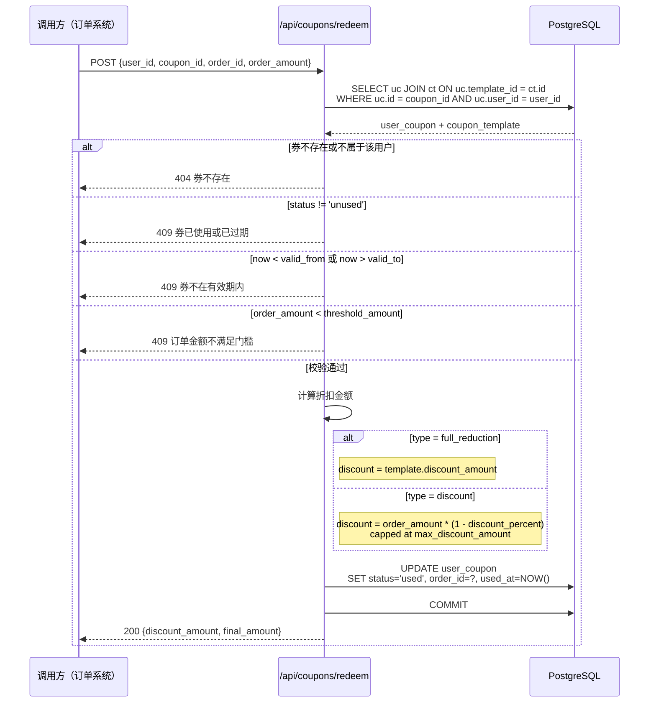

# 优惠券系统 -- 问题定义

## 1. 功能需求

### FR1 优惠券模板管理
管理员可创建、编辑、启用/停用优惠券模板（CouponTemplate），定义优惠券的核心规则：
- 券类型：满减券（`full_reduction`）或折扣券（`discount`）
- 满减券参数：门槛金额 `threshold_amount`、减免金额 `discount_amount`
- 折扣券参数：门槛金额 `threshold_amount`（可为 0 表示无门槛）、折扣比例 `discount_percent`（如 0.85 表示 85 折）、折扣金额上限 `max_discount_amount`（可为 NULL 表示无上限）
- 通用参数：券名称、描述、发行总量 `total_quantity`、每人限领数 `per_user_limit`、有效期 `valid_from` / `valid_to`、启用状态 `is_active`

### FR2 用户领券
用户可浏览可领取的优惠券列表，并领取优惠券：
- 展示当前可领券（`is_active=True`、在有效期内、剩余库存 > 0、用户未达领取上限）
- 领取时校验：券是否存在且有效、库存是否充足、用户是否超过单人限领数
- 领取成功后生成 `UserCoupon` 记录，扣减模板库存
- 并发领取需防止超发

### FR3 用户查看已领券
用户可查看自己持有的优惠券列表：
- 按状态筛选：未使用 / 已使用 / 已过期
- 展示券面信息（类型、门槛、优惠值、有效期）
- 过期券自动标记（查询时根据当前时间判定，或通过后台定时任务批量更新）

### FR4 优惠券使用与核销
用户在下单时可选择一张优惠券进行抵扣：
- 校验券是否属于当前用户、是否未使用、是否在有效期内
- 校验订单金额是否满足门槛条件
- 计算实际抵扣金额：
  - 满减券：直接减免 `discount_amount`
  - 折扣券：`订单金额 * (1 - discount_percent)`，若有 `max_discount_amount` 则取 min
- 使用后标记 `UserCoupon.status = used`，记录使用时间和关联订单号

### FR5 优惠券状态自动管理
- 过期优惠券需有机制将其状态从 `unused` 转为 `expired`
- [NEEDS CLARIFICATION] 过期处理策略：方案 A -- 查询时实时判定（无额外存储开销，但每次查询需计算）；方案 B -- 定时任务批量更新（存储准确，但引入后台调度复杂度）；方案 C -- 混合方案（查询时实时过滤 + 定时清理索引优化）

---

## 2. 性能需求

| 指标 | 要求 | 说明 |
|:---|:---|:---|
| **NFR1 领券响应延迟** | P99 < 200ms | 含库存扣减的数据库事务 |
| **NFR2 券列表查询延迟** | P99 < 100ms | 用户已领券列表，含过期实时判定 |
| **NFR3 核销计算延迟** | P99 < 50ms | 校验 + 金额计算，轻量纯计算逻辑 |
| **NFR4 并发领券** | 支持 100 QPS 无超发 | 需通过数据库锁或乐观锁机制保证库存准确性 |
| **NFR5 券过期标记吞吐** | 每分钟处理 ≥ 10000 条 | 仅在采用方案 B/C 时适用 |

---

## 3. 最终交付物

1. **数据模型**（2 个新表）：
   - `coupon_template` -- 优惠券模板（规则定义 + 库存）
   - `user_coupon` -- 用户持有券记录（领取/使用/过期状态）

2. **API 端点**（预计 5-7 个）：
   - 管理端：券模板 CRUD（创建/编辑/查询/启停）
   - 用户端：可领券列表、领取、我的券列表、券核销（预计算 + 确认使用）

3. **业务服务层**：
   - `CouponService`：券校验、金额计算、领取逻辑、核销逻辑
   - 并发领取的库存安全扣减机制

4. **数据库迁移脚本**（Alembic）：2 个新表的创建迁移

5. **配置扩展**：`config.yaml` 新增 `coupon` 配置组（可选，如过期扫描间隔、默认单人限领数等）

6. **单元测试**：覆盖券校验、金额计算、领取逻辑、核销逻辑、并发安全

---

## 4. 硬约束

| 约束项 | 具体要求 |
|:---|:---|
| **HC1 语言与框架** | Python 3.12+，FastAPI，与现有服务栈一致 |
| **HC2 数据库** | PostgreSQL + SQLAlchemy 2.0 async（`async_session`），复用现有 `database.py` 的引擎与会话工厂 |
| **HC3 ORM 模型** | 继承现有 `Base` 声明式基类，Alembic 管理迁移 |
| **HC4 配置管理** | 新增配置项走 `config.yaml` + `app/config.py` 的 Pydantic Settings 体系 |
| **HC5 日志** | 使用现有 structlog 双通道（控制台 + 文件），遵循已有日志风格 |
| **HC6 测试** | pytest + `asyncio_mode = auto`，mock 策略与现有测试保持一致 |
| **HC7 API 路由** | 新增路由挂载到现有 FastAPI app，路由前缀统一（如 `/api/coupons`） |
| **HC8 反幻觉** | 严禁以任何形式实现"AI 智能推荐优惠券""AI 自动选券"等需求外的功能 |
| **HC9 不引入新依赖** | 不因优惠券系统引入新的第三方库，使用标准库 + 现有依赖栈 |

---

## 5. 隐含要求

1. **用户身份标识**：当前系统无用户体系。优惠券的"用户领取/使用/查看"依赖一个用户标识符来关联 `UserCoupon` 记录。最简方案为在请求头中传入 `X-User-Id`，暂不引入完整的用户认证/授权体系。

2. **订单金额来源**：券核销需要订单金额来校验门槛和计算折扣，但当前系统无订单模块。[NEEDS CLARIFICATION] 核销 API 是由调用方传入订单金额进行预计算 + 确认，还是需要本系统维护订单上下文？

3. **库存并发安全**：领取优惠券涉及 `total_quantity` 扣减，在并发场景下存在超发风险。需采用数据库层面的原子操作：`UPDATE ... SET remaining = remaining - 1 WHERE remaining > 0` + 行级锁 或 `SELECT ... FOR UPDATE`。

4. **单人限领校验**：`per_user_limit` 与库存扣减不在同一条 SQL 中，存在 TOCTOU 风险。需在同一事务中用 `SELECT ... FOR UPDATE` 锁定用户已有的领取记录，再检查数量。

5. **券过期边界值处理**：有效期 `valid_from` / `valid_to` 的边界语义需明确：`valid_from` 是当日 00:00:00 还是精确到秒？`valid_to` 是当日 23:59:59 还是精确到秒？[NEEDS CLARIFICATION]

6. **券叠加规则**：当前规格未明确单笔订单是否可使用多张券。[NEEDS CLARIFICATION] 本系统默认设定为单笔订单限用 1 张券，如有叠加需求需额外设计。

7. **券与商品/品类的关联**：当前规格未限制券的适用范围（全部商品 vs 指定品类/商品）。[NEEDS CLARIFICATION] 初期是否仅支持全场通用券，还是需要支持指定品类/商品的定向券？

8. **券退还逻辑**：用户使用券后若订单取消/退款，券是否退回？[NEEDS CLARIFICATION] 需明确退还策略（退回且恢复未使用 / 不退回 / 由业务方调用 API 决定）。

9. **API 契约风格**：与现有 `/api/products/*`、`/api/search` 保持一致——RESTful 风格、JSON 请求/响应体、Pydantic Schema 校验。

10. **模块组织**：新增文件遵循现有目录结构：
    - `app/models/coupon.py` -- ORM 模型
    - `app/schemas/coupon.py` -- Pydantic Schema
    - `app/services/coupon_service.py` -- 业务逻辑
    - `app/api/coupons.py` -- 路由端点

---

## 6. 任务完成边界

### 在范围内：

- 优惠券模板的创建、编辑、查询、启停（管理端 API）
- 用户浏览可领券列表
- 用户领取优惠券（含并发安全的库存扣减 + 单人限领校验）
- 用户查看已领券列表（含过期实时判定）
- 优惠券核销预计算（传入订单金额 → 返回抵扣金额）
- 优惠券确认使用（标记已使用 + 关联订单号）
- 优惠券过期状态自动处理（按方案 A：查询时实时判定，后续可升级为方案 B/C）
- 2 个数据表 + Alembic 迁移
- Pydantic Schema 定义
- 单元测试（含并发安全测试）

### 明确在范围外：

- **用户认证/授权系统**（仅使用 `X-User-Id` 请求头做最简标识，不实现注册/登录/JWT/权限）
- **订单系统**（券核销接受外部传入的订单 ID 和订单金额，不对订单表做任何 CRUD）
- **支付/结算系统**（券抵扣后的实付金额由调用方计算，本系统仅提供券的校验和折扣金额）
- **券推荐/智能选券**（不做 AI 推荐最优券等智能化功能）
- **券分享/转赠**
- **券过期定时扫描任务**（初期采用查询时实时判定方案 A）
- **前端/UI 界面**
- **满减券的阶梯满减**（如满 100 减 10、满 200 减 30 同券多阶梯——当前仅支持单券单规则）
- **折扣券的折上折/与其他优惠叠加计算**

---

## 7. 架构与流程设计

### 7.1 数据实体关系

### 7.2 优惠券生命周期

### 7.3 领券并发控制流程

### 7.4 核销流程

---

## 8. 风险点

| 风险 | 严重程度 | 说明 | 缓解措施 |
|:---|:---|:---|:---|
| **R1 无用户体系依赖** | 高 | 当前系统无用户认证，券的领取/使用完全依赖调用方传入的 `user_id`，存在伪造用户 ID 的风险 | 明确文档中标注"本系统不做用户身份校验，由上游网关/API Gateway 保证 user_id 真实性" |
| **R2 并发超发** | 高 | 热门券在高并发领取时，`remaining_quantity` 扣减若不加锁可能导致超发（库存扣到负值） | `SELECT ... FOR UPDATE` 行级锁 + 事务包裹；`UPDATE ... WHERE remaining > 0` 做二次防护 |
| **R3 TOCTOU 竞态** | 中 | 单人限领校验（COUNT + INSERT）与库存扣减之间存在时间窗口，同一用户在并发请求下可能超额领取 | 在同一事务中使用 `SELECT ... FOR UPDATE` 锁定用户已有记录后再 COUNT，防止幻读 |
| **R4 过期判定一致性** | 中 | 查询时实时判定过期（方案 A）可能导致：同一张券在 A 接口返回 `unused`，几秒后 B 接口判定为 `expired`——因为恰好跨过了 `valid_to` 边界 | 边界窗口极小（秒级），业务影响可接受；核销时有硬校验做最后一道防线 |
| **R5 券与商品数据隔离** | 低 | 优惠券系统与商品系统（product/sku 表）当前无关联。若后续需要"指定品类券"，需建立 coupon_template → category/sub_category 或 product_id 的关联 | 初期仅实现全场通用券，预留 `coupon_template` 的扩展字段（如 JSONB `applicable_scope`） |
| **R6 券退还的事务一致性** | 中 | 订单取消后退还优惠券涉及：更新 `user_coupon.status` + 恢复 `remaining_quantity`，若退还逻辑由外部调用方分两次 API 调用实现，可能出现不一致 | 提供原子化的退还 API（单一端点完成状态回退 + 库存恢复），或先标记 [NEEDS CLARIFICATION] 等待退还策略确认 |
| **R7 数据库迁移兼容** | 低 | 新增 `coupon_template` 和 `user_coupon` 两张表，Alembic 迁移需正确处理已有数据库的增量升级 | 迁移脚本独立版本号，不影响现有表结构；向下兼容（不影响未使用券功能的旧版本） |
| **R8 折扣金额精度** | 低 | 折扣计算涉及浮点数（如 `order_amount * 0.85`），可能出现 `19.9999999` 这样的浮点精度问题 | 使用 `Decimal` 类型或整数（分）为单位进行金额计算；API 响应中按规定精度（如保留 2 位小数）格式化 |

---

## 9. 已明确 & 仍待确认

### 已明确

- [x] 券类型仅两种：满减券（`full_reduction`）+ 折扣券（`discount`）
- [x] 单券单规则，不支持同券多阶梯
- [x] 全场通用券，不限制品类/商品
- [x] 暂不实现 AI 智能推荐券
- [x] 复用的技术栈：FastAPI + PostgreSQL + SQLAlchemy async + structlog + pytest
- [x] 用户标识使用 `X-User-Id` 请求头，不做完整用户认证体系
- [x] 过期处理采用方案 A（查询时实时判定）
- [x] 单笔订单限用 1 张券
- [x] 不引入新的第三方依赖

### 仍待确认

**阻塞级：**

| # | 问题 | 候选/说明 |
|:---|:---|:---|
| 1 | **核销 API 设计模式** | 方案 A：两阶段——预计算（返回折扣金额）+ 确认使用（标记已使用）。方案 B：单阶段——调用方一次请求完成校验+核销。方案 A 更灵活（调用方可先展示折扣再确认），但需要两次请求。方案 B 更简洁但调用方无法预览。 |
| 2 | **订单金额来源** | 核销时订单金额由调用方传入（本系统不维护订单表）？还是需要本系统新建一个轻量订单上下文？[NEEDS CLARIFICATION] |
| 3 | **券有效期边界语义** | `valid_from=2026-06-01` 表示 6月1日 00:00:00 还是 6月1日 23:59:59 开始？`valid_to` 同理。需统一为精确到秒的 datetime 字段，由调用方传入完整时间戳 |

**重要级：**

| # | 问题 | 说明 |
|:---|:---|:---|
| 4 | **券退还策略** | 订单取消/退款后，已使用的券是否退回？若退回：是恢复为 `unused` 还是生成一张新券？是否恢复库存？需与业务方确认。初期标记为不退回，后续可扩展。 |
| 5 | **管理端 API 鉴权** | 券模板 CRUD 属于管理操作，当前无管理员认证机制。是否需要简单管理密钥（如 `X-Admin-Key` 请求头校验）？还是复用 `api/admin.py` 的现有模式？[NEEDS CLARIFICATION] |
| 6 | **券列表分页** | 用户已领券列表是否需要分页？可领券列表是否需要分页？[NEEDS CLARIFICATION] |
| 7 | **券模板编辑约束** | 已有人领取的券模板是否允许编辑？若允许：修改门槛/折扣值是否影响已领取但未使用的券？[NEEDS CLARIFICATION] 保守方案：已有领取记录的模板仅允许修改 `description` 和 `is_active`，核心规则字段锁定。 |
| 8 | **券到期提醒** | 是否需要在券即将过期时通知用户？若需要，通知机制是什么（短信/推送/站内信）？[NEEDS CLARIFICATION] 初期不做通知。 |

**建议级（实现时自然决策）：**

- 券模板删除策略：软删除（`is_active=False` + 标记删除）还是物理删除？建议软删除——已有领取记录时禁止物理删除
- 折扣券的 `discount_percent` 存储方式：`0.85`（小数）还是 `85`（整数百分比）？建议用小数存储，方便计算
- API 端点路径风格：`/api/coupons/templates` + `/api/coupons/user`，与现有 `/api/products`、`/api/search` 保持 RESTful 前缀一致
- `per_user_limit` 默认值：NULL 表示不限领
- 金额单位统一为"元"（float/DECIMAL），与现有 product.price、sku.price 保持一致

---

## 10. API 端点规划概览

> 具体请求/响应 Schema 在 PLAN.md 阶段定义，此处仅列出端点职责和路由路径。

| 端点 | 方法 | 路径 | 职责 |
|:---|:---|:---|:---|
| 券模板列表 | `GET` | `/api/coupons/templates` | 管理端：查询所有券模板（含已停用） |
| 创建券模板 | `POST` | `/api/coupons/templates` | 管理端：创建新的券模板 |
| 编辑券模板 | `PUT` | `/api/coupons/templates/{id}` | 管理端：编辑券模板规则 |
| 启停券模板 | `PATCH` | `/api/coupons/templates/{id}/status` | 管理端：启用/停用券模板 |
| 可领券列表 | `GET` | `/api/coupons/available` | 用户端：查询当前可领取的券（is_active + 有效期内 + 有库存 + 未达限领上限） |
| 领取优惠券 | `POST` | `/api/coupons/claim` | 用户端：领取一张优惠券 |
| 我的券列表 | `GET` | `/api/coupons/my` | 用户端：查询当前用户持有的所有券（支持按状态筛选） |
| 券核销预计算 | `POST` | `/api/coupons/preview` | 校验券是否可用 + 返回折扣金额（不修改状态） |
| 券确认使用 | `POST` | `/api/coupons/redeem` | 确认使用券，标记已使用 + 关联订单号 |

[NEEDS CLARIFICATION] 核销是两阶段（preview + redeem）还是单阶段（仅 redeem），取决于上述阻塞问题 #1 的确认结果。
