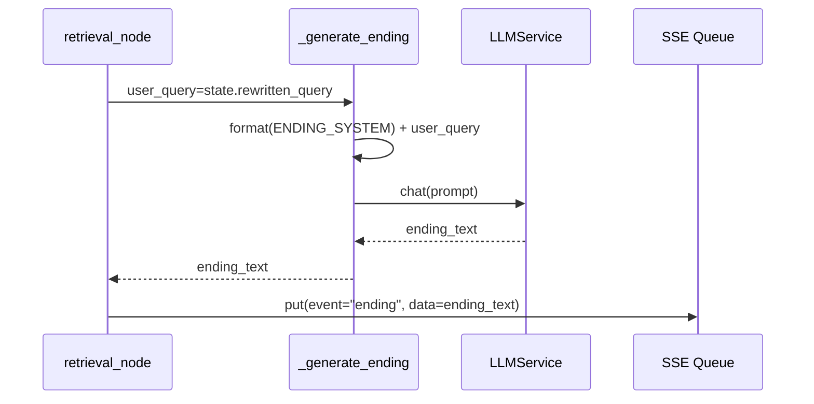
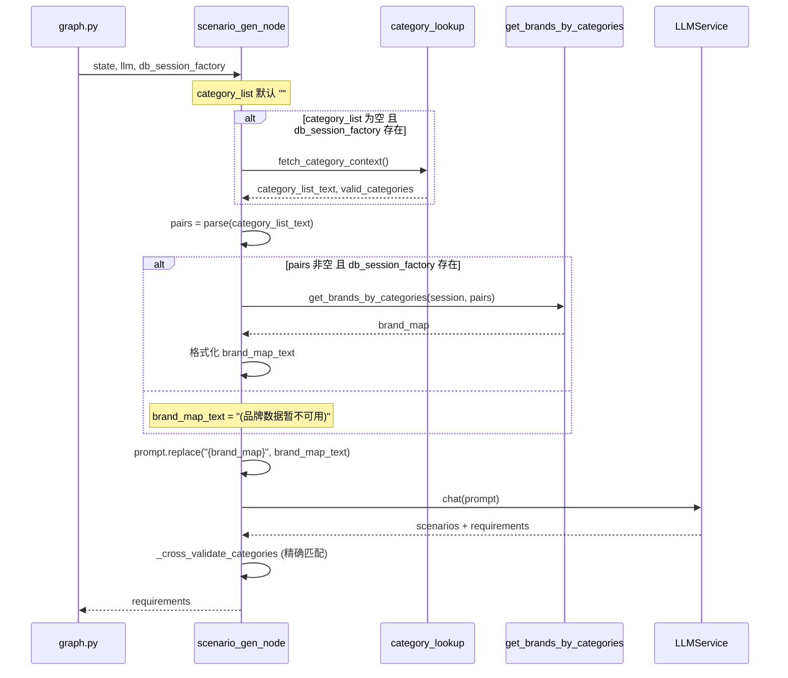

# CATEGORY_OPT — 编码级详细方案

> 输入: `server/docs/AGENT_OPT/CATEGORY_OPT/PLAN.md`
> 输出: `server/docs/AGENT_OPT/CATEGORY_OPT/CON_PLAN.md`

## 1. 模块详细设计

### 1.1 retriever.py — SSE Event 重命名 + Ending 参数传递

**实现思路:**

两处字符串替换 + 一处函数签名扩展。

**F1 — SSE Event 重命名 (2 处):**

```
Line 454 (品类介绍):  "event": "chat_reply"  →  "event": "category_intro"
Line 479 (商品推荐理由): "event": "chat_reply"  →  "event": "product_reason"
```

受影响的上下游:
- 消费者 `_agent_event_stream` (search.py:258-259): 不做 event 名过滤，直接透传 → 无需改动
- chitchat 路径 (chitchat.py:52): 保持 `"chat_reply"` → 无需改动

**F2 — 结束语参数传递:**

`_generate_ending` 签名变更:
```
# 当前
async def _generate_ending(category_results, requirements, llm, session_memory=None)

# 变更后
async def _generate_ending(category_results, requirements, llm, session_memory=None, user_query="")
```

`.format()` 调用新增参数:
```
prompt = ENDING_SYSTEM.format(
    categories_summary=...,
    product_count=...,
    scenario_description=...,
    recent_queries=...,
    rewritten_query=user_query,      # ← 新增
)
```

调用处 (line 482):
```
ending_text = await _generate_ending(
    safe_results, requirements, llm,
    session_memory=state.get("session_memory"),
    user_query=state.get("rewritten_query") or state.get("user_query", ""),
)
```

**时序:**



---

### 1.2 show_prompt.py — ENDING_SYSTEM Prompt 补充

**改动:** 在规则段和推荐概况段之间插入 `## 当前用户查询` 节。

当前结构 (line 69-87):
```
规则 → 推荐概况 → 对话历史 → 请生成结束语
```

变更后:
```
规则 → 当前用户查询 → 推荐概况 → 对话历史 → 请生成结束语
```

具体 diff:
```
 ## 规则
 ...
 
+## 当前用户查询
+{rewritten_query}
+
 ## 推荐概况
 品类: {categories_summary}
```

规则段新增一行:
```
+- 结束语应主要回应当前用户查询，对话历史仅用于补充会话全局上下文
```

---

### 1.3 scenario_gen.py — brand_map 修复 + 移除模糊匹配

**F3 — brand_map 修复:**

实现链路:



插入位置: `scenario_gen.py` line 162 之前（`brand_map_text` 初始化行之前）。

插入代码:
```python
# 内部加载 category_list（与 extraction_node 模式一致）
if not category_list and db_session_factory:
    try:
        from app.services.category_lookup_service import fetch_category_context
        async with db_session_factory() as session:
            category_list, _ = await fetch_category_context(session)
    except Exception as e:
        logger.warning("scenario_gen 品类加载失败", error=str(e))
```

注意: `_` 丢弃 `valid_categories` — scenario_gen 的交叉校验使用 `_parse_category_list(category_list)` 而非 `valid_categories`，两者内容等价（同源 DB）。

**F4 — 移除模糊匹配:**

`_cross_validate_categories` 简化:

```
当前逻辑:
  1. (cat_stripped, sub_stripped) in lookup → 返回
  2. strip(lc) == cat_stripped and strip(ls) == sub_stripped → 返回
  3. category 精确匹配 + sub_category 互为子串 → 返回    ← 删除
  4. (None, None) + warning

变更后:
  1. (cat_stripped, sub_stripped) in lookup → 返回
  2. strip(lc) == cat_stripped and strip(ls) == sub_stripped → 返回
  3. (None, None) + warning
```

删除的具体代码: lines 61-71（`# 2. 模糊匹配` 注释行到对应的 `return lc, ls` 行）。

同步更新 docstring (line 41-46): 移除 `支持模糊匹配` 字样和 `2.` 步骤描述。

**extraction.py Step1 对应删除:**

删除 lines 153-168，替换为:
```python
# 品类校验（精确匹配）
if valid_categories and cat and sub:
    if (cat, sub) not in valid_categories:
        cat = None
        sub = None
```

删除前后都保留品牌校验逻辑不变 (lines 170-189)。

---

### 1.4 scenario_gen_prompt.py — 提示词强化

**改动点 1** — 强化品类选择精确匹配约束:

当前 (line 11):
```
category 和 sub_category MUST 精确匹配可用品类列表中的值。若列表中没有合适的品类，宁可少选也不要编造。
```
已足够明确，无需更改。但需确保 `{category_list}` 的内容格式易于 LLM 精确复制。

**改动点 2** — brand_map fallback 文案指引:

当前 (line 14): `{brand_map}` 占位无额外说明。

当品牌数据不可用时，`brand_map_text = "(品牌数据暂不可用)"` 会直接注入。需在 prompt 中增加对该情况的指引。

在 `### 品类品牌表` 节后添加一行:
```
{如果品牌映射表显示"品牌数据暂不可用"或"暂无"，则 brand 字段均填 []，不要编造品牌名}
```

这比修改 fallback 字符串更鲁棒——LLM 直接收到行为指令。

---

### 1.5 extraction.py — 移除 Step1 模糊匹配

已在 1.3 节 F4 中详细描述。删除 lines 153-168，替换为两行精确匹配逻辑。

---

### 1.6 test_scenario_gen.py — 修正错误品类对

**排查方法:**
```
grep -rn "category_list.*=.*\""
```

已知问题: line 138 `"美妆护肤|洗面奶"` — 不存在于 category_lookup 表。

**修正方案:** 替换为已知存在的类别对。需先查询 `category_lookup` 表获取有效数据。基于现有测试中使用的其他品类对（`"美妆护肤|防晒"`、`"服饰|墨镜"`），建议替换为第三个有效品类对，或改为仅包含两个品类。

具体替换取决于 DB 中实际存在的品类对。实现时查询确认。

---

### 1.7 文档同步

**GENERAL SPEC.md** — 全文 `chat_reply` 引用分类更新:

| 上下文 | 当前 event | 更新为 |
|---|---|---|
| 品类介绍过渡语 | `chat_reply` | `category_intro` |
| 单商品推荐理由 | `chat_reply` | `product_reason` |
| 结束语 | `chat_reply` 或 `ending` | `ending`（统一） |
| 闲聊回复 | `chat_reply` | `chat_reply`（保持） |

SSE 事件流描述更新:
```
welcome → category_intro → products → product_reason → ... → ending → next_options → done
```

**delivery/API.md** — SSE event 表格新增 event:

| Event | 方向 | 说明 |
|---|---|---|
| `category_intro` | SSE→Client | 多品类时的品类过渡介绍语 |
| `product_reason` | SSE→Client | 单个商品的推荐理由 |
| `chat_reply` | SSE→Client | 仅闲聊路径的回复文本 |
| `ending` | SSE→Client | 结束语（已存在，确认保留） |

---

## 2. 核心功能接口详细设计

### 2.1 `_cross_validate_categories()` — 变更后

```
输入: category: str|None, sub_category: str|None, lookup: set[tuple[str,str]]
输出: tuple[str|None, str|None]

实现链路:
  1. guard: category/sub_category 为空 → (None, None)
  2. strip 后 (cat, sub) in lookup → (cat, sub)
  3. strip 遍历匹配 → (lc, ls)
  4. 未匹配 → (None, None) + warning 日志
```

### 2.2 `_generate_ending()` — 变更后

```
输入: category_results, requirements, llm, session_memory=None, user_query=""
输出: str (结束语文本)

实现链路:
  1. 汇总品类名 + 商品数
  2. 提取 scenario 文本 (从 requirements[0])
  3. 从 session_memory 获取 recent_queries
  4. format(ENDING_SYSTEM) 注入 rewritten_query=user_query
  5. LLM chat → 返回
```

### 2.3 `scenario_gen_node()` — 变更后 category_list 加载

```
输入: state, llm, category_list="", db_session_factory=None
输出: {scenario_description, requirements}

新增步骤 (在 brand_map 查询之前):
  if not category_list and db_session_factory:
      从 fetch_category_context 加载 category_list

其余流程不变。
```

---

## 3. 期望目录结构

```
server/
├── app/
│   └── agent/
│       ├── nodes/
│       │   ├── retriever.py        # F1: event 名修改 + F2: ending 参数传递
│       │   ├── scenario_gen.py     # F3: category_list 内部加载 + F4: 移除模糊匹配
│       │   └── extraction.py       # F4: 移除 Step1 模糊匹配
│       └── prompts/
│           ├── show_prompt.py      # F2: ENDING_SYSTEM 补充 user_query
│           └── scenario_gen_prompt.py  # F3/F4: brand_map fallback 指引
├── tests/
│   └── test_scenario_gen.py        # F5: 修正错误品类对
└── docs/
    └── AGENT_OPT/
        ├── CATEGORY_OPT/
        │   ├── SPEC.md             # (输入)
        │   ├── DEFINE.md           # (本次产出)
        │   ├── PLAN.md             # (本次产出)
        │   └── CON_PLAN.md         # (本次产出)
        └── GENERAL/
            └── SPEC.md             # 文档同步: SSE event 引用更新
delivery/
└── API.md                          # 文档同步: SSE event 表格
```

---

## 4. 实现顺序与依赖

```
F3 (scenario_gen category_list 加载)
 │
 ├─→ F5 (修正 test_scenario_gen 错误品类对)
 │
 ├─→ F4 (移除两处模糊匹配)
 │     ├── scenario_gen.py:_cross_validate_categories
 │     └── extraction.py Step1
 │
 ├─→ F1 (SSE event 重命名)
 │     └── retriever.py:454, 479
 │
 ├─→ F2 (结束语 prompt 补充)
 │     ├── show_prompt.py ENDING_SYSTEM
 │     └── retriever.py _generate_ending + call site
 │
 └─→ 文档同步
       ├── GENERAL SPEC.md
       └── delivery/API.md
```

顺序理由: F3 使 category_list 可用 → F5 修正数据 → F4 安全移除模糊匹配 → F1/F2 上层展示改动 → 文档最后同步。

---

## 5. 风险点与待优化项

| 风险点 | 级别 | 应对 |
|---|---|---|
| F3: `fetch_category_context` 在 scenario_gen 中多一次 DB 查询 | 低 | 与 extraction 共享查询模式，单次查询 < 10ms |
| F4: 移除模糊匹配后 LLM 输出"防晒霜"→ 校验失败 → 品类 null | 中 | 提示词已有"MUST 精确匹配"约束；若上线后发现丢失率高，可后续在 prompt 中显式列出品类值如 `防晒 (美妆护肤)` 格式 |
| F5: 测试中品类对改为有效值后可能改变测试覆盖的边界情况 | 低 | 保留测试结构，仅替换数据值 |
| 品牌数据为空: brand_map 仍显示"暂无" | 低 | prompt 增加 behavior instruction（§1.4 改动点 2），LLM 被告知此时 brand 填 [] |

**待优化项（不在本次范围内）:**
- `extraction.py` 和 `scenario_gen.py` 各有一份品类校验逻辑，结构相似但写法不同——未来可考虑抽取公共 `validate_categories()` 函数
- `fetch_category_context` 可能被缓存以减少重复 DB 查询
