# CATEGORY_OPT — 实现方案

> 输入: `server/docs/AGENT_OPT/CATEGORY_OPT/DEFINE.md`
> 输出: `server/docs/AGENT_OPT/CATEGORY_OPT/PLAN.md`

## 1. 整体架构

本次改动不新增模块，所有修改限定在现有文件的局部范围内。

```mermaid
graph TD
    subgraph "F1: SSE Event Rename"
        ret1[retriever.py:454] -->|"chat_reply → category_intro"| sse1[SSE Stream]
        ret2[retriever.py:479] -->|"chat_reply → product_reason"| sse2[SSE Stream]
    end

    subgraph "F2: Ending Prompt Context"
        sp[show_prompt.py<br/>ENDING_SYSTEM] -->|"+ {rewritten_query}"| llm_e[LLM 结束语生成]
        ret3[retriever.py<br/>_generate_ending] -->|"传入 rewritten_query"| sp
    end

    subgraph "F3: brand_map Fix"
        db[(category_lookup)] -->|fetch_category_context| sg[scenario_gen.py<br/>内部加载 category_list]
        sg -->|pairs 非空| tools[get_brands_by_categories]
        tools -->|brand_map_text| prompt[scenario_gen_prompt.py]
    end

    subgraph "F4: Remove Fuzzy Match"
        sg_x[_cross_validate_categories] -->|"仅精确匹配"| norm[品类标准化]
        ex[extraction.py Step1] -->|"仅精确匹配"| norm
    end

    subgraph "F5: Fix Incorrect Pairs"
        fix[test_scenario_gen.py] -->|"替换为有效品类对"| db_static[(category_lookup)]
    end
```



## 2. 模块级变更

### 2.1 retriever.py — SSE Event 重命名 + Ending 传参

**改动点:**

| 行号 | 改动 | 说明 |
|---|---|---|
| 454 | `"chat_reply"` → `"category_intro"` | 品类介绍过渡语 |
| 479 | `"chat_reply"` → `"product_reason"` | 单商品推荐理由 |
| 320-371 | `_generate_ending` 签名增加 `user_query: str = ""` | 传入当前查询 |
| 357 | `.format()` 增加 `user_query=...` | 注入 prompt |
| 482 | 调用处传入 `user_query=state.get("rewritten_query") or state.get("user_query")` | 传递值 |

**模块功能:** Product Retrieval 节点，负责 SSE 事件发送、商品检索、结束语生成。

### 2.2 show_prompt.py — Ending Prompt 补充

**改动点:**

| 位置 | 改动 | 说明 |
|---|---|---|
| ENDING_SYSTEM (line 69-87) | 新增 `{rewritten_query}` 占位 + 规则说明 | 要求结束语主要回应当前查询 |

**新增 prompt 规则:**
```
## 当前用户查询
{rewritten_query}

- 结束语应主要回应当前用户查询
- 对话历史仅用于补充会话全局上下文
```

**模块功能:** SSE 展示流提示词模板。

### 2.3 scenario_gen.py — brand_map 修复 + 移除模糊匹配

**改动点:**

| 位置 | 改动 | 说明 |
|---|---|---|
| 162-164 (insert) | 新增 `fetch_category_context` 调用 | 内部加载 category_list |
| 36-75 | `_cross_validate_categories` 移除 lines 61-71 | 删除模糊匹配分支 |
| 61-71 (remove) | 删除子串匹配逻辑 | 仅保留精确匹配 |

**brand_map 修复逻辑:**

```
if not category_list and db_session_factory:
    # 内部加载（与 extraction_node 模式一致）
    async with db_session_factory() as session:
        category_list, _ = await fetch_category_context(session)
```

`category_list` 参数保留用于兼容测试（测试可直接传入而不需要 DB），默认值 `""` 不变。

**`_cross_validate_categories` 简化后:**

```
1. 精确匹配 (cat, sub) in lookup  → 返回
2. strip 后精确匹配               → 返回
3. 均不匹配                       → 返回 (None, None) + warning 日志
```

### 2.4 extraction.py — 移除 Step1 模糊匹配

**改动点:**

| 位置 | 改动 | 说明 |
|---|---|---|
| 153-168 | 删除模糊匹配分支 | 仅保留: 精确匹配 → 匹配成功 / 不匹配 → 置 null |

### 2.5 scenario_gen_prompt.py — 提示词强化

**改动点:**

| 位置 | 改动 | 说明 |
|---|---|---|
| 品类约束节 | 新增规则: category 和 sub_category MUST 与可用品类列表逐字完全一致 | 补偿 F4 模糊匹配移除 |
| brand_map 节 | 新增 fallback 指引: 品牌数据不可用时基于品类信息生成 | F3 数据不足时的降级 |

### 2.6 test_scenario_gen.py — 修正品类对

**改动点:**

| 行号 | 当前值 | 替换为 |
|---|---|---|
| 138 | `"美妆护肤\|洗面奶"` | 有效的品类对（从 category_lookup 表查询后确定） |

排查方法: 搜索所有 `.py` 文件中 `category_list = "..."` 字符串，逐一校验。

### 2.7 GENERAL SPEC.md + API.md — 文档同步

**改动点:**
- `server/docs/AGENT_OPT/GENERAL/SPEC.md`: 约 40 处 `chat_reply` 引用按上下文更新
  - 品类介绍 → `category_intro`
  - 商品推荐理由 → `product_reason`
  - 结束语 → `ending`（如仍是 `chat_reply`）
  - 闲聊回复 → 保留 `chat_reply`
- `delivery/API.md`: SSE event 表格新增 `category_intro`, `product_reason`，更新 `chat_reply` 说明为仅闲聊

## 3. 实现顺序

```
F3 (brand_map) → F5 (category pairs) → F4 (remove fuzzy) → F1 (SSE rename) → F2 (ending) → 文档同步
```

理由:
- F3 和 F5 是基础设施建设（数据 + 品类加载正确）
- F4 移除模糊匹配依赖 F5（数据修正后才能安全移除）
- F1 和 F2 是上层展示改动，最后做
- 文档同步放在最后（引用已稳定）

## 4. 方案主要优点

- **局部修改**: 所有改动限定在 5 个源文件 + 2 个文档，不新增模块
- **可逆性好**: 每项改动独立，出问题可单独回退
- **与现有模式一致**: F3 修复采用 `extraction_node` 同款 `fetch_category_context` 模式
- **测试友好**: `scenario_gen_node` 保留 `category_list` 参数，测试无需 DB 即可传入

## 5. 主要风险

| 风险 | 概率 | 缓解 |
|---|---|---|
| 移除模糊匹配后 LLM 输出不精确 | 中 | 提示词中列出品类完全字面对照表；要求 LLM 从列表选择 |
| 品牌数据本身为空 | 低 | fallback 文案指引 LLM 基于品类信息生成 |
| 文档更新遗漏 | 中 | 全文 grep + 逐条确认 |

## 6. 复杂度评估

- **代码行数**: ~30 行新增 + ~15 行删除
- **文件数**: 5 源文件 + 2 文档
- **新增依赖**: 0
- **复杂度**: **低** — 局部修改，无架构变更

## 7. 可测试性评估

- **F1**: curl 手动验证 SSE event 名称
- **F2**: 观察实际 ending 内容是否回应用户查询
- **F3**: 单元测试验证 brand_map_text ≠ "(品牌数据暂不可用)"
- **F4**: 现有 `test_scenario_gen.py` 的精确匹配测试继续通过；新增负向测试（不精确输入 → null）
- **F5**: 测试用例中品类对通过精确匹配验证
- **回归**: 全量 `pytest -v` 确保 71 个测试无回归

## 8. 可交付性评估

所有改动都在单次提交范围内，不涉及跨仓库或跨系统协调。**可立即实施。**
