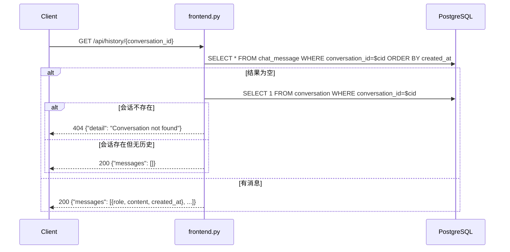
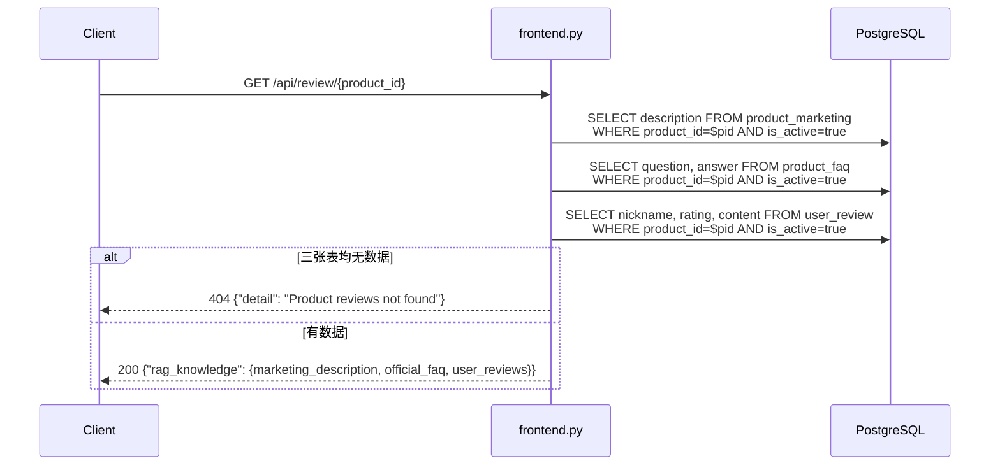
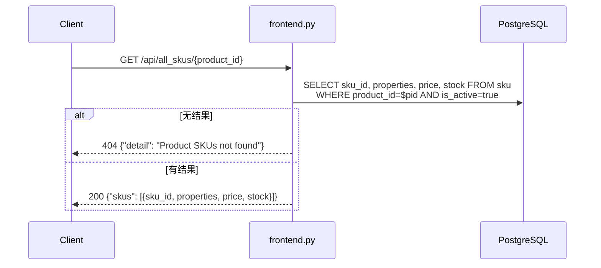

# CON_PLAN.md — 前端补充接口编码级详细设计

## 输入

- **DEFINE.md**: `server/docs/AGENT_OPT/FRONT_API_OPT/DEFINE.md`
- **PLAN.md**: `server/docs/AGENT_OPT/FRONT_API_OPT/PLAN.md`

## 1. M1: ChatMessage ORM 模型

**文件**: `app/models/chat_message.py`

**实现思路**: 参照现有 `conversation.py` 模型风格，定义最小化字段集合。

**字段**:

| 字段 | 类型 | 约束 | 说明 |
|------|------|------|------|
| `id` | int | PK, 自增 | 代理主键 |
| `conversation_id` | String(36) | NOT NULL, indexed | 关联会话 |
| `role` | String(10) | NOT NULL | "user" 或 "assistant" |
| `content` | Text | NOT NULL | 消息内容 |
| `created_at` | DateTime | server_default=func.now() | 创建时间 |

**注意**: 不需要 `updated_at`，消息不可变。

---

## 2. M2: API 路由实现

**文件**: `app/api/frontend.py`

### 2.1 GET /api/history/{conversation_id}



**实现要点**:
- 先查 `chat_message`，若为空则回查 `conversation` 表判断 404 vs 空列表
- `created_at` 序列化为 ISO 8601 字符串

### 2.2 GET /api/review/{product_id}



**实现要点**:
- 三次查询并发执行使用 `asyncio.gather` 减少延迟
- `marketing_description`: 取第一行的 `description`（每个 product 只有一条）
- `official_faq`: 列表 `[{question, answer}]`，无数据时为空数组
- `user_reviews`: 列表 `[{nickname, rating, content}]`，无数据时为空数组
- 三张表全空（marketing 为 None 且 faq 空且 reviews 空）才返回 404

### 2.3 GET /api/all_skus/{product_id}



**实现要点**:
- price 需转换为 `float`（Decimal → float）
- 无 SKU 时返回 404

---

## 3. M3: search.py 写入钩子

**文件**: `app/api/search.py`

**修改位置**: `_agent_event_stream()` 函数的 finally 块，在持久化 session_memory 之后（约 L329-L334），新增 chat_message 写入。

**实现链路**:
1. agent 正常完成（`done_received=True`）
2. 已有逻辑: 持久化 session_memory
3. **新增**: 从 `final_state` 取 `user_query` 和 `chat_reply`
4. 若 `chat_reply` 非空，写入两条 chat_message:
   - `(conversation_id, "user", user_query)`
   - `(conversation_id, "assistant", chat_reply)`
5. 写入包裹在 try/except 中，失败仅 log warning

**伪代码**:
```
if final_state:
    user_query = final_state.get("user_query", "")
    chat_reply = final_state.get("chat_reply", "")
    if user_query and chat_reply:
        try:
            async with async_session() as session:
                session.add(ChatMessage(conversation_id=cid, role="user", content=user_query))
                session.add(ChatMessage(conversation_id=cid, role="assistant", content=chat_reply))
                await session.commit()
        except Exception:
            log.warning("保存聊天记录失败", ...)
```

---

## 4. main.py 注册路由

**文件**: `app/main.py`

在已有路由注册后添加一行:
```python
from app.api import frontend
app.include_router(frontend.router)
```

---

## 5. 期望目录结构变更

```
server/app/
├── api/
│   ├── frontend.py          # [NEW] 前端接口路由（3个端点）
│   └── search.py            # [MODIFY] finally 块新增 chat_message 写入
├── models/
│   └── chat_message.py      # [NEW] ChatMessage ORM 模型
app/
└── main.py                  # [MODIFY] 注册 frontend router
server/tests/
└── test_frontend_api.py     # [NEW] 三个接口的离线测试
```

---

## 6. 风险点与处理

| 风险 | 处理方式 |
|------|----------|
| chat_message 写入时 DB 连接断开 | try/except + log warning，不阻塞 search 响应 |
| Decimal price 序列化失败 | 显式 `float()` 转换 |
| asyncio.gather 多查询并发异常 | 单个查询失败直接 raise，由 FastAPI 全局异常处理返回 500 |
| 没有 is_active 过滤条件导致返回已下架数据 | F2/F3 所有查询均加 `is_active=True` |

---

> 无 `[NEEDS CLARIFICATION]` 项。
