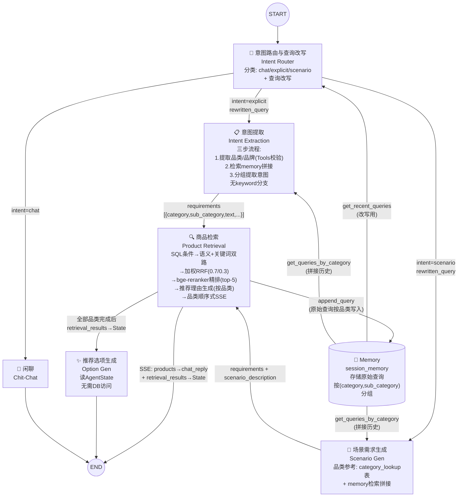
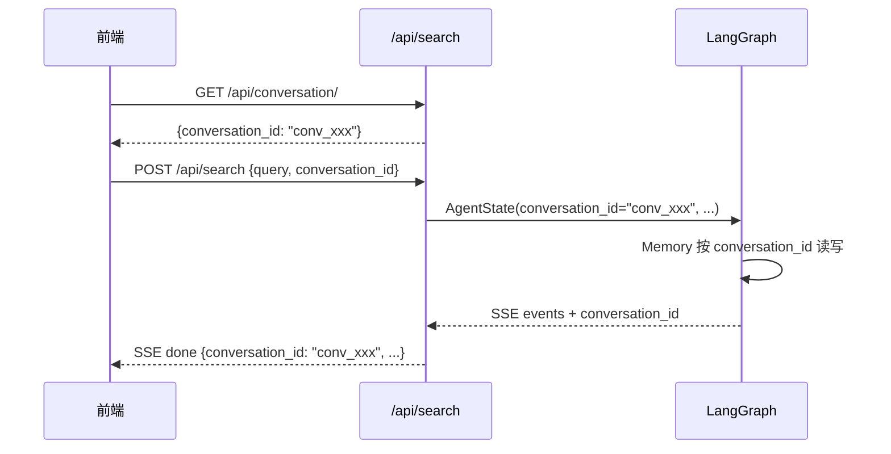

# 1 核心Agent组件

整体采用 **LangGraph 工作流架构**，Agent 之间通过状态图（StateGraph）组织，
共享 `AgentState` 作为状态通道。Memory 作为集中式会话记忆，存储用户原始查询并
按 `(category, sub_category)` 分组。Product Retrieval 在检索完成后统一写入 Memory。

## (1) 意图路由与查询改写 (Intent Router)

作为工作流的第一个节点，结合当前用户提问和对话历史，完成两项任务：

- **意图分类**：单次 LLM 调用判定意图为三类之一：`chat`（闲聊）、`explicit`（明确商品查询）、`scenario`（场景化推荐）
- **查询改写**：当意图为 `explicit` 或 `scenario` 时，利用历史对话记录通过 LLM 改写当前查询，补充查询主体。
  例如："要轻量的" → "要轻量的跑鞋"；"预算 500 以内" → "预算 500 以内的跑鞋"。
  完整查询（不缺少主体）则透传不改写。

输出 `intent` 驱动条件边 + `rewritten_query` 传给下游节点。
改写时从 `session_memory` 检索该会话最近 N 轮原始查询（N 可配置，默认 10）。

## (2) 意图提取 (Intent Extraction)

处理明确商品需求路径（`intent == "explicit"`）。三步流程：

**Step 1 — 提取品类/品牌意图**：从改写后的查询中提取 `brand`/`category`/`sub_category`，
借助 DB Tool（`query_field_values`）校验合法取值。`category`/`sub_category` 取值参考
`category_lookup` 表，`brand` 取值参考 `product` 表中该品类下的实际品牌。

**Step 2 — 检索历史并拼接**：按 `(category, sub_category)` 从 `session_memory` 检索
历史原始查询，与当前改写查询按时间顺序平铺拼接。

**Step 3 — 分组提取意图**：按 `(category, sub_category)` 分组，
从拼接文本中提取结构化查询条件（`structured_filter`：price/stock）和语义查询条件（`semantic`：text 字段）。
冲突以后续意图为准（如先说不超 200 后说不超 300 → 不超 300）。

**不再生成 keyword 策略的查询分支**。输出格式（数组，每个元素对应一个品类）：

```json
[
  {
    "category": "面部护肤",
    "sub_category": "防晒霜",
    "text": "不含酒精、不粘腻、适合敏感肌",
    "min_price": 0,
    "max_price": 200,
    "order_num": 1,
    "brand": ["安热沙", "资生堂"]
  }
]
```

字段说明：
- `category`: 品类大类（可为 null）
- `sub_category`: 品类细类（可为 null）
- `text`: 语义查询条件文本，综合凝练地表述用户主观感受和客观属性需求
- `min_price`: 最低价格，无约束为 0
- `max_price`: 最高价格，无约束为 4294967295
- `order_num`: 下单数量，默认 1
- `brand`: 品牌列表，可能需要世界知识展开（如"日系品牌"→["SK-II","资生堂",...]），无偏好为 null

## (3) 场景需求生成 (Scenario Gen)

处理场景化需求路径（`intent == "scenario"`）。

1. 从 `rewritten_query` 出发，从 **category_lookup 表**读取可用品类列表，确定场景所需品类
2. 按品类从 `session_memory` 检索历史查询，与当前查询拼接
3. LLM 按品类分组输出意图信息

输出格式与 Intent Extraction 统一为 `[{category, sub_category, text, min_price, max_price, order_num, brand}]`。
同时保留 `scenario_description`（原始场景描述，供 Option Gen 使用）。

## (4) 商品检索 (Product Retrieval)

从 state 读取 requirements（按品类分组的意图列表），按品类分组并行执行检索管线：

**检索管线（每个品类独立执行）**：

1. **SQL 条件转换**：将意图中的 `category`/`sub_category`/`min_price`/`max_price`/`order_num`/`brand` 转换为 SQL WHERE 条件
2. **语义检索**：在 SQL 条件基础上，用 `text` embedding 进行余弦相似度匹配，返回 top-25
3. **关键词检索**：在 SQL 条件基础上，用 `plainto_tsquery('chinese', ...)` + tsvector 进行全文检索，返回 top-25
4. **RRF 融合**：加权 RRF 综合语义（权重 0.7）和关键词（权重 0.3）结果，取 top-25
5. **bge-reranker 精排**：调用 SiliconFlow API（`BAAI/bge-reranker-v2-m3`）对 RRF top-25 精排，取 top-5。API 失败时 fallback 到 RRF top-5
6. **推荐理由生成**：检索结束后立即按品类独立生成推荐理由（LLM，复用 `GENERATOR_SYSTEM` 提示词）
7. **品类顺序式 SSE 返回**：按品类顺序发送 `products`（商品 ID 列表）→ `chat_reply`（推荐理由文本）

**SKU 去重**：同 `product_id` 多个 SKU 满足时取 `sku_id` 字典序最小的。

**Review 截断**：单 `product_id` 最多保留 N 条 `product_review`（N 可配置，默认 5）。

**并行检索**：各品类并行执行，通过 `asyncio.Semaphore` 限流（最大并发数
`max_category_concurrency`，默认 5，`config.yaml` 可配）。每个并行任务通过 `async_session()`
创建独立 `AsyncSession`，连接池 `pool_size` ≥ `max_category_concurrency` + 3。

**SSE 事件**：
- `products`: `[{product_id, sku_id, category, sub_category}]` — 品类顺序式发送
- `chat_reply`: 推荐理由文本（按品类发送）
- `done`: `{total_categories, failed_categories}` — 全部品类完成后

**Memory 更新**：检索完成后，将用户**原始查询**按品类追加到 `session_memory`。

输出：SSE 事件流 + `retrieval_results` 写入 AgentState（含完整 SKU 详情 + `matched_texts`），供 Option Gen 使用。

## (5) 推荐选项生成 (Option Gen)

在 Product Retrieval **所有品类返回后执行一次**。
从 `AgentState.retrieval_results` 读取全部商品的检索结果（含完整 SKU 详情 +
`matched_texts`），**无需访问数据库**。基于当前用户需求、全部已检索商品（含评价原文）、
对话历史以及（若触发场景路径）原始场景描述，生成 2-4 条下一步推荐选项。
战略上生成互补品推荐、替代品探索、属性细化、预算调整四类选项。

## (6) 闲聊 (Chit-Chat)

处理与商品导购关系不大的提问。对用户提问做简短回复，
并在结尾声明自身是商品导购服务。不走 Memory 和检索管线。

## (7) 多轮对话及会话记忆机制 (Memory)

集中式会话记忆，作为 `AgentState` 的 `session_memory` 字段。
**存储用户原始查询**（非改写后、非提取意图），按 `(category, sub_category)` 分组。

```json
[
  {
    "category": "服饰运动",
    "sub_category": "跑步鞋",
    "queries": [
      {"query": "帮我推荐跑鞋", "timestamp": "2026-06-04T10:00:00"},
      {"query": "要轻量的", "timestamp": "2026-06-04T10:01:00"}
    ]
  }
]
```

**三种访问模式**：
- **Router 检索**（`get_recent_queries`）：跨品类取最近 N 轮原始查询，用于查询改写
- **Extraction / Scenario Gen 检索**（`get_queries_by_category`）：按 `(category, sub_category)` 精确匹配历史查询，与当前查询拼接后提取意图
- **Retrieval 更新**（`append_query`）：检索完成后将原始查询按品类累加到 memory

**Token 截断**：threshold 2000 token，简易估算 `len(json.dumps(memory)) / 4`。
截断在每次 append 后执行（写时截断），仅在日志中记录。

## (8) 数据库查询 Tool

3 个内部 Python 函数，Agent 节点直接调用（不走 LLM function calling）：

| Tool | 功能 | 说明 |
|------|------|------|
| `list_tables(db)` | 查询数据库所有表 | 返回表名及每张表存储内容的描述 |
| `list_fields(db, table)` | 查询表的字段 | 返回字段名、类型、含义描述 |
| `query_field_values(db, table, field, filters?)` | 查询字段取值 | SELECT DISTINCT，支持多字段联合过滤 |

表/字段的中文描述硬编码为映射字典。`table`/`field`/`filter_key` 做白名单校验防注入。

## (9) Reranker 精排服务

`RerankerService` 封装 bge-reranker-v2-m3 的 SiliconFlow API 调用：

```
POST https://api.siliconflow.cn/v1/rerank
Model: BAAI/bge-reranker-v2-m3
```

超时 5s 可配置，失败返回空列表（调用方 fallback 到 RRF top-5）。

## (10) Properties 汇总（product_review 增强）

独立脚本 `property_summary_service.py`：
- 为每个 Product 汇总其所有 SKU 的 `properties` 字段信息为一句话自然语言描述
- 经 Embedding 向量化后写入 `product_review` 表，`source` 设为 `"property"`
- `config.yaml` 的 `search.source_weights` 新增 `property: 1.0`
- 支持幂等重跑（跳过已处理的 product）

### Agent 间数据契约

所有向 Memory 写入和检索的数据遵循统一结构。
Intent Extraction 和 Scenario Gen 输出统一的意图格式：

```json
[
  {
    "category": "str | null",
    "sub_category": "str | null",
    "text": "str",
    "min_price": 0,
    "max_price": 4294967295,
    "order_num": 1,
    "brand": ["str"] | null
  }
]
```

### Category 查找表

新增 `category_lookup` 表，记录数据库中合法的 (category, sub_category) 取值对：

```sql
CREATE TABLE category_lookup (
    id SERIAL PRIMARY KEY,
    category VARCHAR NOT NULL,
    sub_category VARCHAR NOT NULL,
    UNIQUE(category, sub_category)
);

INSERT INTO category_lookup (category, sub_category)
SELECT DISTINCT category, sub_category FROM product
WHERE category IS NOT NULL AND sub_category IS NOT NULL;
```

**用途**：
- Scenario Gen 提示词中动态注入可用品类列表
- Extraction Step 1 校验 LLM 输出的品类合法性
- 通过 `/server/scripts/` 下手动脚本构建和维护

### Fallback 策略

| Agent | 失败/超时行为 |
|-------|--------------|
| Intent Router | 默认 `intent="explicit"`，`rewritten_query=user_query` |
| Intent Extraction | Step 1 LLM 失败 → 品类/品牌为 null；Step 3 LLM 失败 → 回退为 `[{text: user_query, category: null, ...}]` |
| Scenario Gen | 视为误判，回退到 Intent Extraction 做 explicit 分解 |
| Product Retrieval | 单品类检索失败 → 品类任务内 try/except，返回 `error` 字段，`failed_categories` 汇总记录，其他品类继续；Reranker API 失败 → fallback 到 RRF top-5；全部失败 → 用原始 `user_query` 做语义检索兜底 |
| Option Gen | 跳过，回复末尾不追加选项 |
| Chit-Chat | 返回硬编码兜底消息 |
| Reranker | API 失败/超时 → 跳过精排，直接用 RRF top-5 |

## 目录结构

```
server/app/
├── agent/
│   ├── state.py              # AgentState 定义（含 rewritten_query, session_memory）
│   ├── graph.py              # StateGraph 构建 + 条件边
│   ├── memory.py             # Memory 工具（get_recent_queries / get_queries_by_category / append_query）
│   ├── tools.py              # DB 查询 Tool（list_tables / list_fields / query_field_values）
│   ├── nodes/
│   │   ├── router.py         # Intent Router（意图分类 + 查询改写）
│   │   ├── extraction.py     # Intent Extraction（三步流程）
│   │   ├── scenario_gen.py   # Scenario Gen（场景→品类→意图）
│   │   ├── retriever.py      # Product Retrieval（SQL条件→双路检索→RRF→reranker→推荐理由生成）
│   │   ├── option_gen.py     # Option Gen（读 AgentState，零 DB）
│   │   └── chitchat.py       # Chit-Chat
│   └── prompts/
│       ├── router_prompt.py           # 意图分类 + 查询改写提示词
│       ├── extraction_prompt.py       # 三步提取提示词（Step1 + Step3）
│       ├── scenario_gen_prompt.py     # 场景生成提示词
│       ├── generator_prompt.py        # GENERATOR_SYSTEM（推荐理由生成，从 rag/prompt.py 迁移）
│       ├── option_gen_prompt.py       # 选项生成提示词
│       └── chitchat_prompt.py         # 闲聊提示词
├── services/
│   ├── retriever_service.py   # Retriever / SubQuery / Merger（核心检索逻辑）
│   ├── reranker.py            # RerankerService（bge-reranker-v2-m3 API 客户端）
│   ├── sku_utils_service.py   # _get_skus / _truncate_texts（SKU 查询 + Review 截断）
│   └── ...
├── rag/
│   ├── merger.py              # 加权 RRF 融合
│   └── generator.py           # 推荐理由生成（import 从 agent/prompts/generator_prompt）
└── config.yaml / config.py   # 新增检索分段参数 + reranker 配置段
```

**关键配置参数**：

| 参数 | 默认值 | 说明 |
|------|--------|------|
| `search.semantic_top_k` | 25 | 语义检索返回数量 |
| `search.keyword_top_k` | 25 | 关键词检索返回数量 |
| `search.rrf_semantic_weight` | 0.7 | RRF 语义权重 |
| `search.rrf_keyword_weight` | 0.3 | RRF 关键词权重 |
| `search.rrf_k` | 60 | RRF k 值 |
| `search.rrf_top_k` | 25 | RRF 融合后取 top-k |
| `search.rerank_top_k` | 5 | 精排后最终返回数量 |
| `search.max_reviews_per_product` | 5 | 单 product_id 最多 review 条数 |
| `search.max_category_concurrency` | 5 | 品类并行检索最大并发数 |
| `search.memory_recent_rounds` | 10 | Router 改写时检索的最近轮数 |
| `search.reasoning_max_chars` | 500 | 推荐理由最大字符数 |
| `search.max_batch_ids` | 20 | Batch API 单次最大 ID 数 |
| `reranker.model` | BAAI/bge-reranker-v2-m3 | 精排模型 |
| `reranker.timeout` | 5.0 | Reranker API 超时（秒） |


# 2 多Agent协作关系

## (1) Agent 协作关系图



## (2) Agent 转移关系表

| # | 源 Agent | 条件 / 触发 | 目标 Agent | 语义 |
|---|---------|------------|-----------|------|
| 1 | START | —— | Intent Router | 用户输入进入系统 |
| 2 | Intent Router | `intent == "chat"` | Chit-Chat | 识别为闲聊意图 |
| 3 | Intent Router | `intent == "explicit"` | Intent Extraction | 明确商品需求，进入三步提取流程 |
| 4 | Intent Router | `intent == "scenario"` | Scenario Gen | 场景化需求，进入场景路径 |
| 5 | Memory | Router / Extraction / Scenario Gen 读取 | —— | Router 读最近N轮改写；Extraction/Scenario Gen 按品类读历史拼接 |
| 6 | Intent Extraction | 需求提取完成 | Product Retrieval | 输出 requirements（新格式）→ 进入检索 |
| 7 | Scenario Gen | 场景分析 + 意图提取完成 | Product Retrieval | 输出 requirements + scenario_description → 进入检索 |
| 8 | Product Retrieval | 检索完成后 | Memory（写入） | 将原始查询按品类追加写入 session_memory |
| 9 | Product Retrieval | 所有品类检索完成 | Option Gen | SSE 返回 + retrieval_results 写入 AgentState |
| 10 | Option Gen | 始终 | END | 读 AgentState.retrieval_results → 输出跨品类选项（无需 DB） |
| 11 | Chit-Chat | 始终 | END | 输出闲聊回复 |

## (3) Agent 协作设计要点

- **Router 单级分类 + 改写**：单次 LLM 调用输出 chat/explicit/scenario，对商品查询改写补充主体。
- **Explicit 路径**：Router（改写）→ Extraction（三步流程）→ Retrieval → Option Gen。
  Extraction 使用 DB Tool 校验品类/品牌合法性，按品类从 memory 检索历史拼接。
- **Scenario 路径**：Router（改写）→ Scenario Gen（品类确定+memory检索+意图提取）→ Retrieval → Option Gen。
- **Memory 存储原始查询**：按 `(category, sub_category)` 分组存储用户原始查询。
- **Memory 三种访问模式**：Router（跨品类最近N轮）、Extraction/Scenario Gen（按品类检索拼接）、Retrieval（追加写入）。
- **统一输出格式**：Extraction 和 Scenario Gen 输出统一的 `[{category, sub_category, text, min_price, max_price, order_num, brand}]` 格式。
- **并行检索 + 独立 session**：多品类并行执行，Semaphore 限流。每个并行任务独立 `AsyncSession`。
  连接池 `pool_size` ≥ `max_category_concurrency` + 3。
- **双路检索 + 加权 RRF + bge-reranker**：语义（0.7）和关键词（0.3）双路并行，RRF 融合后精排。
- **品类顺序式 SSE**：products 事件仅返回 `[{product_id, sku_id, category, sub_category}]`，
  chat_reply 按品类发送推荐理由文案。前端通过 batch API 批量获取详情。
- **Option Gen 零 DB 访问**：Product Retrieval 检索完成后将完整 SKU 详情
  （含 title/price/properties 及 product_review matched_texts）聚合写入
  `AgentState.retrieval_results`。Option Gen 直接从 State 读取。
- **推荐理由按品类独立生成**：检索结束后立即为该品类生成推荐理由（复用 `GENERATOR_SYSTEM` 提示词）。


# 3 各Agent的提示词示例

## 3.0 I/O 规约总览

| Agent | 输入（从 State 读取） | 输出（写入 State） | 下游消费者 |
|-------|---------------------|-------------------|-----------|
| **Intent Router** | `user_query`, `session_memory` | `intent`, `rewritten_query` | 条件边 → Chit-Chat 或 Extraction 或 Scenario Gen |
| **Intent Extraction** | `rewritten_query`, `session_memory`（按品类读） | `requirements: [{category, sub_category, text, min_price, max_price, order_num, brand}]` | Product Retrieval |
| **Scenario Gen** | `rewritten_query`, `session_memory`, `category_list`（从 category_lookup 表读） | `scenario_description: str`, `requirements: [{category, sub_category, text, ...}]` | Product Retrieval；scenario_description → Option Gen |
| **Product Retrieval** | `requirements`, `user_query`（原始） | SSE: `products` + `chat_reply` + `done`；State: `retrieval_results`；Memory: `session_memory`（追加） | END（SSE + batch API）+ Option Gen |
| **Option Gen** | `requirements`, `retrieval_results`, `session_memory`, `scenario_description` | `next_options: [str]` | END（追加到回复末尾） |
| **Chit-Chat** | `user_query`, `session_memory` | `chat_reply: str` | END |

## 3.1 Intent Router（意图路由与查询改写）

### 输入规约

```
- user_query: str              # 当前用户提问原文
- session_memory: list         # Memory 中的历史原始查询（按品类分组）
```

### 输出规约

```
- intent: "chat" | "explicit" | "scenario"
- rewritten_query: str         # 改写后的查询（chat 时为原始 user_query）
```

### 提示词

```text
你是一个电商导购意图分类器。根据用户提问和对话历史，完成意图分类和查询改写。

## 第一项任务：意图分类

将用户提问分为三类之一：
- chat：与商品导购无关的闲聊（如"今天天气怎么样"、"讲个笑话"）
- explicit：用户明确提出了具体商品需求（如"蓝牙耳机"、"200元以下的跑鞋"）
- scenario：用户描述了一个使用场景而非具体商品（如"去三亚旅游"、"换季护肤"）

## 第二项任务：查询改写（仅 explicit/scenario）

当意图为 explicit 或 scenario 时，利用历史对话改写当前查询：
1. 若当前查询缺少主体（如只有修饰语"要轻量的"），从历史中提取主体补全
2. 完整查询不做改写，直接透传
3. 冲突时以时间靠后的为准

历史对话（最近 N 轮原始查询）：
{recent_queries}

## 输出格式
只返回 JSON：
{"intent": "explicit", "rewritten_query": "要轻量的跑鞋"}

## 用户提问
{user_query}
```

## 3.2 Intent Extraction（意图提取）

### 输入规约

```
- rewritten_query: str         # Router 改写后的查询
- session_memory: list         # 按 (category,sub_category) 分组的历史原始查询
- DB Tools: list_tables / list_fields / query_field_values
```

### 输出规约

```json
[
  {
    "category": "面部护肤",
    "sub_category": "防晒霜",
    "text": "不含酒精、不粘腻、适合敏感肌",
    "min_price": 0,
    "max_price": 200,
    "order_num": 1,
    "brand": ["安热沙", "资生堂"]
  }
]
```

### 三步流程

**Step 1 提示词**（品类/品牌提取）：

```text
你是一个电商查询品类识别器。从用户查询中提取涉及的品类和品牌。

## 任务
只提取 brand/category/sub_category，不做意图拆解。

## 输出格式
只返回 JSON：
[{"category": "面部护肤", "sub_category": "防晒霜", "brand": ["安热沙"]}]

- category/sub_category 尽量填写，无法确定时填 null
- brand 为用户提到的品牌列表，无品牌偏好时填 null
- 多个品类时输出多个元素

## 用户查询
{rewritten_query}
```

**Step 3 提示词**（分组意图提取）：

```text
你是一个电商查询意图分解专家。按品类分组从拼接文本中提取结构化+语义意图。

## 任务
1. 按 (category,sub_category) 分组输出
2. text: 综合凝练用户主观感受（"好用""舒服"）和客观属性需求（"含酒精""不粘腻"）
3. 价格/库存条件提取为 min_price/max_price/order_num
4. 冲突以后续为准（时间靠后的覆盖靠前的）
5. 新品类无历史时仅基于当前查询提取

## 输出格式
只返回 JSON 数组：
[{"category": "...", "sub_category": "...", "text": "...", "min_price": 0, "max_price": 4294967295, "order_num": 1, "brand": null}]

## 拼接文本（历史+当前）
{context}
```

## 3.3 Scenario Gen（场景需求生成）

### 提示词

```text
你是一个场景化商品需求分析师。根据用户描述的场景，一次性完成场景分析并按品类分组输出需求。

## 任务
1. 从可用品类列表中选取该场景需要的品类，不超过 6 个
2. 分析场景隐含约束（地点、气候、活动类型等），推导评价需求
3. 对每个品类输出需求：
   - text: 结合场景隐含约束的自然语言评价短句
   - 结构化过滤（价格、品牌等）填入 min_price/max_price/brand
4. 所有品类合并为一个数组，按品类聚拢排列
5. category 和 sub_category 必须精确匹配可用品类列表中的值

## 隐含约束推断示例
- "三亚" → 热带海岛 → 高倍防晒、防水防汗、速干、轻薄透气
- "冬季滑雪" → 低温环境 → 保暖、防风防水、防滑

## 可用品类列表
{category_list}

## 历史查询（如有）
{history_context}

## 输出格式
只返回 JSON：
{
  "scenario_description": "原始场景原文",
  "requirements": [
    {"category": "...", "sub_category": "...", "text": "...", "min_price": 0, "max_price": 4294967295, "order_num": 1, "brand": null}
  ]
}

## 用户场景
{rewritten_query}
```

## 3.4 Product Retrieval（商品检索）

### 内部流程（7 步流水线）

```text
Step 1: [SQL 条件转换] — category/sub_category → p.category/p.sub_category;
         min_price/max_price → s.price; order_num → s.stock; brand → p.brand IN (...)
Step 2: [双路并行检索]：
        语义检索: pgvector <=> 余弦相似度 + SQL 条件, top-25
        关键词检索: plainto_tsquery + ts_rank + SQL 条件, top-25
        同 product_id 多 SKU → DISTINCT ON (product_id) ORDER BY sku_id ASC
Step 3: [加权 RRF 融合] — semantic 0.7 / keyword 0.3, k=60, top-25
Step 4: [bge-reranker 精排] — SiliconFlow API, top-5; 失败 → RRF top-5 fallback
Step 5: [Review 截断 + SKU 组装] — max_reviews_per_product=5, max_match_chars=500
Step 6: [推荐理由生成] — 按品类 LLM 生成（GENERATOR_SYSTEM 提示词）
Step 7: [SSE 发送] — products → chat_reply（品类顺序式）
```

### 输出规约

```
SSE 事件（品类顺序式，由 retrieval_node 统一发送）:
  event: products   → data: [{"product_id":"p001","sku_id":"sk001","category":"面部护肤","sub_category":"防晒霜"}, ...]
  event: chat_reply → data: "为您找到以下防晒霜..."（推荐理由文本，按品类发送）
  event: done       → data: {"total_categories": N, "failed_categories": [...]}

写入 AgentState:
  retrieval_results: [{
    "product_id": "p001", "sku_id": "sk001",
    "title": "安热沙小金瓶", "price": 198,
    "category": "面部护肤", "sub_category": "防晒霜",
    "properties": {...},
    "matched_texts": [{"source": "marketing", "content": "..."}, ...]
  }, ...]

写入 Memory:
  session_memory: append_query(session_memory, user_query, categories, timestamp)
```

### 推荐理由生成提示词（GENERATOR_SYSTEM）

```text
你是一个专业的导购助手。基于检索到的商品信息，为用户推荐合适的商品。

## 规则
1. 只能使用以下提供的商品信息，不得编造任何价格、库存、功能、优惠券或折扣
2. 如果商品信息不足以满足用户需求，请诚实告知，不要编造
3. 推荐时说明推荐理由，引用商品的真实属性
4. 以自然、友好的语气回复
5. 不要提及"根据检索结果""根据商品信息"等元表述
6. 商品信息中附带【用户评价与描述】段落时：
   a. 优先引用用户评价中的真实体验作为推荐依据
   b. 区分"官方描述"和"用户评价"，用户评价的权重高于官方描述
   c. 如果用户评价与官方描述矛盾，以用户评价为准
7. 推荐理由控制在{reasoning_max_chars}字以内，简洁有据
8. 必须为结果列表中的每一个商品都说明推荐理由
9. 用户需求中包含多条评价类需求时，逐条回应每个需求是否满足

## 用户需求
{requirements_summary}

## 可用商品信息
{product_context}

请为用户推荐：
```

## 3.5 Option Gen（推荐选项生成）

触发时机：所有品类检索完成后执行一次。数据来源：`AgentState.retrieval_results`（含 matched_texts），无需 DB。

### 提示词

```text
你是一个电商导购推荐选项生成器。基于用户当前需求和已推荐的全部商品，推测用户下一步可能的需求。

## 选项生成策略
1. 互补品推荐：当前商品需要搭配使用的产品
2. 替代品探索：同品类但不同定位的选项
3. 属性细化：帮助用户进一步缩小范围
4. 预算调整：基于价格区间提供放宽或收紧建议

## 规则
1. 选项必须基于数据库中可能存在的商品品类，不得虚构
2. 选项文案自然友好，使用问句或建议语气
3. 不要重复用户已经表达过的需求
4. 选项不超过 4 条，优先级从高到低排列
5. 如果涉及多个品类，选项可以灵活针对不同品类的商品
6. 如果某品类检索失败（见 failed_categories），避免生成该品类的相关选项

## 输出格式
只返回 JSON：{"next_options": ["选项1", "选项2", ...]}

## 当前用户需求
{requirements}

## 原始场景描述（如有）
{scenario_description}

## 已推荐商品信息（含评价内容）
{retrieval_results}

## 对话历史
{session_memory}
```

## 3.6 Chit-Chat（闲聊）

与原来一致：简短回复（不超过 80 字），结尾声明服务范围。


# 4 查询场景例子

## 4.1 单轮对话："200 元以下的蓝牙耳机有哪些？"

```text
用户: "200 元以下的蓝牙耳机有哪些？"

━━━ ① Intent Router ━━━
  Input:  user_query, session_memory=[]
  Logic:  LLM 分类 → explicit; 首轮无历史 → 查询完整 → rewritten_query="200 元以下的蓝牙耳机有哪些？"
  Output: intent="explicit", rewritten_query="200 元以下的蓝牙耳机有哪些？"

━━━ ② Intent Extraction ━━━
  Step 1: LLM 提取品类 → [{category: "数码电子", sub_category: "蓝牙耳机", brand: null}]
          → Tools 校验 (category,sub_category) 在 category_lookup 中存在
  Step 2: 首轮无历史 → context = "当前: 200 元以下的蓝牙耳机有哪些？"
  Step 3: LLM 分组提取 → [{category: "数码电子", sub_category: "蓝牙耳机",
          text: "音质好 连接稳定", min_price: 0, max_price: 200, order_num: 1, brand: null}]
  Output: requirements = [如上]

━━━ ③ Product Retrieval ━━━
  Input:  intent = {category:"数码电子", sub_category:"蓝牙耳机", text:"音质好 连接稳定", max_price:200}
  Logic:  Step 1: SQL → p.category='数码电子' AND p.sub_category='蓝牙耳机' AND s.price<=200
          Step 2: 语义检索(top-25) + 关键词检索(top-25) 并行
          Step 3: RRF 融合 (semantic=0.7, keyword=0.3) → top-25
          Step 4: bge-reranker → top-5
          Step 5: Review 截断 (max 5 per product)
          Step 6: 生成推荐理由 (LLM, GENERATOR_SYSTEM)
          Step 7: SSE: products → chat_reply → done
          Step 8: append_query(session_memory, "200 元以下的蓝牙耳机有哪些？", [{category,sub_category}])
  Output: SSE + retrieval_results（含 matched_texts）

━━━ ④ Option Gen ━━━
  Input:  requirements, retrieval_results（从 AgentState 读，含 matched_texts）
  Logic:  读 AgentState → 无需 DB → LLM 生成选项
  Output: next_options=["需要关注降噪功能吗？", "想看看 100 元以内的入门款吗？"]

━━━ 最终回复 ━━━
  → SSE: products (商品 ID 列表) → chat_reply (推荐理由文本) → next_options
```

## 4.2 多轮对话："帮我推荐跑鞋" → "要轻量的" → "预算 500 以内"

### Turn 1："帮我推荐跑鞋"

```text
━━━ ① Intent Router ━━━
  Output: intent="explicit", rewritten_query="帮我推荐跑鞋"（首轮完整，透传）

━━━ ② Intent Extraction ━━━
  Step 1: LLM → [{category: "运动户外", sub_category: "跑鞋", brand: null}]
  Step 2: 无历史
  Step 3: LLM → [{category: "运动户外", sub_category: "跑鞋", text: "舒适缓震", ...}]

━━━ ③ Product Retrieval ━━━
  检索 → SSE products + chat_reply
  追加 memory: session_memory = [{category:"运动户外", sub_category:"跑鞋", queries:[{query:"帮我推荐跑鞋", ...}]}]

━━━ ④ Option Gen ━━━
  Output: next_options=["需要限定预算范围吗？", "偏好哪个品牌？"]
```

### Turn 2："要轻量的"

```text
━━━ ① Intent Router ━━━
  Input:  历史 = [{query: "帮我推荐跑鞋", ...}]
  Logic:  当前查询缺少主体 → LLM 改写 → rewritten_query="要轻量的跑鞋"
  Output: intent="explicit", rewritten_query="要轻量的跑鞋"

━━━ ② Intent Extraction ━━━
  Step 1: LLM → [{category: "运动户外", sub_category: "跑鞋", brand: null}]
  Step 2: get_queries_by_category("运动户外", "跑鞋") → ["帮我推荐跑鞋"]
          context = "#1 帮我推荐跑鞋\n当前: 要轻量的跑鞋"
  Step 3: LLM → [{category: "运动户外", sub_category: "跑鞋",
          text: "轻量化设计 舒适缓震", ...}]

━━━ ③ Product Retrieval ━━━
  检索 + SSE + 追加 memory（同品类追加 query）
```

### Turn 3："预算 500 以内"

```text
━━━ ① Intent Router ━━━
  改写: "预算 500 以内" → "预算 500 以内的跑鞋"

━━━ ② Intent Extraction ━━━
  Step 3: text 整合"轻量化 舒适缓震", max_price=500

━━━ ③ Product Retrieval ━━━
  SQL: s.price <= 500 → 检索匹配
```

## 4.3 场景化推荐："下周去三亚度假，帮我搭配一套从防晒到穿搭的方案"

```text
用户: "下周去三亚度假，帮我搭配一套从防晒到穿搭的方案"

━━━ ① Intent Router ━━━
  Output: intent="scenario", rewritten_query="下周去三亚度假，帮我搭配一套从防晒到穿搭的方案"（完整透传）

━━━ ② Scenario Gen ━━━
  Input:  rewritten_query, category_list（从 category_lookup 表动态注入）
  Logic:  场景分析 → 热带海岛 → 高倍防晒、防水防汗、速干透气、偏光防紫外线
          选取品类: 防晒霜/墨镜/沙滩裤/遮阳帽/凉鞋
          对每个品类: 按品类检索 memory（首轮无历史）→ 生成意图
  Output: requirements = [
    {category:"面部护肤", sub_category:"防晒霜", text:"高倍防晒 SPF50+ 清爽不油腻 防水防汗", ...},
    {category:"服饰", sub_category:"墨镜", text:"偏光防紫外线 轻便可折叠", ...},
    {category:"服饰", sub_category:"沙滩裤", text:"速干透气 轻薄", ...},
    {category:"服饰", sub_category:"遮阳帽", text:"大帽檐 透气 可折叠", ...},
    {category:"服饰", sub_category:"凉鞋", text:"防滑舒适 速干", ...}
  ]（5 品类）

━━━ ③ Product Retrieval ━━━
  Logic:  5 组并行检索（≤ max_concurrency=5，全部并发）
          每品类: SQL 条件 → 语义+关键词双路 → RRF → reranker → 推荐理由生成
  SSE:    品类顺序式发送:
    products: [{防晒霜 SKU...}, {墨镜 SKU...}, ...]
    chat_reply: "为您推荐以下防晒霜..." → "墨镜方面..." → ...（按品类顺序）
    done: {total_categories: 5, failed_categories: []}
  追加 memory: 原始查询追加到 5 个品类 group（无对应 group 则新建）

━━━ ④ Option Gen ━━━
  Input:  requirements, retrieval_results（5 品类 × top-5 SKU, 含 matched_texts）, scenario_description
  Output: next_options=["需要推荐泳衣吗？", "需要搭配晒后修复产品吗？"]
```

## 4.4 三场景对比总结

| 维度 | 4.1 单轮对话 | 4.2 多轮对话 | 4.3 场景化推荐 |
|------|-------------|-------------|--------------|
| Intent Router | intent=explicit, 查询完整透传 | intent=explicit, 改写补全主体 | intent=scenario, 透传 |
| 路径 | Explicit | Explicit | Scenario |
| Extraction Step 1 | LLM+Tools 校验品类 | LLM+Tools 校验品类 | — |
| Extraction Step 2 | 无历史 | 按品类检索历史拼接 | — |
| Extraction Step 3 | 分组提取意图（text 凝练） | 历史+当前合并提取 | — |
| Scenario Gen | 不触发 | 不触发 | 触发：场景→品类→意图 |
| requirements 格式 | `[{category,sub_category,text,...}]` | 同左 | 同左（格式统一） |
| Memory 读取 | 无 | Router: get_recent_queries; Extraction: get_queries_by_category | Router: get_recent_queries; Scenario Gen: get_queries_by_category |
| Memory 更新 | append_query（1 品类） | append_query（同品类追加） | append_query（5 品类） |
| 检索策略 | 单品类双路检索 | 单品类双路检索 | 5 品类并行双路检索 |
| Reranker | bge-reranker-v2-m3 | bge-reranker-v2-m3 | bge-reranker-v2-m3 |
| SSE | products → chat_reply → done | 同左 | 同左 × 5（品类顺序式） |
| Option Gen | 读 AgentState，零 DB | 同左 | 同左，含 scenario_description |


# 5 多会话支持

## 5.1 问题

当前系统只支持单一会话（全局 Memory），不同用户/不同会话的对话历史混在一起。

## 5.2 设计

引入 `conversation_id` 作为会话隔离标识：

### API 变更

- **新增 `GET /api/conversation/`**：创建新会话，返回唯一 `conversation_id`
- **修改 `POST /api/search`**：请求体新增 `conversation_id` 参数，响应的 done 事件中返回 `conversation_id`

### Memory 隔离

Memory 根据 `conversation_id` 分别存储和检索：

```
Memory Store: {conversation_id → session_memory}

- 写入：Product Retrieval → 以 conversation_id 为 key 追加原始查询
- 读取：Router / Extraction / Scenario Gen → 以 conversation_id 为 key 检索
```

### 数据流



### 设计要点

- 每个 `conversation_id` 对应独立的 Memory 空间，互不干扰
- `GET /api/conversation/` 无副作用，仅生成新 ID 并返回
- 旧客户端（不传 `conversation_id`）向后兼容：系统自动分配临时 ID
- Memory 截断策略不变（2000 token 写时截断，仅日志记录），但截断范围限定在当前 conversation_id 内
