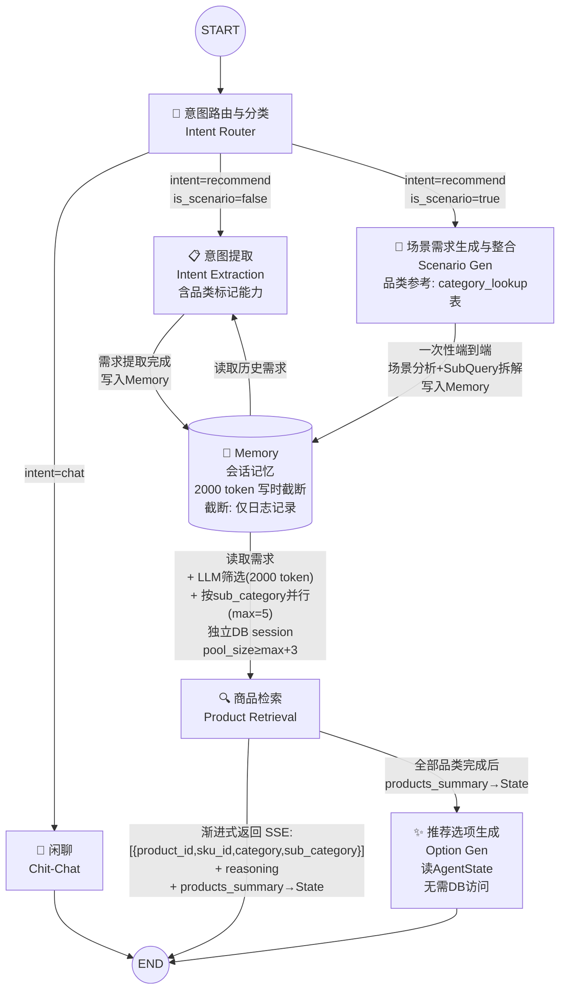

# 1 核心Agent组件

整体采用 **LangGraph 工作流架构**，Agent 之间通过状态图（StateGraph）组织，
共享 `AgentState` 作为状态通道。Memory 作为集中式会话记忆（append-only），
由 Intent Extraction 和 Scenario Gen 分别写入，Product Retrieval 负责读取和 LLM 筛选。

(1)  **意图路由与查询分类 (Intent Router)**

作为工作流的第一个节点，结合当前用户提问和对话历史（从 Memory 读取），
同时完成两级分类：

- **意图分流**：商品推荐 (recommend) / 自由聊天 (chat)
- **查询类型**：明确商品需求 (`is_scenario=false`) / 场景化需求 (`is_scenario=true`)

输出 `intent` + `is_scenario` 驱动两级条件边：先按 intent 分流 chat/recommend，
再在 recommend 分支按 is_scenario 分流 explicit/scenario 两条路径。

(2)  **意图提取 (Intent Extraction)**

仅处理明确商品需求路径（`is_scenario=false`）。负责从用户提问中提取结构化 SubQuery 列表，
复用现有 QueryParser 的查询分解能力（strategy: semantic/keyword/structured_filter）。
**使用扩展后的 `QUERY_PARSE_SYSTEM`**（`app/rag/prompt.py`）——在现有提示词基础上新增
`category`/`sub_category` 输出字段 + 品类标记指引 + 需求合并逻辑，与现有 `/api/search`
的 QueryParser 共用同一份提示词。**具备品类标记能力**——在能确定品类时为 SubQuery 标注
`category`/`sub_category` 字段，使 explicit 路径的 SubQuery 与 Scenario Gen 路径保持数据契约一致，
Product Retrieval 可按 sub_category 分组而非全部归入 default 组。
输出 SubQuery 列表写入 Memory。

> **设计决策**：本节点不再输出 `topic_shift` 标志。话题切换的判断完全交由
> Product Retrieval 的轻量级 LLM 筛选步骤处理，避免僵化的规则式判断
> 导致跨品类关联需求（如"跑鞋"→"运动袜"）被误判为不相关。

(3)  **场景需求生成与整合 (Scenario Gen)**（合并原 Scenario Integration）

处理场景化需求路径（`is_scenario=true`）。合并了原 Scenario Gen 和 Scenario Integration
两个节点的职责，**单次 LLM 调用 + 一次性端到端提示词**完成从场景描述到带品类标签的
SubQuery 列表的全流程：

1. **场景分析**：根据用户场景描述（如"去三亚旅游需要准备什么"），
   从 **category 查找表**读取可用品类列表（每次请求 `SELECT category, sub_category FROM category_lookup`，
   数据量 < 200 行，无需缓存），结合 LLM 常识推断隐含约束
   （如"三亚"→热带→防水防汗、速干材质），确定所需品类及评价需求
2. **SubQuery 拆解**：直接在输出中按品类分组，每条 SubQuery 标注 `category` 和 `sub_category`
   （取值参考 category 查找表）

输出：`scenario_description`（原始场景描述，供 Option Gen 使用）+ `requirements.sub_queries`。

(4)  **商品检索 (Product Retrieval)**

从 Memory 读取完整 SubQuery 列表（含历史），执行多步操作：

- **LLM 需求筛选**：使用轻量级提示词，从 Memory 历史需求中筛选与当前用户查询相关的需求子集。
  输入窗口与 Memory 截断阈值一致（**2000 token**），不依赖 `topic_shift` 等规则式标志，
  支持跨品类关联（如"跑鞋"→"运动袜"）。
- **按 sub_category 分组并行检索**：将筛选后的 SubQuery 按 `sub_category` 字段分组
  （无 `sub_category` 时回退 `category`，无 `category` 时归入 `default`），
  **各组并行执行检索**（Retriever → Generator）。最大并发数 5（`config.yaml` 中
  `search.max_category_concurrency` 可配，启动时加载，运行时不动态调整），
  品类数超出时自动分批并发。
- **独立 DB session**：每个并行任务通过 `async_session()` 创建**独立 AsyncSession**，
  从连接池获取独立连接，确保真正并发执行。连接池 `pool_size` ≥ `max_category_concurrency` + 3
  （默认 ≥ 8，预留 buffer 应对并发请求），`max_overflow` = 5。
  共享 session 将导致 `InvalidRequestError`。
- **渐进式返回**：每完成一个品类的检索+推荐理由生成，即通过 SSE 发送该品类结果；
  **products 事件仅返回 `[{product_id, sku_id, category, sub_category}]`**。
  前端通过新的 batch API（`/api/products/batch`、`/api/products/image/batch`、
  `/api/sku/batch`）批量获取卡片所需的标题/价格/图片，大幅减少 HTTP 请求数。
  推荐理由生成时 Generator 内部通过独立 session 按需 SQL 查询商品详细信息。
- **提取 products_summary**：每品类检索完成后，从 Generator 已查询的商品详情中提取
  轻量摘要（product_id / sku_id / title / price / category / sub_category），
  聚合写入 `AgentState.products_summary`，供 Option Gen 使用（无需再次查库）。

输出：检索商品标识（按品类分组，渐进式返回）、推荐理由文本（流式 token）；
`products_summary` 写入 AgentState 供 Option Gen 使用。

(5)  **推荐选项生成 (Option Gen)**

在 Product Retrieval **所有品类返回后执行一次**。
从 **`AgentState.products_summary`** 读取全部商品的轻量摘要作为生成上下文，
**无需访问数据库**。基于当前用户需求、全部已检索商品摘要、对话历史以及
（若触发场景路径）原始场景描述，生成 2-4 条下一步推荐选项。
选项可灵活针对不同推荐品类的商品。
战略上生成互补品推荐、替代品探索、属性细化、预算调整四类选项。
输出追加到最终回复中。

> **设计决策**：Option Gen 不再通过内部 SQL 查询商品详情。
> Product Retrieval 各品类任务在检索完成时已获取全部商品详情（Generator 内部），
> 顺手提取轻量摘要写入 AgentState，Option Gen 直接读取——零额外 DB 开销，
> 数据一致性有保障（同一批查询结果），代码更简洁。

(6)  **闲聊 (Chit-Chat)**

处理与商品导购关系不大的提问。对用户提问做简短回复，
并在结尾声明自身是商品导购服务。不走 Memory 和检索管线。

(7)  **多轮对话及会话记忆机制 (Memory)**

集中式会话记忆，作为 `AgentState` 的 `conversation_history` 字段，
通过 LangGraph 的 `Annotated[list, add]` 实现自动累加。
每个元素仅存储 `{sub_queries}`（非完整对话轮次），按 token 数截断（阈值 **2000 token**，
与 LLM 筛选输入窗口一致）。Token 计数采用简易估算 `len(json.dumps(history)) / 4`，无需额外依赖。

**核心策略 — append-only + 写时截断 + 下游 LLM 筛选**：
- Memory 本身不做删除或重置，所有历史需求持续保留。
- 截断在**每次 append 后立即执行**（写时截断），允许截断不完整的需求组
  （如一个轮次的 sub_queries 被部分切分）。
- 截断发生时**仅在日志中记录**（包含截断前的 token 数、截断丢弃的需求组数），
  不向前端推送提示，不写入 AgentState 额外标志位。
- Product Retrieval 使用轻量级 LLM 提示词从完整历史中筛选与当前查询相关的需求子集，
  筛选输入窗口 2000 token（与截断阈值一致）。
- 不依赖 `topic_shift` 等规则式判断——LLM 天然理解"跑鞋"与"运动袜"的跨品类关联。

Memory 与 Intent Extraction / Scenario Gen 为写入关系，
Memory 与 Product Retrieval 为只读 + LLM 筛选关系。

### Agent 间 SubQuery 数据契约

所有向 Memory 写入的 Agent（Intent Extraction、Scenario Gen）输出统一的 SubQuery 结构：

```json
{
  "text": "...",
  "strategy": "semantic|keyword|structured_filter",
  "field": "...|null",
  "operator": "...|null",
  "value": "...|null",
  "expanded_values": [...]|null",
  "category": "...|null",
  "sub_category": "...|null"
}
```

> **新增字段说明**：`category`（可选）标记品类大类（如"面部护肤"），`sub_category`（可选）
> 标记品类细分类目（如"防晒霜"）。两个字段的取值参考 **category 查找表**（见下方）。
> Intent Extraction 在能确定品类时也应填写（与 Scenario Gen 保持一致），
> 使 explicit 路径的 SubQuery 同样可按 sub_category 分组。
> Product Retrieval 按 `sub_category` 分组检索（回退 `category` → `default`）。
> 两个字段均为可选，现有 SubQuery 构造代码不受影响。

### Category 查找表

新增 `category_lookup` 表，记录数据库中合法的 (category, sub_category) 取值对：

```sql
CREATE TABLE category_lookup (
    id SERIAL PRIMARY KEY,
    category VARCHAR NOT NULL,        -- 大类: "面部护肤"
    sub_category VARCHAR NOT NULL,    -- 细类: "防晒霜"
    UNIQUE(category, sub_category)
);

-- 从现有 product 表 DISTINCT 填充
INSERT INTO category_lookup (category, sub_category)
SELECT DISTINCT category, sub_category FROM product
WHERE category IS NOT NULL AND sub_category IS NOT NULL;
```

**用途**：
- Scenario Gen 提示词中动态注入可用品类列表（替换硬编码列表），品类变更时无需修改提示词
- Product Retrieval 分组时校验 `sub_category` 有效性，无效值回退到 `category` 分组

**维护方式**：通过 **`/server/scripts/` 下手动脚本**构建表结构和填充数据。
执行步骤和时机在 `operation.md` 中说明。不采用应用启动自动同步（避免 product 表
数据量大时全表扫描拖慢启动速度）。

### Fallback 策略

| Agent | 失败/超时行为 |
|---|---|
| Intent Router | 默认 `intent="recommend"`, `is_scenario=false` |
| Intent Extraction | 回退为 `[SubQuery(text=user_query, strategy="semantic")]` |
| Scenario Gen | 视为误判，回退到 Intent Extraction 做 explicit 分解 |
| Product Retrieval | LLM 筛选失败 → 使用 Memory 全部 2000 token 历史；单品类检索失败 → 品类任务内 try/except，返回 `error` 字段（不抛异常），`failed_categories` 汇总记录，其他品类继续；全部失败 → 用原始 `user_query` 做语义检索兜底；失败品类不写入 products_summary |
| Option Gen | 跳过，回复末尾不追加选项 |
| Chit-Chat | 返回硬编码兜底消息 |


# 2 多Agent协作关系

## (1) Agent 协作关系图



## (2) Agent 转移关系表

| # | 源 Agent | 条件 / 触发 | 目标 Agent | 语义 |
|---|---|---|---|---|
| 1 | START | —— | Intent Router | 用户输入进入系统 |
| 2 | Intent Router | `intent == "chat"` | Chit-Chat | 识别为闲聊意图 |
| 3 | Intent Router | `intent == "recommend"`, `is_scenario == false` | Intent Extraction | 明确商品需求，进入显式分解路径（含品类标记） |
| 4 | Intent Router | `intent == "recommend"`, `is_scenario == true` | Scenario Gen | 场景化需求，进入场景路径（品类参考 category_lookup 表） |
| 5 | Memory | Intent Extraction 读取 | Intent Extraction | 提取需求前读取历史需求，辅助合并判断 |
| 6 | Intent Extraction | 需求提取完成 | Memory（写入） | SubQuery 列表写入会话记忆（写时截断 2000 token，截断仅日志记录） |
| 7 | Scenario Gen | 场景分析 + SubQuery 拆解完成 | Memory（写入） | SubQuery 列表（带 category/sub_category）写入 |
| 8 | Memory | Product Retrieval 读取 | Product Retrieval | 读取历史 + LLM 筛选(2000 token) + 按 sub_category 分组并行检索(max=5, 独立 session, pool_size≥max+3) |
| 9 | Product Retrieval | 所有品类检索完成 | Option Gen | 渐进式 SSE 返回（ID + reasoning）+ products_summary 写入 AgentState |
| 10 | Option Gen | 始终 | END | 读 AgentState.products_summary → 输出跨品类选项（无需 DB） |
| 11 | Chit-Chat | 始终 | END | 输出闲聊回复 |

## (3) Agent 协作设计要点

- **Router 两级分流**：Intent Router 同时完成 intent 分类和 is_scenario 判断，
  减少一次 LLM 调用。推荐路径分叉为 explicit 和 scenario 两条路径，在 Memory 处汇合。
- **Explicit 路径**：Router → Intent Extraction → Memory → Product Retrieval → Option Gen。
  Intent Extraction 仅处理明确商品需求，复用 QueryParser，**具备品类标记能力**。
- **Scenario 路径**：Router → Scenario Gen → Memory → Product Retrieval → Option Gen。
  Scenario Gen 合并了场景分析和 SubQuery 拆解，单节点一次性端到端完成场景→子查询的全流程。
  品类列表从 category_lookup 表动态注入提示词。
- **两条路径在 Memory 处汇合**：无论走哪条路径，最终都产出统一的 SubQuery 列表写入 Memory，
  Product Retrieval 从 Memory 读取（含 LLM 筛选）后执行检索。
- **Memory ↔ Intent Extraction 读写闭环**：Extraction 执行前从 Memory 读取历史需求；
  执行后写入。Memory 采用 append-only + 写时截断策略（2000 token），
  截断仅在日志记录。
- **Memory → Scenario Gen 只写**：Scenario Gen 从 Router 接收输入，写入 Memory，不从 Memory 读取。
- **Memory → Product Retrieval 只读 + LLM 筛选**：检索 Agent 读取完整历史，
  使用轻量级 LLM 调用筛选相关需求子集（输入窗口 2000 token），
  按 sub_category 分组并行渐进式检索。
- **并行检索 + 独立 session**：多品类并行执行，最大并发数 5（config.yaml 可配，启动时加载），
  超出时分批并发。每个并行任务通过 `async_session()` 创建独立 `AsyncSession`，
  从连接池获取独立连接，避免共享 session 导致的 `InvalidRequestError`。
  连接池 `pool_size` ≥ `max_category_concurrency` + 3（默认 ≥ 8），`max_overflow` = 5。
- **SSE 精简 + 前端 batch API 取详情**：products 事件仅返回 `[{product_id, sku_id, category, sub_category}]`。
  前端通过 `/api/products/batch`、`/api/products/image/batch`、`/api/sku/batch`
  三个 batch API 批量获取标题/价格/图片，将请求数从最多 45 次降至 3 次。
  Generator 内部通过独立 session 按需 SQL 查询。
- **Option Gen 零 DB 访问**：Product Retrieval 每品类检索完成后提取轻量摘要
  （product_id/sku_id/title/price/category/sub_category）写入
  `AgentState.products_summary`。Option Gen 直接从 State 读取，无需 session。
- **LangGraph 条件边**：Intent Router 使用两级 `add_conditional_edges` 实现三路分叉
  （chat / recommend+explicit / recommend+scenario）。
- **无 topic_shift**：不依赖规则式话题切换检测，完全由 Product Retrieval 的 LLM 筛选步骤
  动态判断历史需求相关性，灵活处理跨品类关联场景。


# 3 各Agent的提示词示例

## 3.0 I/O 规约总览

| Agent | 输入（从 State 读取） | 输出（写入 State） | 下游消费者 |
|---|---|---|---|
| **Intent Router** | `user_query`, `conversation_history` | `intent`, `is_scenario` | 条件边 → Chit-Chat 或 Intent Extraction 或 Scenario Gen |
| **Intent Extraction** | `user_query`, `conversation_history`（从 Memory 读） | `requirements: {sub_queries: [{..., category, sub_category}]}` | Memory（写入）→ Product Retrieval |
| **Scenario Gen** | `user_query`, `conversation_history`, `category_list`（从 category_lookup 表读） | `scenario_description: str`, `requirements: {sub_queries: [{..., category, sub_category}]}` | Memory（写入）→ Product Retrieval；scenario_description → Option Gen |
| **Product Retrieval** | `requirements.sub_queries`（从 Memory 读）, `user_query` | `products: [{product_id, sku_id, category, sub_category}]`（SSE 渐进式返回）, `reasoning: str`（流式 token）, `products_summary: [{product_id, sku_id, title, price, category, sub_category}]`（写入 AgentState） | END（用户可见，前端调 batch API 取详情）+ Option Gen（全部品类完成后，读 products_summary） |
| **Option Gen** | `requirements`, `products_summary`（从 AgentState 读）, `conversation_history`, `scenario_description: str\|null` | `next_options: [str]` | END（追加到回复末尾） |
| **Chit-Chat** | `user_query`, `conversation_history` | `chat_reply: str` | END（用户可见） |

## 3.1 Intent Router（意图路由与查询分类）

### 输入规约

```
- user_query: str              # 当前用户提问原文
- conversation_history: list   # Memory 中的历史对话记录
```

### 输出规约

```
- intent: "recommend" | "chat"
- is_scenario: bool            # True=场景化需求, False=明确商品需求（仅 intent=recommend 时有效）
```

### 提示词

```text
你是一个电商导购意图分类器。根据用户提问和对话历史，同时完成两级分类。

## 分类规则

### 第一级：意图分流
- recommend：用户提问涉及商品需求、购物建议、产品比较、场景化推荐等。
  - 示例："推荐一款蓝牙耳机"、"跑步穿什么鞋"、"去三亚需要准备什么"
  - 多轮对话中，若历史已确立推荐意图，后续追问也属于 recommend。
- chat：用户提问与商品导购无关。
  - 示例："今天天气怎么样"、"你好"、"讲个笑话"

### 第二级：查询类型（仅 recommend）
- is_scenario=true：用户描述了一个使用场景而非具体商品。
  - 示例："去三亚旅游"、"怕晒黑怎么办"、"换季护肤需要买什么"
  - 特征：无法直接用品类关键词概括，需要分析场景后拆解为多个品类。
- is_scenario=false：用户明确提出了具体商品需求。
  - 示例："蓝牙耳机"、"200元以下的跑鞋"、"保湿面霜推荐"

## 输出格式
只返回 JSON：
{"intent": "recommend", "is_scenario": false}
或 {"intent": "chat", "is_scenario": false}

## 对话历史
{conversation_history}

## 用户提问
{user_query}
```

---

## 3.2 Intent Extraction（意图提取）

### 输入规约

```
- user_query: str              # 当前用户提问
- conversation_history: list   # Memory 历史记录（sub_queries 列表）
```

### 输出规约

```json
{
  "requirements": {
    "sub_queries": [
      {
        "text": "蓝牙耳机",
        "strategy": "keyword",
        "field": null,
        "operator": null,
        "value": null,
        "expanded_values": null,
        "category": "数码电子",
        "sub_category": "蓝牙耳机"
      },
      {
        "text": "",
        "strategy": "structured_filter",
        "field": "price",
        "operator": "lt",
        "value": 200,
        "expanded_values": null,
        "category": null,
        "sub_category": null
      }
    ]
  }
}
```

> **品类标记说明**：Intent Extraction 在能确定品类时填写 `category`/`sub_category`。
> category 取值参考 product 表中的大类（如"数码电子"、"面部护肤"、"服饰"），
> sub_category 填写具体细类（如"蓝牙耳机"、"防晒霜"）。
> 无法确定时保持 null——Product Retrieval 会通过三级回退（sub_category → category → default）处理。
> 这与 Scenario Gen 的输出规范一致，确保两条路径的 SubQuery 可统一分组。

### 提示词

```text
你是一个电商查询意图分解专家。将用户的明确商品需求拆解为结构化的 SubQuery 列表。

## 任务
将用户查询拆分为多个子查询，结合对话历史进行需求合并（如同品类累加约束）。

## 查询分解规则
将用户查询拆分为多个子查询，以 JSON 数组返回：

- text: str — 子查询文本
- strategy: str — "semantic" | "keyword" | "structured_filter"
- field: str|null — structured_filter 的目标字段
- operator: str|null — eq|lt|gt|in|not_in|contains|not_contains
- value: str|float|null — 单值比较
- expanded_values: list[str]|null — 多值展开（需要世界知识时填入）
- category: str|null — 品类大类（能确定时填写，如"面部护肤"、"数码电子"）
- sub_category: str|null — 品类细类（能确定时填写，如"防晒霜"、"蓝牙耳机"）

### 拆分规则
1. 模糊主观/评价意图 → strategy="semantic"，text 须为评价短句
   例："保湿效果好" "充电速度快" "质地清爽不油腻"
2. 具体关键词 → strategy="keyword"，text 为核心词
   例："蓝牙耳机" "洗面奶" "iPhone"
   → 同时标注 category/sub_category（能确定时）
3. 可结构化条件 → strategy="structured_filter"：
   - 否定条件直接用 not_in/not_contains 操作符表达
   - 需要世界知识时填入 expanded_values（如"日系品牌"→展开为日系品牌列表）
4. 内容级否定（如"不含酒精"）→ strategy="semantic"，text 表述为"产品评价中是否提及XX成分"

### 品类标记指引
- 当 text 包含明确商品品类关键词时，填写 category（大类）和 sub_category（细类）
- 参考常见电商品类体系：面部护肤（防晒霜/洗面奶/面霜...）、服饰（T恤/跑鞋/牛仔裤...）、
  数码电子（蓝牙耳机/充电宝/数据线...）等
- 无法确定品类时保持 null——下游 Product Retrieval 会统一处理

### 可用数据表
- product: brand, category, sub_category, title
- sku: price, stock, properties (JSONB，key 因 sub_category 而异)

## 需求合并
- 若对话历史中存在同品类历史需求，将当前约束与历史累加（如历史"跑鞋" + 当前"轻量" → 合并输出）
- 品类完全不同的历史需求不需要合并，但也不删除——由下游 Product Retrieval 做 LLM 筛选

## 输出格式
只返回 JSON，格式如输出规约所示。

## 对话历史
{conversation_history}

## 用户提问
{user_query}
```

---

## 3.3 Scenario Gen（场景需求生成与整合）

> **合并说明**：本节点合并了原 Scenario Gen（场景分析 → 品类清单）和 Scenario Integration
> （品类清单 → SubQuery 拆解）的职责。采用**一次性端到端提示词**，LLM 直接按品类分组
> 输出带 `category` + `sub_category` 标签的 SubQuery 列表。
> 可用品类列表从 **category_lookup 表**动态注入，无需在提示词中硬编码。

### 输入规约

```
- user_query: str              # 用户描述的场景原文
- conversation_history: list   # Memory 历史记录
- category_list: str           # 从 category_lookup 表查询的可用品类列表
```

### 输出规约

```json
{
  "scenario_description": "下周去三亚度假，帮我搭配一套从防晒到穿搭的方案",
  "requirements": {
    "sub_queries": [
      {"text": "防晒霜", "strategy": "keyword", "category": "面部护肤", "sub_category": "防晒霜", "field": null, "operator": null, "value": null, "expanded_values": null},
      {"text": "高倍防晒 SPF50+ PA++++", "strategy": "semantic", "category": "面部护肤", "sub_category": "防晒霜", "field": null, "operator": null, "value": null, "expanded_values": null},
      {"text": "清爽不油腻 防水防汗", "strategy": "semantic", "category": "面部护肤", "sub_category": "防晒霜", "field": null, "operator": null, "value": null, "expanded_values": null},
      {"text": "墨镜", "strategy": "keyword", "category": "服饰", "sub_category": "墨镜", "field": null, "operator": null, "value": null, "expanded_values": null},
      {"text": "偏光防紫外线 轻便可折叠", "strategy": "semantic", "category": "服饰", "sub_category": "墨镜", "field": null, "operator": null, "value": null, "expanded_values": null}
    ]
  }
}
```

> `category` 和 `sub_category` 的取值必须来自 category_lookup 表中已有的值对。
> Product Retrieval 按 `sub_category` 分组检索（回退：无 sub_category → 按 category；
> 无 category → default）。

### 提示词

```text
你是一个场景化商品需求分析师。根据用户描述的场景，一次性完成场景分析并按品类分组输出 SubQuery 列表。

## 任务
1. 从下方可用品类列表中选取该场景需要的品类（category + sub_category），不超过 6 个
2. 分析场景隐含约束（地点、气候、活动类型等），推导评价需求
3. 对每个品类直接拆解为 SubQuery：
   - category 字段 → strategy="keyword"，text 为 sub_category 名称，
     category 标注大类，sub_category 标注细类
   - 评价类需求（结合场景隐含约束）→ strategy="semantic"，text 为自然语言评价短句
   - 结构化过滤（价格、品牌等）→ strategy="structured_filter"
   - 每个品类 2-5 条 SubQuery
4. 所有品类合并为一个 SubQuery 列表，按品类聚拢排列
5. 保留原始场景描述文本
6. **重要**：category 和 sub_category 的取值必须精确匹配下方可用品类列表中的值

## 隐含约束推断示例
- "三亚" → 热带海岛 → 高倍防晒、防水防汗、速干、轻薄透气
- "冬季滑雪" → 低温环境 → 保暖、防风防水、防滑
- "商务出差" → 正式场合 → 便携、抗皱、简约设计

## 可用品类列表
{category_list}

## 输出格式
只返回 JSON，不要输出分析过程：
{
  "scenario_description": "原始场景原文",
  "requirements": {
    "sub_queries": [
      {"text": "...", "strategy": "keyword", "category": "...", "sub_category": "...", "field": null, "operator": null, "value": null, "expanded_values": null},
      {"text": "...", "strategy": "semantic", "category": "...", "sub_category": "...", "field": null, "operator": null, "value": null, "expanded_values": null}
    ]
  }
}

## 用户场景
{user_query}
```

---

## 3.4 Product Retrieval（商品检索）

### 输入规约

```
- requirements.sub_queries: [SubQuery]  # 从 Memory 读取的完整历史 SubQuery 列表（2000 token 窗口）
- user_query: str                        # 当前用户提问
```

### 内部流程

```text
Memory 完整历史（截断阈值 2000 token，写时截断，仅日志记录）
  → [LLM 需求筛选：输入窗口 2000 token，根据 user_query 从历史中筛选相关 SubQuery]
  → [按 sub_category 分组（回退: sub_category → category → default）]
  → [并行检索（max_concurrency=5，config.yaml 可配，启动时加载，运行时不动态调整）]：
      对每组品类（并行执行，超出并发数则分批）：
        async with async_session() as db:    ← 独立 session（pool_size≥max+3, max_overflow=5）
          1. Retriever.retrieve(品类 SubQuery 组)
          2. _get_skus(db, ranked)           ← 使用独立 session
          3. Generator.generate()            ← 内部可通过独立 session 按需补充查询
          4. 提取 products_summary:           ← 从 _get_skus 结果中提取轻量摘要
             [{product_id, sku_id, title, price, category, sub_category}, ...]
          5. SSE: products([{product_id, sku_id, category, sub_category}])
             + reasoning(token stream)
          6. session 自动 close()，连接归还池
  → [聚合各品类 products_summary → 写入 AgentState.products_summary]
  → 所有品类完成 → SSE done（含 failed_categories）
  → 触发 Option Gen（读 AgentState.products_summary，无需 DB）
```

### 输出规约

```
SSE 事件（渐进式，每品类一组）:
  event: products  → data: [{"product_id":"p001","sku_id":"sk001","category":"面部护肤","sub_category":"防晒霜"}, ...]
  event: reasoning → data: {"token":"这款","category":"面部护肤","sub_category":"防晒霜"} (逐 token，附带品类路由键)

写入 AgentState:
  products_summary: [{"product_id":"p001","sku_id":"sk001","title":"安热沙小金瓶","price":198,"category":"面部护肤","sub_category":"防晒霜"}, ...]

SSE 事件（全部完成后）:
  event: done → data: {"total_categories": N, "failed_categories": [{"category": "...", "sub_category": "...", "error": "..."}]}
```

> **前端渲染**：收到 products 事件后，通过 `/api/products/batch`、
> `/api/products/image/batch`、`/api/sku/batch` 三个 batch API 批量获取
> 标题/价格/图片。`category` 和 `sub_category` 字段用于前端按品类分区渲染。
> 3 次 batch 请求替代原来逐 SKU 调用（最多 45 次）。

### LLM 需求筛选提示词（轻量级，2000 token 输入窗口）

```text
你是一个需求相关性筛选器。从历史需求列表中筛选出与当前用户查询相关的需求。

## 任务
给定用户当前查询和历史需求列表（每组 SubQuery 来自之前的对话轮次），
判断每组历史需求是否与当前查询相关（同品类、互补品、同场景、跨品类关联均视为相关）。

## 相关性判断规则
1. 同品类：历史需求和当前查询涉及同一商品品类 → 相关
2. 互补品：历史需求的品类与当前查询品类存在搭配关系（如跑鞋与运动袜）→ 相关
3. 同场景：历史需求和当前查询属于同一使用场景 → 相关
4. 跨品类关联：虽然品类不同但存在消费关联（如"跑鞋"→"运动袜"、"手机"→"手机壳"）→ 相关
5. 品类完全不同且无搭配/关联关系 → 不相关

## 输出格式
只返回 JSON：
{"relevant_indices": [0, 2]}

## 当前用户查询
{user_query}

## 历史需求列表（按轮次分组，2000 token 窗口）
{history_sub_queries}
```

### 按 sub_category 分组与并行检索

LLM 筛选后，Product Retrieval 将 SubQuery 按品类分组（三级回退）：
1. 优先按 `sub_category` 分组（如"防晒霜"、"墨镜"、"沙滩裤"——更精准）
2. 无 `sub_category` → 按 `category` 分组（如"面部护肤"、"服饰"——较粗）
3. 无 `category` → 归入 `default` 组

各组**并行执行**检索管线：
- 每个并行任务通过 `async_session()` 创建独立 `AsyncSession`
- 最大并发数：**5**（`config.yaml` 中 `search.max_category_concurrency` 可配，
  启动时加载，**不支持运行时动态调整**）
- 品类数 > 最大并发数时，分批次并发
- 连接池 `pool_size` ≥ `max_category_concurrency` + 3（默认 ≥ 8），`max_overflow` = 5
- 每完成一个品类即发送 SSE 事件，前端渐进式渲染
- 每品类完成后提取轻量摘要，`asyncio.gather(*tasks)` 收集后**串行聚合**写入 `AgentState.products_summary`
- 品类任务内部 try/except，始终返回结构化结果 `{category, sub_category, products_summary, error}`；
  失败时 `error` 字段记录异常信息，"品类无结果"时 `error=None, products_summary=[]`

### products_summary 数据结构

```json
[
  {
    "product_id": "p001",
    "sku_id": "sk001",
    "title": "安热沙小金瓶防晒霜",
    "price": 198.0,
    "category": "面部护肤",
    "sub_category": "防晒霜"
  }
]
```

> **字段说明**：仅包含 Option Gen 生成选项所需的最小字段集。
> 每品类检索完成后从 `_get_skus()` 结果中直接提取，零额外查询。
> 各品类摘要聚合后写入 `AgentState.products_summary`。

### 推荐理由生成提示词（复用现有 GENERATOR_SYSTEM 并扩展）

```text
你是一个专业的导购助手。基于检索到的商品信息，为用户推荐合适的商品。

## 规则
1. 只能使用以下提供的商品信息，不得编造任何价格、库存、功能、优惠券或折扣
2. 如果商品信息不足以满足用户需求，请诚实告知，不要编造
3. 推荐时说明推荐理由，引用商品的真实属性
4. 以自然、友好的语气回复
5. 不要提及"根据检索结果""根据商品信息"等元表述
6. 商品信息中附带【用户评价与描述】段落时：
   a. 优先引用用户评价中的真实体验作为推荐依据
   b. 区分"官方描述"（品牌声称）和"用户评价"（真实反馈），用户评价的权重高于官方描述
   c. 如果用户评价与官方描述矛盾，以用户评价为准
7. 推荐理由控制在{reasoning_max_chars}字以内，简洁有据
8. 必须为结果列表中的每一个商品都说明推荐理由；如果多个SKU属于同一商品，合并介绍后简要说明各SKU的规格差异和价格即可
9. 用户需求中包含多条评价类需求时，逐条回应每个需求是否满足；若某方面在商品信息中缺乏相关数据，诚实说明"目前商品信息中未提及"

## 用户需求
{requirements_summary}

## 可用商品信息
{product_context}

请为用户推荐：
```

> **复用说明**：`{requirements_summary}` 由本组品类的 SubQuery 中
> `strategy="semantic"` 和 `strategy="keyword"` 的 `text` 聚合而成。
> `{product_context}` 由 Generator 内部通过独立 session + `_get_skus()` 查询构建。
> 其余字段与现有 `GENERATOR_SYSTEM` 完全一致（参见 `server/app/rag/prompt.py`）。

---

## 3.5 Option Gen（推荐选项生成）

> **触发时机**：在所有品类检索完成后执行一次。
> **数据来源**：从 `AgentState.products_summary` 读取全部商品的轻量摘要，
> **无需访问数据库**。Product Retrieval 已在检索阶段获取全部商品详情并提取摘要。

### 输入规约

```
- requirements: dict              # 当前用户需求（整合后的 SubQuery 摘要）
- products_summary: list          # 从 AgentState 读取的商品摘要
                                  # [{product_id, sku_id, title, price, category, sub_category}, ...]
- conversation_history: list      # Memory 历史记录
- scenario_description: str|null  # 若触发了 Scenario Gen，传入原始场景描述
```

### 输出规约

```json
{
  "next_options": [
    "需要搭配专业的跑步袜吗？",
    "想看看 300-500 元价位的中高端跑鞋吗？"
  ]
}
```

### 提示词

```text
你是一个电商导购推荐选项生成器。基于用户当前需求和已推荐的全部商品，推测用户下一步可能的需求。

## 任务
分析用户的当前需求和已推荐的全部商品（可能跨多个品类），生成 2-4 个下一步推荐选项。
这些选项应当是用户在当前购物路径上可能继续提出的需求，用于辅助多轮对话。

## 选项生成策略
1. **互补品推荐**：当前商品需要搭配使用的产品（如推荐了跑鞋 → "需要搭配运动袜吗？"）
2. **替代品探索**：同品类但不同定位的选项（如推荐了入门款 → "想看看更高端的专业款吗？"）
3. **属性细化**：帮助用户进一步缩小范围（如推荐了多款 → "需要限定某个品牌或色系吗？"）
4. **预算调整**：基于价格区间提供放宽或收紧建议

## 规则
1. 选项必须基于数据库中可能存在的商品品类，不得虚构不存在的品类
2. 选项文案自然友好，使用问句或建议语气
3. 不要重复用户已经表达过的需求
4. 选项不要超过 4 条，优先级从高到低排列
5. 如果涉及多个品类，选项可以灵活针对不同品类的商品（如同时推荐了跑鞋和防晒霜，可以分别生成运动袜和晒后修复的选项）
6. 如果某品类检索失败（见 failed_categories），避免生成该品类的相关选项

## 输出格式
只返回 JSON，格式如输出规约所示。

## 当前用户需求
{requirements}

## 原始场景描述（如有）
{scenario_description}

## 已推荐商品摘要
{products_summary}

## 对话历史
{conversation_history}
```

> **关键变化**：`{products_summary}` 直接来自 AgentState，包含 product_id/sku_id/title/price/
> category/sub_category。Option Gen 不再执行 SQL 查询，数据由 Product Retrieval
> 在检索阶段提取并传递。这消除了 Option Gen 对数据库的依赖，简化了 session 管理。

---

## 3.6 Chit-Chat（闲聊）

### 输入规约

```
- user_query: str              # 用户提问
- conversation_history: list   # Memory 历史记录
```

### 输出规约

```
- chat_reply: str              # 闲聊回复
```

### 提示词

```text
你是一个友好的电商导购助手。用户当前提问与商品导购关系不大，请做简短友好的回复。

## 规则
1. 回复简短（不超过 80 字）
2. 语气自然友好
3. 在回复结尾声明服务范围，例如："我主要可以帮助您推荐和比较商品，有需要的话随时告诉我！"
4. 不要编造商品信息或推荐任何产品

## 用户提问
{user_query}
```


# 4 查询场景例子

## 4.1 单轮对话："200 元以下的蓝牙耳机有哪些？"

```text
用户: "200 元以下的蓝牙耳机有哪些？"

━━━ ① Intent Router ━━━
  Input:  user_query, conversation_history=[]
  Output: intent="recommend", is_scenario=false
  → 条件边: is_scenario=false → Intent Extraction

━━━ ② Intent Extraction ━━━
  Input:  user_query, conversation_history=[]
  Logic:  查询分解：keyword("蓝牙耳机") + structured_filter(price<200)
          → 品类标记: category="数码电子", sub_category="蓝牙耳机"
  Output: requirements.sub_queries=[
            {text:"蓝牙耳机", strategy:"keyword", category:"数码电子", sub_category:"蓝牙耳机"},
            {text:"", strategy:"structured_filter", field:"price", operator:"lt", value:200}
          ]
  → Memory: 写入后写时截断（2000 token，截断仅日志记录）

━━━ ③ Product Retrieval ━━━
  Input:  sub_queries（从 Memory 读取）, user_query
  Logic:  LLM 筛选（首轮跳过）
          → sub_category="蓝牙耳机" → 单独一组（无需并发）
          → async_session() → Retriever.retrieve() → _get_skus() → Generator.generate()
          → 提取 products_summary: [{p001,sk001,"漫步者...",199,"数码电子","蓝牙耳机"},...]
          → SSE: products([{product_id,sku_id,category:"数码电子",sub_category:"蓝牙耳机"}])
            → reasoning(token stream)
  Output: SSE products: [{p001,sk001},{p002,sk002},{p003,sk003}],
          SSE reasoning: "为您找到 3 款 200 元以内的蓝牙耳机..."
  AgentState.products_summary: [{p001,sk001,"漫步者...",199,...},...]

━━━ ④ 前端 ━━━
  收到 products → 调 /api/products/batch?ids=p001,p002,p003
                 + /api/products/image/batch?ids=p001,p002,p003
                 + /api/sku/batch?ids=sk001,sk002,sk003
  → 3 次 batch 请求（替代原来的 9 次逐一调用）
  → 渲染商品卡片（标题/价格/图片）

━━━ ⑤ Option Gen ━━━
  Input:  requirements, products_summary（从 AgentState 读）, scenario_description=null
  Logic:  读 AgentState → 无需 DB → LLM 生成选项
  Output: next_options=["需要关注降噪功能吗？", "想看看 100 元以内的入门款吗？"]

━━━ 最终回复 ━━━
  → 前端：商品卡片（batch API 获取）+ 推荐理由（reasoning 文本）+ 下一步选项
```

## 4.2 多轮对话："帮我推荐跑鞋" → "要轻量的" → "预算 500 以内"

### Turn 1："帮我推荐跑鞋"

```text
━━━ ① Intent Router ━━━
  Output: intent="recommend", is_scenario=false

━━━ ② Intent Extraction ━━━
  Input:  user_query="帮我推荐跑鞋", conversation_history=[]
  Output: requirements.sub_queries=[
            {text:"跑鞋", strategy:"keyword", category:"运动户外", sub_category:"跑鞋"}
          ]
  → Memory: 写入，2000 token 写时截断（截断仅日志记录）

━━━ ③ Product Retrieval ━━━
  Input:  sub_queries, user_query
  Logic:  LLM 筛选（首轮无历史）→ sub_category="跑鞋" → 独立 session 检索
          → 提取 products_summary 写入 AgentState
  Output: SSE products: [{p010,sk010,...}] → reasoning...

━━━ ⑤ Option Gen ━━━（读 AgentState.products_summary）
  Output: next_options=["需要限定预算范围吗？", "偏好哪个品牌？"]
```

### Turn 2："要轻量的"（需求累加）

```text
━━━ ① Intent Router ━━━
  Output: intent="recommend", is_scenario=false

━━━ ② Intent Extraction ━━━
  Input:  user_query="要轻量的"
          从 Memory 读取: [{sub_queries: [{text:"跑鞋", strategy:"keyword", category:"运动户外", sub_category:"跑鞋"}]}]
  Logic:  需求合并：历史"跑鞋" + 当前 semantic("轻量化设计")
  Output: requirements.sub_queries=[
            {text:"跑鞋", strategy:"keyword", category:"运动户外", sub_category:"跑鞋"},
            {text:"轻量化设计", strategy:"semantic"}
          ]
  → Memory: append，写后截断（当前 2 组远低于 2000 token）

━━━ ③ Product Retrieval ━━━
  Input:  2 组 sub_queries（均在 2000 token 窗口内）
  Logic:  LLM 筛选 → 全部相关 → 独立 session 检索
          → sub_category="跑鞋" → 提取 products_summary
  Output: SSE products: [{p011,sk011}] → reasoning...
```

### Turn 3："预算 500 以内"（再次累加）

```text
━━━ ①② 同前 ━━━
  Output: requirements.sub_queries=[{跑鞋}, {轻量化}, {price<500}]
  → Memory: append（3 组均在 2000 token 内）

━━━ ③ Product Retrieval ━━━
  Input:  3 组 sub_queries（2000 token 窗口内）
  Logic:  LLM 筛选 → 全部相关 → 安踏 C202（¥399, 180g）完美匹配
          → 提取 products_summary

━━━ ⑤ Option Gen ━━━（读 AgentState.products_summary，无需 DB）
  Output: next_options=["需要搭配跑步袜吗？", "想了解更高端的专业竞速款吗？"]
```

> 当对话持续 20+ 轮，2000 token 写时截断自动丢弃早期需求。截断信息仅在日志中记录。

## 4.3 场景化推荐："下周去三亚度假，帮我搭配一套从防晒到穿搭的方案"

```text
用户: "下周去三亚度假，帮我搭配一套从防晒到穿搭的方案"

━━━ ① Intent Router ━━━
  Input:  user_query, conversation_history=[]
  Output: intent="recommend", is_scenario=true
  → 条件边: is_scenario=true → Scenario Gen

━━━ ② Scenario Gen（一次性端到端）━━━
  Input:  user_query, conversation_history,
          category_list（从 category_lookup 表查询的动态品类列表）
  Logic:  一次性分析+拆解：
          从 category_lookup 表获知可用品类 → 选取匹配三亚场景的品类
          场景分析 → 热带海岛 → 高倍防晒、防水防汗、速干透气、偏光防紫外线
  Output: scenario_description="下周去三亚度假，帮我搭配一套..."
          requirements.sub_queries=[
            {text:"防晒霜", strategy:"keyword", category:"面部护肤", sub_category:"防晒霜"},
            {text:"高倍防晒 SPF50+ PA++++", strategy:"semantic", category:"面部护肤", sub_category:"防晒霜"},
            {text:"清爽不油腻 防水防汗", strategy:"semantic", category:"面部护肤", sub_category:"防晒霜"},
            {text:"墨镜", strategy:"keyword", category:"服饰", sub_category:"墨镜"},
            {text:"偏光防紫外线 轻便可折叠", strategy:"semantic", category:"服饰", sub_category:"墨镜"},
            {text:"沙滩裤", strategy:"keyword", category:"服饰", sub_category:"沙滩裤"},
            {text:"速干透气 轻薄", strategy:"semantic", category:"服饰", sub_category:"沙滩裤"},
            {text:"遮阳帽", strategy:"keyword", category:"服饰", sub_category:"遮阳帽"},
            {text:"大帽檐 透气 可折叠", strategy:"semantic", category:"服饰", sub_category:"遮阳帽"},
            {text:"凉鞋", strategy:"keyword", category:"服饰", sub_category:"凉鞋"},
            {text:"防滑舒适 速干", strategy:"semantic", category:"服饰", sub_category:"凉鞋"}
          ]（2 大类 × 5 细类 × 2-3 条 ≈ 11 条）
  → Memory: 写入，2000 token 写时截断（截断仅日志记录）

━━━ ③ Product Retrieval ━━━
  Input:  sub_queries（11 条，带 category + sub_category）, user_query
  Logic:  LLM 筛选（首轮无历史 → 全部保留）
          → 按 sub_category 分组（5 组）：
            防晒霜(3条) / 墨镜(2条) / 沙滩裤(2条) / 遮阳帽(2条) / 凉鞋(2条)
          → 并行检索（5 组 ≤ max_concurrency=5，全部并发）：
            每个任务: async_session() → Retriever.retrieve() → _get_skus() → Generator.generate()
                     → 提取 products_summary
          → 连接池: 5 个并行 session + 主请求可能 1 个 → pool_size≥8 足够
  SSE 事件流（按实际完成顺序渐进返回）:
    event: products  → [{"product_id":"p001","sku_id":"sk001","category":"面部护肤","sub_category":"防晒霜"}, ...]
    event: reasoning → {"token":"针","category":"面部护肤","sub_category":"防晒霜"}
    event: products  → [{"product_id":"p010","sku_id":"sk010","category":"服饰","sub_category":"墨镜"}, ...]
    event: reasoning → {"token":"墨","category":"服饰","sub_category":"墨镜"}
    ...（其余 3 品类按完成顺序）
    event: done → {"total_categories":5, "failed_categories":[]}

  AgentState.products_summary: [
    {p001,sk001,"安热沙小金瓶",198,"面部护肤","防晒霜"},
    {p002,sk002,"资生堂蓝胖子",239,"面部护肤","防晒霜"},
    {p010,sk010,"雷朋飞行员",599,"服饰","墨镜"},
    ...（5 品类 × 3 SKU ≈ 15 条）
  ]

━━━ ④ 前端 ━━━
  收到全部 products 事件后（或渐进式收到每批后）:
    → /api/products/batch?ids=p001,p002,p010,...   （1 次请求）
    → /api/products/image/batch?ids=p001,p002,p010,... （1 次请求）
    → /api/sku/batch?ids=sk001,sk002,sk010,...       （1 次请求）
  → 共 3 次 batch 请求（替代原来的 15×3=45 次逐一调用）
  → 按 category 分区渲染商品卡片 + reasoning 文本

━━━ ⑤ Option Gen（所有品类完成后执行）━━━
  Input:  requirements, products_summary（从 AgentState 读，15 条摘要）, scenario_description
  Logic:  读 AgentState → 无需 DB → LLM 分析 5 品类商品 → 推断缺失品类（泳衣、晒后修复）
  Output: next_options=["需要推荐泳衣吗？", "需要搭配晒后修复产品吗？"]
```

> 若品类数超过 5（如 8 品类），第一批 5 组并发执行，剩余 3 组在第一批有完成时自动补入。
> 单品类失败不影响其他品类，失败信息在 done 事件的 `failed_categories` 中体现，
> 失败品类的商品不会出现在 products_summary 中。

## 4.4 三场景对比总结

| 维度 | 4.1 单轮对话 | 4.2 多轮对话 | 4.3 场景化推荐 |
|---|---|---|---|
| Intent Router | recommend + is_scenario=false | recommend + is_scenario=false（×3） | recommend + is_scenario=true |
| 路径 | Explicit | Explicit | Scenario |
| Scenario Gen | 不触发 | 不触发 | 触发，品类参考 category_lookup 表，一次性端到端 |
| SubQuery 结构 | 带 category/sub_category（Extraction 标记） | 带 category/sub_category（Extraction 标记） | 带 category + sub_category（来自查找表） |
| Memory | 1 组，2000 token 写时截断 | 3 组 append，2000 token 写时截断 | 1 组 11 条，2000 token 写时截断 |
| Memory 截断记录 | 仅日志 | 仅日志 | 仅日志 |
| LLM 筛选 | 首轮跳过 | 3 组全部相关 | 首轮跳过 |
| 分组粒度 | sub_category="蓝牙耳机"（单组） | sub_category="跑鞋"（单组） | 按 sub_category 分为 5 组 |
| 检索策略 | 单组，独立 session | 单组，独立 session | 5 组并行（max=5），各自独立 session |
| DB session | 1 个 async_session() | 1 个 async_session() | 5 个 async_session() 并发 |
| 连接池 | pool_size≥8, max_overflow=5 | pool_size≥8 | pool_size≥8, 5并发+主请求=6, 2 buffer |
| SSE products | [{product_id, sku_id, category, sub_category}] | 同左 | 同左 × 5 |
| 前端详情 | /api/products/batch 等 3 个 batch API | 同左 | 同左，3 次请求，按 category 分区渲染 |
| reasoning | 单段流式 | 单段流式 | 5 段流式（每品类一段，交错发送） |
| products_summary | 写入 AgentState | 写入 AgentState | 聚合写入 AgentState（15 条） |
| Option Gen | 读 AgentState，无需 DB | 读 AgentState，无需 DB | 读 AgentState，无需 DB，跨品类灵活选项 |
