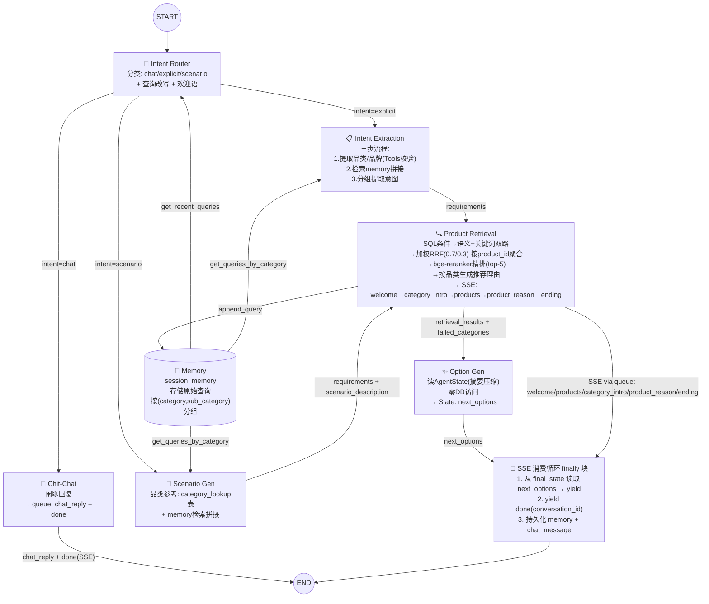
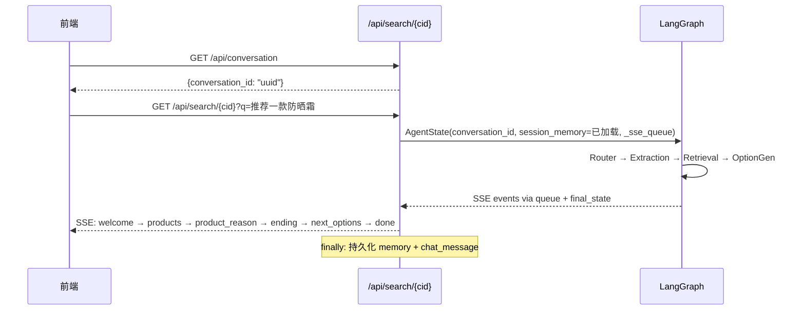

# 1 核心Agent组件

> 更新日期：2026-06-07 | 变更：商品级检索 + SSE 事件流修正 + ChatMessage 持久化 + 前端补充接口

整体采用 **LangGraph 工作流架构**，6 节点管线：

```
START → Router → ChitChat / Extraction / ScenarioGen → Retrieval → OptionGen → END
```

节点间共享 `AgentState` 作为状态通道。Memory 作为集中式会话记忆，存储用户原始查询并按 `(category, sub_category)` 分组。SSE 事件通过 `asyncio.Queue` 注入 `state["_sse_queue"]`，由 `_agent_event_stream` 消费循环统一转发；`next_options` 和 `done` 由消费循环的 finally 块从 `final_state` 读取后发送。

---

## (1) 意图路由与查询改写 (Intent Router)

**节点函数**: `router_node(state, llm)` → `app/agent/nodes/router.py`

作为工作流的第一个节点，结合当前用户提问和对话历史，完成三项任务：

- **意图分类**：单次 LLM 调用判定意图为三类之一：`chat`（闲聊）、`explicit`（明确商品查询）、`scenario`（场景化推荐）
- **查询改写**：当意图为 `explicit` 或 `scenario` 时，利用 `session_memory` 中最近 N 轮历史改写当前查询，补充查询主体。例如："要轻量的" → "要轻量的跑鞋"；完整查询透传不改写。
- **欢迎语生成**：为 `explicit`/`scenario` 路径生成欢迎语（单品类突出特点，多品类突出场景感），写入 `welcome_text`

改写时从 `session_memory` 检索该会话最近 N 轮原始查询（N 可配置，默认 10）。

### 输出内容

| 通道 | 内容 | 说明 |
|------|------|------|
| **State** | `intent`: `"chat"` \| `"explicit"` \| `"scenario"` | 驱动条件边路由 |
| **State** | `welcome_text`: `str` | explicit/scenario 时的欢迎语；chat 时为空串 |

> Router 不直接发送 SSE 事件。`welcome_text` 由 Retrieval 节点读取后通过 queue 以 `welcome` 事件发送。

---

## (2) 意图提取 (Intent Extraction)

**节点函数**: `extraction_node(state, llm, db_session_factory)` → `app/agent/nodes/extraction.py`

处理明确商品需求路径（`intent == "explicit"`）。三步流程：

**Step 1 — 提取品类/品牌意图**：从改写后的查询中提取 `brand`/`category`/`sub_category`，借助 DB Tool（`query_field_values`）校验合法取值。`category`/`sub_category` 取值参考 `category_lookup` 表，`brand` 取值参考 `product` 表中该品类下的实际品牌。

**Step 2 — 检索历史并拼接**：按 `(category, sub_category)` 从 `session_memory` 检索历史原始查询，与当前改写查询按时间顺序平铺拼接。

**Step 3 — 分组提取意图**：按 `(category, sub_category)` 分组，从拼接文本中提取结构化查询条件（`structured_filter`：price/stock）和语义查询条件（`semantic`：text 字段）。冲突以后续意图为准。

**不再生成 keyword 策略的查询分支**。

### 输出内容

| 通道 | 内容 | 说明 |
|------|------|------|
| **State** | `requirements`: `list[dict]` | 按品类分组的意图列表，格式见下方 |

```json
[
  {
    "category": "面部护肤",
    "sub_category": "防晒霜",
    "text": "不含酒精、不粘腻、适合敏感肌",
    "min_price": 0,
    "max_price": 200,
    "order_num": 1,
    "brand": ["安热沙", "资生堂"]
  }
]
```

字段说明：
- `category`: 品类大类（可为 null）
- `sub_category`: 品类细类（可为 null）
- `text`: 语义查询条件文本
- `min_price`: 最低价格，无约束为 0
- `max_price`: 最高价格，无约束为 4294967295
- `order_num`: 下单数量，默认 1
- `brand`: 品牌列表，无偏好为 null

> Extraction 不直接发送 SSE 事件。

---

## (3) 场景需求生成 (Scenario Gen)

**节点函数**: `scenario_gen_node(state, llm, db_session_factory)` → `app/agent/nodes/scenario_gen.py`

处理场景化需求路径（`intent == "scenario"`）。

1. 从 `user_query` 出发，从 **category_lookup 表**读取可用品类列表，确定场景所需品类
2. 按品类从 `session_memory` 检索历史查询，与当前查询拼接
3. LLM 按品类分组输出意图信息

### 输出内容

| 通道 | 内容 | 说明 |
|------|------|------|
| **State** | `scenario_description`: `str` | 原始场景描述，供 Option Gen 和结束语使用 |
| **State** | `requirements`: `list[dict]` | 格式与 Extraction 统一（见 §2） |

> Scenario Gen 不直接发送 SSE 事件。

---

## (4) 商品检索 (Product Retrieval)

**节点函数**: `retrieval_node(state, llm, emb_service, async_session_factory, reranker)` → `app/agent/nodes/retriever.py`

从 state 读取 `requirements`（按品类分组的意图列表），按品类分组并行执行检索管线：

**检索管线（每个品类独立执行）**：

1. **SQL 条件转换**：将意图中的 `category`/`sub_category`/`min_price`/`max_price`/`order_num`/`brand` 转换为 SQL WHERE 条件
2. **语义检索**：在 SQL 条件基础上，用 `text` embedding 进行余弦相似度匹配，返回 top-25
3. **关键词检索**：在 SQL 条件基础上，用 `plainto_tsquery('chinese', ...)` + tsvector 进行全文检索，返回 top-25
4. **RRF 融合**：加权 RRF 综合语义（权重 0.7）和关键词（权重 0.3）结果，取 top-25。**按 product_id 聚合**（`ROW_NUMBER() OVER PARTITION BY product_id`，同 product 多 SKU 去重）
5. **bge-reranker 精排**：调用 SiliconFlow API（`BAAI/bge-reranker-v2-m3`）对 RRF top-25 精排，取 top-5。API 失败时 fallback 到 RRF top-5
6. **推荐理由生成**：按品类 LLM 生成推荐理由（`PRODUCT_REASON_SYSTEM` 提示词），每个商品一条
7. **品类顺序式 SSE 返回**：按品类顺序发送 `welcome` → `category_intro`（品类介绍，仅多品类）→ `products` + `product_reason`（逐商品）→ `ending`（结束语）

**并行检索**：各品类并行执行，通过 `asyncio.Semaphore` 限流（`max_category_concurrency`，默认 5）。每个并行任务独立 `AsyncSession`。

**Review 截断**：单 product 最多保留 N 条 `matched_texts`（N 可配置，默认 5），每条最大字符数可配（默认 500）。

### 输出内容

| 通道 | 内容 | 说明 |
|------|------|------|
| **SSE** `welcome` | `string` | Router 生成的欢迎语（从 `state.welcome_text` 读取） |
| **SSE** `category_intro` | `string` | 品类介绍过渡语（仅多品类，在品类第一个商品前） |
| **SSE** `product_reason` | `string` | 单商品推荐理由（每个 `products` 事件后） |
| **SSE** `ending` | `string` | 结束语（所有品类推荐完成后） |
| **SSE** `products` | `{product_id, category, sub_category}` | 单商品对象（非数组），**商品级（不含 sku_id）** |
| **State** | `retrieval_results`: `list[dict]` | 全部商品详情，供 Option Gen 使用 |
| **State** | `failed_categories`: `list[str]` | 检索失败的 sub_category 列表 |
| **State** | `session_memory`: `list[dict]` | 追加当前查询后的会话记忆 |

每个 `retrieval_results` 元素（商品级）：
```json
{
  "product_id": "p_beauty_001",
  "title": "安热沙小金瓶防晒霜",
  "brand": "安热沙",
  "category": "面部护肤",
  "sub_category": "防晒霜",
  "base_price": 198.0,
  "skus": [
    {"sku_id": "s_p_beauty_001_1", "properties": {"容量": "60ml"}, "price": 198.0, "stock": 50}
  ],
  "matched_texts": [
    {"source": "marketing", "content": "安热沙小金瓶..."},
    {"source": "user_review", "content": "海边用完全没晒黑..."}
  ]
}
```

> Retrieval **不再发送 `done` 事件**。`done` 由消费循环 finally 块在所有节点完成后统一发送。结束语为独立的 `ending` 事件。

---

## (5) 推荐选项生成 (Option Gen)

**节点函数**: `option_gen_node(state, llm)` → `app/agent/nodes/option_gen.py`

在 Product Retrieval **所有品类返回后执行一次**。从 `AgentState.retrieval_results` 读取全部商品，压缩为摘要（最多 5 个商品，每条 ≤300 字符）后由 LLM 生成 2-3 条下一步推荐选项。**无需访问数据库**。

### 输出内容

| 通道 | 内容 | 说明 |
|------|------|------|
| **State** | `next_options`: `list[str]` | 最多 3 条下一步推荐选项 |

> Option Gen **不再通过 queue 发送 SSE 事件**。`next_options` 由消费循环 finally 块从 `final_state` 读取后统一发送（在 `done` 之前），避免重复发送。

---

## (6) 闲聊 (Chit-Chat)

**节点函数**: `chitchat_node(state, llm)` → `app/agent/nodes/chitchat.py`

处理与商品导购关系不大的提问（`intent == "chat"`）。对用户提问做简短回复（≤80 字），并在结尾声明自身是商品导购服务。不走 Memory 和检索管线。

### 输出内容

| 通道 | 内容 | 说明 |
|------|------|------|
| **SSE** `chat_reply` | `string` | 闲聊回复文本（通过 queue 发送） |
| **SSE** `done` | `{}` | 结束标记（通过 queue 发送；chat 路径不经过消费循环 finally 块） |
| **State** | `chat_reply`: `str` | 闲聊回复文本 |

> ChitChat 是唯一在节点内直接发送 `done` 的路径——它直接走 `END`，不经过 Retrieval → OptionGen 管线。消费循环检测到 queue 中的 `done` 事件后立即返回，不进入 finally 块的 `next_options`/`done` 逻辑。

---

## (7) SSE 消费循环（事件流总控）

**函数**: `_agent_event_stream(user_query, graph, queue, total_timeout, conversation_id)` → `app/api/search.py`

所有节点 SSE 事件的统一消费和收尾逻辑：

1. 后台启动 `graph.ainvoke(initial_state)`
2. 循环从 queue 消费事件并 yield（`welcome`/`products`/`category_intro`/`product_reason`/`ending`），直到 graph 完成
3. graph 完成后排空 queue 中残留事件
4. **finally 块**：从 `final_state` 读取 `next_options` 并 yield（如有）；yield `done`（含 `conversation_id`）作为最后事件
5. 持久化会话记忆到 `conversation` 表 + 聊天记录到 `chat_message` 表

### 完整 SSE 事件流顺序

```
welcome → [品类介绍 category_intro] → products → product_reason（推荐理由）
       → ... (逐品类重复)
       → ending（结束语）
       → next_options → done
```

---

## (8) 多轮对话及会话记忆机制 (Memory)

集中式会话记忆，作为 `AgentState` 的 `session_memory` 字段。**存储用户原始查询**（非改写后、非提取意图），按 `(category, sub_category)` 分组。

```json
[
  {
    "category": "服饰运动",
    "sub_category": "跑步鞋",
    "queries": [
      {"query": "帮我推荐跑鞋", "timestamp": "2026-06-04T10:00:00"},
      {"query": "要轻量的", "timestamp": "2026-06-04T10:01:00"}
    ]
  }
]
```

**三种访问模式**：
- **Router 检索**（`get_recent_queries`）：跨品类取最近 N 轮原始查询，用于查询改写
- **Extraction / Scenario Gen 检索**（`get_queries_by_category`）：按 `(category, sub_category)` 精确匹配历史查询，与当前查询拼接后提取意图
- **Retrieval 更新**（`append_query`）：检索完成后将原始查询按品类累加到 memory

**持久化**：`session_memory` 写入 `conversation` 表的 `memory` JSONB 字段，每轮检索后 upsert。**聊天记录**（user query + assistant reply）额外写入 `chat_message` 表，按 `created_at` 排序即为对话时间线。

**Token 截断**：threshold 2000 token，简易估算 `len(json.dumps(memory)) / 4`。截断在每次 append 后执行（写时截断），仅在日志中记录。

---

## (9) 数据库查询 Tool

3 个内部 Python 函数，Agent 节点直接调用（不走 LLM function calling）：

| Tool | 功能 | 说明 |
|------|------|------|
| `list_tables(db)` | 查询数据库所有表 | 返回表名及每张表存储内容的描述 |
| `list_fields(db, table)` | 查询表的字段 | 返回字段名、类型、含义描述 |
| `query_field_values(db, table, field, filters?)` | 查询字段取值 | SELECT DISTINCT，支持多字段联合过滤 |

表/字段的中文描述硬编码为映射字典。`table`/`field`/`filter_key` 做白名单校验防注入。

---

## (10) Reranker 精排服务

`RerankerService` 封装 bge-reranker-v2-m3 的 SiliconFlow API 调用：

```
POST https://api.siliconflow.cn/v1/rerank
Model: BAAI/bge-reranker-v2-m3
```

超时 5s 可配置，失败返回空列表（调用方 fallback 到 RRF top-5）。

---

## (11) Properties 汇总（product_review 增强）

独立脚本 `property_summary_service.py`：
- 为每个 Product 汇总其所有 SKU 的 `properties` 字段信息为一句话自然语言描述
- 经 Embedding 向量化后写入 `product_review` 表，`source` 设为 `"property"`
- `config.yaml` 的 `search.source_weights` 新增 `property: 1.0`
- 支持幂等重跑（跳过已处理的 product）

---

### Agent 间数据契约

所有向 Memory 写入和检索的数据遵循统一结构。
Intent Extraction 和 Scenario Gen 输出统一的意图格式：

```json
[
  {
    "category": "str | null",
    "sub_category": "str | null",
    "text": "str",
    "min_price": 0,
    "max_price": 4294967295,
    "order_num": 1,
    "brand": ["str"] | null
  }
]
```

---

### Category 查找表

新增 `category_lookup` 表，记录数据库中合法的 (category, sub_category) 取值对：

```sql
CREATE TABLE category_lookup (
    id SERIAL PRIMARY KEY,
    category VARCHAR NOT NULL,
    sub_category VARCHAR NOT NULL,
    UNIQUE(category, sub_category)
);
```

**用途**：
- Scenario Gen 提示词中动态注入可用品类列表
- Extraction Step 1 校验 LLM 输出的品类合法性
- 通过 `/server/scripts/` 下手动脚本构建和维护

---

### Fallback 策略

| Agent | 失败/超时行为 |
|-------|--------------|
| Intent Router | 默认 `intent="explicit"`，`welcome_text=""` |
| Intent Extraction | Step 1 LLM 失败 → 品类/品牌为 null；Step 3 LLM 失败 → 回退为 `[{text: user_query, category: null, ...}]` |
| Scenario Gen | 视为误判，回退到 Intent Extraction 做 explicit 分解 |
| Product Retrieval | 单品类检索失败 → 品类任务内 try/except，返回 `error` 字段，`failed_categories` 汇总记录，其他品类继续；Reranker API 失败 → fallback 到 RRF top-5；全部失败 → 用原始 `user_query` 做语义检索兜底 |
| Option Gen | 跳过，回复末尾不追加选项 |
| Chit-Chat | 返回硬编码兜底消息 |
| Reranker | API 失败/超时 → 跳过精排，直接用 RRF top-5 |

---

## 目录结构

```
server/app/
├── agent/
│   ├── state.py              # AgentState TypedDict 定义（含 _sse_queue）
│   ├── graph.py              # StateGraph 构建 + 条件边（6 节点管线）
│   ├── memory.py             # Memory 工具（get_recent_queries / get_queries_by_category / append_query）
│   ├── tools.py              # DB 查询 Tool（list_tables / list_fields / query_field_values）
│   ├── nodes/
│   │   ├── router.py         # Intent Router（意图分类 + 查询改写 + 欢迎语生成）
│   │   ├── extraction.py     # Intent Extraction（三步流程：品类提取 → 历史拼接 → 分组意图）
│   │   ├── scenario_gen.py   # Scenario Gen（场景→品类确定→意图提取）
│   │   ├── retriever.py      # Product Retrieval（SQL条件→双路检索→RRF融合→reranker→推荐理由→SSE）
│   │   ├── option_gen.py     # Option Gen（读 AgentState，零 DB，写 next_options 到 State）
│   │   └── chitchat.py       # Chit-Chat（闲聊回复 + SSE 发送）
│   └── prompts/
│       ├── router_prompt.py           # 意图分类提示词
│       ├── rewrite_prompt.py          # 查询改写提示词
│       ├── show_prompt.py             # WELCOME_SYSTEM / CATEGORY_INTRO_SYSTEM / PRODUCT_REASON_SYSTEM / ENDING_SYSTEM
│       ├── extraction_prompt.py       # 三步提取提示词（Step1 + Step3）
│       ├── scenario_gen_prompt.py     # 场景生成提示词
│       ├── option_gen_prompt.py       # 选项生成提示词
│       └── chitchat_prompt.py         # 闲聊提示词
├── api/
│   ├── search.py             # SSE 搜索端点 + _agent_event_stream 消费循环
│   ├── frontend.py           # 前端补充接口（history / review / all_skus）
│   ├── products.py           # 商品查询 + 批量查询
│   └── ...
├── services/
│   ├── retriever_service.py   # Retriever / SubQuery / Merger / ProductHit（商品级检索）
│   ├── reranker.py            # RerankerService（bge-reranker-v2-m3 API 客户端）
│   ├── sku_utils_service.py   # _get_products / _truncate_texts（商品查询 + 文本截断）
│   └── ...
├── models/
│   ├── conversation.py       # Conversation 模型（conversation_id + memory JSONB）
│   ├── chat_message.py       # ChatMessage 模型（对话历史持久化）
│   └── ...
└── config.yaml / config.py   # 检索分段参数 + reranker 配置段 + timeout 配置
```

**关键配置参数**：

| 参数 | 默认值 | 说明 |
|------|--------|------|
| `search.semantic_top_k` | 25 | 语义检索返回数量 |
| `search.keyword_top_k` | 25 | 关键词检索返回数量 |
| `search.rrf_semantic_weight` | 0.7 | RRF 语义权重 |
| `search.rrf_keyword_weight` | 0.3 | RRF 关键词权重 |
| `search.rrf_k` | 60 | RRF k 值 |
| `search.rrf_top_k` | 25 | RRF 融合后取 top-k |
| `search.rerank_top_k` | 5 | 精排后最终返回数量 |
| `search.max_match_texts_per_product` | 5 | 单 product 最多 review 条数 |
| `search.max_match_chars_per_product` | 500 | 单 product review 最大字符数 |
| `search.max_category_concurrency` | 5 | 品类并行检索最大并发数 |
| `search.memory_recent_rounds` | 10 | Router 改写时检索的最近轮数 |
| `search.reasoning_max_chars` | 500 | 推荐理由最大字符数 |
| `search.max_batch_ids` | 20 | Batch API 单次最大 ID 数 |
| `timeout.total_request` | 300 | SSE 总超时（秒） |
| `reranker.model` | BAAI/bge-reranker-v2-m3 | 精排模型 |
| `reranker.timeout` | 5.0 | Reranker API 超时（秒） |


# 2 多Agent协作关系

## (1) Agent 协作关系图



## (2) Agent 转移关系表

| # | 源 Agent | 条件 / 触发 | 目标 Agent | 语义 |
|---|---------|------------|-----------|------|
| 1 | START | —— | Intent Router | 用户输入进入系统 |
| 2 | Intent Router | `intent == "chat"` | Chit-Chat | 闲聊意图 |
| 3 | Intent Router | `intent == "explicit"` | Intent Extraction | 明确商品需求 |
| 4 | Intent Router | `intent == "scenario"` | Scenario Gen | 场景化需求 |
| 5 | Memory | Router / Extraction / Scenario Gen 读取 | —— | Router 读最近N轮；Extraction/Scenario Gen 按品类读历史 |
| 6 | Intent Extraction | 需求提取完成 | Product Retrieval | 输出 requirements → 进入检索 |
| 7 | Scenario Gen | 场景分析 + 意图提取完成 | Product Retrieval | 输出 requirements + scenario_description |
| 8 | Product Retrieval | 检索完成后 | Memory（写入） | 原始查询按品类追加写入 session_memory |
| 9 | Product Retrieval | 检索完成 | Option Gen | retrieval_results + failed_categories 写入 State |
| 10 | Option Gen | 始终 | END | 写 next_options 到 State |
| 11 | Chit-Chat | 始终 | END | 通过 queue 发送 chat_reply + done |
| 12 | 消费循环 | graph 完成后 (finally) | END (SSE 流) | 从 final_state 读 next_options → yield done |

## (3) Agent 协作设计要点

- **Router 单级分类 + 改写 + 欢迎语**：单次 LLM 调用输出 chat/explicit/scenario/welcome_text。
- **Explicit 路径**：Router（改写+欢迎语）→ Extraction（三步流程）→ Retrieval（检索+SSE）→ Option Gen（选项）。
- **Scenario 路径**：Router（改写+欢迎语）→ Scenario Gen（品类确定+意图提取）→ Retrieval（检索+SSE）→ Option Gen（选项）。
- **Memory 存储原始查询**：按 `(category, sub_category)` 分组存储用户原始查询。
- **Memory 三种访问模式**：Router（跨品类最近N轮）、Extraction/Scenario Gen（按品类检索拼接）、Retrieval（追加写入）。
- **统一输出格式**：Extraction 和 Scenario Gen 输出统一的 `[{category, sub_category, text, ...}]` 格式。
- **商品级检索**：RRF 融合时按 `product_id` 聚合去重（`ROW_NUMBER() OVER PARTITION BY product_id`），不再输出 SKU 级结果。`products` SSE 事件仅含 `{product_id, category, sub_category}`，前端通过 `/api/all_skus/{product_id}` 获取 SKU 变体。
- **并行检索 + 独立 session**：多品类并行执行，Semaphore 限流。每个并行任务独立 `AsyncSession`。
- **双路检索 + 加权 RRF + bge-reranker**：语义（0.7）和关键词（0.3）双路并行，RRF 融合后精排。
- **SSE 事件流**：`welcome → category_intro(品类介绍) → products → product_reason(推荐理由) → ... → ending(结束语) → next_options → done`。`done` 始终为最后事件。
- **Option Gen 零 DB 访问**：Retrieval 将完整商品详情（含 skus + matched_texts）写入 `retrieval_results`，Option Gen 压缩后直接使用。
- **next_options 单次发送**：由消费循环 finally 块从 `final_state` 读取并发送，不在 Option Gen 节点内通过 queue 发送（避免重复）。
- **Chat 路径特殊处理**：ChitChat 节点内通过 queue 发送 `chat_reply` + `done`，消费循环检测到 queue `done` 后立即返回，不走 finally 块。
- **聊天记录持久化**：每轮对话的 user_query + chat_reply 写入 `chat_message` 表，按 `created_at` 排序即为对话时间线。


# 3 各Agent的I/O规约与提示词

## 3.0 I/O 规约总览

| Agent | 输入（从 State 读取） | 输出（写入 State） | SSE 事件（通过 queue） | 下游消费者 |
|-------|---------------------|-------------------|---------------------|-----------|
| **Intent Router** | `user_query`, `session_memory` | `intent`, `welcome_text` | — | 条件边 → Chit-Chat 或 Extraction 或 Scenario Gen |
| **Intent Extraction** | `user_query`, `session_memory`（按品类读），DB Tools | `requirements` | — | Product Retrieval |
| **Scenario Gen** | `user_query`, `session_memory`, `category_list`（category_lookup 表） | `scenario_description`, `requirements` | — | Product Retrieval（scenario_description → Option Gen 也读） |
| **Product Retrieval** | `requirements`, `user_query`, `welcome_text`, `session_memory` | `retrieval_results`, `failed_categories`, `session_memory`（追加后） | `welcome`, `category_intro`, `product_reason`, `products` | Option Gen（State）；前端（SSE） |
| **Option Gen** | `user_query`, `requirements`, `retrieval_results`, `scenario_description`, `failed_categories`, `session_memory` | `next_options` | `ending` | 前端（SSE）；消费循环 finally 块 → `next_options` SSE |
| **Chit-Chat** | `user_query` | `chat_reply` | `chat_reply`, `done`（直接在节点内发送） | END |

## 3.1 Intent Router（意图路由与查询改写 + 欢迎语）

### 输入规约

```
- user_query: str              # 当前用户提问原文
- session_memory: list         # Memory 中的历史原始查询（按品类分组）
```

### 输出规约

```
- intent: "chat" | "explicit" | "scenario"
- welcome_text: str            # 欢迎语（explicit/scenario 时生成，chat 时为空串）
```

### 提示词（意图分类 + 欢迎语）

```text
你是一个电商导购意图分类器。根据用户提问和对话历史，完成意图分类。

## 任务一：意图分类
- chat：与商品导购无关的闲聊
- explicit：用户明确提出了具体商品需求
- scenario：用户描述了一个使用场景而非具体商品

## 任务二：欢迎语生成（仅 explicit/scenario）
单品类时突出品类特点，多品类时突出场景感。简洁友好。

历史对话（最近 N 轮）：
{recent_queries}

## 输出格式
{"intent": "explicit", "welcome_text": "帮你挑了几款..."}

用户提问：{user_query}
```

## 3.2 Intent Extraction（意图提取）

### 输入规约

```
- user_query: str             # 用户原始查询
- session_memory: list         # 按 (category,sub_category) 分组的历史原始查询
- DB Tools: list_tables / list_fields / query_field_values
```

### 输出规约

```json
[
  {
    "category": "面部护肤",
    "sub_category": "防晒霜",
    "text": "不含酒精、不粘腻、适合敏感肌",
    "min_price": 0,
    "max_price": 200,
    "order_num": 1,
    "brand": ["安热沙", "资生堂"]
  }
]
```

### 三步流程提示词（与 v2.2 一致，略）

## 3.3 Scenario Gen（场景需求生成）

### 提示词（与 v2.2 一致，略）

## 3.4 Product Retrieval（商品检索）

### 内部流程（7 步流水线）

```text
Step 1: [SQL 条件转换] — category/sub_category → p.category/p.sub_category;
         min_price/max_price → s.price; order_num → s.stock; brand → p.brand IN (...)
Step 2: [双路并行检索]：
        语义检索: pgvector <=> 余弦相似度 + SQL 条件, top-25
        关键词检索: plainto_tsquery + ts_rank + SQL 条件, top-25
        ROW_NUMBER() OVER (PARTITION BY pr.product_id) → 按 product_id 去重
Step 3: [加权 RRF 融合] — semantic 0.7 / keyword 0.3, k=60, top-25（按 product_id 聚合）
Step 4: [bge-reranker 精排] — SiliconFlow API, top-5; 失败 → RRF top-5 fallback
Step 5: [Review 截断] — max_match_texts_per_product=5, max_match_chars_per_product=500
Step 6: [推荐理由生成] — 按品类 LLM 生成（PRODUCT_REASON_SYSTEM 提示词）+ 品类介绍（仅多品类）+ 结束语
Step 7: [SSE 发送] — welcome → category_intro(品类介绍) → products → product_reason(推荐理由) → ... → ending(结束语)
```

### 输出规约

```
SSE 事件（通过 queue，由消费循环转发）:
  event: welcome     → data: "帮你挑了几款..."（从 state.welcome_text 读取）
  event: category_intro  → data: "🧴 首先是美妆护肤..."（品类介绍，仅多品类）
  event: products    → data: {"product_id":"p_beauty_001","category":"面部护肤","sub_category":"防晒霜"}
  event: product_reason  → data: "安热沙小金瓶——SPF50+..."（推荐理由）
  ... （逐品类、逐商品重复）
  event: ending  → data: "以上就是为你搭配的..."（结束语）

注意: done 不在此节点发送，由消费循环 finally 块统一发送。

写入 AgentState:
  retrieval_results: [{
    "product_id": "p_beauty_001",
    "title": "安热沙小金瓶防晒霜",
    "brand": "安热沙",
    "category": "面部护肤", "sub_category": "防晒霜",
    "base_price": 198.0,
    "skus": [{"sku_id":"...", "properties":{...}, "price":..., "stock":...}],
    "matched_texts": [{"source":"marketing", "content":"..."}, ...]
  }, ...]
  failed_categories: ["防晒霜"]  // 仅失败的 sub_category

写入 Memory:
  session_memory: append_query(session_memory, user_query, categories, timestamp)
```

### 推荐理由生成提示词（PRODUCT_REASON_SYSTEM）

与 v2.2 一致：引用商品真实属性，用户评价优先于官方描述，控制在 `reasoning_max_chars` 字以内。

## 3.5 Option Gen（推荐选项生成）

触发时机：所有品类检索完成后执行一次。数据来源：`AgentState.retrieval_results`（压缩为摘要：≤5 商品，每条 ≤300 字符），无需 DB。

### 输出规约

```
- next_options: list[str]       # 最多 3 条，写入 State；不通过 queue 发送 SSE
```

> `next_options` 的 SSE 发送由消费循环 finally 块从 `final_state` 统一读取并 yield，确保只发送一次且在 `done` 之前。

### 提示词（与 v2.2 一致，略）

## 3.6 Chit-Chat（闲聊）

简短回复（≤80 字），结尾声明服务范围。通过 queue 直接发送 `chat_reply` + `done`。


# 4 查询场景例子

## 4.1 单轮对话："200 元以下的蓝牙耳机有哪些？"

```text
用户: "200 元以下的蓝牙耳机有哪些？"

━━━ ① Intent Router ━━━
  Input:  user_query, session_memory=[]
  Logic:  LLM 分类 → explicit; 生成欢迎语
  Output: intent="explicit",
          welcome_text="帮你挑了几款口碑好、性价比高的蓝牙耳机～"

━━━ ② Intent Extraction ━━━
  Step 1: LLM 提取品类 → [{category: "数码电子", sub_category: "蓝牙耳机", brand: null}]
          → Tools 校验合法性
  Step 2: 首轮无历史 → context = "当前: 200 元以下的蓝牙耳机有哪些？"
  Step 3: LLM 分组提取 → [{category:"数码电子", sub_category:"蓝牙耳机",
          text:"音质好 连接稳定", min_price:0, max_price:200, ...}]
  Output: requirements = [如上]

━━━ ③ Product Retrieval ━━━
  Input:  requirements[0] = {category:"数码电子", sub_category:"蓝牙耳机", text:"音质好 连接稳定", max_price:200}
  SSE:
    event: welcome → "帮你挑了几款口碑好、性价比高的蓝牙耳机～"
    event: products → {"product_id":"p_digi_001","category":"数码电子","sub_category":"蓝牙耳机"}
    event: product_reason → "漫步者 X3——¥159，音质均衡..."
    event: products → {"product_id":"p_digi_002","category":"数码电子","sub_category":"蓝牙耳机"}
    event: product_reason → "小米 Buds 3——¥189，轻量设计..."
    event: ending → "这两款都是 200 元以内的人气款，有看中的吗？"（结束语）
  追加 memory: append_query(session_memory, "200 元以下的蓝牙耳机有哪些？", [{category,sub_category}])

━━━ ④ Option Gen ━━━
  Input:  requirements, retrieval_results（从 AgentState 读，压缩为摘要）
  Output: next_options=["需要关注降噪功能吗？", "想看看 100 元以内的入门款吗？"]

━━━ ⑤ 消费循环 finally ━━━
  SSE:
    event: next_options → ["需要关注降噪功能吗？", "想看看 100 元以内的入门款吗？"]
    event: done → {"conversation_id":"550e8400-..."}

  持久化: memory → conversation 表; user_query + assistant_reply → chat_message 表
```

## 4.2 多轮对话："帮我推荐跑鞋" → "要轻量的" → "预算 500 以内"

### Turn 1："帮我推荐跑鞋"

```text
━━━ ① Intent Router ━━━
  Output: intent="explicit", welcome_text="..."

━━━ ② Intent Extraction ━━━
  Step 1: LLM → [{category: "运动户外", sub_category: "跑鞋", brand: null}]
  Step 2: 无历史
  Step 3: LLM → [{category:"运动户外", sub_category:"跑鞋", text:"舒适缓震", ...}]

━━━ ③ Product Retrieval ━━━
  SSE: welcome → products + product_reason（逐商品）→ ending（结束语）
  追加 memory

━━━ ④ Option Gen ━━━
  Output: next_options=["需要限定预算范围吗？", "偏好哪个品牌？"]

━━━ ⑤ 消费循环 finally ━━━
  SSE: next_options → done
```

### Turn 2："要轻量的"

```text
━━━ ① Intent Router ━━━
  Input:  历史 = [{query: "帮我推荐跑鞋", ...}]
  Logic:  欢迎语基于 user_query + 历史生成
  Output: intent="explicit", welcome_text="..."

━━━ ② Intent Extraction ━━━
  Step 2: get_queries_by_category("运动户外", "跑鞋") → ["帮我推荐跑鞋"]
          context = "#1 帮我推荐跑鞋\n当前: 要轻量的"
  Step 3: LLM → [{category:"运动户外", sub_category:"跑鞋", text:"轻量化设计 舒适缓震", ...}]

━━━ ③ Product Retrieval ━━━
  检索 + SSE + 追加 memory（同品类追加 query）
```

### Turn 3："预算 500 以内"

```text
━━━ ① Intent Router ━━━
  改写: "预算 500 以内" → "预算 500 以内的跑鞋"

━━━ ② Intent Extraction ━━━
  Step 3: text 整合"轻量化 舒适缓震", max_price=500

━━━ ③ Product Retrieval ━━━
  SQL: s.price <= 500 → 检索匹配
```

## 4.3 场景化推荐："下周去三亚度假，帮我搭配一套方案"

```text
━━━ ① Intent Router ━━━
  Output: intent="scenario", welcome_text="海边度假装备得备齐！..."

━━━ ② Scenario Gen ━━━
  Input:  user_query, category_list（category_lookup 表动态注入）
  Logic:  场景分析 → 热带海岛 → 高倍防晒、防水防汗、速干透气
          选取品类: 防晒霜/墨镜/沙滩裤/遮阳帽/凉鞋（≤6 个）
  Output: scenario_description="下周去三亚度假...", requirements = [5 品类]

━━━ ③ Product Retrieval ━━━
  5 组并行检索（≤ max_concurrency=5）
  SSE（品类顺序式）:
    event: welcome → "海边度假装备得备齐！..."
    event: category_intro → "🧴 首先是美妆护肤（防晒必备）..."
    event: products → {防晒商品1} → product_reason → {防晒商品2} → product_reason
    event: category_intro → "🕶️ 接下来是服饰配件..."
    event: products → {墨镜商品} → product_reason
    ... （逐品类）
    event: ending → "以上就是为你搭配的海边出游套装..."（结束语）
  追加 memory: 原始查询追加到 5 个品类 group

━━━ ④ Option Gen ━━━
  Output: next_options=["需要推荐泳衣吗？", "需要搭配晒后修复产品吗？"]

━━━ ⑤ 消费循环 finally ━━━
  SSE: next_options → done
```

## 4.4 闲聊场景

```text
用户: "今天天气怎么样？"

━━━ ① Intent Router ━━━
  Output: intent="chat", welcome_text=""

━━━ ② Chit-Chat ━━━
  SSE (via queue):
    event: chat_reply → "抱歉，我是电商导购助手，无法查询天气。有什么商品需要我帮您推荐吗？"
    event: done → {}

━━━ 消费循环检测到 done → 立即返回（不走 finally 块）━━━
```

## 4.5 四场景对比总结

| 维度 | 单轮 explicit | 多轮 explicit | scenario | chat |
|------|-------------|-------------|----------|------|
| Router 输出 | explicit + 透传 + 欢迎语 | explicit + 改写补全 + 欢迎语 | scenario + 透传 + 欢迎语 | chat |
| 路径 | Extraction → Retrieval → OptionGen | 同左 | ScenarioGen → Retrieval → OptionGen | ChitChat |
| Memory 读取 | 无 | Router + Extraction 读 | Router + ScenarioGen 读 | 无 |
| Memory 更新 | append_query（1 品类） | append_query（同品类追加） | append_query（多品类） | 无 |
| 检索策略 | 单品类商品级双路检索 | 同左 | 多品类并行商品级双路检索 | 无 |
| SSE 事件顺序 | welcome → products+product_reason → ending → next_options → done | 同左 | 同左 + 品类介绍 category_intro | chat_reply → done |
| done 发送方 | 消费循环 finally | 同左 | 同左 | ChitChat 节点 |
| Option Gen | 读 State 摘要，零 DB | 同左 | 同左，含 scenario_description | 不触发 |
| ChatMessage | 持久化 user + assistant | 同左 | 同左 | 持久化 |


# 5 多会话支持

## 5.1 设计

通过 `conversation_id` 实现会话隔离：

### API

- **`GET /api/conversation`**：创建新会话，返回 UUID
- **`GET /api/search/{conversation_id}?q=...`**：SSE 搜索（conversation_id 为路径参数）

### Memory 隔离

```
conversation 表:
  conversation_id (PK) → memory (JSONB)
  chat_message 表:
    conversation_id (INDEX) → (role, content, created_at)
```

- **写入**：Product Retrieval 完成后 upsert `conversation.memory`；每次搜索后 insert `chat_message`（user + assistant 各一条）
- **读取**：Router / Extraction / Scenario Gen 以 `conversation_id` 为 key 检索 memory

### 数据流



### 前端补充接口

| 接口 | 说明 | 数据来源 |
|------|------|---------|
| `GET /api/history/{conversation_id}` | 会话对话历史 | `chat_message` 表 |
| `GET /api/review/{product_id}` | 商品 RAG 知识（营销/FAQ/评价） | `product_marketing` / `product_faq` / `user_review` 表 |
| `GET /api/all_skus/{product_id}` | 商品所有 SKU 变体 | `sku` 表 |

### 设计要点

- 每个 `conversation_id` 对应独立的 Memory 空间，互不干扰
- `GET /api/conversation` 无副作用，仅生成新 UUID 并写入 conversation 表（初始 memory=[]）
- conversation_id 在 conversation 表中不存在时返回 error 事件 `{"detail": "conversation not found"}`
- Memory 截断策略不变（2000 token 写时截断），截断范围限定在当前 conversation_id 内
- `stream` 参数保留但忽略，始终走 SSE 流式
