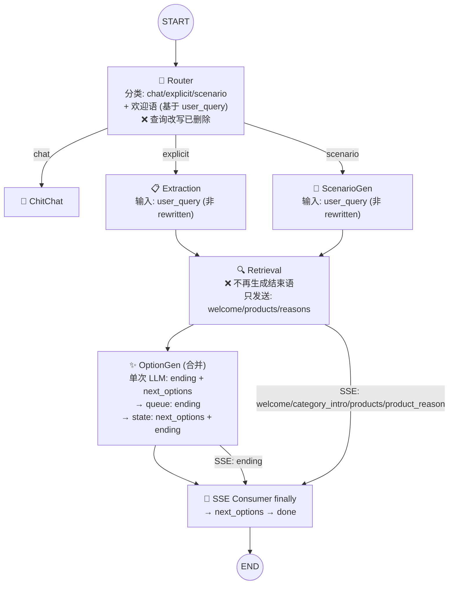

# MERGE_OPT — 实现方案

> 输入: `server/docs/AGENT_OPT/MERGE_OPT/DEFINE.md`
> 输出: `server/docs/AGENT_OPT/MERGE_OPT/PLAN.md`

## 1. 整体架构

### Graph 节点变更



### AgentState 变更

```
Before:                              After:
  user_query: str                      user_query: str
  rewritten_query: str    ← 删除       welcome_text: str
  welcome_text: str                    session_memory: list[dict]
  session_memory: list[dict]           intent: str
  intent: str                         requirements: list[dict]
  requirements: list[dict]             scenario_description: str | None
  scenario_description: str | None     retrieval_results: list[dict]
  retrieval_results: list[dict]        chat_reply: str
  chat_reply: str                     next_options: list[str]
  next_options: list[str]             failed_categories: list[str]
  failed_categories: list[str]        _sse_queue: Any
  _sse_queue: Any
```

## 2. 模块级变更

### 2.1 router.py — 删除查询改写

| 改动 | 说明 |
|---|---|
| 删除 `_rewrite_query()` (lines 120-161) | 不再需要查询改写 LLM 调用 |
| 删除 `REWRITE_SYSTEM` import | 不再使用 |
| `_generate_welcome()` 移除 `rewritten_query` 参数 | 欢迎语基于 `user_query` + history |
| `router_node()` 删除 Step 2 改写调用 | 不再调用 `_rewrite_query()` |
| `router_node()` 不再返回 `rewritten_query` | 返回值只有 `{intent, welcome_text}` |

### 2.2 state.py — 删除 rewritten_query

删除 `rewritten_query` 字段定义和 TypedDict 注释行。

### 2.3 search.py — 删除初始 state 中的 rewritten_query

删除 `"rewritten_query": ""` 行。

### 2.4 extraction.py — rewritten_query → user_query

| 行号 | 改动 |
|---|---|
| 245 | `rewritten_query = state.get("rewritten_query", state.get("user_query", ""))` → `user_query = state.get("user_query", "")` |
| 250 | 参数名 `rewritten_query` → `user_query` |
| 259 | 变量名 `rewritten_query` → `user_query` |
| 64, 74, 99, 102 | `_build_context_with_memory` 参数名和文档更新 |
| 106, 113 | `_extract_categories_and_brands` 参数名和文档更新 |

### 2.5 scenario_gen.py — rewritten_query → user_query

| 行号 | 改动 |
|---|---|
| 143 | `rewritten_query = state.get("rewritten_query", state.get("user_query", ""))` → `user_query = state.get("user_query", "")` |
| 148, 182 | 变量名 `rewritten_query` → `user_query` |
| 4, 65, 74 | 文档和注释更新 |

### 2.6 retriever.py — 删除 _generate_ending

| 改动 | 说明 |
|---|---|
| 删除 `_generate_ending()` 函数 (lines 320-371) | 迁移到 option_gen_node |
| 删除 `ENDING_SYSTEM` import | 不再使用 |
| 删除 `retrieval_node` 中结束语调用 (line 482-484) | ending 事件由 option_gen_node 通过 queue 发送 |
| `retrieval_node` 中 `user_query` 变量改为直接读 `state.get("user_query")` | 不再有 rewritten_query fallback |

### 2.7 option_gen.py — 扩展为合并节点

新增函数 `_build_ending_context(state)`:

```python
def _build_ending_context(state: dict) -> dict:
    """从 state 构建结束语所需的上下文字段。"""
    retrieval_results = state.get("retrieval_results", [])
    categories = set()
    for p in retrieval_results:
        cat = p.get("category", "")
        sub = p.get("sub_category", "")
        if cat and sub:
            categories.add(f"{cat}/{sub}")
    return {
        "categories_summary": "、".join(sorted(categories)) if categories else "无",
        "product_count": len(retrieval_results),
    }
```

新增函数 `_build_recent_queries_text(state)`:

```python
def _build_recent_queries_text(state: dict) -> str:
    """从 session_memory 构建最近查询文本。"""
    from app.agent.memory import get_recent_queries
    from app.config import settings
    memory = state.get("session_memory", [])
    if not memory:
        return "(无历史记录)"
    recent = get_recent_queries(memory, settings.search.memory_recent_rounds)
    if not recent:
        return "(无历史记录)"
    sorted_q = sorted(recent, key=lambda x: x["timestamp"])
    return "\n".join(f"- {q['query']}" for q in sorted_q)
```

`option_gen_node` 核心逻辑变更:

```
1. 构建 ending 上下文 (categories_summary, product_count)
2. 构建 recent_queries 文本
3. 构建 requirements/retrieval_results/scenario_description/failed_categories（同现有逻辑）
4. LLM 调用 ENDING_OPTION_SYSTEM → {"ending": "...", "next_options": [...]}
5. 通过 _sse_queue 发送 ending 事件
6. 返回 {"next_options": [...], "ending": "..."}
```

### 2.8 option_gen_prompt.py — 合并 prompt

新增 `ENDING_OPTION_SYSTEM`:

```
# 任务
同时完成两项任务:
1. 生成自然的结束语
2. 生成下一步推荐选项

# 结束语规则
- 主要回应当前用户查询
- 简要总结推荐内容（提及品类数量和商品总数）
- 引导用户进一步互动
- 1到3句话，不超过60字
- 不使用客服腔和书面语

# 选项规则
- 站在用户视角，用用户会输入的话
- 每个选项不超过16个中文字符
- 不重复已有需求，不凭空扩展品类

# 输出格式
{"ending": "<结束语>", "next_options": ["选项1", "选项2", "选项3"]}

# 输入信息
## 当前用户查询: {user_query}
## 推荐概况: {categories_summary} 共{product_count}件
## 场景: {scenario_description}
## 对话历史: {recent_queries}
## 当前需求: {requirements}
## 已推荐商品: {retrieval_results}
## 失败品类: {failed_categories}
```

删除 `OPTION_GEN_SYSTEM`（旧 prompt）。

### 2.9 show_prompt.py — 清理

| 改动 | 说明 |
|---|---|
| 删除 `ENDING_SYSTEM` (lines 69-91) | 迁移到 option_gen_prompt.py |
| `WELCOME_SYSTEM` 移除 `{rewritten_query}` | 已不再需要（含 line 19 占位和对应规则） |

### 2.10 rewrite_prompt.py — 删除文件

### 2.11 测试文件更新

`grep -rn "rewritten_query" tests/` → 替换所有引用为 `user_query`。

### 2.12 文档同步

`GENERAL SPEC.md` + `delivery/API.md`: 更新 AgentState 表、事件流描述、节点 I/O 表。

## 3. 实现顺序

```
F1a (router 删除 _rewrite_query) 
  → F1b (state.py/search.py 删除 rewritten_query)
    → F1c (extraction/scenario_gen/retriever 改为 user_query)
      → F1d (show_prompt.py WELCOME_SYSTEM 清理)
        → F1e (删除 rewrite_prompt.py)
          → F2a (合并 prompt 写入 option_gen_prompt.py)
            → F2b (option_gen.py 扩展)
              → F2c (retriever.py 删除 _generate_ending)
                → F2d (show_prompt.py 删除 ENDING_SYSTEM)
                  → 测试 + 文档同步
```

顺序理由: F1 先清理 `rewritten_query` 全链路，避免残留引用；F2 在此基础上合并尾声逻辑。

## 4. 方案主要优点

- **减少 2 次 LLM 调用**：查询改写 + 结束语/选项分离 → 单一分类+欢迎语 + 合并尾声
- **职责清晰化**：option_gen_node 成为唯一"结束处理"节点，retrieval 不再涉及结束语
- **State 精简**：移除 `rewritten_query` 字段，减少一个贯穿全链路的状态变量
- **向后兼容**：SSE 事件流顺序不变，前端无需改动

## 5. 主要风险

| 风险 | 概率 | 缓解 |
|---|---|---|
| 去除改写后多轮对话中省略主语的查询无法提取品类 | 中 | extraction/scenario_gen 已注入历史上下文；加强提示词 |
| 合并 prompt 后 ending 或 next_options 质量下降 | 低 | 保留各自核心规则，清晰分隔两个任务 |
| `option_gen_node` LLM 单次调用（以往两次）超时风险增加 | 低 | 生成 ending 和 options 都是短文本，总 token 量不大 |

## 6. 复杂度评估

- **代码行数**: ~80 行新增 + ~60 行删除 + 1 文件删除
- **文件数**: 10 源文件修改 + 1 删除 + 2 文档
- **新增依赖**: 0
- **复杂度**: **中等** — 涉及全链路字段重命名，但每处改动都很机械

## 7. 可测试性评估

- **F1**: 现有测试中 `rewritten_query` 引用更新后继续通过
- **F2**: `test_option_gen.py` 扩展验证 ending 输出；mock state 注入 session_memory/retrieval_results
- **回归**: 全量 pytest（148 个测试）验证无回归
- **手动验证**: curl 检查 SSE 事件流中 ending + next_options 正确出现

## 8. 可交付性评估

所有改动限定在 server 端，无前端或 DB 变更。**可立即实施。**
