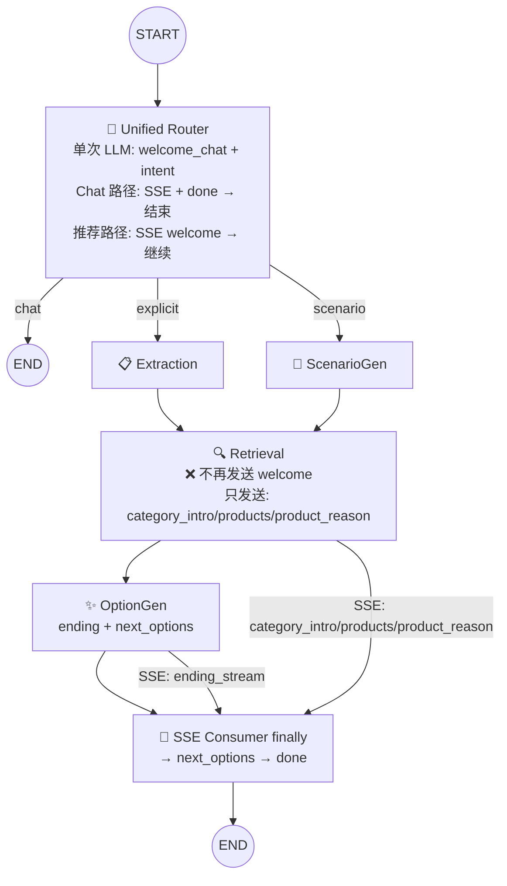

# MERGE_OPT2 — 实现方案

> 输入: `server/docs/AGENT_OPT/MERGE_OPT2/DEFINE.md`
> 输出: `server/docs/AGENT_OPT/MERGE_OPT2/PLAN.md`

## 1. 整体架构

### Graph 节点变更



**核心变更:**
- `router_node` 合并原 `chitchat_node` 功能，单次 LLM 完成分类 + 回复生成
- Chat 路径: router 发送 SSE 回复 + `done` 后直接结束，不再经过 chitchat 节点
- 推荐路径: router 发送 welcome 后继续 extraction/scenario_gen → retrieval → option_gen
- retrieval 不再发送 welcome 事件（由 router 统一负责）

### AgentState 变更

无新增字段，无删除字段。现有 `welcome_text` 字段保留（用于非流式路径状态传递和日志/调试）。

### LLM 调用对比

```
Post-MERGE_OPT 状态:
  Chat 路径:       ROUTER_SYSTEM(1) + CHITCHAT_SYSTEM(1) = 2 次
  推荐路径:         ROUTER_SYSTEM(1) + WELCOME_SYSTEM(1) = 2 次
  完整推荐链路:      2 + Extraction(1) + Ending/Option(1) = 4 次

MERGE_OPT2 目标:
  Chat 路径:       UNIFIED_ROUTER_SYSTEM(1) = 1 次 (−1)
  推荐路径:         UNIFIED_ROUTER_SYSTEM(1) = 1 次 (−1)
  完整推荐链路:      1 + Extraction(1) + Ending/Option(1) = 3 次 (−1 vs post-MERGE_OPT, −3 vs 原始)
```

## 2. 模块级变更

### 2.1 unified_router_prompt.py — **新建** — 统一提示词

合并三类提示词为 `UNIFIED_ROUTER_SYSTEM`:

```
结构:
  1. 角色设定: 电商导购助手
  2. 意图分类规则: chat / explicit / scenario（来自 ROUTER_SYSTEM）
  3. 分类示例（来自 ROUTER_SYSTEM）
  4. Chat 回复规则: 亲切自然、50字内、引导购物（来自 CHITCHAT_SYSTEM）
  5. 商品欢迎语规则: 单品类突出特点、多品类突出场景感（来自 WELCOME_SYSTEM）
  6. 输出格式: {"welcome_chat": "...", "intent": "chat|explicit|scenario"}
```

**关键设计要求:**
- `welcome_chat` 字段必须在 JSON 中排在 `intent` 前面，确保流式提取能先拿到内容
- Chat 意图时 `welcome_chat` 内容为闲聊回复
- Explicit/scenario 意图时 `welcome_chat` 内容为商品相关欢迎语
- 提示词中保留 `{user_query}` 和 `{recent_queries}` 占位符

### 2.2 router.py — 重写 — 单次 LLM + SSE 发送

**删除:**
- `ROUTER_SYSTEM` import（改用 `UNIFIED_ROUTER_SYSTEM`）
- `WELCOME_SYSTEM` import
- `_generate_welcome()` 函数（逻辑合并到统一提示词）

**新增 import:**
- `from app.agent.prompts.unified_router_prompt import UNIFIED_ROUTER_SYSTEM`
- `from app.agent.utils.stream_json import stream_json_field`

**`router_node()` 新逻辑:**

```
1. 读取 user_query, session_memory, stream, queue
2. 构建 recent_queries 文本（复用 _format_recent_queries）
3. 构建 messages: UNIFIED_ROUTER_SYSTEM + user_query
4. 流式路径 (stream=True):
   a. llm.chat_stream() → token_stream
   b. stream_json_field(token_stream, "welcome_chat") 逐 token 推送 welcome_chat_stream 事件
   c. 解析完整 JSON 获得 intent
   d. chat 意图:
      - queue.put("done")
      - return {"intent": "chat", "welcome_text": ""}
   e. explicit/scenario 意图:
      - return {"intent": intent, "welcome_text": welcome_chat}
5. 非流式路径 (stream=False):
   a. llm.chat() → 解析 JSON 获得 {welcome_chat, intent}
   b. chat 意图:
      - queue.put({"event": "chat_reply", "data": welcome_chat})
      - queue.put({"event": "done", "data": {}})
      - return {"intent": "chat", "welcome_text": ""}
   c. explicit/scenario 意图:
      - queue.put({"event": "welcome", "data": welcome_chat})
      - return {"intent": intent, "welcome_text": welcome_chat}
```

**Fallback 处理:**
- LLM 调用失败 → `{"intent": "explicit", "welcome_text": ""}`
- JSON 解析失败 → `{"intent": "explicit"}`（复用现有 `_parse_router_response`）

**SSE 事件设计（流式路径）:**

由于流式输出时 intent 在 welcome_chat 之后才能确定，统一使用 `welcome_chat_stream` 事件名（start → delta × N → end）。前端根据后续事件判断路径：
- 紧接着收到 `done` → Chat 路径
- 紧接着收到 `category_intro`/`category_intro_stream` → 推荐路径

### 2.3 chitchat.py — **删除**

功能已合并到 `router_node`。`FALLBACK_REPLY` 常量按需迁移到 router.py 或删除（LLM fallback 走 unified prompt 自带的降级逻辑）。

### 2.4 router_prompt.py — **删除**

`ROUTER_SYSTEM` 内容迁移到 `unified_router_prompt.py`。

### 2.5 chitchat_prompt.py — **删除**

`CHITCHAT_SYSTEM` 内容迁移到 `unified_router_prompt.py`。

### 2.6 show_prompt.py — 删除 WELCOME_SYSTEM

删除 lines 1-24（`WELCOME_SYSTEM` 定义）。保留 `CATEGORY_INTRO_SYSTEM` 和 `PRODUCT_REASON_SYSTEM`（仍在 retrieval_node 中使用）。

### 2.7 graph.py — 移除 chitchat 节点

| 改动 | 说明 |
|---|---|
| 删除 `from app.agent.nodes.chitchat import chitchat_node` | 不再需要 |
| 删除 `_chitchat` wrapper 函数 (lines 90-94) | 功能已在 router |
| 删除 `graph.add_node("chitchat", _chitchat)` | 节点移除 |
| 删除 `graph.add_edge("chitchat", END)` | 边移除 |
| `route_intent()` "chat" → `"chitchat"` 改为 `"chat"` | 目标节点变更 |
| 条件边 map: `{"chitchat": "chitchat", ...}` → `{"chat": END, ...}` | Chat 直接结束 |

**条件边更新后的路由:**

```python
def route_intent(state: AgentState) -> str:
    intent = state.get("intent", "explicit")
    if intent == "chat":
        return "chat"
    elif intent == "scenario":
        return "scenario_gen"
    else:
        return "extraction"

graph.add_conditional_edges(
    "router", route_intent,
    {
        "chat": END,
        "extraction": "extraction",
        "scenario_gen": "scenario_gen",
    },
)
```

### 2.8 retriever.py — 删除 welcome 发送

删除 lines 344-348:
```python
# 1. 欢迎语（仅非流式模式: Router 已写入 state，此处读取并发送）
if not stream:
    welcome_text = state.get("welcome_text", "")
    if queue and welcome_text:
        await queue.put({"event": "welcome", "data": welcome_text})
```

> 非流式路径的 welcome 事件已改由 router_node 直接发送，retrieval_node 不再承担此职责。

### 2.9 测试文件更新

| 文件 | 改动 |
|---|---|
| `tests/test_router.py` | 更新 mock 验证: 不区分 chat welcome_text（合并到一个字段），验证 intent 分类正确 |
| `tests/test_chitchat.py` | **删除**（chitchat 节点已删除） |
| `tests/test_agent_state.py` | 无需改动（AgentState 字段无变化） |
| `tests/test_graph.py` | 更新节点数验证（5 节点 → 4 节点），条件边验证 |

### 2.10 文档同步

`server/docs/AGENT_OPT/GENERAL/SPEC.md`: 更新 Router 节点 I/O 表和 SSE 事件描述。

## 3. 实现顺序

```
F1 (新建 unified_router_prompt.py)
  → F2 (重写 router.py — 切换为新统一提示词 + SSE)
    → F3 (删除 chitchat.py + chitchat_prompt.py + router_prompt.py)
      → F4 (更新 graph.py — 移除 chitchat 节点 + 条件边)
        → F5 (retriever.py — 删除 welcome 发送)
          → F6 (show_prompt.py — 删除 WELCOME_SYSTEM)
            → 测试更新 + 文档同步
```

**顺序理由:** 先创建新提示词（F1），再修改核心节点逻辑（F2），确保 router_node 独立可用后再删除旧节点（F3-F4），最后清理残留引用（F5-F6）。

## 4. 关键设计决策

### 4.1 流式事件名称统一

**问题:** 流式输出时，intent 在 welcome_chat 内容之后才产出，无法在 streaming 阶段区分 chat 和推荐路径的事件名。

**决策:** 流式路径统一使用 `welcome_chat_stream` 事件名。前端根据后续事件区分路径：
- 收到 `done` 事件 → Chat 路径（前端显示为对话回复）
- 收到 `category_intro`/`category_intro_stream` → 推荐路径（前端显示为欢迎语）

**影响:** `chat_reply_stream` 事件名不再使用（改为 `welcome_chat_stream`）。需通知前端。

### 4.2 非流式事件保持向后兼容

非流式路径在 LLM 返回后即可获得 intent，因此仍可发送路径特定的事件名：
- Chat → `chat_reply` + `done`
- 推荐 → `welcome`

前端在后兼容模式下无需改动。

### 4.3 `welcome_text` 字段保留

即使 SSE 不再经过 retrieval，`welcome_text` 仍写入 AgentState，用于日志记录和调试。

## 5. 方案主要优点

- **减少 1 次 LLM 调用**：所有路径节约 1 次（相对 post-MERGE_OPT），结合 MERGE_OPT 共节约 3 次（相对原始版本）
- **节点简化**：从 6 节点减少到 5 节点（删除 chitchat），Graph 结构更清晰
- **职责集中**：router_node 成为唯一入口，统一处理所有意图的首次回复
- **提示词内聚**：分类、闲聊、欢迎语逻辑集中在一个提示词中，便于调优和维护

## 6. 主要风险

| 风险 | 概率 | 影响 | 缓解 |
|---|---|---|---|
| 合并 prompt 导致意图分类准确率下降 | 中 | 错误路由到 extraction/scenario_gen 或漏掉 chat | 保留完整分类示例和规则；测试验证三分类准确率 |
| 流式 welcome_chat + intent 解析在低质量 LLM 上可能失败 | 中 | welcome_chat 为空或 intent 解析错误 | 非流式 fallback；intent fallback 为 explicit |
| `welcome_chat_stream` 事件名变更导致前端不兼容 | 低 | Chat 路径流式回复不显示 | 提前与前端沟通事件名变更；提供 migration guide |
| WELCOME_SYSTEM 规则在合并后丢失 | 低 | 欢迎语质量下降 | 在统一提示词中保留核心规则（口语化、60 字内、不编造品牌等） |
| Chat 路径 done 事件发送时机变化 | 低 | 前端 SSE 消费逻辑异常 | `_agent_event_stream` consumer loop 在收到 done 后立即退出，不依赖发送者 |

## 7. 复杂度评估

- **新建文件**: 1（`unified_router_prompt.py`）
- **重写文件**: 1（`router.py` ~130 行 → ~100 行）
- **删除文件**: 3（`chitchat.py`, `chitchat_prompt.py`, `router_prompt.py`）
- **修改文件**: 3（`graph.py`, `retriever.py`, `show_prompt.py`）
- **删除测试**: 1（`test_chitchat.py`）
- **新增依赖**: 0
- **复杂度**: **中等** — 核心逻辑集中在 router.py 重写和 graph.py 路由变更

## 8. 可测试性评估

- **F1 (统一提示词)**: `test_router.py` 验证三分类 + welcome_chat 内容质量（用 mock LLM 或离线 LLM）
- **F2 (router_node 重写)**: 现有 `test_router.py` 扩展验证流式/非流式两路；mock `stream_json_field` 验证 SSE 事件发出
- **F3-F5 (删除旧代码)**: 验证无 import 错误，graph 可编译
- **F6 (cleanup)**: grep 确认无残留引用
- **回归**: 全量 pytest 验证无回归（约 183 个测试）

## 9. 可交付性评估

所有改动限定在 server 端。**可立即实施。**
