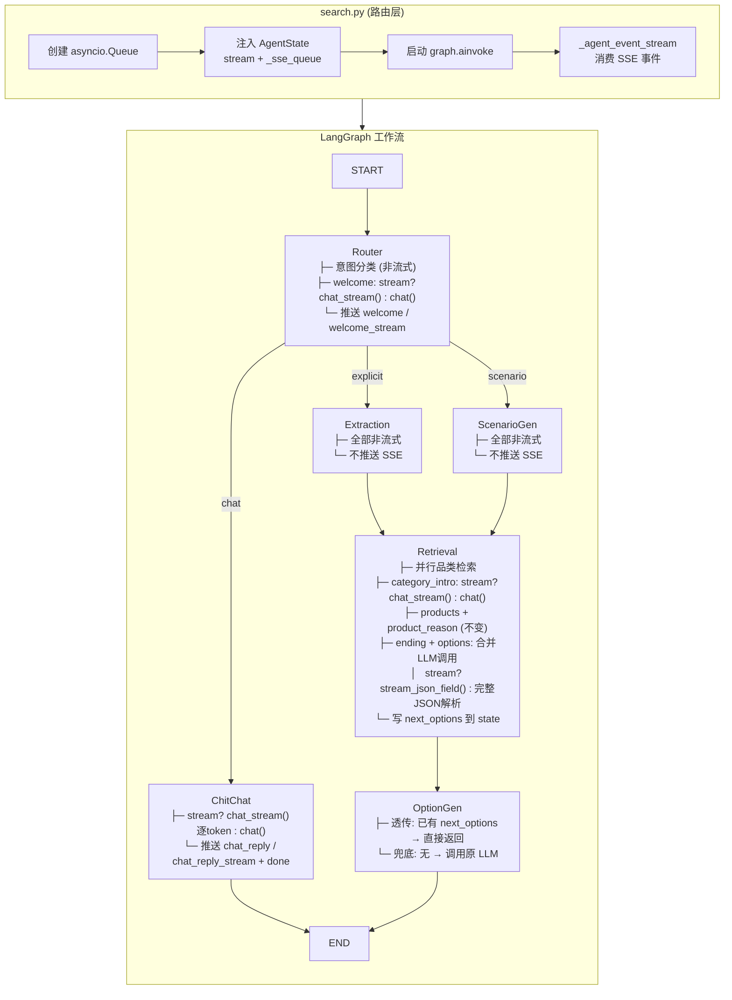

# PLAN.md — 流式输出优化架构方案

> 输入：`server/docs/AGENT_OPT/OUTPUT_OPT/DEFINE.md`
> 参考：`server/docs/AGENT_OPT/GENERAL/OUTPUT_DESIGN.md`、`server/docs/AGENT_OPT/MERGE_OPT/SPEC.md`

## 1. 整体实现架构



**核心思路**：保持单 `asyncio.Queue` 架构不变，通过 `stream` 字段控制各节点的 LLM 调用方式和 SSE 事件名。流式路径使用 `_stream` 后缀事件名，非流式路径保持现有事件名。

## 2. 核心功能接口与需求映射

| 功能需求 | 实现方式 | 涉及模块 |
|---------|---------|---------|
| F1: stream 开关 | `stream: bool` 注入 AgentState，各节点 `state.get("stream", True)` 判断 | state.py, search.py, 各节点 |
| F2: 文本逐 token 流式 | 新增 `_stream` 事件（`welcome_stream`/`category_intro_stream`/`ending_stream`/`chat_reply_stream`），格式 `start → delta* → end` | Router, Retriever, ChitChat |
| F3: 合并 ending + options | 一次 LLM 调用，`stream=true` 时用 `stream_json_field()` 提取 ending 字段值并逐字符推送，完成后解析 next_options | Retriever |
| F4: 合并查询相关调用 | Router 移除查询改写，欢迎语直接基于历史+原查询 | Router, Extraction, ScenarioGen |

## 3. 模块设计

### 3.1 AgentState（`state.py`）

**输入**：无（类型定义）
**输出**：`AgentState` TypedDict

变更：
- **新增** `stream: bool` — 流式/非流式标志
- **移除** `welcome_text: str` — Router 直接推送，不再经 state 中转
- **移除** `rewritten_query: str` — MERGE_OPT 已取消查询改写

### 3.2 Router 节点（`nodes/router.py`）

**输入**：`state` + `llm` + `_sse_queue`（新增）
**输出**：`{"intent": str, "welcome_text": str}`（仅非流式模式写 welcome_text）

功能：
- 意图分类（始终非流式 `chat()`）
- **移除**查询改写 LLM 调用（MERGE_OPT）
- 欢迎语生成：
  - `stream=true`：`chat_stream()` → 逐 token 推送 `welcome_stream`（start/delta/end）
  - `stream=false`：`chat()` → 完整文本写入 `state["welcome_text"]`

### 3.3 Retriever 节点（`nodes/retriever.py`）

**输入**：`state` + `llm` + `emb_service` + `async_session_factory` + `reranker` + `_sse_queue`
**输出**：`{"retrieval_results", "failed_categories", "session_memory", "next_options"}`（新增 next_options）

功能：
- welcome：不再读取 state 中的 welcome_text（Router 已直接推送）
- 品类并行检索：不变
- category_intro：
  - `stream=true`：`chat_stream()` → 逐 token 推送 `category_intro_stream`
  - `stream=false`：`chat()` → 完整文本推送 `category_intro`
- products + product_reason：不变（始终业务事件级别）
- ending + next_options（合并调用）：
  - `stream=true`：`chat_stream()` + `stream_json_field()` → 边流式推送 `ending_stream` 边收集完整 JSON → 解析 `next_options`
  - `stream=false`：`chat()` → 完整 JSON 解析 → 推送 `ending` 事件 → `next_options` 存 state
- memory 更新：不变

### 3.4 ChitChat 节点（`nodes/chitchat.py`）

**输入**：`state` + `llm`
**输出**：`{"chat_reply": str}`

功能：
- `stream=true`：`chat_stream()` → 逐 token 推送 `chat_reply_stream`
- `stream=false`：`chat()` → 完整文本推送 `chat_reply`
- done 事件始终由节点自身发送

### 3.5 OptionGen 节点（`nodes/option_gen.py`）

**输入**：`state` + `llm`
**输出**：`{"next_options": list[str]}`

功能：简化为透传节点
- `state["next_options"]` 已有值 → 直接返回
- 无值 → 调用原 LLM 生成（兜底）

### 3.6 流式 JSON 字段提取器（新增 `utils/stream_json.py`）

**输入**：`async_token_gen` (AsyncGenerator[str]) + `field_name` (str)
**输出**：`(stream_events: list[dict], parsed_dict: dict)`

功能：
- 四态状态机（SEEK_KEY → IN_VALUE → COLLECT → DONE）
- 实时检测目标 JSON 字段的字符串值边界
- 在 IN_VALUE 状态中，每个字符产生一个 delta 事件
- JSON 完整后解析整个 dict 并返回
- 失败时返回空 parsed_dict，stream_events 保留已完成部分

核心算法：

```
状态机:
  SEEK_KEY:
    在缓冲区中搜索 ""<field_name>":" 模式
    找到 → 进入 IN_VALUE，跳过开头的 "
    未找到 → 继续累积

  IN_VALUE:
    逐字符扫描:
      \  → 转义处理，跳过下一字符
      "  → 字段值结束，进入 COLLECT
      其他 → 产出 delta 事件

  COLLECT:
    继续累积字符直到 JSON 完整（括号匹配）
    JSON 完整 → 解析为 dict → DONE
```

### 3.7 Graph 构建层（`graph.py`）

**输入**：`llm`, `emb_service`, `async_session_factory`, `reranker_service`
**输出**：`CompiledStateGraph`

变更：
- `_router` 包装函数传入 `_sse_queue=state.get("_sse_queue")`
- `_retrieval` 不变（已传入 queue）
- 边结构不变

### 3.8 API 路由层（`search.py`）

变更：
- `initial_state["stream"] = stream`（第 210-224 行之间新增）
- `_agent_event_stream` 逻辑不变（消费循环与事件名无关，直接转发）

## 4. 事件序列对比

### 推荐路径（stream=true）

```
welcome_stream(start) → welcome_stream(delta)* → welcome_stream(end)
  → (category_intro_stream(start) → delta* → end)? → products → product_reason*
    → ending_stream(start) → delta* → end
      → next_options → done
```

### 推荐路径（stream=false）

```
welcome → (category_intro)? → products → product_reason* → ending → next_options → done
```

### 闲聊路径（stream=true）

```
chat_reply_stream(start) → delta* → end → done
```

### 闲聊路径（stream=false）

```
chat_reply → done
```

## 5. 方案优点

1. **最小侵入**：保持单 Queue 架构、事件驱动的消费模型不变，只改变事件名和推送粒度
2. **向后兼容**：`_stream` 是新事件名，旧客户端监听 `welcome` 等事件不受影响；`stream=false` 完全保持现有行为
3. **节点职责清晰**：Router 负责 welcome，Retriever 负责 category_intro/ending/products，ChitChat 负责 chat_reply
4. **流式提取器通用**：`stream_json_field()` 不依赖特定 LLM 输出格式，可复用于其他 JSON 字段流式提取场景

## 6. 主要风险

| 风险 | 等级 | 缓解措施 |
|------|------|---------|
| `stream_json_field()` 复杂度过高 | 中 | 限制状态机范围：仅处理 ending 字段为字符串类型的情况，不支持嵌套 JSON |
| LLM 输出 JSON 格式不稳定（缺 closing brace、字段名异常等） | 中 | 状态机超时 + fallback：完整 JSON 解析失败时用正则提取 ending 文本 |
| `_stream` 事件大幅增加事件数量 | 低 | 每个 token 一个事件，对于 ~100 token 的文本是可控的；SSE 协议本身支持高频事件 |
| MERGE_OPT 和 OUTPUT_OPT 并行开发冲突 | 低 | 两个 SPEC 的变更文件有交集（Router, Retriever, graph.py），需要协调实现顺序 |

## 7. 实现复杂度评估

| 模块 | 复杂度 | 工时估计 |
|------|--------|---------|
| `stream_json.py`（新增） | 中 | 核心状态机 + 测试 |
| Router 改造 | 低 | 新增 queue 参数 + 分支逻辑 |
| Retriever 改造 | 中 | 合并 ending/options + 流式分支 |
| ChitChat 改造 | 低 | 分支逻辑 |
| OptionGen 简化 | 低 | 透传检查 |
| AgentState 变更 | 低 | 增删字段 |
| graph.py 适配 | 低 | 传参调整 |
| search.py 适配 | 低 | 注入 stream |
| **合计** | **中低** | |

## 8. 可测试性评估

- `stream_json_field()` 是纯函数，易于单元测试（模拟 token 生成器，验证事件序列和解析结果）
- 各节点的流式/非流式分支可通过 mock `chat_stream()` vs `chat()` 独立测试
- SSE 事件序列可通过 mock queue 验证事件类型和顺序
- 现有测试（Router/Retriever/ChitChat）需要更新以适应新的事件名和字段变更
- 需新增测试：stream_json_field 状态机各种输入场景、合并 ending/options 的 LLM 输出格式

## 9. 可交付性评估

- 所有变更限制在 `server/` 目录内，不涉及前端、部署、配置
- 向后兼容，可通过 `stream=false` 无缝回退
- 可分批交付：先合并 MERGE_OPT 变更，再叠加 OUTPUT_OPT 流式化改造
