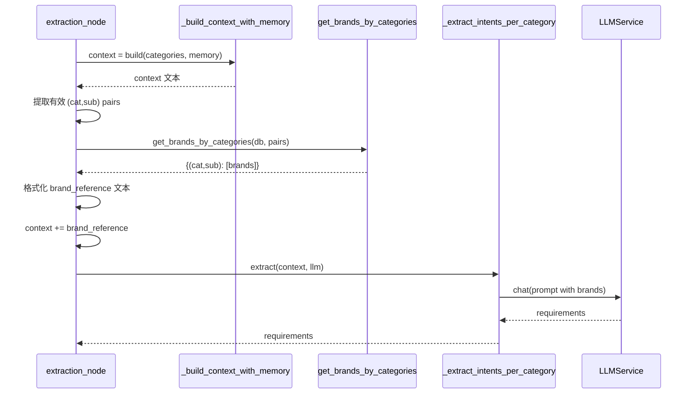
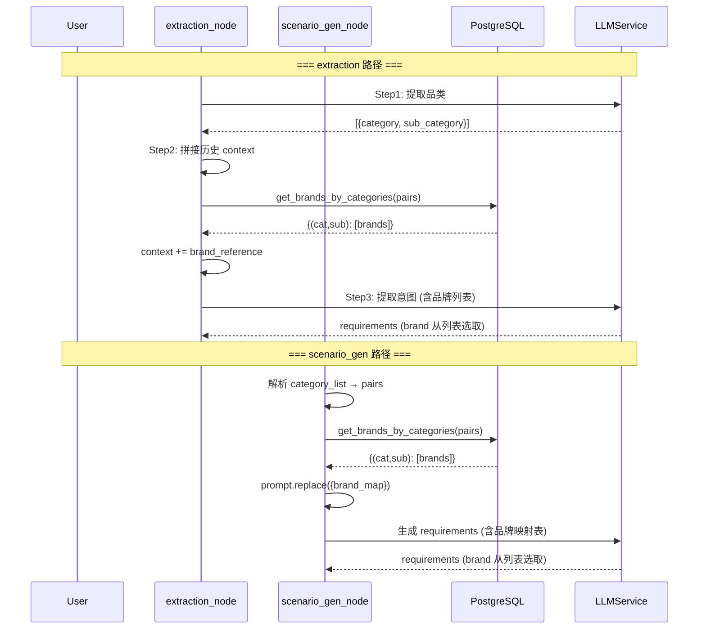

# 编码级详细方案 — 提示词品牌注入与格式对齐

> **输入**: `server/docs/AGENT_OPT/PROMPT_OPT/PLAN.md`

## 1. 模块详细设计

### 1.1 `tools.py` — 新增 2 个品牌查询函数

#### `get_brands_by_category` — 单品类查询

**实现思路**: `query_field_values` 的薄封装，按 (category, sub_category) 过滤 product.brand。

```python
async def get_brands_by_category(
    db: AsyncSession,
    category: str | None,
    sub_category: str | None,
) -> list[str]:
    filters = {}
    if category:
        filters["category"] = category
    if sub_category:
        filters["sub_category"] = sub_category
    return await query_field_values(db, "product", "brand", filters)
```

**调用示例**:
```python
brands = await get_brands_by_category(db, "面部护肤", "防晒")
# → ["安热沙", "资生堂", "碧柔", ...]
```

#### `get_brands_by_categories` — 批量查询

**实现思路**: 一次 SQL 查询全部品牌（按 (category, sub_category) 分组），Python 侧过滤截断。

```python
async def get_brands_by_categories(
    db: AsyncSession,
    pairs: list[tuple[str, str]],
) -> dict[tuple[str, str], list[str]]:
    """批量查询多个品类的品牌列表。
    
    参数:
        db: 异步 SQLAlchemy 会话。
        pairs: (category, sub_category) 元组列表。
    
    返回值:
        {(category, sub_category): [brand1, brand2, ...]}，每品类最多 20 个品牌，
        按商品数量降序排列。
    """
    if not pairs:
        return {}
    
    # 构建 IN 子句的参数化占位符
    pair_set = set(pairs)  # 去重
    placeholders = []
    params = {}
    for i, (cat, sub) in enumerate(pair_set):
        cp = f"c_{i}"
        sp = f"s_{i}"
        placeholders.append(f"(:{cp}, :{sp})")
        params[cp] = cat
        params[sp] = sub
    
    sql = text(f"""
        SELECT category, sub_category, brand, COUNT(*) AS cnt
        FROM product
        WHERE (category, sub_category) IN ({", ".join(placeholders)})
          AND brand IS NOT NULL AND brand != ''
          AND is_active = TRUE
        GROUP BY category, sub_category, brand
        ORDER BY category, sub_category, cnt DESC
    """)
    
    try:
        result = await db.execute(sql, params)
        rows = result.fetchall()
    except Exception as e:
        logger.warning("get_brands_by_categories 查询失败", error=str(e))
        return {}
    
    # 按 (category, sub_category) 分组，每品类截断 top-20
    grouped: dict[tuple[str, str], list[str]] = {}
    for row in rows:
        key = (row.category, row.sub_category)
        if key not in grouped:
            grouped[key] = []
        if len(grouped[key]) < 20:
            grouped[key].append(row.brand)
    
    # 确保请求的 pair 都有 key（即使为空列表）
    for pair in pair_set:
        if pair not in grouped:
            grouped[pair] = []
    
    return grouped
```

**关键设计**:
- `is_active = TRUE` 过滤下架商品
- 参数化 SQL（白名单外的字段不拼接）
- 每品类 top-20 截断（`COUNT(*) DESC`）
- 请求的 pair 即使无品牌也返回 `[]`

---

### 1.2 `extraction_prompt.py` — 移除 TODO，新增品牌选取规则

**变更位置**: Step3 提示词第 38、44 行。

**Before** (lines 38, 44):
```
- brand 相关：提取为 brand 列表。用户明确提到品牌时填入；涉及国家/地区风格时可用世界知识展开（如"日系防晒"→["安热沙","资生堂"]）；无品牌偏好填空列表[]，注意提取的品牌也必须是真实存储于数据库的，可以通过工具查询(category, sub_category)品类下有哪些品牌；

### TODO 根据(category, sub_category)查询品牌名工具
```

**After**:
```
- brand 相关：提取为 brand 列表。用户明确提到品牌时填入；涉及国家/地区风格时可用世界知识展开（如"日系防晒"→["安热沙","资生堂"]）；无品牌偏好填空列表 []。brand 值 MUST 从下方【可用品牌列表】中选取，不能编造。列表为空时填 []。

## 可用品牌列表
{brand_reference}
```

**变更说明**: `{brand_reference}` 占位符由 extraction.py 在调用前替换为格式化的品牌列表文本。

---

### 1.3 `scenario_gen_prompt.py` — 移除 TODO，新增品牌映射表

**变更位置**: 第 28、31 行。

**Before** (lines 28, 31):
```
- **brand**: 品牌偏好列表。用户明确提到品牌时填入；涉及国家/地区风格时可用世界知识展开（如"日系防晒"→["安热沙","资生堂"]）；无品牌偏好填空列表[]，注意提取的品牌也必须是真实存储于数据库的，可以通过工具查询(category, sub_category)品类下有哪些品牌

## TODO 根据(category, sub_category)查询品牌名工具
```

**After**:
```
- **brand**: 品牌偏好列表。用户明确提到品牌时填入；涉及国家/地区风格时可用世界知识展开（如"日系防晒"→["安热沙","资生堂"]）；无品牌偏好填空列表 []。brand 值 MUST 从下方【品类品牌映射表】中选取，不能编造。映射表中无对应品牌时填 []。

## 品类品牌映射表
{brand_map}
```

**变更说明**: `{brand_map}` 占位符由 scenario_gen.py 在调用前替换为格式化的品类→品牌映射表文本。

**示例值对齐** (line 50): `"brand": null` → `"brand": []`

---

### 1.4 `extraction.py` — Step3 品牌注入 + brand 格式对齐

#### 变更点 1: `extraction_node` 中注入品牌

**位置**: 第 259 行（Step2 context 构建后，Step3 调用前）

**实现链路**:


**代码变更** (在 `extraction_node` 第 259-262 行之间插入):

```python
# ---- Step 2: 检索历史并拼接 ----
context = _build_context_with_memory(rewritten_query, categories, session_memory)

# ---- 新增: 查询品牌列表并注入 context ----
brand_map = {}
try:
    pairs = [
        (c.get("category"), c.get("sub_category"))
        for c in categories
        if c.get("category") and c.get("sub_category")
    ]
    if pairs:
        from app.agent.tools import get_brands_by_categories
        async with db_session_factory() as session:
            brand_map = await get_brands_by_categories(session, pairs)
except Exception as e:
    logger.warning("Step3 品牌查询失败", error=str(e))

# 格式化品牌参考文本
brand_lines = []
for (cat, sub), brands in brand_map.items():
    if brands:
        brand_lines.append(f"- {cat}/{sub}: {', '.join(brands)}")
    else:
        brand_lines.append(f"- {cat}/{sub}: (该品类暂无品牌数据)")
brand_reference = "\n".join(brand_lines) if brand_lines else "(品牌数据暂不可用)"

context = context + "\n\n## 可用品牌列表\n" + brand_reference

# ---- Step 3: 分组提取意图 ----
requirements = await _extract_intents_per_category(context, llm)
```

#### 变更点 2: brand 默认值对齐

**位置**: 第 220 行

```python
# Before:
"brand": item.get("brand") if item.get("brand") else None,

# After:
"brand": item.get("brand") if item.get("brand") else [],
```

---

### 1.5 `scenario_gen.py` — 品牌注入 + brand 格式对齐

#### 变更点 1: `scenario_gen_node` 中注入品牌映射表

**位置**: 第 144 行（history_context 构建后，prompt 构建前）

**代码变更**:

```python
# 构建历史查询上下文
history_context = _build_scenario_history_context(
    rewritten_query, category_list, session_memory
)

# ---- 新增: 查询全部品类品牌映射表 ----
brand_map_text = "(品牌数据暂不可用)"
pairs = list(_parse_category_list(category_list))
if pairs and db_session_factory:
    try:
        from app.agent.tools import get_brands_by_categories
        async with db_session_factory() as session:
            brand_map = await get_brands_by_categories(session, pairs)
        # 格式化为紧凑文本
        lines = []
        for (cat, sub), brands in sorted(brand_map.items()):
            if brands:
                lines.append(f"- {cat}/{sub}: {', '.join(brands[:10])}")
            else:
                lines.append(f"- {cat}/{sub}: (暂无)")
        brand_map_text = "\n".join(lines) if lines else "(无品类数据)"
    except Exception as e:
        logger.warning("scenario_gen 品牌查询失败", error=str(e))

prompt = (SCENARIO_GEN_SYSTEM
          .replace("{category_list}", category_list)
          .replace("{history_context}", history_context)
          .replace("{brand_map}", brand_map_text)
          .replace("{user_query}", rewritten_query))
```

**注意**: `_parse_category_list` 返回 `set[tuple[str, str]]`，直接转为 list 传给 `get_brands_by_categories`。

#### 变更点 2: brand 默认值对齐

**位置**: 第 193 行

```python
# Before:
"brand": sq.get("brand") if sq.get("brand") else None,

# After:
"brand": sq.get("brand") if sq.get("brand") else [],
```

---

## 2. 关键数据实体

无新增数据实体。品牌映射表为临时内存数据结构：

| 变量 | 类型 | 来源 | 用途 |
|------|------|------|------|
| `brand_map` | `dict[(str,str), list[str]]` | `get_brands_by_categories` | 品类→品牌映射，注入 prompt |
| `brand_reference` | `str` | 格式化 `brand_map` | 追加到 extraction Step3 context |
| `brand_map_text` | `str` | 格式化 `brand_map` | 替换 scenario_gen `{brand_map}` |

---

## 3. 期望项目目录结构

```
server/
├── app/agent/
│   ├── tools.py                       # ← 新增 get_brands_by_category / get_brands_by_categories
│   ├── nodes/
│   │   ├── extraction.py              # ← Step3 品牌注入 + brand None→[]
│   │   └── scenario_gen.py            # ← prompt 品牌注入 + brand None→[]
│   └── prompts/
│       ├── extraction_prompt.py       # ← 移除 TODO + 新增品牌选取规则 + {brand_reference}
│       └── scenario_gen_prompt.py     # ← 移除 TODO + 新增品牌选取规则 + {brand_map}
└── docs/AGENT_OPT/PROMPT_OPT/
    ├── SPEC.md
    ├── DEFINE.md
    ├── PLAN.md
    └── CON_PLAN.md                    # ← 本文档
```

---

## 4. 实现链路时序



---

## 5. 风险点与待优化项

| 风险 | 等级 | 缓解 |
|------|------|------|
| scenario_gen brand_map_text 过长 | 低 | 每品类只取 top-10（非 top-20），品牌名本身很简短 |
| LLM 忽视品牌选取规则 | 低 | 提示词中 3 处强调（字段说明 + 品牌列表标题 + 格式示例）；Step1 post-hoc 校验作为兜底 |
| DB 查询阻塞 | 低 | 仅 1 次批量查询，延迟 ~10-50ms |
| 品牌为空时 prompt 仍需占位 | 极低 | 注入"(无品牌数据)"文本，不报错 |

### 待优化项（不在本次范围）

1. **品牌列表排序优化**: 当前按 COUNT(*) DESC，可改为按品牌首字母或拼音排序以降低 LLM 认知负担
2. **品牌语义匹配**: LLM 展开"日系"等风格词后，若展开的品牌不在列表中，可做模糊匹配（如编辑距离）
3. **品牌缓存**: 品牌列表变化频率低，可考虑 Redis 缓存避免每次查询 DB
