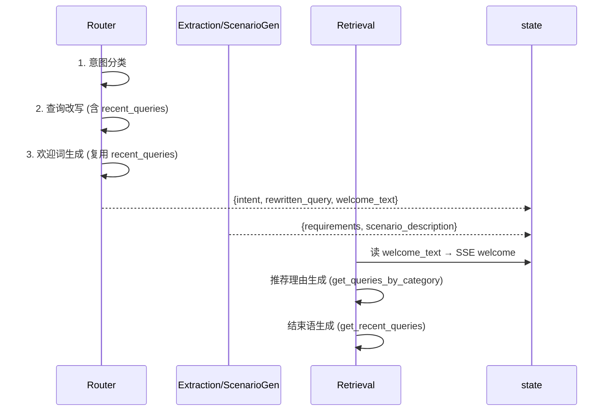

# PROMPT_OPT2 — CON_PLAN.md

## 1. router.py 详细设计

### `_generate_welcome()` 新增函数

```python
async def _generate_welcome(
    user_query: str,
    rewritten_query: str,
    recent_queries: list[dict],
    scenario_description: str,
    llm,
) -> str:
    """在 router 节点生成欢迎词。基于当前查询+改写结果+对话历史。
    失败时返回空字符串，不阻塞主流程。"""
    if not llm:
        return ""
    try:
        history_text = _format_recent_queries(recent_queries)
        prompt = WELCOME_SYSTEM.format(
            user_query=user_query,
            rewritten_query=rewritten_query,
            recent_queries=history_text,
            scenario_description=scenario_description or "无",
        )
        messages = [
            {"role": "system", "content": prompt},
            {"role": "user", "content": "请生成欢迎语"},
        ]
        text = await llm.chat(messages, temperature=0.3)
        return text.strip() if text else ""
    except Exception as e:
        logger.warning("欢迎语生成失败", error=str(e))
        return ""
```

### `router_node()` 修改

在现有返回之前，增加欢迎词生成步骤：

```python
# ---- Step 3: 生成欢迎词（explicit / scenario 路径） ----
welcome_text = ""
if intent in ("explicit", "scenario"):
    scenario_desc = state.get("scenario_description") or ""
    welcome_text = await _generate_welcome(
        user_query=user_query,
        rewritten_query=rewritten_query,
        recent_queries=recent_queries,
        scenario_description=scenario_desc,
        llm=llm,
    )

return {
    "intent": intent,
    "rewritten_query": rewritten_query,
    "welcome_text": welcome_text,
}
```

注意：router 阶段 `scenario_description` 尚未生成（由 scenario_gen 产出），始终为空字符串。后续 extraction/scenario_gen 可覆盖更新。

**recent_queries 复用**：router 改写阶段已调 `get_recent_queries()`，欢迎词直接复用该结果，不重复读取 memory。

## 2. retriever.py 详细设计

### 删除 `_generate_welcome()`

删除第 302-340 行整个函数体。

### `retrieval_node()` 修改

```python
# 原来：welcome_text = await _generate_welcome(requirements, scenario_description, llm)
# 改为：
welcome_text = state.get("welcome_text", "")
if queue and welcome_text:
    await queue.put({"event": "welcome", "data": welcome_text})
```

### `_generate_product_reason()` 签名修改

新增参数 `session_memory: list[dict]`：

```python
async def _generate_product_reason(
    sku: dict,
    total_in_category: int,
    category_overview: str,
    max_chars: int,
    llm,
    session_memory: list[dict] | None = None,  # 新增
) -> str:
```

函数内新增按品类检索历史：

```python
from app.agent.memory import get_queries_by_category
user_history = ""
if session_memory:
    cat = sku.get("category", "")
    sub = sku.get("sub_category", "")
    queries = get_queries_by_category(session_memory, cat, sub)
    if queries:
        user_history = "用户此前对该品类的关注：\n" + "\n".join(
            f"- {q['query']}" for q in queries
        )
```

prompt 注入：

```python
prompt = PRODUCT_REASON_SYSTEM.format(
    user_intent=user_intent,
    total_in_category=total_in_category,
    category_overview=category_overview,
    product_detail=product_detail,
    max_chars=max_chars,
    user_history=user_history or "无",  # 新增
)
```

**调用处传参**（retrieval_node 内，约第 565 行）：

```python
reason = await _generate_product_reason(
    sku, total_in_category, category_overview, max_chars, llm,
    session_memory=state.get("session_memory"),  # 新增
)
```

### `_generate_ending()` 签名修改

新增参数 `session_memory: list[dict]`：

```python
async def _generate_ending(
    category_results: list[dict],
    requirements: list[dict],
    llm,
    session_memory: list[dict] | None = None,
) -> str:
```

内部：

```python
from app.agent.memory import get_recent_queries
from app.config import settings

recent_text = "(无历史记录)"
if session_memory:
    n_rounds = settings.search.memory_recent_rounds
    recent = get_recent_queries(session_memory, n_rounds)
    if recent:
        recent_text = "\n".join(
            f"- {q['query']}" for q in sorted(recent, key=lambda x: x["timestamp"])
        )

prompt = ENDING_SYSTEM.format(
    categories_summary=categories_summary,
    product_count=total_products,
    scenario_description=scenario or "无",
    recent_queries=recent_text,  # 新增
)
```

**调用处传参**（retrieval_node 内，约第 603 行）：

```python
ending_text = await _generate_ending(
    safe_results, requirements, llm,
    session_memory=state.get("session_memory"),  # 新增
)
```

## 3. show_prompt.py 详细设计

### WELCOME_SYSTEM 改版

```python
WELCOME_SYSTEM = """你是一个电商导购助手。根据用户当前查询和对话历史，生成一句自然的欢迎语。

## 规则
- 结合对话历史理解用户当前意图，欢迎语与上下文自然衔接
- 额外关注当前查询，欢迎语主要是为了应答当前用户查询
- 语气口语化、亲切，像朋友聊天
- 一句话即可，不超过 60 字
- 不要使用"亲爱的用户""欢迎光临"等客服腔
- 不要编造商品名或具体品牌

## 对话历史
{recent_queries}

## 当前查询
{user_query}

## 场景描述（如有）
{scenario_description}

请生成欢迎语："""
```

### PRODUCT_REASON_SYSTEM 追加

在现有 `{product_detail}` 和规则之间插入：

```
## 用户此前对该品类的关注
{user_history}
```

### ENDING_SYSTEM 追加

在 `{scenario_description}` 之后插入：

```
## 对话历史
{recent_queries}
```

## 4. retriever_service.py 详细设计

### semantic_search 结果日志（第 404 行）

```python
# 原来：
top_rows=[{"sku_id": r.sku_id,
           "content": (r.matched_texts_json or [{}])[0].get("content", "")[:100]}
          for r in rows[:3]]

# 改为：
top_rows=[{"sku_id": r.sku_id,
           "score": round(float(r.score), 4),
           "content": (r.matched_texts_json or [{}])[0].get("content", "")[:100]}
          for r in rows[:3]]
```

### keyword_search 结果日志（第 508 行）

```python
# 原来：
top_rows=[{"sku_id": r.sku_id, "content": r.content[:100]}
           for r in rows[:3]]

# 改为：
top_rows=[{"sku_id": r.sku_id, "score": round(float(r.score), 4), "content": r.content[:100]}
           for r in rows[:3]]
```

## 5. 数据流



## 6. 关键实现要点

1. **router 阶段无 requirements**：欢迎词不依赖品类信息，仅用查询+历史。若用户需求是多品类，欢迎词仍可体现全局语境。
2. **recent_queries 复用**：router 改写步骤已获取，欢迎词直接复用，避免重复 memory 读取。
3. **失败降级**：欢迎词生成失败 → `welcome_text=""` → retrieval 跳过发送（不阻塞主流程）。
4. **推荐理由用按品类历史**：`get_queries_by_category()` 精确匹配当前商品品类，避免引入无关历史。
5. **结束语用跨品类历史**：`get_recent_queries()` 全局视野，与欢迎词一致。

## 7. 改动清单

| 文件 | 行数变化 | 关键改动 |
|------|---------|---------|
| `agent/nodes/router.py` | +45 | 新增 `_generate_welcome()`；新建 welcome 状态的 import；router_node 新增第 3 步 |
| `agent/nodes/retriever.py` | −25 +20 | 删除 `_generate_welcome()`；`_generate_product_reason`/`_generate_ending` 签名+参数；读取 welcome_text |
| `agent/prompts/show_prompt.py` | ~10 | 3 个模板各加历史占位符 |
| `services/retriever_service.py` | 4 | 两处 log 加 score |
