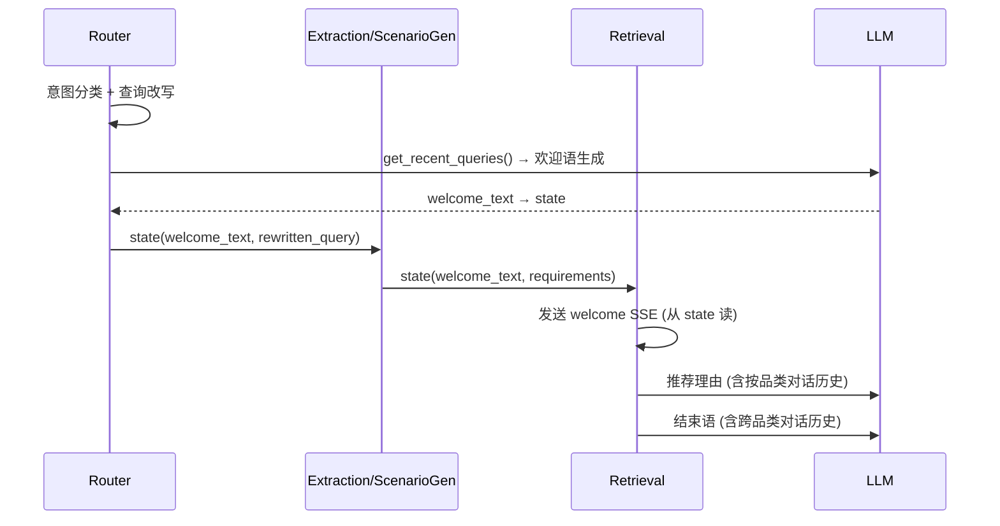

# PROMPT_OPT2 — PLAN.md

## 1. 实现架构

- 欢迎词不再从 retrieval 节点生成，改为 router 生成、retrieval 发送
- 推荐理由/结束语的 LLM prompt 各追加对话历史段落
- 日志改动：retriever_service.py 两处 debug log 加 score

## 2. 核心接口

| 函数 | 变化 | 说明 |
|------|------|------|
| `router_node()` | +欢迎词生成步骤 | 新增 `_generate_welcome()` 调用，写入 state |
| `retrieval_node()` | −欢迎词生成，+传参 | 读取 `welcome_text` 发送 SSE；推荐理由/结束语新增 history 参数 |
| `_generate_product_reason()` | +session_memory 参数 | 注入按品类匹配的历史 |
| `_generate_ending()` | +session_memory 参数 | 注入跨品类最近 N 轮 |
| 日志 | +score 字段 | 两处 top_rows 增加 score |

## 3. 模块变更

### 3.1 router.py
- **新增** `_generate_welcome(user_query, recent_queries, scenario_description, llm) → str`
- `router_node()` 末尾调用：若 intent ∈ {explicit, scenario}，基于当前查询+对话历史生成欢迎词写入 `state["welcome_text"]`
- 欢迎词不依赖 requirements（router 阶段尚未提取），改用 rewritten_query + 历史对话驱动

### 3.2 retriever.py
- **删除** 现有 `_generate_welcome()`
- **修改** `retrieval_node()` 发送欢迎词：读 `state.get("welcome_text")` 而非本地生成
- **修改** `_generate_product_reason()` 签名，新增 `session_memory`，按品类检索历史传入 prompt
- **修改** `_generate_ending()` 签名，新增 `session_memory`，传入跨品类最近 N 轮

### 3.3 show_prompt.py
- WELCOME: 新增 `{recent_queries}` 占位符
- PRODUCT_REASON: 新增 `{user_history}` 占位符
- ENDING: 新增 `{recent_queries}` 占位符

### 3.4 retriever_service.py
- 两处 debug log 的 `top_rows` dict 加 `"score": round(r.score, 4)`

## 4. 优点

- 欢迎词生成时机提前（分类完成后即有），可利用改写阶段已获取的 recent_queries，无需重复读取 memory
- 推荐理由和结束语获得对话上下文后，推荐语更连贯、结束语更有针对性
- 日志增强便于检索效果调试

## 5. 风险

- Router 节点多一次 LLM 调用，router 总耗时增加 ~1-2s，但仍在超时范围内
- 欢迎词生成依赖 `requirements`（当前在 extraction/scenario_gen 之后才有），但 SPEC 明确说用当前查询+历史，实际上不需要 requirements 详情

## 6. 复杂度评估

低。改动集中在 4 个文件，无新增文件，无架构变更。

## 7. 可测试性

- 欢迎词/推荐理由/结束语的生成函数均为纯 async 函数，可独立 mock LLM 测试
- 日志变更无需测试
