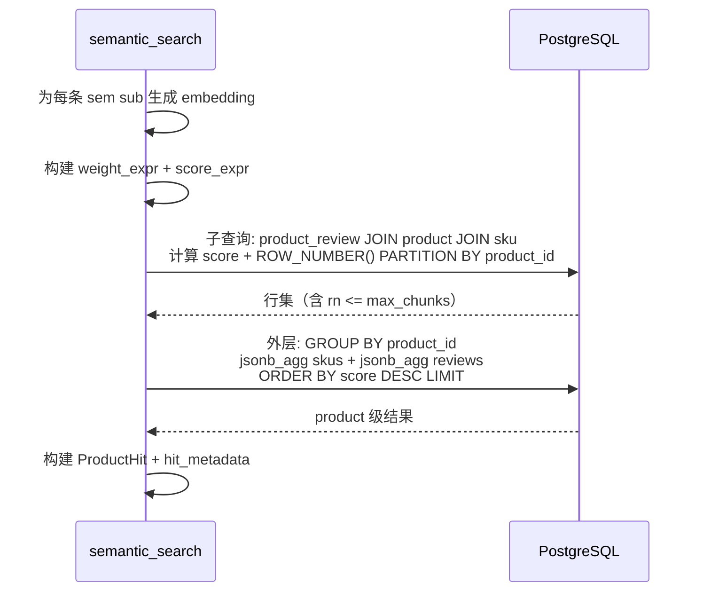
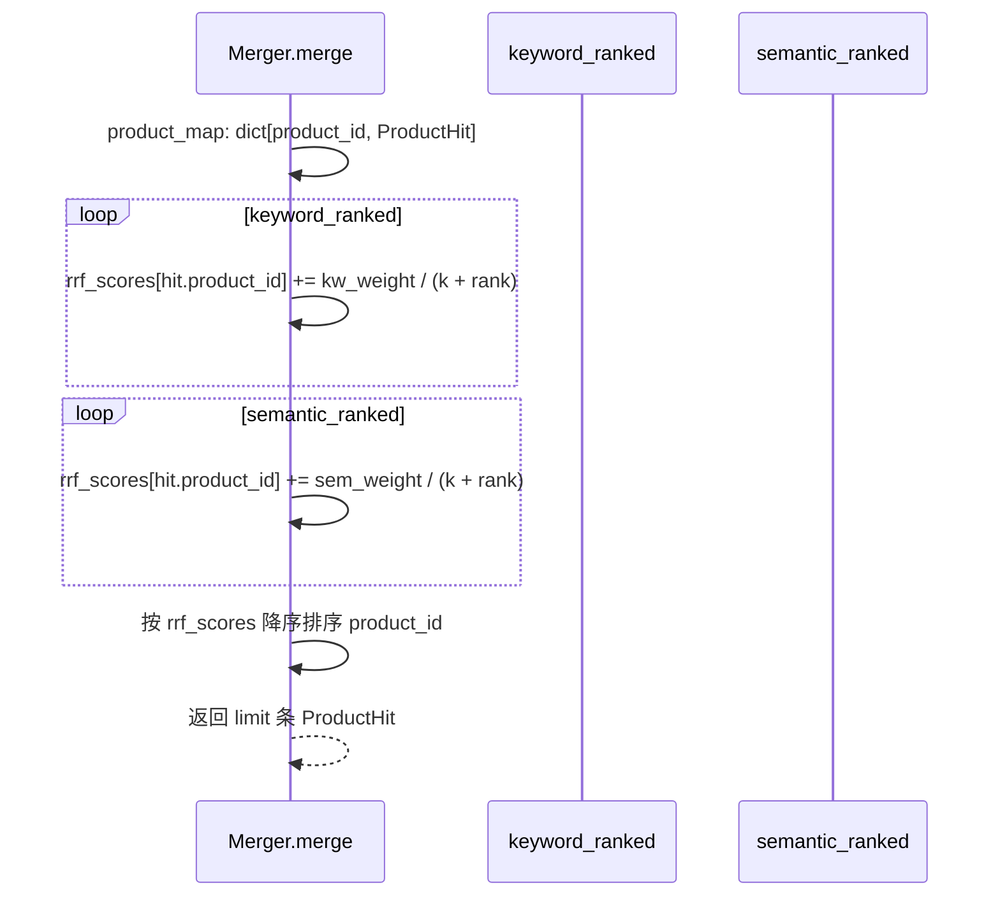

# CON_PLAN.md — Retrieve 节点 Product 级别重构编码级设计

## 输入

- **DEFINE.md**: `server/docs/AGENT_OPT/SENER_OPT/DEFINE.md`
- **PLAN.md**: `server/docs/AGENT_OPT/SENER_OPT/PLAN.md`

## 1. M1: retriever_service.py 详细设计

### 1.1 ProductHit 数据类

替换 `SKUHit`：

```python
@dataclass
class ProductHit:
    product_id: str
    score: float
```

`__all__` 导出列表同步更新：`SKUHit` → `ProductHit`。

### 1.2 _build_base_query 重构

**当前签名**: `_build_base_query(filters, score_expr, extra_cols="")`

**新签名**: `_build_base_query(filters, score_expr)` — 移除 `extra_cols` 参数

**当前 SELECT**: `SELECT s.sku_id, p.product_id, {score_expr}{extra_cols}`

**新 SELECT**: `SELECT p.product_id, {score_expr}` — 固定 product 列，不再拼接 extra_cols

FROM 子句不变（保留 JOIN sku）。

### 1.3 _semantic_search 重构



**SQL 模板**:

```sql
SELECT
    sub.product_id,
    SUM(sub.weighted_score) AS score,
    sub.title, sub.brand, sub.category, sub.sub_category, sub.base_price,
    jsonb_agg(DISTINCT sub.sku_json) AS skus_json,
    jsonb_agg(jsonb_build_object(
        'content', sub.content,
        'source', sub.source,
        'metadata', sub.metadata
    )) AS matched_texts_json
FROM (
    SELECT
        p.product_id, p.title, p.brand, p.category, p.sub_category, p.base_price,
        pr.content, pr.source, pr.metadata,
        {weight_expr} * ({score_expr}) AS weighted_score,
        jsonb_build_object(
            'sku_id', s.sku_id,
            'properties', s.properties,
            'price', s.price,
            'stock', s.stock
        ) AS sku_json,
        ROW_NUMBER() OVER (
            PARTITION BY pr.product_id
            ORDER BY {weight_expr} * ({score_expr}) DESC
        ) AS rn
    FROM product_review pr
    JOIN product p ON p.product_id = pr.product_id AND p.is_active = TRUE
    JOIN sku s ON s.product_id = p.product_id AND s.is_active = TRUE
    {where_clause}
) sub
WHERE sub.rn <= :max_chunks
GROUP BY sub.product_id, sub.title, sub.brand, sub.category, sub.sub_category, sub.base_price
ORDER BY score DESC
LIMIT :limit
```

**实现要点**:
- `max_chunks`: `settings.search.max_chunks_per_product`
- `DISTINCT` 在 `jsonb_agg(sku_json)` 中防止重复 SKU（因为同一 SKU 可能匹配多个 review chunk）
- 每行分数字段在子查询中预计算为 `weighted_score`
- `hit_metadata` 构建: key = `product_id`，value 包含 product 基础字段 + `skus`(list) + `matched_texts`(list)

### 1.4 _keyword_search 重构

同样模式，调整之处：

- 得分表达式：`ts_rank(...)` 或 `0.3`（ILIKE fallback）
- 子查询 + ROW_NUMBER + 外层聚合结构同上
- 去重逻辑：按 `product_id` 去重（原按 `sku_id`）

**去重代码变更**:
```python
# 原: deduped: dict[str, SKUHit] = {}  # key = sku_id
# 新: deduped: dict[str, ProductHit] = {}  # key = product_id
```

### 1.5 _merge_metadata 适配

函数签名不变，但 metadata dict 的 key 从 sku_id 变为 product_id。去重逻辑不变。

---

## 2. M2: retriever.py 详细设计

### 2.1 Merger 适配



代码改动：`h.sku_id` → `h.product_id`（约 6 处）。

### 2.2 _category_task 适配

**`retrieve_result["hit_metadata"]`** 的 key 从 `sku_id` 变为 `product_id`：

```python
# 原: meta = merged_meta.get(hit.sku_id, {})
# 新: meta = merged_meta.get(hit.product_id, {})
```

**SSE products 事件**:
```python
# 去掉 sku_id，只保留 product_id
await queue.put({
    "event": "products",
    "data": {
        "product_id": product["product_id"],
        "category": category,
        "sub_category": sub_category,
    },
})
```

**reranker documents 构建**: 查询 meta 中 `title` + `matched_texts[0]` 构建文档文本（逻辑不变）。

**最终 SKU 列表组装**: meta 中已包含 `skus` 列表（来自 JSONB 聚合），无需二次查询。

### 2.3 _build_product_context 适配

输入列表的每一项是 product 级别 dict：

```python
{
    "product_id": "...",
    "title": "...",
    "brand": "...",
    "category": "...",
    "base_price": ...,
    "skus": [{"sku_id": ..., "properties": ..., "price": ..., "stock": ...}],
    "matched_texts": [...],
}
```

函数逻辑简化：因为每个输入项已经是一个独立 product，无需按 `product_id` 分组，直接遍历构建即可。

### 2.4 retrieval_node 适配

- 遍历 `retrieval_results` 时使用 `product["product_id"]`（原 `sku["sku_id"]`）
- `_generate_product_reason` 的 `sku` 参数改名为 `product`
- 推荐理由生成时 product 上下文中 SKU 信息已嵌套

---

## 3. M3: sku_utils_service.py 适配

### 3.1 _get_skus → _get_products

| 项目 | 原 | 新 |
|------|-----|-----|
| 函数名 | `_get_skus` | `_get_products` |
| 参数 | `skuhits: list[SKUHit]` | `hits: list[ProductHit]` |
| 查询条件 | `Sku.sku_id.in_(sku_ids)` | `Product.product_id.in_(product_ids)` |
| 聚合 key | `sku_id` | `product_id` |

**注意**: `_get_products` 在新的 Product 级别架构下可能不再需要。因为 `_semantic_search` / `_keyword_search` 的 `hit_metadata` 已经通过 JSONB 聚合包含了所有 product 和 sku 信息。检查是否有外部调用者（如 `search.py` 中的非 Agent 路径）依赖 `_get_skus`，若有则保留并适配。

### 3.2 _truncate_texts

函数本身不变，但调用处参数名更新：
- `max_match_texts_per_sku` → `max_match_texts_per_product`
- `max_match_chars_per_sku` → `max_match_chars_per_product`

---

## 4. M4: 配置层

### 4.1 config.yaml

```yaml
search:
  # ... 现有字段保持不变 ...
  max_chunks_per_product: 5          # [NEW] 每个 product 最多保留的 product_review chunk 数
  max_match_texts_per_product: 3     # [RENAME] 原 max_match_texts_per_sku
  max_match_chars_per_product: 500   # [RENAME] 原 max_match_chars_per_sku
```

### 4.2 config.py SearchSettings

```python
max_chunks_per_product: int = 5       # [NEW]
max_match_texts_per_product: int = 3  # [RENAME]
max_match_chars_per_product: int = 500 # [RENAME]
```

旧字段 `max_match_texts_per_sku` 和 `max_match_chars_per_sku` 删除。

---

## 5. 期望目录结构变更

```
server/
├── app/
│   ├── api/
│   │   └── search.py              # [MODIFY] 如有直接调用 _get_skus 需适配
│   ├── agent/
│   │   └── nodes/
│   │       └── retriever.py        # [MODIFY] 全链路 product_id 适配
│   ├── services/
│   │   ├── retriever_service.py   # [MODIFY] SQL 重构; SKUHit→ProductHit
│   │   └── sku_utils_service.py   # [MODIFY] _get_skus→_get_products; 配置字段重命名
│   └── config.py                  # [MODIFY] SearchSettings 新增+重命名
├── config.yaml                    # [MODIFY] 新增 max_chunks_per_product; 重命名 2 个字段
└── tests/
    ├── test_retriever.py          # [MODIFY] 适配 ProductHit
    ├── test_search.py             # [MODIFY] 适配新数据结构
    ├── test_merger.py             # [MODIFY] 适配 product_id key
    └── test_sku_utils.py          # [MODIFY] _get_skus→_get_products
```

## 6. 风险点与处理

| 风险 | 处理 |
|------|------|
| `jsonb_agg(DISTINCT sku_json)` 在 PostgreSQL 中 DISTINCT 对 jsonb 需要 `jsonb` 类型支持 | PostgreSQL 9.4+ 支持 jsonb `=` 运算符，DISTINCT 有效。如遇问题，改用子查询先 DISTINCT sku_id |
| `_get_skus` 有外部调用者 | 全局搜索确认调用方后统一适配 |
| 窗口函数 `ORDER BY weighted_score DESC` 中 weighted_score 是表达式 | 子查询中加权分数以列别名存在，外层 `ORDER BY product_id, weighted_score DESC` 直接在 OVER 子句中使用 |
| `search.py` 中 `_agent_event_stream` 引用的 agent state 路径 | 不涉及，仅 Agent 内部数据结构变化 |

---

> 无 `[NEEDS CLARIFICATION]` 项。
