# PLAN.md — Retrieve 节点 Product 级别重构架构方案

## 输入

- **DEFINE.md**: `server/docs/AGENT_OPT/SENER_OPT/DEFINE.md`

## 1. 整体架构

```mermaid
flowchart TB
    subgraph Before[当前: SKU 粒度]
        direction LR
        B_SUB[SubQuery列表] --> B_RET[Retriever.retrieve]
        B_RET --> B_KW[_keyword_search]
        B_RET --> B_SEM[_semantic_search]
        B_KW --> B_MERGE[Merger: 按 sku_id 去重融合]
        B_SEM --> B_MERGE
        B_MERGE --> B_TASK[_category_task: sku_id 查找 metadata]
        B_TASK --> B_SSE[SSE: product_id + sku_id]
    end

    subgraph After[改后: Product 粒度]
        direction LR
        A_SUB[SubQuery列表] --> A_RET[Retriever.retrieve]
        A_RET --> A_KW[_keyword_search]
        A_RET --> A_SEM[_semantic_search]
        A_KW --> A_MERGE[Merger: 按 product_id 去重融合]
        A_SEM --> A_MERGE
        A_MERGE --> A_TASK[_category_task: product_id 查找 metadata]
        A_TASK --> A_SSE[SSE: product_id]
    end
```



核心变化：整条链路的聚合 key 从 `sku_id` 切换到 `product_id`。

## 2. 模块设计

### M1: `retriever_service.py` — 检索层

| 项目 | 说明 |
|------|------|
| 输入 | SubQuery 列表 |
| 输出 | `{"keyword": list[ProductHit], "semantic": list[ProductHit], "hit_metadata": dict[product_id → dict]}` |
| 变更 | SKUHit→ProductHit；SQL 增加窗口函数子查询；GROUP BY 改为 product 级别 |

**SKUHit → ProductHit**:
```python
@dataclass
class ProductHit:
    product_id: str
    score: float
```

**SQL 重构策略**（semantic 和 keyword 共用模式）:
1. 子查询：计算每行得分 + `ROW_NUMBER() OVER (PARTITION BY pr.product_id ORDER BY score DESC) AS rn`
2. 外层 WHERE `rn <= :max_chunks`
3. GROUP BY `p.product_id, p.title, p.brand, p.category, p.sub_category, p.base_price`
4. sku 信息聚合：`jsonb_agg(DISTINCT jsonb_build_object(...)) AS skus_json`
5. product_review 聚合：`jsonb_agg(jsonb_build_object(...)) AS matched_texts_json`

**_build_base_query 变更**:
- SELECT: 移除 `s.sku_id`，新增 `p.title, p.brand, p.category, p.sub_category, p.base_price`
- 保留 `JOIN sku s`
- 移除旧的 `extra_cols` 参数（product/sku 列已在 SELECT 中固定）

### M2: `retriever.py` — Agent Node 层

| 项目 | 说明 |
|------|------|
| 输入 | AgentState |
| 输出 | `{"retrieval_results": list[dict], "failed_categories": list, "session_memory": list}` |
| 变更 | Merger 按 product_id 去重；_category_task 适配；SSE 适配 |

**Merger 变更**: `sku_map: dict[str, SKUHit]` → `product_map: dict[str, ProductHit]`

**_category_task 变更**:
- `retrieve_result["hit_metadata"]` 的 key 从 sku_id 变为 product_id
- `hit_metadata[product_id]` 包含：product 基础字段 + `skus`(list) + `matched_texts`(list)
- 遍历检索结果时用 `product_id`
- SSE products 事件只发 `product_id`（去掉 `sku_id`）

**_build_product_context 变更**:
- 输入从 SKU 级列表变为 product 级列表
- 每个 product 内部已包含 `skus` 列表（来自聚合），按 product_id 分组逻辑简化

### M3: `sku_utils_service.py` — 工具函数

| 项目 | 说明 |
|------|------|
| 变更 | `_get_skus` 改为 `_get_products`；参数从 `list[SKUHit]` 改为 `list[ProductHit]`；查询按 `product_id` 批量 |

### M4: `config.py` + `config.yaml` — 配置层

| 项目 | 说明 |
|------|------|
| 新增 | `SearchSettings.max_chunks_per_product: int = 5` |
| 重命名 | `max_match_texts_per_sku` → `max_match_texts_per_product` |
| 重命名 | `max_match_chars_per_sku` → `max_match_chars_per_product` |

## 3. 接口覆盖

| DEFINE 需求 | 涉及模块 | 验证方式 |
|-------------|----------|----------|
| F1: SQL 不含 sku_id | M1 | 检查 SELECT/GROUP BY |
| F2: 保留 JOIN sku | M1 | 聚合 skus_json |
| F3: 每 product 最多 N 条 | M1, M4 | ROW_NUMBER + config |
| F4: 下游适配 | M2, M3 | 全链路 product_id 一致性 |

## 4. 主要优点

- **粒度统一**：检索→融合→推荐全链路一致使用 product_id
- **减少冗余**：同一 product 的不同 SKU 不再重复出现在结果中
- **可配置**：`max_chunks_per_product` 可在 config.yaml 中调整

## 5. 主要风险

| 风险 | 等级 | 缓解 |
|------|------|------|
| SQL 窗口函数性能 | 低 | product_id 有索引；数据量小（<10000 行） |
| 配置字段重命名导致旧引用报错 | 中 | 全局搜索所有引用点，逐一处更新 |
| SKU 信息丢失（聚合时漏字段） | 低 | jsonb_agg 显式列出所有字段 |
| `_build_product_context` LLM 上下文质量变化 | 低 | SKU 信息嵌套但格式不变，LLM 仍可理解 |

## 6. 实现复杂度评估

- **整体**: 中高（涉及 5 个文件，核心 SQL 重构）
- SQL 重构: 高 — 窗口函数子查询 + 双重聚合
- 下游适配: 中 — 多处 sku_id → product_id 替换
- 配置: 低 — 新增 1 字段 + 重命名 2 字段
- 新增代码量估算：~60 行（主要是 SQL 重构），其余为参数名替换

## 7. 可测试性评估

- SQL 窗口函数：可用模拟数据验证 top-N 逻辑
- Merger product 级别去重：现有 merger 测试改 key 即可
- 全链路：e2e 测试可验证（需网络）

## 8. 可交付性评估

- 不改变对外 API 接口
- SSE 事件格式仅在 products 事件中去掉 `sku_id` 字段
- 无需数据库迁移

---

> 无 `[NEEDS CLARIFICATION]` 项。
