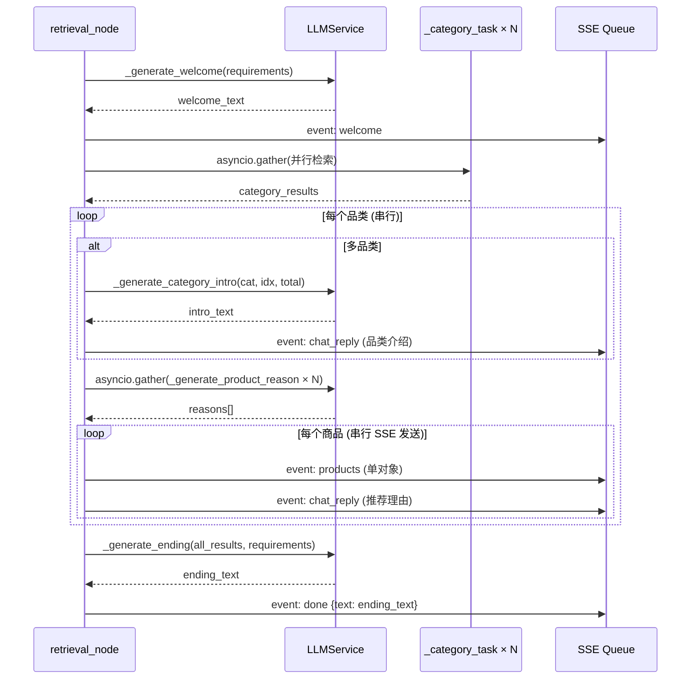

# 编码级详细方案 — SSE 展示流重构

> **输入**: `server/docs/AGENT_OPT/SHOW_OPT/PLAN.md`

## 1. 模块详细设计

### 1.1 `retriever.py` — 核心重构

#### 1.1.1 `_category_task` 瘦身

**变更**: 移除 LLM 推荐理由生成，回归纯检索职责。

**实现链路**:
```
_intent_to_sub_queries → Retriever.retrieve → Merger.merge → reranker.rerank → truncate → return
```
去掉步骤 6（原 278-306 行），移除 `llm` 参数，返回 dict 去掉 `reasoning_text`。

**难点**: 无。纯粹的代码删除。

#### 1.1.2 `_generate_welcome` — 新增

**实现思路**: 根据 requirements 数量和内容判断单/多品类，调用 LLM 生成欢迎语。

```
输入: requirements (list[dict]), scenario_description (str), llm (LLMService)
输出: str (欢迎语文本，失败返回 "")
链路: requirements → WELCOME_SYSTEM.format(...) → llm.chat(messages, temperature=0.3) → welcome_text
```

**难点**: LLM 调用失败不应阻断后续流程。catch Exception → log warning → return ""。

#### 1.1.3 `_generate_category_intro` — 新增

**实现思路**: 为每个品类生成过渡介绍语。仅多品类（len(requirements) > 1）时调用。

```
输入: category (str), sub_category (str), index (int), total (int), 
      scenario_description (str), llm (LLMService)
输出: str (品类介绍语，失败返回 "")
链路: CATEGORY_INTRO_SYSTEM.format(...) → llm.chat(messages, temperature=0.3) → intro_text
```

**调用位置**: `retrieval_node` 中遍历品类结果时，发送商品之前。

#### 1.1.4 `_generate_product_reason` — 新增

**实现思路**: 为单个商品生成推荐理由。注入用户原始需求 + 同品类全部商品概览（提供横向对比上下文）。

```
输入: sku (dict), user_intent (str), category_skus (list[dict]), llm (LLMService)
输出: str (推荐理由文本，失败返回 "")
链路: PRODUCT_REASON_SYSTEM.format(product_detail=..., category_overview=..., user_intent=..., max_chars=...) 
      → llm.chat(messages, temperature=0.3) → reason_text
```

**关键设计**: 
- `product_detail` 从单个 SKU 的 `_build_product_context([sku])` 构建
- `category_overview` 用 `_build_product_context(category_skus)` 构建（同类全量商品概览）
- 两个上下文同时注入，缓解 R2（单商品推荐质量下降）风险

#### 1.1.5 `_generate_ending` — 新增

**实现思路**: 汇总所有推荐结果，生成结束语引导下一步互动。

```
输入: category_results (list[dict]), requirements (list[dict]), llm (LLMService)
输出: str (结束语文本，失败返回 "")
链路: ENDING_SYSTEM.format(categories_summary=..., product_count=..., scenario_description=...) 
      → llm.chat(messages, temperature=0.3) → ending_text
```

#### 1.1.6 `retrieval_node` — SSE 编排重构

**新实现链路时序**:



**关键代码逻辑**（伪代码）:

```python
async def retrieval_node(state, llm, emb_service, async_session_factory, reranker, _sse_queue):
    requirements = state.get("requirements", [])
    scenario_description = state.get("scenario_description", "")
    user_query = state.get("user_query", "")
    queue = _sse_queue or state.get("_sse_queue")

    if not requirements:
        return {"retrieval_results": [], "failed_categories": [],
                "session_memory": state.get("session_memory", [])}

    # 1. Welcome
    welcome_text = await _generate_welcome(requirements, scenario_description, llm)
    if queue and welcome_text:
        await queue.put({"event": "welcome", "data": welcome_text})

    # 2. 并行检索（不变）
    semaphore = asyncio.Semaphore(settings.search.max_category_concurrency)
    async def _bounded_task(intent):
        async with semaphore:
            return await _category_task(intent, async_session_factory, emb_service, reranker)
    results = await asyncio.gather(*[_bounded_task(req) for req in requirements])

    # 3. 异常规范化（不变）
    safe_results = [...same as current...]

    # 4. SSE 逐品类 → 逐商品发送
    retrieval_results = []
    failed_categories = []
    total_categories = len([r for r in safe_results if not r.get("error")])

    for idx, r in enumerate(safe_results):
        if r.get("error"):
            failed_categories.append({...})
            continue

        skus = r.get("skus", [])
        retrieval_results.extend(skus)
        category = r.get("category", "")
        sub_category = r.get("sub_category", "")

        # 4a. 品类介绍语（仅多品类）
        if total_categories > 1:
            intro = await _generate_category_intro(
                category, sub_category, idx + 1, total_categories,
                scenario_description, llm
            )
            if queue and intro:
                await queue.put({"event": "chat_reply", "data": intro})

        # 4b. 逐商品推荐
        if skus:
            # 并行生成推荐理由
            reason_tasks = [
                _generate_product_reason(sku, user_query, skus, llm)
                for sku in skus
            ]
            reasons = await asyncio.gather(*reason_tasks, return_exceptions=True)

            # 串行 SSE 发送（保证前端展示顺序）
            for i, sku in enumerate(skus):
                if queue:
                    await queue.put({
                        "event": "products",
                        "data": {
                            "product_id": sku["product_id"],
                            "sku_id": sku["sku_id"],
                            "category": category,
                            "sub_category": sub_category,
                        }
                    })
                    reason = reasons[i] if isinstance(reasons[i], str) else ""
                    if reason:
                        await queue.put({"event": "chat_reply", "data": reason})

    # 5. 结束语 + done
    ending_text = await _generate_ending(safe_results, requirements, llm)
    if queue:
        await queue.put({
            "event": "done",
            "data": {"text": ending_text},
        })
        # conversation_id 由 _agent_event_stream 注入（search.py:264-266）

    # 6. Memory 更新（不变）
    ...

    return {
        "retrieval_results": retrieval_results,
        "failed_categories": [f["sub_category"] for f in failed_categories],
        "session_memory": new_memory,
    }
```

**难点/风险**:
- **并发控制**: 品类内推荐理由并行生成 + 品类间串行，避免 LLM API 被瞬时打爆
- **return_exceptions=True**: `_generate_product_reason` 单个失败不应阻断其他商品，返回空字符串代替
- **品类介绍索引**: 按实际有效品类编号（跳过 error 品类），保证"第1/3个"语义准确

---

### 1.2 `option_gen.py` — 移除 done 发送

**变更位置**: 第 64-67 行。

```python
# 删除以下代码:
# 通过 SSE 队列发送 done 事件（推荐路径的终端节点）
queue = state.get("_sse_queue")
if queue:
    await queue.put({"event": "done", "data": {"next_options_count": len(options)}})
```

**影响**: option_gen 只计算并返回 `next_options`，done 事件由 retrieval 统一发送。`_agent_event_stream` 从 `final_state["next_options"]` 读取并发送 `next_options` 事件（search.py:337-344，不变）。

---

### 1.3 `scenario_gen.py` — 修复重复传参

**变更位置**: 第 150-153 行。

```python
# Before (重复):
messages = [
    {"role": "system", "content": prompt},
    {"role": "user", "content": rewritten_query},  # ← rewritten_query 已在 system prompt 的 {user_query} 占位符中
]

# After:
messages = [
    {"role": "system", "content": prompt},
    {"role": "user", "content": "请根据场景描述生成品类需求拆解"},
]
```

**检查项**: 其他 6 个 LLM 调用点（extraction Step1/Step3 × 2、router、rewrite、option_gen、generator）均无此问题，已在 DEFINE.md 阶段验证。

---

### 1.4 `app/agent/prompts/show_prompt.py` — 新增

4 个轻量级提示词模板。

#### WELCOME_SYSTEM

```python
WELCOME_SYSTEM = """你是一个电商导购助手。根据用户的需求生成一句自然的欢迎语。

## 规则
- 单品类时突出品类特点和用户需求，如"不含酒精的防晒霜对敏感肌超友好！帮你挑了几款口碑好、温和不刺激的。"
- 多品类时突出场景感，提及品类数量，如"海边度假装备得备齐！结合你的出游场景，帮你整理了几个超实用的品类～"
- 语气口语化、亲切，像朋友聊天
- 一句话即可，不超过 60 字
- 不要使用"亲爱的用户""欢迎光临"等客服腔
- 不要编造商品名或具体品牌

## 用户需求
品类数量: {category_count}
{requirements_summary}

## 场景描述
{scenario_description}

请生成欢迎语："""
```

#### CATEGORY_INTRO_SYSTEM

```python
CATEGORY_INTRO_SYSTEM = """你是一个电商导购助手。在推荐多个品类商品时，为当前品类生成一句简短的介绍过渡语。

## 规则
- 自然衔接上下文：第 1 个品类用"首先是"，中间的用"接下来是"，最后的用"最后是"
- 简要说明该品类与用户场景的关联（一句话）
- 语气口语化、亲切，可以适当使用 1-2 个 emoji
- 一句话即可，不超过 50 字
- 不要编造商品名或具体品牌
- 不要评价尚未推荐的商品

## 场景
{scenario_description}

## 当前品类
{category}/{sub_category}（第 {index} 个，共 {total} 个品类）

请生成品类介绍过渡语："""
```

#### PRODUCT_REASON_SYSTEM

```python
PRODUCT_REASON_SYSTEM = """你是一个专业导购。根据用户需求和商品信息，为指定商品撰写简短推荐理由。

## 用户需求
{user_intent}

## 同品类商品概览（共 {total_in_category} 件，供横向对比参考）
{category_overview}

## 当前推荐商品详情
{product_detail}

## 规则
- 只推荐当前这一件商品，不要提及其他商品或做对比
- 只能使用商品详情中出现的属性、价格、评价，严禁编造
- 优先引用用户评价作为推荐依据；无用户评价时可使用官方描述但需注明
- 语气自然口语化，像真人导购，用"这款""它"等称谓
- 控制在 {max_chars} 字以内
- 不使用"根据检索结果""基于商品信息"等元表述
- 信息不足以支撑推荐时诚实说明，不编造理由

请为这件商品写一句推荐理由："""
```

#### ENDING_SYSTEM

```python
ENDING_SYSTEM = """你是一个电商导购助手。根据已完成的推荐，生成一句自然的结束语。

## 规则
- 简要总结推荐内容（提及品类数量和商品总数）
- 引导用户进一步互动（如询问预算、偏好、尺码等）
- 语气轻松自然，像朋友聊天收尾
- 一句话即可，不超过 60 字
- 不使用"感谢您的耐心""期待为您服务"等客服腔
- 不使用"以上是""综上所述"等书面语

## 推荐概况
品类: {categories_summary}
共 {product_count} 件商品
场景: {scenario_description}

请生成结束语："""
```

---

### 1.5 `delivery/API.md` — 同步更新

更新 §4 SSE 事件规格：

| 变更项 | 旧 | 新 |
|--------|----|----|
| welcome 事件 | 不存在 | `event: welcome` `data: "<欢迎语文本>"` |
| products 格式 | `data: [{...},{...}]` | `data: {"product_id":"...","sku_id":"...","category":"...","sub_category":"..."}` |
| chat_reply 语义 | 聚合推荐（1品类1段） | 品类介绍语 或 单商品推荐理由 |
| done 字段 | `{"next_options_count":N,"conversation_id":"..."}` | `{"text":"<结束语>","conversation_id":"..."}` |

---

## 2. 关键数据实体

无新增数据结构。所有新增文本（welcome/ending/intro）直接通过 SSE 发送，不写入 AgentState。

retrieval_node 新增内部变量：

| 变量 | 类型 | 用途 |
|------|------|------|
| `welcome_text` | `str` | 欢迎语，通过 welcome 事件发送 |
| `ending_text` | `str` | 结束语，通过 done.text 发送 |
| `total_valid_categories` | `int` | 有效品类数（排除 error），用于判断单/多品类 |

---

## 3. 期望项目目录结构

```
server/
├── app/agent/
│   ├── nodes/
│   │   ├── retriever.py            # ← 重构：+4 LLM 函数，_category_task 瘦身，SSE 编排
│   │   ├── option_gen.py           # ← 移除 done 事件发送
│   │   └── scenario_gen.py         # ← 修复重复传参（user message）
│   └── prompts/
│       ├── show_prompt.py          # ← 新增：WELCOME/CATEGORY_INTRO/PRODUCT_REASON/ENDING
│       └── generator_prompt.py     # - 保留但不再被 retriever 引用（其他模块可能引用）
├── docs/AGENT_OPT/SHOW_OPT/
│   ├── SPEC.md                     # 需求规格
│   ├── DEFINE.md                   # 需求分析
│   ├── PLAN.md                     # 架构方案
│   └── CON_PLAN.md                 # 本文档
├── tests/
│   └── test_show_flow.py           # ← 新增：SSE 事件流集成测试（可选）
└── delivery/
    └── API.md                      # ← 更新 SSE 事件规格
```

---

## 4. 风险点与待优化项

| 风险 | 等级 | 缓解措施 |
|------|------|---------|
| LLM 调用量增至 ~11 次/请求 | 中 | 品类内推荐理由 `asyncio.gather` 并行；prompt 轻量化（总 token 增量控制在 3x 内） |
| retriever.py 膨胀至 ~550 行 | 低 | 4 个 LLM 生成函数可随时提取到 `retriever_llm.py` |
| 单商品推荐理由质量 | 低 | PRODUCT_REASON_SYSTEM 注入同品类概览 + 用户原始需求 |
| 品类 intro LLM 失败 | 低 | 失败静默跳过，不发送 intro，不影响后续流程 |
| 前端 products 格式变化 | 中 | API.md 同步更新，前端按新契约开发 |

### 待优化项（不在本次范围）

1. **推荐理由质量调优**: 上线后根据用户反馈迭代 PRODUCT_REASON_SYSTEM prompt
2. **LLM 模型分层**: 欢迎语/介绍语/结束语可使用更轻量模型（如 doubao-seed-2.0-lite），推荐理由使用主力模型
3. **retriever.py 拆分**: 若后续维护困难，将 LLM 生成函数移至 `retriever_llm.py`

---

> **实现入口**: 按 `PLAN.md` → `CON_PLAN.md` → 编码 顺序执行
