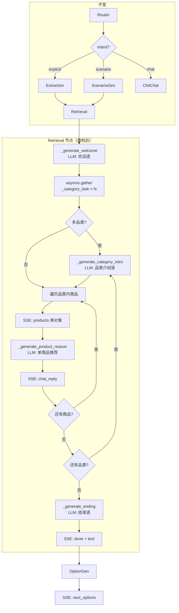

# 架构方案 — SSE 展示流重构

> **输入**: `server/docs/AGENT_OPT/SHOW_OPT/DEFINE.md`

## 1. 整体实现架构



**关键变化：**
- `_category_task` 瘦身为纯检索（去掉推荐理由生成）
- retrieval 主节点新增 4 个 LLM 生成函数
- done 从 option_gen 上移到 retrieval
- products 从数组变为单对象，与 chat_reply 交替发送

## 2. 核心功能接口 vs 需求映射

| FR | 功能 | 实现位置 | 说明 |
|----|------|---------|------|
| FR1 | 欢迎语 | `retriever.py:_generate_welcome()` | retrieval 入口，基于 requirements 生成 |
| FR2 | 品类介绍语 | `retriever.py:_generate_category_intro()` | 仅多品类，每个品类处理前 |
| FR3 | products 单商品 | `retrieval_node` SSE 循环 | 逐商品 `await queue.put({"event":"products","data":{...}})` |
| FR4 | chat_reply 逐商品 | `retriever.py:_generate_product_reason()` | 1 商品 1 次 LLM 调用 |
| FR5 | done 结束语 | `retriever.py:_generate_ending()` | 基于全部推荐结果生成，写入 done.text |
| FR6 | done 发送权变更 | `retrieval_node` 发送, `option_gen.py` 移除 | done 只发一次（retrieval 发） |
| FR7 | 修复重复传参 | `scenario_gen.py:150-153` | user message 改为简短触发语 |

## 3. 模块设计

### 3.1 `retriever.py` — 重构

| 函数 | 输入 | 输出 | 变更 |
|------|------|------|------|
| `_intent_to_sub_queries` | intent dict | list[SubQuery] | 不变 |
| `_build_product_context` | skus list | str | 不变 |
| `_category_task` | intent, db, emb, reranker | dict{category, sub_category, skus, product_ids, error} | **瘦身**：移除 reasoning_text 生成和 LLM 参数 |
| `_generate_welcome` | requirements, llm | str | **新增**：LLM 调用生成欢迎语 |
| `_generate_category_intro` | category, sub_category, index, total, scenario_desc, llm | str | **新增**：LLM 调用生成品类介绍 |
| `_generate_product_reason` | sku, user_intent, category_context, llm | str | **新增**：LLM 调用生成单商品推荐 |
| `_generate_ending` | all_category_results, requirements, llm | str | **新增**：LLM 调用生成结束语 |
| `retrieval_node` | state, llm, emb, db, reranker, _sse_queue | dict | **重构**：SSE 编排逻辑 |

**`_category_task` 变更详情：**
- 移除参数 `llm`
- 移除步骤 6（LLM 生成推荐理由）
- 返回 dict 移除 `reasoning_text` 字段
- 检索管线（SQL→双路检索→RRF→reranker）完全不变

**`retrieval_node` 变更详情：**
- 新增入口处 `_generate_welcome` 调用 + SSE 发送
- `asyncio.gather` 不变（并行检索）
- SSE 发送循环重构：品类级串行 → 品类内逐商品（products + chat_reply 交替）
- 新增末尾 `_generate_ending` + done SSE 发送
- Memory 更新逻辑不变

### 3.2 `option_gen.py` — 移除 done

移除第 65-67 行的 done 事件发送逻辑。仅输出 `{"next_options": [...]}`。

### 3.3 `scenario_gen.py` — 修复重复传参

第 150-153 行，user message 从 `rewritten_query` 改为简短触发语 `"请根据场景生成需求拆解"`。

### 3.4 `app/agent/prompts/show_prompt.py` — 新增

4 个轻量级提示词模板：

| 提示词 | 用途 | 预估 token |
|--------|------|-----------|
| `WELCOME_SYSTEM` | 生成欢迎语（单品类/多品类自适应） | ~200 |
| `CATEGORY_INTRO_SYSTEM` | 生成品类介绍语（含场景承接） | ~200 |
| `PRODUCT_REASON_SYSTEM` | 单商品推荐理由（轻量，比 GENERATOR_SYSTEM 简短） | ~300 |
| `ENDING_SYSTEM` | 生成结束语（提及品类/商品数量） | ~150 |

### 3.5 `delivery/API.md` — 同步更新

更新 §4 SSE 事件规格中的 products 格式（数组→单对象）、新增 welcome 事件、done 新增 text 字段。

## 4. 并发策略

```
retrieval_node 时间线:
│
├─ _generate_welcome()          ← LLM #1 (串行，~1s)
│
├─ asyncio.gather(              ← 并行检索 (不变)
│     _category_task(cat1),     ← DB + ES + reranker
│     _category_task(cat2),     
│     _category_task(cat3),     
│   )
│
├─ for each category:           ← 串行（保证前端展示顺序）
│   ├─ _generate_category_intro()  ← LLM (仅多品类)
│   ├─ asyncio.gather(             ← 品类内商品推荐理由并行生成
│   │     _generate_product_reason(p1),
│   │     _generate_product_reason(p2),
│   │   )
│   └─ for each product:          ← 串行 SSE 发送
│       ├─ queue.put(products)
│       └─ queue.put(chat_reply)
│
└─ _generate_ending()           ← LLM #last (串行)
   queue.put(done)
```

**品类内推荐理由并行生成**：一个品类下的多个商品推荐理由互不依赖，可 `asyncio.gather` 后按序发送。

## 5. 方案优点

1. **渐进式渲染**：逐商品发送使前端可以边收边渲染，首屏延迟不变
2. **检索管线零改动**：`_category_task` 只做减法（移除 reasoning），检索逻辑完全保持
3. **职责清晰**：SSE 展示逻辑集中在 `retrieval_node` 主节点，不散布到其他节点
4. **轻量 prompt**：新增 4 个 prompt 均比原 `GENERATOR_SYSTEM` 简短，token 消耗可控
5. **AgentState 不变**：welcome/ending 不写 state，直接 SSE 发送

## 6. 主要风险

| 风险 | 缓解 |
|------|------|
| R1: LLM 调用量膨胀 | 品类内推荐理由并行生成；4 个新 prompt 轻量化 |
| R2: 单商品推荐质量下降 | prompt 注入用户需求 + 品类全部商品概览 |
| R3: retriever.py 膨胀至 ~550 行 | 4 个 LLM 生成函数可提取到 `retriever_llm.py`，保持主文件 ≤400 行 |
| R4: 前端兼容性 | 前端需同步更新（products 格式、welcome 事件、done.text），在 API.md 明确标注 |

## 7. 实现复杂度评估

| 维度 | 评级 | 说明 |
|------|------|------|
| 代码量 | 中 | 新增 ~150 行（4 个 LLM 函数 + 编排逻辑）、删除 ~30 行、修改 ~50 行 |
| 逻辑复杂度 | 中 | 嵌套循环（品类 × 商品）+ 多个 LLM 调用 + SSE 时序 |
| 测试复杂度 | 低 | 核心逻辑为 LLM 调用 + SSE 发送，可 mock 验证事件顺序 |
| 风险等级 | 中 | LLM 调用量增加，但无破坏性变更 |

## 8. 可测试性评估

- `_generate_*` 函数均为纯 LLM 调用，可独立 mock llm.chat 测试
- SSE 事件顺序可通过 mock queue 验证（品类 intro → product → chat_reply 循环）
- `_category_task` 瘦身后检索逻辑可用现有测试覆盖
- `option_gen.py` done 移除为单行删除，现有测试需更新断言

## 9. 可交付性评估

- 4 个交付物：retriever.py、option_gen.py、scenario_gen.py、show_prompt.py、API.md
- 无外部依赖
- 可与前端并行开发（API.md 先交付定义接口契约）
- 可通过 feature flag 或分支隔离，不影响线上

---

> 下一阶段：`CON_PLAN.md` — 编码级详细设计
