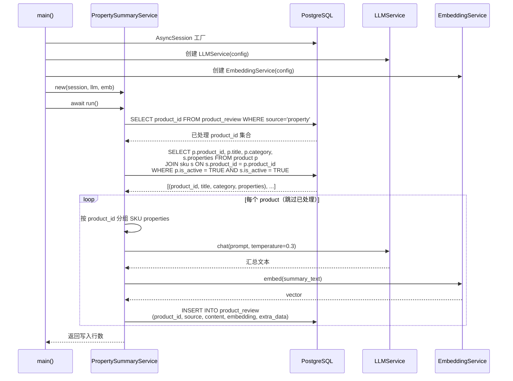
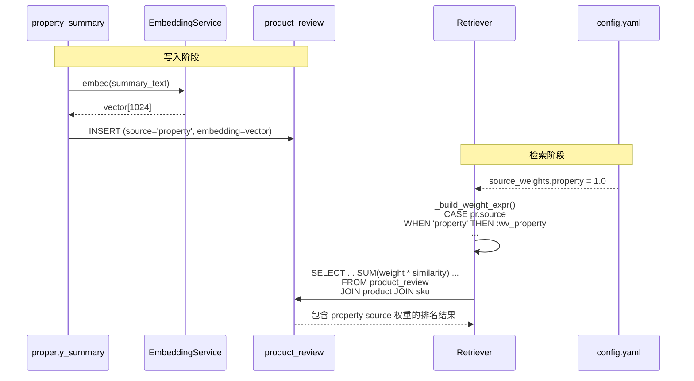

# CON_PLAN.md — product_review 表更新编码级详细设计

> 输入：`server/docs/AGENT_OPT/TABLE_OPT/PLAN.md`
> 日期：2026-06-04

## 1. 模块详细设计

### 1.1 `property_summary_service.py`（新增）

**实现思路**：独立的 async 脚本，通过 `if __name__ == "__main__"` + `asyncio.run()` 运行。内部封装为 `PropertySummaryService` 类，接受 DB session、LLMService、EmbeddingService 三个依赖。

**功能实现链路**：



**难点与解决方案**：

| 难点 | 解决方案 |
|------|----------|
| LLM 生成结果不稳定 | Prompt 中给出 1-shot 示例，约束输出格式；生成后校验非空且长度 > 5 字符 |
| 无 properties 的 SKU | 收集 properties 时跳过空 dict；若全部 SKU 无 properties，跳过该 product |
| 单个 product 失败不中断整体 | try/except 包裹单条处理，记录 `failed_products` 列表，最终打印摘要 |

**LLM Prompt（硬编码）**：

```python
_PROMPT = """你是一个电商商品描述助手。请根据以下商品的SKU属性信息，用一句简洁的中文自然语言概括该商品包含哪些规格/变体。

商品名称：{title}
商品品类：{category}
SKU属性列表：
{properties_list}

要求：
1. 用"本{品类}产品包含"句式开头
2. 用逗号或顿号分隔不同SKU的属性
3. 不做任何额外解释，只输出一句话

示例：
商品名称：雅诗兰黛特润修护肌活精华露
商品品类：精华
SKU属性列表：
- 容量: 30ml 经典装
- 容量: 50ml 加大装
- 容量: 75ml 家用装
输出：本精华产品包含30ml经典装，50ml加大装和75ml家用装"""
```

**验证逻辑**：生成后检查 `len(summary) > 5` 且包含 `{category}` 关键词。

### 1.2 `retriever_service.py`（修改）

**修改点详情**：

#### 修改 A：`_build_weight_expr()` — known_sources 扩展

```python
# 修改前 (~L274)
known_sources = ["marketing", "faq", "user_review"]

# 修改后
known_sources = ["marketing", "faq", "user_review", "property"]
```

无需修改其他逻辑：`settings.search.source_weights` 已在 config.yaml 中配置 `property: 1.0`，CASE WHEN 自动生成对应分支。

#### 修改 B：`_semantic_search()` — 日志降级 + 结果日志

```python
# 位置：原 L398，logger.info → logger.debug
logger.debug("semantic_search SQL", sql=sql_str,
             params={k: str(v)[:80] for k, v in params.items()})

result = await self.db.execute(sql, params)
rows = result.fetchall()

# 新增：DEBUG 级别打印查询结果摘要
logger.debug("semantic_search 结果",
             row_count=len(rows),
             top_rows=[{"sku_id": r.sku_id, "content": (r.matched_texts_json or [{}])[0].get("content", "")[:100]}
                        for r in rows[:3]])
```

#### 修改 C：`_keyword_search()` — 日志降级 + 结果日志

```python
# 位置：原 L469，tsvector 分支
logger.debug("keyword_search SQL (tsvector)", config=tsv_config,
             sql=base_sql,
             params={k: str(v)[:80] for k, v in kw_params.items()})

# 位置：原 L494，ILIKE fallback 分支
logger.debug("keyword_search SQL (ILIKE fallback)", sql=sql_str,
             params={k: str(v)[:80] for k, v in ilike_params.items()})

# 位置：原 L497 附近，循环填充 all_rows 后新增
if rows:
    logger.debug("keyword_search 结果",
                 sub_text=sub.text[:80],
                 row_count=len(rows),
                 top_rows=[{"sku_id": r.sku_id, "content": r.content[:100]}
                            for r in rows[:3]])
```

### 1.3 `config.yaml`（修改）

```yaml
# 位置：L44-47
source_weights:
  marketing: 1.0
  faq: 1.0
  user_review: 0.7
  property: 1.0      # 新增
```

## 2. 核心功能接口详细设计

### F1: SKU Properties 汇总生成

**涉及模块**：`property_summary_service.py`

**实现链路时序**：见上文 1.1 Mermaid 时序图。

**关键实现细节**：

```python
async def _get_unprocessed(self) -> list[dict]:
    """查询未处理的 product 及其 SKU properties，按 product_id 分组。

    返回: [{"product_id": "p_001", "title": "...", "category": "精华",
             "sku_properties": [{"容量": "30ml 经典装"}, ...]}, ...]
    """
    # 1. 查询已处理 product_id
    done = set()
    result = await self.session.execute(
        text("SELECT DISTINCT product_id FROM product_review WHERE source = 'property'")
    )
    for r in result.fetchall():
        done.add(r.product_id)

    # 2. 查询 product + SKU（只查活跃的，排除已处理）
    result = await self.session.execute(
        text("""
            SELECT p.product_id, p.title, p.category, s.properties
            FROM product p
            JOIN sku s ON s.product_id = p.product_id
            WHERE p.is_active = TRUE AND s.is_active = TRUE
            ORDER BY p.product_id
        """)
    )

    # 3. 按 product_id 分组
    products: dict[str, dict] = {}
    for r in result.fetchall():
        if r.product_id in done:
            continue
        if r.product_id not in products:
            products[r.product_id] = {
                "product_id": r.product_id,
                "title": r.title,
                "category": r.category or "",
                "sku_properties": [],
            }
        if r.properties and isinstance(r.properties, dict) and r.properties:
            products[r.product_id]["sku_properties"].append(r.properties)

    # 4. 过滤：至少有一个有效 properties 的 SKU
    return [p for p in products.values() if p["sku_properties"]]


async def _generate_summary(self, title: str, category: str,
                            sku_props: list[dict]) -> str:
    """调用 LLM 生成一句中文汇总。"""
    props_lines = []
    for props in sku_props:
        parts = [f"{k}: {v}" for k, v in props.items()]
        props_lines.append("- " + ", ".join(parts))

    prompt = _PROMPT.format(
        title=title,
        category=category or "该",
        properties_list="\n".join(props_lines),
    )
    return await self.llm.chat(
        [{"role": "user", "content": prompt}],
        temperature=0.3,
    )


async def _insert_review(self, product_id: str, summary: str,
                         embedding: list[float], sku_props: list[dict]):
    """写入 product_review。"""
    pr = ProductReview(
        product_id=product_id,
        source="property",
        content=summary,
        embedding=embedding,
        extra_data={"raw_properties": sku_props},
    )
    self.session.add(pr)
```

### F2: 向量化与检索加权

**涉及模块**：`property_summary_service.py`（写入）、`retriever_service.py`（检索链路）、`config.yaml`（配置）

**实现链路**：



### F3: DEBUG 日志打印查询结果

**涉及模块**：`retriever_service.py`

**改动范围**：仅修改 `_semantic_search()` 和 `_keyword_search()` 两个方法的日志调用。

## 3. 关键数据实体

### 3.1 product_review 新增行结构

| 列 | 值 | 说明 |
|----|-----|------|
| `product_id` | 如 `"p_beauty_001"` | 关联 product |
| `source` | `"property"` | 固定值 |
| `content` | `"本精华产品包含30ml经典装，50ml加大装和75ml家用装"` | LLM 生成的汇总文本 |
| `embedding` | `[0.012, -0.034, ...]` (1024 维) | 汇总文本的向量 |
| `extra_data` | `{"raw_properties": [{"容量": "30ml 经典装"}, ...]}` | 原始 SKU properties |

### 3.2 检索加权表达式

`_build_weight_expr({"property": 1.0, ...})` 生成：

```sql
CASE pr.source
  WHEN 'marketing' THEN :wv_marketing
  WHEN 'faq' THEN :wv_faq
  WHEN 'user_review' THEN :wv_user_review
  WHEN 'property' THEN :wv_property
  ELSE 1.0
END
```

乘以语义得分后 SUM，property source 权重 1.0 意味着与 FAQ/营销同等对待。

## 4. 目录结构树

```
server/
├── app/
│   └── services/
│       └── retriever_service.py          # [修改] 3 处变更：known_sources + 日志降级 + 结果日志
├── scripts/
│   └── property_summary_service.py       # [新增] Properties 汇总脚本（~110 行）
├── config.yaml                           # [修改] source_weights 新增 property: 1.0
└── docs/
    └── AGENT_OPT/
        └── TABLE_OPT/
            ├── SPEC.md                   # [不变] 需求输入
            ├── DEFINE.md                 # [新增] 需求分析
            ├── PLAN.md                   # [新增] 架构方案
            └── CON_PLAN.md               # [新增] 编码级详细设计
```

## 5. 风险点与待优化项

| 项目 | 类型 | 说明 |
|------|------|------|
| LLM 生成汇总文本过长 | 风险 | Embedding 模型 token 上限通常 512-8192 tokens，一句中文远小于上限，低风险 |
| property source 权重调优 | 待优化 | 当前设 1.0（与 FAQ/营销同等），实际效果需线上观察后调整 |
| 批量 Embedding | 待优化 | 当前逐条 embed()，若 product 数量 >200 可改用 `embed_batch()` 减少 API 调用 |
| 增量更新 | 范围外 | Product SKU 变更后不会自动重新生成汇总；如需支持，后续可另加监听机制 |

---

## [NEEDS CLARIFICATION] 待确认项

无。三项改动范围清晰、无外部依赖、无设计歧义。
