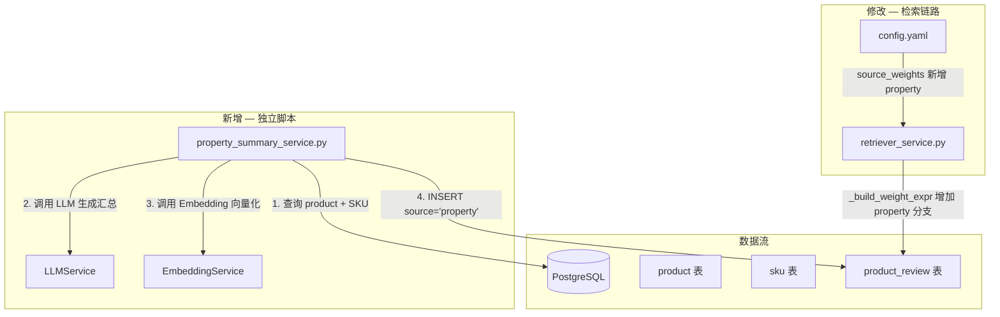

# PLAN.md — product_review 表更新架构方案

> 输入：`server/docs/AGENT_OPT/TABLE_OPT/DEFINE.md`
> 日期：2026-06-04

## 1. 整体实现架构



**数据链路**：独立脚本读取 product/sku → LLM 生成自然语言汇总 → Embedding 向量化 → 写入 product_review（source="property"）。检索链路通过 `_build_weight_expr` 自动加权 property source。

## 2. 核心功能接口

| 功能 | 对应 DEFINE | 实现位置 | 说明 |
|------|-------------|----------|------|
| F1: Properties 汇总 | F1 | `property_summary_service.py::PropertySummaryService.generate_summary()` | LLM 生成汇总文本 |
| F2: 向量化写入 | F2 | `property_summary_service.py::PropertySummaryService.run()` | Embedding + INSERT |
| F2: 检索加权 | F2 | `retriever_service.py::_build_weight_expr()` | known_sources 新增 "property" |
| F2: 配置更新 | F2 | `config.yaml` | source_weights.property = 1.0 |
| F3: SQL 日志降级 | F3 | `retriever_service.py::_semantic_search()`, `_keyword_search()` | logger.info → logger.debug |
| F3: 查询结果日志 | F3 | 同上 | row_count + 前3条摘要 |

## 3. 模块设计

### 3.1 `property_summary_service.py`（新增）

| 维度 | 说明 |
|------|------|
| **职责** | 全量 product 的 SKU properties 汇总生成 + 向量化写入 |
| **输入** | DB session、LLMService、EmbeddingService |
| **输出** | product_review 表新增行（每 product 1 行，source="property"） |
| **幂等** | 查询已有 source="property" 的 product_id，跳过已处理 |

**核心方法**：

```
PropertySummaryService
├── __init__(session, llm_svc, emb_svc)
├── async run() -> int          # 主流程，返回新写入行数
├── async _get_unprocessed()    # 查询未处理的 product + SKU
├── async _generate_summary(product_title, category, sku_properties_list) -> str  # LLM 调用
└── async _insert_review(product_id, summary, embedding)    # 写入 product_review
```

**LLM Prompt**（硬编码在脚本中）：

```
你是一个电商商品描述助手。请根据以下商品的 SKU 属性信息，用一句简洁的中文自然语言概括该商品包含哪些规格/变体。

商品名称：{title}
商品品类：{category}
SKU 属性列表：
{properties_list}

要求：
1. 用"本{品类}产品包含..."句式开头
2. 用逗号或顿号分隔不同 SKU 的属性
3. 不做任何额外解释，只输出一句话
```

### 3.2 `retriever_service.py`（修改）

| 修改点 | 行号范围 | 内容 |
|--------|----------|------|
| `_build_weight_expr()` | ~L274 | `known_sources` 列表新增 `"property"` |
| `_semantic_search()` SQL 日志 | ~L398 | `logger.info` → `logger.debug` |
| `_semantic_search()` 结果日志 | ~L400 后 | 新增 `logger.debug()` 输出 row_count + 摘要 |
| `_keyword_search()` tsvector 日志 | ~L469 | `logger.info` → `logger.debug` |
| `_keyword_search()` ILIKE 日志 | ~L494 | `logger.info` → `logger.debug` |
| `_keyword_search()` 结果日志 | ~L497 后 | 新增 `logger.debug()` 输出 row_count + 摘要 |

### 3.3 `config.yaml`（修改）

```yaml
search:
  source_weights:
    marketing: 1.0
    faq: 1.0
    user_review: 0.7
    property: 1.0        # 新增
```

## 4. 方案主要优点

- **独立脚本解耦**：不侵入现有数据导入管道，可随时重跑或按需执行
- **幂等设计**：重跑自动跳过已处理 product，不产生重复数据
- **检索链路自动化**：`_build_weight_expr` 按 source name 配置自动适配，新增 source 只需加配置 + 加 known_sources 列表
- **日志级别合理**：SQL 和查询结果降为 DEBUG，生产环境下不刷屏；调试时改配置为 DEBUG 即可观测

## 5. 主要风险

| 风险 | 等级 | 缓解 |
|------|------|------|
| LLM 生成质量波动 | 中 | Prompt 内约束格式；调用后校验非空和长度 |
| SKU 无 properties 导致空汇总 | 低 | 跳过无 properties 的 SKU；全部 SKU 均无则跳过该 product |
| API 不可用导致脚本中断 | 低 | try/except 包裹单条处理，失败则记录日志继续下一个 |

## 6. 实现复杂度评估

| 维度 | 评估 |
|------|------|
| 新增代码量 | ~110 行（property_summary_service.py） |
| 修改代码量 | ~20 行（retriever_service.py + config.yaml） |
| 外部依赖 | 无新增（复用 LLMService、EmbeddingService、AsyncSession） |
| 数据库变更 | 无 DDL 变更，仅 DML 新增行 |
| 总体复杂度 | **低** — 三项改动均独立、无交叉依赖 |

## 7. 可测试性评估

| 测试类型 | 覆盖范围 |
|----------|----------|
| 单元测试 | `_generate_summary` prompt 构造逻辑可 mock LLM 测试 |
| 集成测试 | `run()` 全流程可用测试 DB 验证（需 mock LLM/Embedding） |
| 回归测试 | 现有 retriever 测试确认 source_weights 变更不破坏已有行为 |

## 8. 可交付性评估

- **部署顺序**：1) 运行脚本写入 property 数据 → 2) 部署 config.yaml + retriever_service.py 代码变更
- **回滚方案**：`DELETE FROM product_review WHERE source = 'property'` + 回滚代码即可
- **无停机要求**：检索链路变更向后兼容，`_build_weight_expr` 对未知 source 默认 ELSE 1.0 兜底
