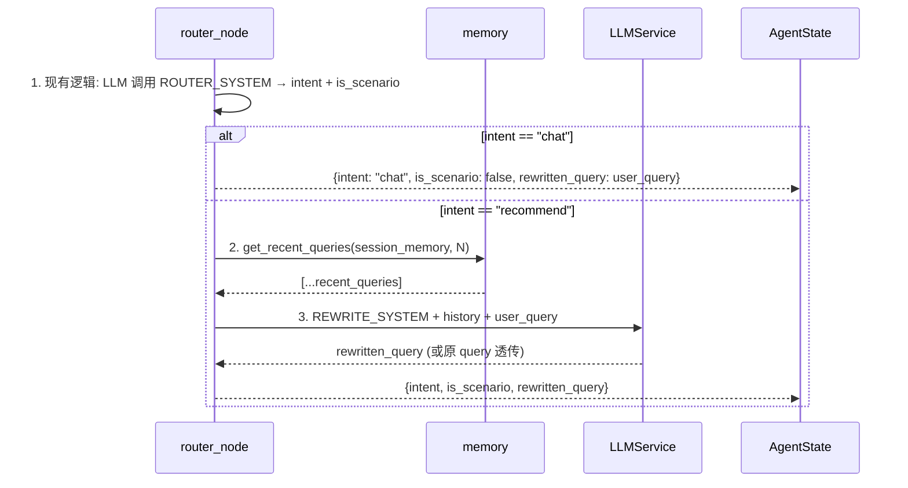
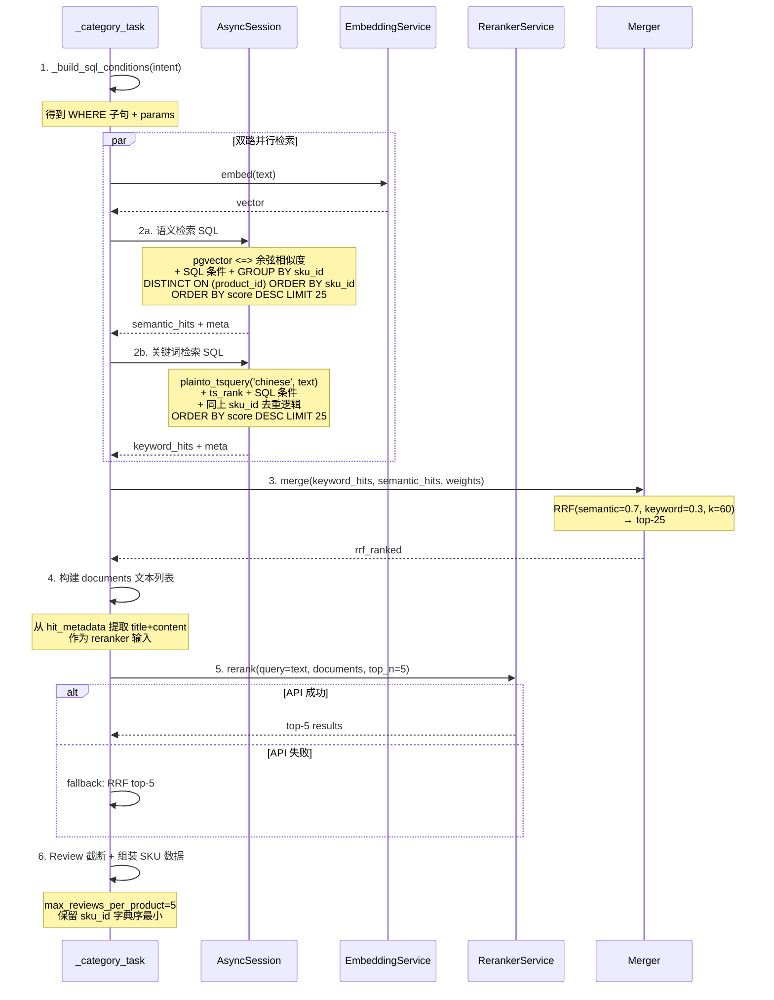
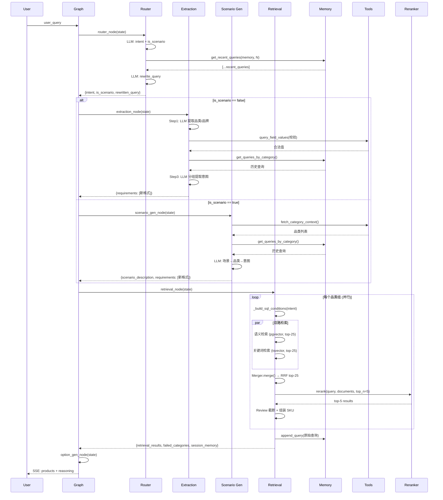

# CON_PLAN.md — Agent Tool 优化编码级详细设计

> 输入：[PLAN.md](PLAN.md) | 日期：2026-06-04

## 1. 期望的项目目录结构

```
server/
├── config.yaml                        ← 新增检索分段参数 + reranker 配置段
├── app/
│   ├── config.py                      ← 新增 RerankerSettings + SearchSettings 扩展字段
│   ├── agent/
│   │   ├── state.py                   ← 新增 rewritten_query, session_memory；requirements 类型变更
│   │   ├── graph.py                   ← build_graph 新增 tools/memory/reranker 参数注入
│   │   ├── memory.py                  ← 重构：分组存储 + get_recent_queries + get_queries_by_category + append_query
│   │   ├── tools.py                   ← [新增] list_tables, list_fields, query_field_values
│   │   ├── nodes/
│   │   │   ├── router.py             ← 新增 _rewrite_query() + rewrite 提示词调用
│   │   │   ├── extraction.py         ← 重构：三步流程，新输出格式
│   │   │   ├── scenario_gen.py       ← 适配：rewritten_query 输入 + memory 检索 + 新输出格式
│   │   │   ├── retrieval.py          ← 重构：SQL WHERE 构建 + 双路检索 + RRF + reranker + memory 更新
│   │   │   ├── option_gen.py         ← 适配新 requirements 格式
│   │   │   └── chitchat.py           ← 不变
│   │   └── prompts/
│   │       ├── __init__.py           ← 不变
│   │       ├── router_prompt.py      ← 不变
│   │       ├── rewrite_prompt.py     ← [新增] 查询改写提示词
│   │       ├── extraction_prompt.py  ← [新增] 三步提取提示词（Step1 + Step3）
│   │       ├── scenario_gen_prompt.py ← 更新：支持历史拼接 + 新输出格式
│   │       ├── generator_prompt.py   ← [新增] 从 rag/prompt.py 迁移 GENERATOR_SYSTEM
│   │       ├── relevance_filter_prompt.py ← 删除（不再需要 LLM 需求筛选）
│   │       ├── option_gen_prompt.py  ← 微调适配新格式
│   │       └── chitchat_prompt.py    ← 不变
│   ├── rag/
│   │   ├── merger.py                 ← 加权 RRF（semantic_weight / keyword_weight 可配置）
│   │   ├── generator.py              ← 更新 import：从 agent.prompts.generator_prompt 导入
│   │   └── prompt.py                 ← 删除（内容已迁移）
│   └── services/
│       ├── retriever.py              ← 保留核心逻辑；新增 _build_where_clause() 静态方法
│       ├── reranker.py               ← [新增] RerankerService 类
│       ├── llm.py                    ← 不变
│       ├── embedding.py              ← 不变
│       ├── sku_utils.py              ← 不变（_truncate_texts 继续使用）
│       └── category_lookup_service.py ← 不变
├── tests/
│   ├── test_tools.py                 ← [新增] Tools 函数测试
│   ├── test_memory.py               ← 重写
│   ├── test_reranker.py             ← [新增] Reranker mock 测试
│   ├── test_router.py               ← 新增 rewrite 测试用例
│   ├── test_extraction.py           ← 重写
│   ├── test_retrieval_node.py       ← 重写
│   ├── test_merger.py               ← 新增加权 RRF 测试用例
│   └── test_graph.py                ← 适配新 state 字段
```

## 2. 各模块详细设计

---

### 2.1 `app/config.py` — 配置扩展

**新增 RerankerSettings：**
```python
class RerankerSettings(BaseSettings):
    base_url: str = "https://api.siliconflow.cn/v1"
    api_key: str = ""       # 从 .secrets.yaml / 环境变量注入
    model: str = "BAAI/bge-reranker-v2-m3"
    timeout: float = 5.0    # 秒
```

**SearchSettings 扩展字段（替换旧参数 `top_k_per_query` / `final_sku_limit`）：**
```python
class SearchSettings(BaseSettings):
    # === 删除 ===
    # top_k_per_query: int = 20    → 拆分为 semantic_top_k / keyword_top_k
    # final_sku_limit: int = 10    → 改为 rrf_top_k

    # === 保留 ===
    rrf_k: int = 60
    max_match_texts_per_sku: int = 3
    max_match_chars_per_sku: int = 500
    source_weights: dict[str, float] = {}
    reasoning_max_chars: int = 200
    max_category_concurrency: int = 5
    max_batch_ids: int = 20
    memory_max_tokens: int = 2000

    # === 新增 ===
    semantic_top_k: int = 25           # 语义检索返回数量
    keyword_top_k: int = 25            # 关键词检索返回数量
    rrf_semantic_weight: float = 0.7   # RRF 语义权重
    rrf_keyword_weight: float = 0.3    # RRF 关键词权重
    rrf_top_k: int = 25                # RRF 融合后取 top-k
    rerank_top_k: int = 5              # 精排后最终返回数量
    max_reviews_per_product: int = 5   # 单 product_id 最多 review 条数
    memory_recent_rounds: int = 10     # Router 改写时检索的最近轮数
```

---

### 2.2 `app/config.yaml` — 配置示例

```yaml
search:
  rrf_k: 60
  semantic_top_k: 25
  keyword_top_k: 25
  rrf_semantic_weight: 0.7
  rrf_keyword_weight: 0.3
  rrf_top_k: 25
  rerank_top_k: 5
  max_reviews_per_product: 5
  max_match_texts_per_sku: 3
  max_match_chars_per_sku: 500
  source_weights:
    marketing: 1.0
    faq: 1.0
    user_review: 0.7
  reasoning_max_chars: 500
  max_category_concurrency: 5
  max_batch_ids: 20
  memory_max_tokens: 2000
  memory_recent_rounds: 10

reranker:
  base_url: "https://api.siliconflow.cn/v1"
  api_key: ""   # 在 .secrets.yaml 中设置
  model: "BAAI/bge-reranker-v2-m3"
  timeout: 5.0
```

---

### 2.3 `app/agent/state.py` — AgentState 变更

```python
from typing import TypedDict, Annotated, Any
from operator import add

class AgentState(TypedDict):
    # === 不变 ===
    user_query: str
    conversation_history: Annotated[list[dict], add]  # 保留旧字段，不再写入新数据
    intent: str
    is_scenario: bool
    scenario_description: str | None
    retrieval_results: list[dict]
    chat_reply: str
    next_options: list[str]
    failed_categories: list[str]
    _sse_queue: Any

    # === 新增 ===
    rewritten_query: str       # Router 改写后的查询字符串
    session_memory: list[dict] # [{category, sub_category, queries: [{query, timestamp}]}]

    # === 类型变更（字段名不变，值类型改变） ===
    requirements: list[dict]   # 原: {"sub_queries": [{text, strategy, field, operator, value, ...}]}
                               # 新: [{category, sub_category, text, min_price, max_price, order_num, brand}]
```

---

### 2.4 `app/agent/tools.py` — 数据库查询 Tool [新增]

**3 个异步函数，纯 SQL 查询 `information_schema` + 业务表 DISTINCT。**

#### `list_tables(db: AsyncSession) -> list[dict]`

```python
async def list_tables(db: AsyncSession) -> list[dict]:
    """返回 ecommerce 数据库所有表名及中文描述。
    返回格式: [{"table_name": "product", "description": "产品目录主表"}, ...]
    数据源: information_schema.tables + 硬编码中文描述映射。
    """
```

**实现思路：**
- 查询 `SELECT table_name FROM information_schema.tables WHERE table_schema='public'`
- 与硬编码字典 `TABLE_DESCRIPTIONS` 匹配注入 description
- 8 张表的中文描述硬编码维护

#### `list_fields(db: AsyncSession, table_name: str) -> list[dict]`

```python
async def list_fields(db: AsyncSession, table_name: str) -> list[dict]:
    """返回指定表的所有字段名、类型及中文描述。
    返回格式: [{"column_name": "sku_id", "data_type": "character varying", "description": "SKU唯一标识"}, ...]
    数据源: information_schema.columns + 硬编码中文描述映射。
    """
```

**实现思路：**
- 参数化查询 `SELECT column_name, data_type FROM information_schema.columns WHERE table_name=:tbl`
- 与 `COLUMN_DESCRIPTIONS[table_name]` 二级映射匹配 description

#### `query_field_values(db: AsyncSession, table: str, field: str, filters: dict | None = None) -> list`

```python
async def query_field_values(
    db: AsyncSession, table: str, field: str, filters: dict | None = None
) -> list:
    """查询指定表某个字段的去重取值，支持多字段联合过滤。
    例: query_field_values(db, "product", "brand", {"category": "面部护肤", "sub_category": "防晒霜"})
    返回: ["安热沙", "资生堂", ...]
    """
```

**实现思路：**
- 白名单校验 `table` 在 `["product", "sku", "product_review", ...]` 内
- 白名单校验 `field` 在对应表的列名集合内（查询 information_schema 或硬编码）
- `filters` 的 key 也做白名单校验，value 使用参数化绑定 `:filter_<key>`
- 构造 `SELECT DISTINCT {field} FROM {table} WHERE {filters} ORDER BY {field}`

**安全要点：** table/field/filter_key 必须白名单校验 → 参数化查询防 SQL 注入。这是纯内部调用，不是用户-facing API，但仍需防御 LLM 幻觉输出的非法值。

---

### 2.5 `app/agent/memory.py` — 会话记忆系统 [重构]

**数据结构：**
```python
# session_memory: list[dict]
# 每个元素:
# {
#     "category": str,          # 品类大类
#     "sub_category": str,      # 品类细类
#     "queries": [              # 该品类下的原始查询列表
#         {"query": str, "timestamp": str},  # timestamp 为 ISO 8601 格式
#         ...
#     ]
# }
```

**3 个纯函数接口：**

#### `get_recent_queries(memory: list[dict], n: int) -> list[dict]`

```python
def get_recent_queries(memory: list[dict], n: int) -> list[dict]:
    """跨品类获取最近 N 轮原始查询，按时间降序。
    返回: [{"query": "预算500以内", "timestamp": "2026-06-04T10:02:00"}, ...]
    实现: 展平所有 group 的 queries → sorted by timestamp desc → [:n]
    """
```

#### `get_queries_by_category(memory: list[dict], category: str, sub_category: str) -> list[dict]`

```python
def get_queries_by_category(
    memory: list[dict], category: str, sub_category: str
) -> list[dict]:
    """按 (category, sub_category) 精确匹配检索历史查询。
    返回: [{"query": "要轻量的", "timestamp": "2026-06-04T10:01:00"}, ...]
    无匹配时返回空列表。
    """
```

#### `append_query(memory: list[dict], query: str, categories: list[dict], timestamp: str) -> list[dict]`

```python
def append_query(
    memory: list[dict],
    query: str,                          # 用户原始查询
    categories: list[dict],              # [{category, sub_category}, ...]
    timestamp: str,                      # ISO 8601 时间戳
) -> list[dict]:
    """将原始查询追加到匹配的品类 group 中。若无匹配 group 则新建。
    返回新的 session_memory（不修改入参，纯函数）。
    """
```

**实现要点：**
- `append_query` 浅拷贝 memory → 遍历 categories → 匹配已有 group 则追加 query → 无匹配新建 group
- 保留旧的 `count_tokens()` / `truncate_by_tokens()` 供兼容（不再用于新 memory 流程）

---

### 2.6 `app/agent/nodes/router.py` — Router 节点 [修改]

**新增函数：**

```python
async def _rewrite_query(
    user_query: str,
    recent_queries: list[dict],
    llm: LLMService,
) -> str:
    """利用历史对话改写当前查询，补充查询主体。
    若当前查询已完整，透传原查询。
    """
```

**实现时序：**



**`rewrite_prompt.py` 设计要点（编写时调用 `prompt-master` skill）：**
- 输入变量：`{recent_queries}`（按时间顺序编号）、`{user_query}`
- 核心规则：
  1. 判断当前查询是否缺少主体（如只有修饰语"要轻量的"）
  2. 缺少主体时，从历史中提取最近的商品主体并补全
  3. 完整查询直接返回原句
  4. 历史中存在冲突意图时，以时间靠后的为准
- 输出：纯文本字符串，非 JSON

---

### 2.7 `app/agent/nodes/extraction.py` — Extraction 节点 [重构]

**整体结构：** 删除旧 `_format_history_context()` 和 `build_parse_prompt()` 引用。新增三个函数对应三步流程。

#### Step 1: `_extract_categories_and_brands(rewritten_query, llm, db_session) -> list[dict]`

```python
async def _extract_categories_and_brands(
    rewritten_query: str,
    llm: LLMService,
    db_session_factory,
) -> list[dict]:
    """Step 1: LLM 提取品类/品牌意图 + Tool 校验合法性。
    返回: [{"category": "面部护肤", "sub_category": "防晒霜", "brand": ["安热沙"]}, ...]
    """
```

**实现链路：**
1. LLM 调用 `EXTRACTION_STEP1_SYSTEM` → 输出 `[{category, sub_category, brand}]`
2. 对每个结果：
   - `category/sub_category`: 调用 `fetch_category_context()` 获取合法 (category,sub_category) 集合校验
   - `brand`: 调用 `query_field_values(db, "product", "brand", {"category": cat, "sub_category": sub})` 校验
3. 不合法值置 null

#### Step 2: `_build_context_with_memory(rewritten_query, categories, session_memory) -> list[dict]`

```python
def _build_context_with_memory(
    rewritten_query: str,
    categories: list[dict],       # Step 1 输出
    session_memory: list[dict],
) -> list[dict]:
    """Step 2: 按品类从 memory 检索历史查询，与当前查询拼接。
    返回: [{"category": ..., "sub_category": ..., "context": "历史+当前拼接文本"}, ...]
    纯函数，无 LLM 调用。
    """
```

**实现思路：**
- 遍历 `categories` 列表 → 对每个 (category,sub_category) 调用 `get_queries_by_category()`
- 将历史查询按 timestamp 排序 → 与 `rewritten_query` 用换行符平铺拼接
- 格式示例：`#1 [2026-06-04T10:00:00] 帮我推荐跑鞋\n#2 [2026-06-04T10:02:00] 预算500以内\n当前: 要轻量的`
- 若某品类无历史，context 仅包含 `rewritten_query`

#### Step 3: `_extract_intents_per_category(contexts, llm) -> list[dict]`

```python
async def _extract_intents_per_category(
    contexts: list[dict],         # Step 2 输出
    llm: LLMService,
) -> list[dict]:
    """Step 3: 按品类分组从拼接文本中提取结构化+语义意图。
    返回: [{category, sub_category, text, min_price, max_price, order_num, brand}]
    """
```

**实现思路：**
- LLM 调用 `EXTRACTION_STEP3_SYSTEM` → 注入 `{context}`（所有品类的拼接文本）
- 提示词核心约束：
  - 按 (category,sub_category) 分组输出
  - text 综合凝练用户主观感受+客观属性
  - 价格/库存提取为 min_price/max_price/order_num
  - 冲突以后续为准；新品类无历史只用当前
- 解析 JSON 数组，校验字段类型

**`extraction_node` 主函数：**
```python
async def extraction_node(
    state: AgentState,
    llm: LLMService,
    db_session_factory,
) -> dict:
    # 1. Step1: 提取品类/品牌
    categories = await _extract_categories_and_brands(
        state["rewritten_query"], llm, db_session_factory
    )
    # 2. Step2: 检索 memory 并拼接
    contexts = _build_context_with_memory(
        state["rewritten_query"], categories, state.get("session_memory", [])
    )
    # 3. Step3: 分组提取意图
    requirements = await _extract_intents_per_category(contexts, llm)
    return {"requirements": requirements}
```

**`extraction_prompt.py` 设计要点（编写时调用 `prompt-master` skill）：**
- Step1 提示词 `EXTRACTION_STEP1_SYSTEM`：
  - 只提取 brand/category/sub_category，不做意图拆解
  - 输出 `[{category, sub_category, brand}]`
- Step3 提示词 `EXTRACTION_STEP3_SYSTEM`：
  - 输入含历史查询拼接文本（带时间戳编号）
  - text 字段综合凝练主观+客观需求
  - min_price/max_price 默认 0/4294967295
  - order_num 默认 1
  - 冲突以后续为准（提示词显式说明）
  - 输出 `[{category, sub_category, text, min_price, max_price, order_num, brand}]`

---

### 2.8 `app/agent/nodes/scenario_gen.py` — Scenario Gen 节点 [修改]

**变更点：**
1. 从 `state["rewritten_query"]` 读取输入（原为 `state["user_query"]`）
2. 新增 memory 检索+拼接逻辑（同 extraction Step2）
3. 输出格式改为 `[{category, sub_category, text, min_price, max_price, order_num, brand}]`

```python
async def scenario_gen_node(
    state: AgentState,
    llm: LLMService,
    db_session_factory,
    category_list: str = "",
) -> dict:
    # 1. LLM 从 rewritten_query 确定相关品类列表
    # 2. 按品类从 session_memory 检索历史 → 拼接
    # 3. LLM 生成分组意图（新格式）
    # 返回: {"scenario_description": ..., "requirements": [新格式]}
```

---

### 2.9 `app/agent/nodes/retrieval.py` — Retrieval 节点 [重构]

**核心变化：**
- 删除 `_filter_sub_queries()` — 不再需要 LLM 需求筛选
- 删除 `_group_sub_queries()` — requirements 已按品类分组
- 删除 conversation_history 旧格式追加
- `_category_task()` 重写为：SQL 构建 → 双路检索 → RRF → reranker
- 新增 memory 更新

#### 新增: `_build_sql_conditions(intent: dict) -> tuple[str, dict]`

```python
def _build_sql_conditions(intent: dict) -> tuple[str, dict]:
    """将意图信息转换为 SQL WHERE 子句和参数绑定。
    输入: {category, sub_category, min_price, max_price, order_num, brand}
    返回: ("p.category=:cat AND ...", {"cat": "面部护肤", ...})
    """
```

**转换规则：**
| 意图字段 | SQL 条件 | 参数绑定 |
|---------|---------|---------|
| `category` 非空 | `p.category = :cat` | `cat` |
| `sub_category` 非空 | `p.sub_category = :sub` | `sub` |
| `min_price > 0` | `s.price >= :min_p` | `min_p` |
| `max_price < 4294967295` | `s.price <= :max_p` | `max_p` |
| `order_num > 1` | `s.stock >= :ord` | `ord` |
| `brand` 非空列表 | `p.brand IN (:b0, :b1, ...)` | `b0, b1, ...` |

#### 重写: `_category_task()`

```python
async def _category_task(
    intent: dict,          # 单品类意图 {category, sub_category, text, min_price, max_price, order_num, brand}
    emb_service,
    async_session_factory,
    reranker,
    config,                # settings.search
) -> dict:
    """单品类检索：SQL 条件 → 语义+关键词双路 → RRF → reranker。
    返回: {category, sub_category, skus, product_ids, reasoning_text, error}
    """
```

**实现链路时序：**



**SKU 去重逻辑（单路检索阶段）：**

语义检索 SQL 模板：
```sql
SELECT DISTINCT ON (p.product_id)
    s.sku_id, p.product_id,
    SUM(weight * (1 - (pr.embedding <=> :vec))) AS score,
    p.title, p.brand, p.category, p.sub_category, p.base_price,
    s.properties, s.price, s.stock,
    jsonb_agg(...) AS matched_texts_json
FROM product_review pr
JOIN product p ON p.product_id = pr.product_id AND p.is_active = TRUE
JOIN sku s ON s.product_id = p.product_id AND s.is_active = TRUE
WHERE {sql_conditions}
GROUP BY s.sku_id, p.product_id, p.title, p.brand, p.category, p.sub_category, p.base_price, s.properties, s.price, s.stock
ORDER BY p.product_id, s.sku_id ASC, score DESC
LIMIT :limit
```

- `DISTINCT ON (p.product_id)` + `ORDER BY p.product_id, s.sku_id ASC` 保证同一 product_id 取 sku_id 字典序最小的 SKU
- `GROUP BY sku_id` 聚合 product_review（jsonb_agg）

**关键词检索 SQL 模板：**
```sql
SELECT DISTINCT ON (p.product_id)
    s.sku_id, p.product_id,
    weight * ts_rank(pr.content_tsv, plainto_tsquery('chinese', :kw)) AS score,
    ...
FROM product_review pr
JOIN product p ON ...
JOIN sku s ON ...
WHERE {sql_conditions}
ORDER BY p.product_id, s.sku_id ASC, score DESC
LIMIT :limit
```

#### Memory 更新

在 `retrieval_node` 主函数末尾（聚合结果后）：
```python
# 将原始查询按品类累加到 memory
from app.agent.memory import append_query
from datetime import datetime

new_memory = state.get("session_memory", [])
extracted_categories = [
    {"category": req.get("category"), "sub_category": req.get("sub_category")}
    for req in requirements
]
new_memory = append_query(
    new_memory,
    query=state["user_query"],        # 原始查询（非 rewritten）
    categories=extracted_categories,
    timestamp=datetime.now().isoformat(),
)

return {
    "retrieval_results": ...,
    "failed_categories": ...,
    "session_memory": new_memory,
}
```

---

### 2.10 `app/services/reranker.py` — Reranker API 客户端 [新增]

```python
import httpx
import structlog
from app.config import settings

logger = structlog.get_logger("services.reranker")

class RerankerService:
    """bge-reranker-v2-m3 SiliconFlow API 客户端。"""

    def __init__(self, base_url: str, api_key: str, model: str, timeout: float):
        self.base_url = base_url.rstrip("/")
        self.api_key = api_key
        self.model = model
        self.timeout = timeout
        self._client: httpx.AsyncClient | None = None

    async def _get_client(self) -> httpx.AsyncClient:
        """延迟初始化 httpx 客户端。"""
        if self._client is None:
            self._client = httpx.AsyncClient(
                base_url=self.base_url,
                headers={"Authorization": f"Bearer {self.api_key}"},
                timeout=httpx.Timeout(self.timeout),
            )
        return self._client

    async def rerank(
        self, query: str, documents: list[str], top_n: int = 5
    ) -> list[dict]:
        """重排序文档列表，返回 [{index, relevance_score}, ...]。
        失败返回空列表。
        """
        payload = {
            "model": self.model,
            "query": query,
            "documents": documents,
            "top_n": top_n,
            "return_documents": False,
            "max_chunks_per_doc": 1024,
            "overlap_tokens": 80,
        }
        try:
            client = await self._get_client()
            resp = await client.post("/v1/rerank", json=payload)
            resp.raise_for_status()
            data = resp.json()
            return data.get("results", [])
        except Exception as e:
            logger.warning("Reranker API 失败，使用 fallback", error=str(e))
            return []

    async def close(self):
        """释放 httpx 客户端资源。"""
        if self._client:
            await self._client.aclose()
            self._client = None
```

**调用方使用方式（在 `_category_task` 中）：**
```python
# 从 hit_metadata 构建 documents 列表
# 格式: "title: {title} | {matched_text.content}"
documents = [
    f"title: {meta['title']} | {text['content']}"
    for hit in rrf_ranked
    for meta in [hit_metadata.get(hit.sku_id, {})]
    for text in meta.get("matched_texts", [])[:1]  # 取第一条 matched_text
]

results = await reranker.rerank(query=intent["text"], documents=documents, top_n=5)
if results:
    # 用 results[index].index 映射回 rrf_ranked 中的 SKU
    ...
else:
    # fallback: 取 rrf_ranked[:5]
    ...
```

---

### 2.11 `app/rag/merger.py` — 加权 RRF [修改]

**变更：** 构造函数新增 `semantic_weight` / `keyword_weight` 参数。

```python
class Merger:
    def __init__(
        self,
        rrf_k: int = 60,
        semantic_weight: float = 0.7,
        keyword_weight: float = 0.3,
        final_limit: int = 25,
    ):
        self.rrf_k = rrf_k
        self.semantic_weight = semantic_weight
        self.keyword_weight = keyword_weight
        self.final_limit = final_limit

    def merge(
        self,
        keyword_ranked: list[SKUHit],
        semantic_ranked: list[SKUHit],
    ) -> list[SKUHit]:
        """加权 RRF: RRF(sku) = sw/(k+sem_rank) + kw/(k+kw_rank)"""
        # 现有逻辑 + 语义侧乘以 self.semantic_weight，关键词侧乘以 self.keyword_weight
```

---

### 2.12 `app/agent/nodes/option_gen.py` — Option Gen [微调]

**变更：** 适配新 `requirements` 格式。
- 原：从 `requirements["sub_queries"]` 提取 sub_query 的 text 列表
- 新：从 `requirements` 数组直接提取每个元素的 `text` 字段

**Generator 调用适配：**
```python
# 旧: generator.generate(skus, user_query, sub_queries=state["requirements"]["sub_queries"])
# 新: generator.generate(skus, user_query, sub_queries=state["requirements"])
# requirements 中每个元素的 text 字段与旧 sub_query.text 语义一致
```

---

### 2.13 `app/rag/generator.py` — Generator [微调]

**变更：** import 路径更新。
```python
# 旧: from app.rag.prompt import GENERATOR_SYSTEM
# 新: from app.agent.prompts.generator_prompt import GENERATOR_SYSTEM
```

---

### 2.14 `app/agent/graph.py` — Graph 构建 [修改]

**变更：** `build_graph()` 新增参数，节点工厂函数适配新依赖注入。

```python
def build_graph(
    llm,
    emb_service,
    async_session_factory,
    reranker_service=None,        # [新增] RerankerService 实例
    category_list_provider=None,
):
    graph = StateGraph(AgentState)

    # --- router 节点 ---
    async def _router(state: AgentState) -> dict:
        # 注入 memory_recent_rounds 配置
        return await router_node(state, llm=llm)

    # --- extraction 节点 ---
    async def _extraction(state: AgentState) -> dict:
        return await extraction_node(
            state, llm=llm,
            db_session_factory=async_session_factory,
        )

    # --- scenario_gen 节点 ---
    async def _scenario_gen(state: AgentState) -> dict:
        category_list = ""
        if category_list_provider:
            category_list = await category_list_provider()
        return await scenario_gen_node(
            state, llm=llm,
            db_session_factory=async_session_factory,
            category_list=category_list,
        )

    # --- retrieval 节点 ---
    async def _retrieval(state: AgentState) -> dict:
        return await retrieval_node(
            state,
            llm=llm,
            emb_service=emb_service,
            async_session_factory=async_session_factory,
            reranker=reranker_service,      # [新增]
        )

    # ... 其余节点不变 ...
```

---

## 3. 关键数据实体

### 3.1 requirements（新格式）

```python
# 类型: list[dict]
# 每个元素:
{
    "category": "面部护肤",        # str | None
    "sub_category": "防晒霜",     # str | None
    "text": "不含酒精 不粘腻 适合敏感肌",  # str — 语义查询文本
    "min_price": 0,               # int — 最低价格，无约束为 0
    "max_price": 200,             # int — 最高价格，无约束为 4294967295
    "order_num": 1,               # int — 下单数量，默认 1
    "brand": ["安热沙", "资生堂"],  # list[str] | None — 品牌列表
}
```

### 3.2 session_memory

```python
# 类型: list[dict]
# 每个元素:
{
    "category": "服饰运动",
    "sub_category": "跑步鞋",
    "queries": [
        {"query": "帮我推荐跑鞋", "timestamp": "2026-06-04T10:00:00"},
        {"query": "要轻量的",     "timestamp": "2026-06-04T10:01:00"},
        {"query": "预算500以内",  "timestamp": "2026-06-04T10:02:00"},
    ]
}
```

### 3.3 retrieval_results（不变）

保持现有 SKU 字典结构（含 product 字段 + SKU 字段 + matched_texts），下游 option_gen 和 SSE 推送不变。

---

## 4. 核心功能接口时序图

### 4.1 完整请求链路



---

## 5. 风险点和待优化项

### 5.1 风险点

| # | 风险 | 等级 | 缓解措施 | 实现建议 |
|---|------|------|---------|---------|
| RK1 | Extraction Step1 LLM 输出品类不在合法集合中 | 中 | Step1 后调用 `validate_categories()` 校验；brand 调用 `query_field_values` 查实际取值 | 校验失败 → 置 None，不阻断流程 |
| RK2 | Reranker API 超时拖慢整体响应 | 中 | `timeout=5.0s`；失败立即 fallback 到 RRF top-5 | httpx 层设置 timeout；异常捕获后 log warning 并继续 |
| RK3 | SKU 去重 SQL (`DISTINCT ON + ORDER BY sku_id ASC`) 在数据量大时性能下降 | 低 | SQL 条件缩小范围 + LIMIT 25 限制；现有索引覆盖 product_id/sku_id | 监控慢查询日志 |
| RK4 | session_memory 随会话增长无限膨胀 | 低 | `append_query` 时按 group 内 query 数量做 FIFO 截断（如每组最多 50 条） | 当前不实现，标记为待优化项 |
| RK5 | 旧 `conversation_history` 与 `session_memory` 并存导致混淆 | 低 | `conversation_history` 仅保留字段声明不删除（LangGraph add reducer 要求），所有新代码使用 `session_memory` | 文档化此约定 |

### 5.2 待优化项

| # | 项目 | 说明 | 时机 |
|---|------|------|------|
| TO1 | session_memory 容量截断 | 每组 query 数量 FIFO 截断，防止 memory 无限增长 | 后续迭代 |
| TO2 | Extraction Step1+Step3 延迟优化 | 若 Step1 确定了多个品类且互不重叠，各品类 Step3 可并行调用 LLM | 后续迭代 |
| TO3 | Reranker batch 优化 | 多品类可合并为一次 rerank 调用（documents 数组加品类标记）减少 API 调用次数 | 后续迭代 |
| TO4 | 语义检索 embedding 缓存 | 同一 text 在会话内重复检索时可复用 embedding | 后续迭代 |
