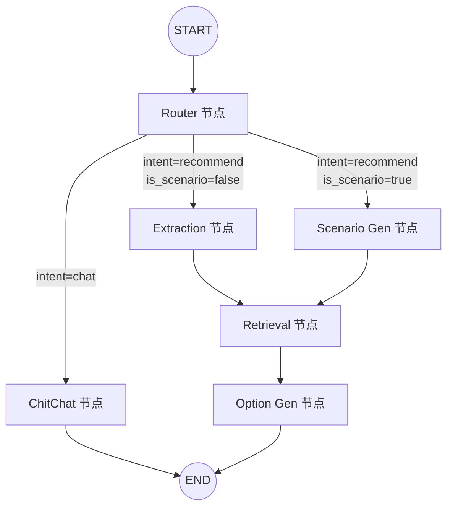
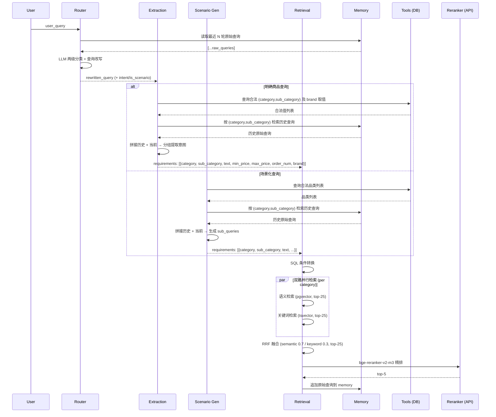

# PLAN.md — Agent Tool 优化架构方案

> 输入：[DEFINE.md](DEFINE.md) | 日期：2026-06-04

## 1. 整体实现架构

### 1.1 Agent 工作流 (Mermaid)



### 1.2 数据流 (Mermaid)



### 1.3 模块架构

```
server/app/
├── agent/
│   ├── state.py          ← 新增 rewritten_query, session_memory；修改 requirements 结构
│   ├── graph.py          ← 注入 tools/memory/reranker 依赖；适配新数据流
│   ├── memory.py         ← 重构：分组存储 + 多模式检索 + 更新
│   ├── tools.py          ← [新增] 3 个 DB 查询函数
│   ├── nodes/
│   │   ├── router.py     ← 新增 LLM 查询改写步骤
│   │   ├── extraction.py ← 重构：三步流程（品类提取→memory检索→分组提取）
│   │   ├── scenario_gen.py ← 适配：memory 检索 + 新输出格式
│   │   ├── retrieval.py  ← 重构：双路检索→RRF→reranker; memory 更新
│   │   ├── option_gen.py ← 适配新 requirements 格式（输入来源变更）
│   │   └── chitchat.py   ← 不变
│   └── prompts/
│       ├── router_prompt.py        ← 不变
│       ├── rewrite_prompt.py       ← [新增] 查询改写提示词
│       ├── extraction_prompt.py    ← [新增] 三步提取提示词
│       ├── scenario_gen_prompt.py  ← 更新：支持历史拼接
│       ├── relevance_filter_prompt.py ← 可能删除（Extraction 不再产出多 strategy）
│       ├── option_gen_prompt.py    ← 适配新格式
│       └── chitchat_prompt.py      ← 不变
├── rag/
│   ├── merger.py         ← 加权 RRF（semantic 0.7 / keyword 0.3）
│   ├── generator.py      ← 更新 import 路径（prompt 已移至 agent/prompts/）
│   └── prompt.py         ← 删除（内容迁移到 agent/prompts/ 下各文件）
├── services/
│   ├── retriever.py      ← 保留（核心 SQL 检索逻辑不变，Extraction 移除 keyword 分支）
│   ├── reranker.py       ← [新增] bge-reranker-v2-m3 API 客户端
│   ├── llm.py            ← 不变
│   ├── embedding.py      ← 不变
│   └── category_lookup_service.py ← 不变
└── config.py / config.yaml ← 新增检索参数 + reranker 配置
```

## 2. 核心功能接口与 DEFINE 需求映射

| DEFINE ID | 功能 | 实现位置 | 接口/方案 |
|-----------|------|---------|----------|
| FR1.1 | `list_tables` | `agent/tools.py` | `async def list_tables(db: AsyncSession) -> list[dict]` |
| FR1.2 | `list_fields` | `agent/tools.py` | `async def list_fields(db: AsyncSession, table_name: str) -> list[dict]` |
| FR1.3 | `query_field_values` | `agent/tools.py` | `async def query_field_values(db: AsyncSession, table: str, field: str, filters: dict) -> list` |
| FR2.1 | 移动 prompt.py | 文件迁移 | `rag/prompt.py` → 内容拆分到 `agent/prompts/` 下各 prompt 文件 |
| FR3.1-3.4 | Router 改写 | `agent/nodes/router.py` | 新增 `_rewrite_query()` 函数，调用 LLM + rewrite_prompt |
| FR4.1-4.6 | Extraction 重构 | `agent/nodes/extraction.py` | 三步流程，新输出格式 |
| FR5.1-5.9 | Retrieval 重构 | `agent/nodes/retrieval.py` | 双路检索 + RRF + reranker |
| FR6.1-6.6 | Memory 重构 | `agent/memory.py` | 新数据结构 + 三种访问模式 |

## 3. 各模块详细设计

### 3.1 `agent/tools.py` — 数据库查询 Tool

**职责：** 提供 3 个内部 Python 函数，查询 ecommerce 数据库元数据和字段值。

**接口：**

| 函数 | 输入 | 输出 | 说明 |
|------|------|------|------|
| `list_tables(db)` | AsyncSession | `[{table_name, description}]` | 查询 `information_schema.tables`，返回表名+中文描述映射 |
| `list_fields(db, table_name)` | AsyncSession + 表名 | `[{column_name, data_type, description}]` | 查询 `information_schema.columns`，返回字段名+类型+中文描述 |
| `query_field_values(db, table, field, filters?)` | AsyncSession + 表名 + 字段名 + 可选过滤条件 | `[value, ...]` | SELECT DISTINCT field FROM table WHERE filters |

**实现方式：**
- 纯 SQL 查询 `information_schema` + 业务表 `SELECT DISTINCT`
- 表/字段的中文描述硬编码为映射字典（8 张表不超过 80 个字段，维护成本低）
- `query_field_values` 的 `filters` 参数为 `{column: value}` 字典，参数化查询防注入

**依赖：** 仅依赖 `AsyncSession`，无 LLM/Embedding 依赖。

### 3.2 `agent/memory.py` — 会话记忆系统

**职责：** 管理 `session_memory` 的存储、三种检索模式、更新。

**数据结构：**
```python
# session_memory: list[MemoryGroup]
# MemoryGroup = {category, sub_category, queries: [{query, timestamp}]}
```

**接口：**

| 函数 | 输入 | 输出 | 说明 |
|------|------|------|------|
| `get_recent_queries(memory, n)` | session_memory + N | `[{query, timestamp}]` 按时间降序，最多 N 条 | Router 用：跨品类取最近 N 轮 |
| `get_queries_by_category(memory, category, sub_category)` | session_memory + 品类对 | `[{query, timestamp}]` | Extraction/Scenario_gen 用 |
| `append_query(memory, query, categories)` | session_memory + 原始查询 + 品类列表 `[{category, sub_category}]` | 更新后的 session_memory | Retrieval 用：按品类累加 |

**实现要点：**
- `get_recent_queries`: 展平所有 group 的 queries → 按 timestamp 排序 → 取最近 N 条
- `get_queries_by_category`: 精确匹配 category + sub_category 的 group，返回其 queries
- `append_query`: 遍历 categories 列表，找到匹配 group → 追加 query；无匹配则新建 group
- 纯函数设计，方便测试

### 3.3 `agent/nodes/router.py` — Router 节点

**职责：** 两级分类 + 查询改写。

**流程：**
1. 现有逻辑：LLM 调用 `ROUTER_SYSTEM` → 输出 intent + is_scenario
2. **[新增]** 若 intent=="recommend"：
   - 从 `session_memory` 取最近 N 轮原始查询（`get_recent_queries`）
   - LLM 调用 `REWRITE_SYSTEM` → 输出 rewritten_query
   - 若当前查询已完整（提示词中指示不做改写），直接透传

**提示词 `rewrite_prompt.py` 核心约束：**
- 输入：最近 N 轮历史查询（按时间顺序编号）+ 当前查询
- 任务：判断是否需要补充主体/上下文，完整查询不做改写
- 冲突处理：以后续意图为准（提示词中显式说明）
- 输出：改写后的完整查询字符串（纯文本，非 JSON）

**函数签名变化：**
```python
async def router_node(state: AgentState, llm: LLMService, memory_config: dict) -> dict:
    # 返回: {"intent": ..., "is_scenario": ..., "rewritten_query": ...}
```

### 3.4 `agent/nodes/extraction.py` — Extraction 节点

**职责：** 从改写后查询中按三步流程提取分组意图。

**流程：**

```
Step 1: 提取品类/品牌意图
  输入: rewritten_query
  过程: LLM 提取 {brand, category, sub_category}
        → 调用 list_tables / query_field_values 校验合法性
  输出: [{brand, category, sub_category}]

Step 2: 检索历史并拼接
  输入: Step1 的品类列表 + session_memory
  过程: 对每个 (category,sub_category) 调用 get_queries_by_category()
        → 将历史查询与当前 rewritten_query 按时间顺序平铺拼接
  输出: 每个品类的拼接文本

Step 3: 分组提取意图
  输入: 每个品类的拼接文本
  过程: LLM 按 (category,sub_category) 分组提取
        → structured_filter (price/stock) + semantic (text 字段)
  输出: [{category, sub_category, text, min_price, max_price, order_num, brand}]
```

**提示词 `extraction_prompt.py` 核心约束：**
- Step 1: 只提取品牌/品类，不做意图拆解
- Step 3: 冲突以后续为准（时间靠后的查询覆盖）；新品类无历史则只用当前查询
- text 字段综合凝练用户的主观感受和客观属性需求
- 输出格式严格遵循 DEFINE FR4.6 的 JSON 数组

**函数签名变化：**
```python
async def extraction_node(
    state: AgentState, llm: LLMService,
    db_session_factory,  # 用于 Tools 调用
) -> dict:
    # 返回: {"requirements": [{category, sub_category, text, min_price, max_price, order_num, brand}]}
```

### 3.5 `agent/nodes/scenario_gen.py` — Scenario Gen 节点

**职责：** 场景化需求 → 确定品类 → 检索 memory → 生成 sub_queries。

**变更点：**
1. 从 `rewritten_query`（而非 `user_query`）出发
2. 从 memory 按品类检索历史查询，拼接后做意图提取
3. 输出格式与 extraction 统一为新格式 `[{category, sub_category, text, min_price, max_price, order_num, brand}]`。两个节点的主要区别在于查询意图提取方式（scenario_gen 需先从场景描述确定相关品类），输出数据结构保持一致

**函数签名变化：**
```python
async def scenario_gen_node(state: AgentState, llm: LLMService, category_list: str = "") -> dict:
    # 返回: {"scenario_description": ..., "requirements": [新格式]}
```

### 3.6 `agent/nodes/retrieval.py` — Retrieval 节点

**职责：** 按品类分组双路检索 → RRF 融合 → bge-reranker 精排。

**流程（每个 category group 独立执行）：**

```
1. SQL 条件转换
   输入: {category, sub_category, min_price, max_price, order_num, brand}
   输出: SQL WHERE 子句
   - category/sub_category → p.category = :cat AND p.sub_category = :sub
   - min_price/max_price → s.price BETWEEN :min AND :max
   - order_num → s.stock >= :order_num
   - brand → p.brand IN (:brands)

2. 语义检索 (top-25)
   - 在 SQL 条件基础上，text embedding 余弦相似度排序
   - 同 product_id 多 SKU 满足时，取 sku_id 字典序最小

3. 关键词检索 (top-25)
   - 在 SQL 条件基础上，plainto_tsquery('chinese', text) + ts_rank 排序
   - 同 product_id 多 SKU 满足时，取 sku_id 字典序最小

4. RRF 融合 (top-25)
   - 语义权重 0.7 / 关键词权重 0.3
   - 可配置 k 值

5. bge-reranker 精排 (top-5)
   - 调用 SiliconFlow API: POST https://api.siliconflow.cn/v1/rerank
   - 失败时跳过精排，直接用 RRF top-5 作为 fallback

6. Review 截断
   - 单 product_id 最多保留 5 条 product_review
```

**代码结构变化：**
- 删除 `_filter_sub_queries()`（不再需要 LLM 需求筛选，Extraction 已按品类分组）
- 删除 `_group_sub_queries()`（Extraction 已按品类分组输出）
- `_category_task()` 大幅重写：
  - 构建 SQL WHERE（替代 Filters + SubQuery 体系）
  - 语义检索 + 关键词检索 并行执行（同品类内两路并行）
  - RRF 融合（可配置权重）
  - bge-reranker 调用（含超时 + fallback）
  - 追加原始查询到 memory（`append_query`）
- 删除 LLM 需求筛选逻辑
- 删除 conversation_history 的旧格式追加

### 3.7 `services/reranker.py` — Reranker API 客户端 [新增]

**职责：** 封装 bge-reranker-v2-m3 的 SiliconFlow API 调用。

**API 规范（参考 [SiliconFlow Rerank API](https://docs.siliconflow.cn/cn/api-reference/rerank/create-rerank)）：**

```
POST https://api.siliconflow.cn/v1/rerank
Authorization: Bearer <API_KEY>
Content-Type: application/json

Request Body:
{
  "model": "BAAI/bge-reranker-v2-m3",
  "query": "<搜索查询字符串>",
  "documents": ["<文档1>", "<文档2>", ...],
  "top_n": 5,
  "return_documents": false,
  "max_chunks_per_doc": 1024,
  "overlap_tokens": 80
}

Response:
{
  "results": [
    {"index": 0, "relevance_score": 0.6406},
    {"index": 1, "relevance_score": 0.4422}
  ],
  "meta": { "tokens": {...}, "billed_units": {...} }
}
```

- `results` 按 `relevance_score` 降序排列
- `index` 对应 `documents` 数组中的原始位置
- `return_documents: false` 时不返回文档原文，节省带宽

**接口：**
```python
class RerankerService:
    def __init__(self, base_url: str, api_key: str, model: str, timeout: float):
        ...

    async def rerank(
        self, query: str, documents: list[str], top_n: int = 5
    ) -> list[dict]:
        """返回 [{index, relevance_score}, ...] 按 relevance_score 降序"""
```

**实现要点：**
- 使用 `httpx.AsyncClient` 发送 POST 请求
- `documents` 为商品标题/描述文本列表，用 `index` 映射回 SKU
- 超时默认 5s，可配置
- 失败返回空列表（调用方 fallback 到 RRF top-5）

### 3.8 `agent/state.py` — AgentState 变更

```python
class AgentState(TypedDict):
    # === 不变 ===
    user_query: str                           # 用户原始输入
    conversation_history: Annotated[list[dict], add]  # 旧格式兼容（保留，不再写入新数据）
    intent: str
    is_scenario: bool
    scenario_description: str | None
    retrieval_results: list[dict]
    chat_reply: str
    next_options: list[str]
    failed_categories: list[str]
    _sse_queue: Any

    # === 新增 ===
    rewritten_query: str                      # Router 改写后的查询
    session_memory: list[dict]                # 新记忆结构 [{category, sub_category, queries: [{query, timestamp}]}]

    # === 变更 ===
    requirements: list[dict]                  # 从 {"sub_queries": [...]} 变为 [{category, sub_category, text, ...}]
```

## 4. 方案主要优点

| 优点 | 说明 |
|------|------|
| **渐进式重构** | 节点级独立变更，router → extraction → retrieval 依序开发，每步可独立测试 |
| **最小侵入** | chitchat 节点不变；option_gen 仅适配输入格式；现有 services 大多保留 |
| **可配置性** | 所有检索阈值（top-k、权重、超时）集中在 config.yaml，替换旧参数不叠加 |
| **降级兜底** | Reranker API 失败 → RRF top-5；LLM 调用失败 → fallback 默认值；Tool 失败 → 空列表 |
| **纯函数记忆** | memory 模块纯函数设计，无副作用，易于单元测试 |
| **并行检索** | 多品类并行 + 品类内语义/关键词并行，复用现有 Semaphore 模式 |

## 5. 主要风险

| 风险 | 等级 | 缓解 |
|------|------|------|
| Extraction 三步流程 LLM 调用次数增加（2 次 vs 1 次） | 中 | Step1+Step3 保持两次独立调用；Step2 为纯函数无需 LLM。Step1 的品类结果对 Step3 memory 检索有价值 |
| bge-reranker API 稳定性 | 中 | 超时 5s + 失败 fallback 到 RRF top-5 |
| 旧 memory 格式兼容 | 低 | 读取时检测格式：旧格式（conversation_history 的 sub_queries 列表）视为空；新格式直接使用 |
| requirements 格式变更影响 option_gen | 低 | option_gen 的 Generator 当前使用 sub_queries.text 字段，新格式的 text 字段语义一致 |

## 6. 实现复杂度评估

| 维度 | 评估 | 说明 |
|------|------|------|
| **整体复杂度** | 中等偏高 | 涉及 6 个节点中 4 个的重构 + 2 个新增模块 + 1 个迁移 |
| **最大难点** | Retrieval 双路检索 + RRF + reranker 链路 | 需要新增 SQL WHERE builder、reranker client、加权 RRF |
| **次难点** | Extraction 三步流程的 LLM 提示词设计 | 需要 prompt engineering 确保输出格式稳定 |
| **预计新增代码量** | ~800-1000 行 | tools.py ~150, memory.py ~150, reranker.py ~100, extraction ~200, retrieval ~200, prompts ~150 |
| **预计修改代码量** | ~300-400 行 | state.py, graph.py, router.py, scenario_gen.py, merger.py, generator.py, config |
| **测试工作量** | 中等 | 新增 ~15 测试用例，更新 ~10 现有测试 |

## 7. 可测试性评估

| 模块 | 测试策略 | 难度 |
|------|---------|------|
| `tools.py` | 纯 DB 查询，需要 test DB fixture | 低 |
| `memory.py` | 纯函数，输入/输出确定，无 mock 需求 | 低 |
| `reranker.py` | Mock HTTP 响应，测试正常/超时/错误三种场景 | 低 |
| `router.py` (改写部分) | Mock LLM 响应，验证改写透传逻辑 | 中 |
| `extraction.py` | Mock LLM + Mock Tools + Mock memory；验证三步流程 + 输出格式 | 中 |
| `retrieval.py` | Mock DB + Mock Embedding + Mock Reranker；验证双路检索 + RRF + fallback | 中 |
| `merger.py` (加权 RRF) | 纯函数，验证不同权重下的排序结果 | 低 |
| `graph.py` (集成) | 端到端测试（test_e2e.py），验证完整链路 | 高（需网络） |

## 8. 澄清确认记录

以下为 PLAN.md 阶段确认的关键决策：

| # | 事项 | 确认结果 |
|----|------|----------|
| 1 | Scenario Gen 输出格式 | 与 Extraction 统一为新格式 `[{category, sub_category, text, min_price, max_price, order_num, brand}]`。两者主要区别在查询意图提取方式，输出数据结构一致 |
| 2 | Extraction LLM 调用次数 | 保持两次独立调用（Step1 品类提取 + Step3 意图提取），Step2 为纯 memory 检索 |
| 3 | Memory 更新机制 | Retrieval 节点计算完成后，显式调用 `append_query()` 将原始查询写入 `session_memory`，不使用 LangGraph reducer |
| 4 | 语义检索 top-k | 改为 top-25（与关键词检索一致） |
| 5 | Reranker API | 参考 [SiliconFlow Rerank API](https://docs.siliconflow.cn/cn/api-reference/rerank/create-rerank)：`POST /v1/rerank`，model=`BAAI/bge-reranker-v2-m3` |
| 6 | 提示词生成 | 编写 prompt 时调用 `prompt-master` skill 辅助生成 |
